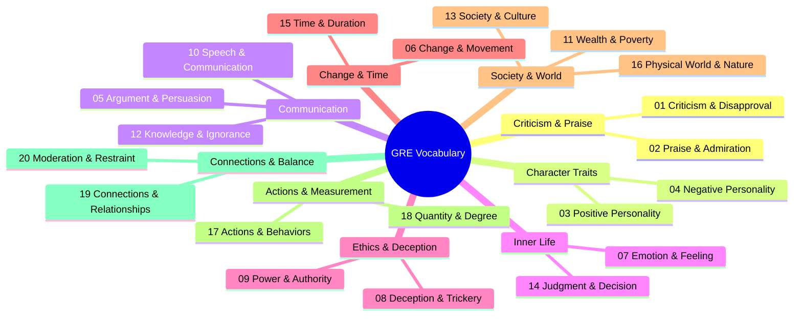

# 🎓 GRE Vocabulary Mind Maps

## 🗺️ Master Overview

---

## 📂 All Sections

| #   | Section                                                                                   | File                                           | Focus                                           | ~Words |
| --- | ----------------------------------------------------------------------------------------- | ---------------------------------------------- | ----------------------------------------------- | ------ |
| 01  | 📛 [Criticism, Disapproval & Attack](mindmaps/01-criticism-and-disapproval.md)            | `mindmaps/01-criticism-and-disapproval.md`     | Verbal attacks, belittling, mocking, refuting   | ~35    |
| 02  | 🌟 [Praise, Admiration & Excellence](mindmaps/02-praise-and-admiration.md)                | `mindmaps/02-praise-and-admiration.md`         | Formal praise, honor, generosity, beauty        | ~40    |
| 03  | 😊 [Positive Personality Traits](mindmaps/03-positive-personality-traits.md)              | `mindmaps/03-positive-personality-traits.md`   | Warmth, courage, wisdom, integrity, diligence   | ~45    |
| 04  | 😤 [Negative Personality Traits](mindmaps/04-negative-personality-traits.md)              | `mindmaps/04-negative-personality-traits.md`   | Arrogance, cowardice, hostility, laziness       | ~60    |
| 05  | 🗣️ [Argument, Persuasion & Rhetoric](mindmaps/05-argument-and-persuasion.md)              | `mindmaps/05-argument-and-persuasion.md`       | Asserting, supporting, hedging, logic           | ~55    |
| 06  | 🔄 [Change, Movement & Transformation](mindmaps/06-change-and-movement.md)                | `mindmaps/06-change-and-movement.md`           | Growth, decline, beginnings, endings, travel    | ~70    |
| 07  | 💭 [Emotion, Feeling & Temperament](mindmaps/07-emotion-and-feeling.md)                   | `mindmaps/07-emotion-and-feeling.md`           | Joy, sadness, fear, anger, calm, remorse        | ~50    |
| 08  | 🎭 [Deception, Trickery & Concealment](mindmaps/08-deception-and-trickery.md)             | `mindmaps/08-deception-and-trickery.md`        | Lying, schemes, secrecy, fraud, exposing        | ~45    |
| 09  | 👑 [Power, Authority & Governance](mindmaps/09-power-and-authority.md)                    | `mindmaps/09-power-and-authority.md`           | Leadership, control, rebellion, justice, rank   | ~55    |
| 10  | 📢 [Speech, Communication & Language](mindmaps/10-speech-and-communication.md)            | `mindmaps/10-speech-and-communication.md`      | Talkative, concise, pompous, sounds             | ~50    |
| 11  | 💰 [Wealth, Poverty & Resources](mindmaps/11-wealth-and-poverty.md)                       | `mindmaps/11-wealth-and-poverty.md`            | Abundance, generosity, greed, poverty           | ~45    |
| 12  | 📚 [Knowledge, Learning & Ignorance](mindmaps/12-knowledge-and-ignorance.md)              | `mindmaps/12-knowledge-and-ignorance.md`       | Experts, beginners, clarity, complexity         | ~50    |
| 13  | 🏛️ [Society, Culture & Groups](mindmaps/13-society-and-culture.md)                        | `mindmaps/13-society-and-culture.md`           | Social groups, customs, diversity, class        | ~50    |
| 14  | ⚖️ [Judgment, Bias & Decision-Making](mindmaps/14-judgment-and-decision.md)               | `mindmaps/14-judgment-and-decision.md`         | Fairness, bias, deciding, moral judgment        | ~50    |
| 15  | ⏳ [Time, Duration & Permanence](mindmaps/15-time-and-duration.md)                        | `mindmaps/15-time-and-duration.md`             | Fleeting, lasting, old, new, speed              | ~45    |
| 16  | 🌿 [Physical World, Nature & Science](mindmaps/16-physical-world-and-nature.md)           | `mindmaps/16-physical-world-and-nature.md`     | Health, nature, properties, science             | ~55    |
| 17  | ⚡ [Actions, Behaviors & Human Conduct](mindmaps/17-actions-and-behaviors.md)             | `mindmaps/17-actions-and-behaviors.md`         | Aggressive, gentle, strategic, yielding         | ~50    |
| 18  | 📏 [Quantity, Size, Degree & Comparisons](mindmaps/18-quantity-size-and-degree.md)        | `mindmaps/18-quantity-size-and-degree.md`      | Abundance, scarcity, scale, modifiers           | ~50    |
| 19  | 🔗 [Connections, Relationships & Influence](mindmaps/19-connections-and-relationships.md) | `mindmaps/19-connections-and-relationships.md` | Supporting, hindering, tendencies, fortune      | ~55    |
| 20  | ⚖️ [Moderation, Restraint & Remaining](mindmaps/20-moderation-and-restraint.md)           | `mindmaps/20-moderation-and-restraint.md`      | Balance, reconciliation, clichés, miscellaneous | ~100   |

---

## 🔑 Key Root Words for GRE

| Root             | Meaning         | Example Words                     |
| ---------------- | --------------- | --------------------------------- |
| **bene-**        | good            | beneficent, benign                |
| **mal-**         | bad             | malediction, malinger             |
| **magn-**        | great           | magnanimous, magnate              |
| **laud-**        | praise          | laudable                          |
| **voc/loqu-**    | speak           | vociferous, loquacious, eloquent  |
| **cred-**        | believe         | credulous, credibility            |
| **path-**        | feeling/disease | apathy, pathogenic, empathy       |
| **chron-**       | time            | chronological, anachronism        |
| **graph/scrib-** | write           | cartography, ascribe, proscribe   |
| **duc/duct-**    | lead            | conducive, induct                 |
| **fid-**         | faith           | fidelity, perfidious              |
| **gen-**         | birth/produce   | engender, pathogenic              |
| **mort/mors-**   | death           | amortize                          |
| **aud-**         | hear/bold       | audacious                         |
| **spec-**        | look            | specious, perspicacious, spectrum |
| **ver-**         | truth           | veracity, aver, verisimilar       |
