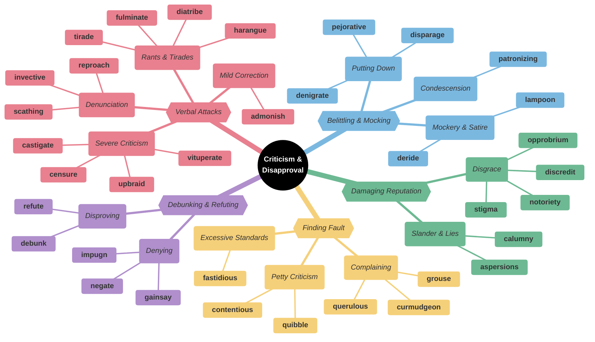
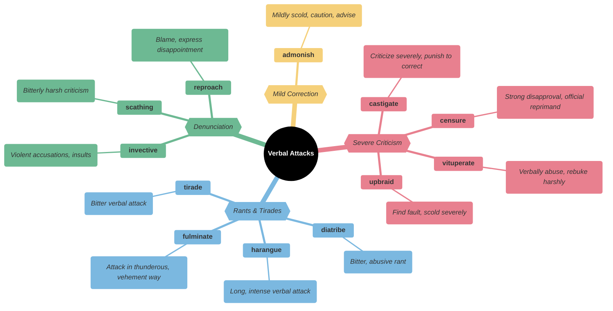
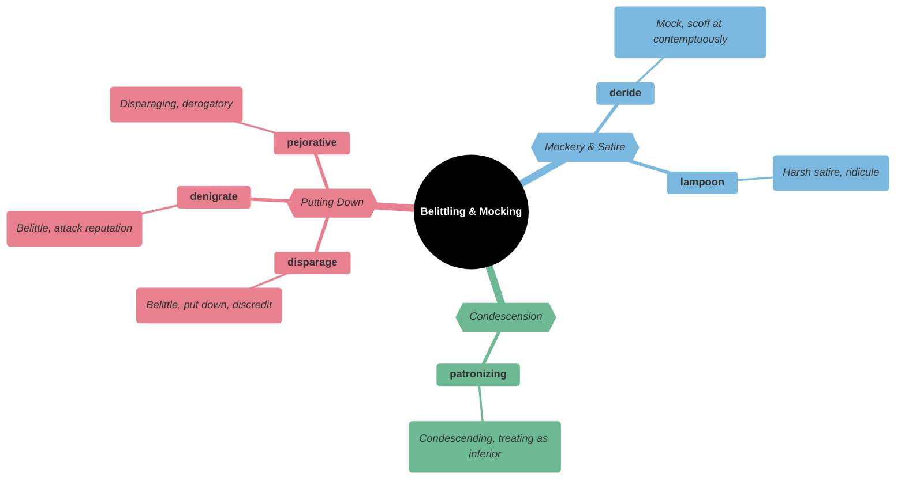
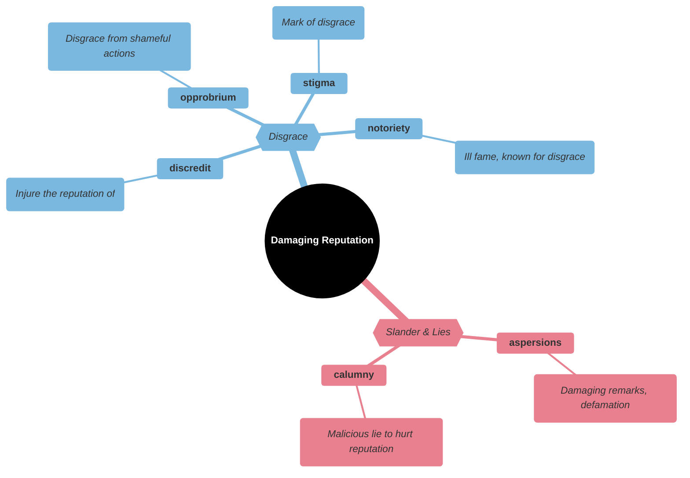
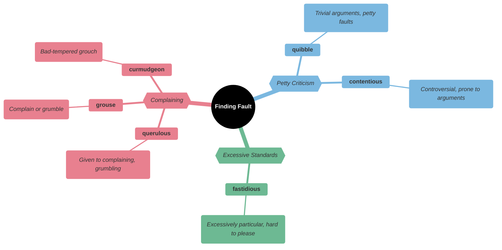
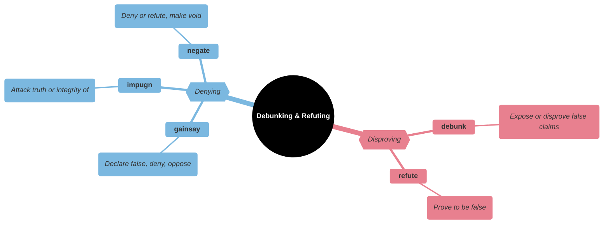
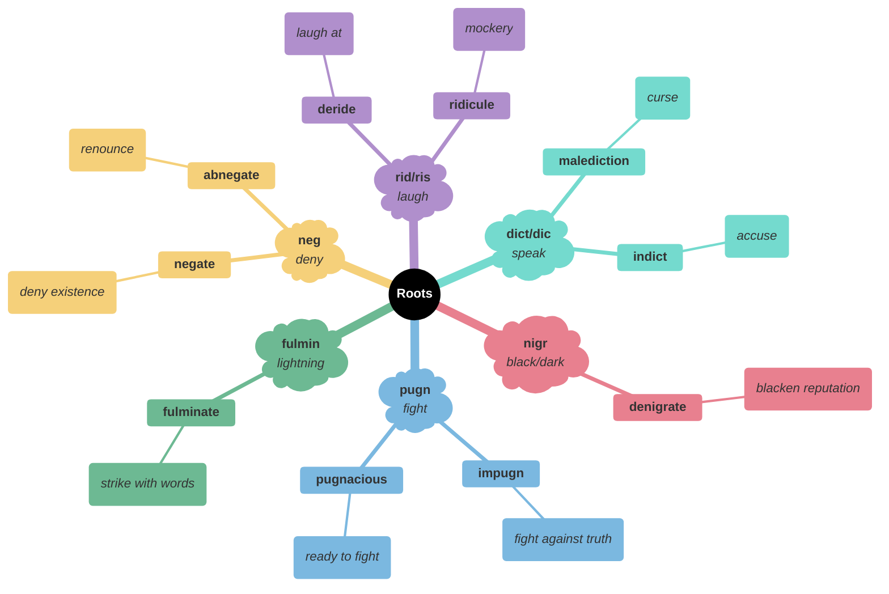

# Criticism & Disapproval

## Main Mindmap

---

## Detailed Focus

### Verbal Attacks

| Word           | Definition                                                                   | Memory Hook                                                  | Example Sentence                                                                          |
| -------------- | ---------------------------------------------------------------------------- | ------------------------------------------------------------ | ----------------------------------------------------------------------------------------- |
| **admonish**   | Mildly scold; caution or advise against something                            | **AD-MON**-ish → **AD**vise the **MON**ster nicely           | The teacher **admonished** the student for forgetting his homework but didn't punish him. |
| **castigate**  | To criticize or punish severely                                              | **CAST**-i-**GATE** → **CAST** them out the **GATE**         | The drill sergeant **castigated** the recruit for his messy uniform.                      |
| **censure**    | Strong disapproval or official reprimand                                     | **CENS**-ure → **CENS**or bad behavior                       | The Senate voted to **censure** the senator for his unethical conduct.                    |
| **diatribe**   | A bitter and prolonged verbal attack                                         | **DIA-TRIBE** → A **TRIBE** yelling at you                   | He launched into a long **diatribe** against the government's new tax policy.             |
| **fulminate**  | To attack loudly; to denounce explosively                                    | **FULMIN**-ate → **FULMIN**ation (lightning)                 | The preacher **fulminated** against the sins of modern society.                           |
| **harangue**   | A long, intense, and scolding speech                                         | **HAR**-angue → **HAR**sh **ANG**er                          | The coach delivered a furious **harangue** to the team at halftime.                       |
| **invective**  | Insulting, abusive, or highly critical language                              | **IN-VECT**-ive → **IN**fected with **V**enom                | His speech was full of **invective** directed at his political rivals.                    |
| **reproach**   | To address someone in such a way as to express disapproval or disappointment | **RE-PROACH** → **RE**-ap**PROACH** with blame               | Her mother looked at her with **reproach** when she came home late.                       |
| **scathing**   | Witheringly scornful; severely critical                                      | **SCATH**-ing → Like getting **SCATH**ed (burned)            | The movie received a **scathing** review in the New York Times.                           |
| **tirade**     | A long, angry speech of criticism or accusation                              | **TIR**-ade → **TIR**ed of listening to it                   | He went on a **tirade** about how the younger generation is lazy.                         |
| **upbraid**    | To find fault with someone; scold                                            | **UP-BRAID** → Pulling a **BRAID** **UP** (painful scolding) | The manager **upbraided** the employee for being late three times in a row.               |
| **vituperate** | To blame or insult someone in strong or violent language                     | **VIT**-uperate → **VIT**al signs of anger                   | He **vituperated** the driver who cut him off in traffic.                                 |

### Belittling & Mocking

| Word            | Definition                                                               | Memory Hook                                        | Example Sentence                                                                            |
| --------------- | ------------------------------------------------------------------------ | -------------------------------------------------- | ------------------------------------------------------------------------------------------- |
| **denigrate**   | To attack the reputation of; to speak ill of                             | **DEN**-i-grate → **DEN**y their **GREAT**ness     | Do not **denigrate** the work of your predecessors; they built the foundation you stand on. |
| **deride**      | To ridicule; to mock                                                     | **DE-RIDE** → Take for a **RIDE** (make fun of)    | The critics **derided** the movie as a mindless waste of time.                              |
| **disparage**   | To belittle; to speak slightingly of                                     | **DIS-PAR**-age → Make them feel below **PAR**     | She constantly **disparages** her brother's efforts to learn the guitar.                    |
| **lampoon**     | A harsh satire; ridicule                                                 | **LAMP**-oon → Shine a **LAMP** on them to mock    | The show **lampooned** the president's awkward handshake.                                   |
| **patronizing** | Treating with an apparent kindness that betrays a feeling of superiority | **PATRON**-izing → Acting like a **PATRON** (boss) | Her **patronizing** tone made him feel like a child.                                        |
| **pejorative**  | Expressing contempt or disapproval                                       | **PEJOR**-ative → **P**oor opinion                 | "Bureaucrat" has become a **pejorative** term for government workers.                       |

### Damaging Reputation

| Word           | Definition                                                                       | Memory Hook                                              | Example Sentence                                                                        |
| -------------- | -------------------------------------------------------------------------------- | -------------------------------------------------------- | --------------------------------------------------------------------------------------- |
| **aspersions** | Damaging remarks; defamation                                                     | **ASP**-ersions → Like a snake (**ASP**) spitting poison | The politician cast **aspersions** on his opponent's integrity during the debate.       |
| **calumny**    | A false and malicious accusation; slander                                        | **COLUMN**-y → Lies written in a newspaper **COLUMN**    | The article was nothing but **calumny**, filled with lies designed to ruin her career.  |
| **discredit**  | To injure the reputation of; destroy confidence in                               | **DIS-CREDIT** → Remove **CREDIT** or trust              | The defense lawyer tried to **discredit** the witness by revealing his criminal record. |
| **notoriety**  | The state of being famous or well-known for some bad quality or deed             | **NOTOR**-ious → **NOTOR**iously bad                     | The gangster achieved **notoriety** for his brutal crimes.                              |
| **opprobrium** | Disgrace arising from shameful conduct; harsh criticism                          | **OP-PROB**-rium → **OP**posing **PROB**ity (honesty)    | The dictator faced international **opprobrium** for his human rights abuses.            |
| **stigma**     | A mark of disgrace associated with a particular circumstance, quality, or person | **STIGMA**ta → Marks of shame                            | There is still a **stigma** attached to mental illness in some cultures.                |

### Finding Fault

| Word            | Definition                                                     | Memory Hook                                              | Example Sentence                                                                      |
| --------------- | -------------------------------------------------------------- | -------------------------------------------------------- | ------------------------------------------------------------------------------------- |
| **contentious** | Argumentative; quarrelsome; causing controversy                | **CONTENT**-ious → Not **CONTENT**, wants to fight       | The meeting became **contentious** when the budget cuts were proposed.                |
| **curmudgeon**  | A bad-tempered, difficult person; a grouch                     | **CUR**-mud-geon → A **CUR** (dog) in the **MUD**        | The old **curmudgeon** yelled at the kids to get off his lawn.                        |
| **fastidious**  | Excessively particular, critical, or demanding; hard to please | **FAST**-idious → You have to be **FAST** to please them | The **fastidious** editor caught every single typo in the manuscript.                 |
| **grouse**      | To complain or grumble                                         | **GROUSE** → Like a **GROUCH**-mouse                     | The employees began to **grouse** about the lack of coffee in the breakroom.          |
| **querulous**   | Complaining in a petulant or whining manner                    | **QUER**-ulous → **QUARREL**-ous                         | The **querulous** passenger complained about the seat, the food, and the temperature. |
| **quibble**     | To argue or raise objections about a trivial matter            | **QUIB**-ble → **QUIB**bling over bits                   | Let's not **quibble** over a few cents when we're splitting a large bill.             |

### Debunking & Refuting

| Word        | Definition                                                | Memory Hook                                            | Example Sentence                                                                              |
| ----------- | --------------------------------------------------------- | ------------------------------------------------------ | --------------------------------------------------------------------------------------------- |
| **debunk**  | To expose the falseness of a claim or myth                | **DE-BUNK** → Take the **BUNK** (nonsense) out         | The scientist wrote a paper to **debunk** the popular myth about sugar causing hyperactivity. |
| **gainsay** | To deny; dispute; contradict                              | **GAIN-SAY** → **SAY** a**GAIN**st it                  | No one could **gainsay** the fact that the team had played poorly.                            |
| **impugn**  | To attack as false or questionable; challenge in argument | **IM-PUG**-n → **PUG**nacious (fighting) against truth | The lawyer tried to **impugn** the witness's character to create doubt.                       |
| **negate**  | To deny the existence or truth of; to nullify             | **NEG**-ate → **NEG**ative                             | The new evidence **negated** the prosecution's entire theory.                                 |
| **refute**  | To prove to be false or erroneous                         | **REF**-ute → **REF**use to accept                     | The scientist used data to **refute** the climate change deniers.                             |

---

## Etymology & Roots

