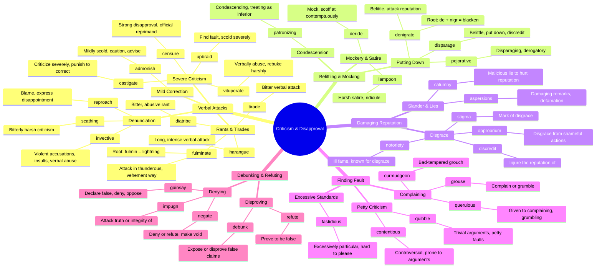

# 📛 Criticism, Disapproval & Attack

> GRE vocabulary for expressing criticism, disapproval, blame, and verbal attacks.

## Mind Map

## Quick Memory Hooks

| Word | Memory Hook |
|------|------------|
| castigate | CAST-i-GATE → Cast someone out the gate after punishing |
| diatribe | DIA-TRIBE → A tribe giving you a diatribe |
| fulminate | FULMIN-ate → Like fulminating lightning bolts of criticism |
| calumny | COLUMN-y → Lies written in newspaper columns |
| lampoon | LAMP-oon → Shining a lamp on someone to mock them |
| vituperate | Like "VIPER-ate" → Striking like a viper with words |
