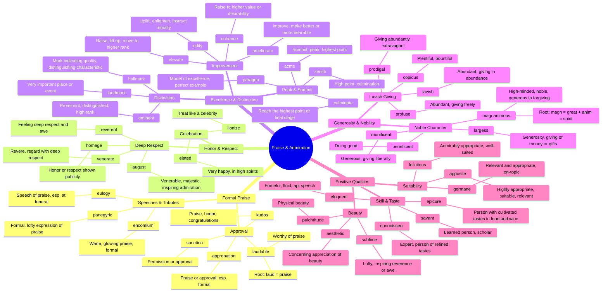

# 🌟 Praise, Admiration & Excellence

> GRE vocabulary for expressing praise, admiration, honor, and excellence.

## Mind Map

## Quick Memory Hooks

| Word        | Memory Hook                                                 |
| ----------- | ----------------------------------------------------------- |
| encomium    | EN-COME-ium → Praise that makes you want to COME in         |
| panegyric   | PAN-a-GYRIC → Praise that spans (PAN) everywhere            |
| magnanimous | MAGN-ANIM-ous → Great (magn) spirit (anim)                  |
| munificent  | Like MAGNIFICENT giving                                     |
| pulchritude | Sounds ugly but means BEAUTY — the irony helps you remember |
| venerate    | VENER-ate → Venus was venerated                             |
| zenith      | Z is the last letter → the ultimate high point              |
