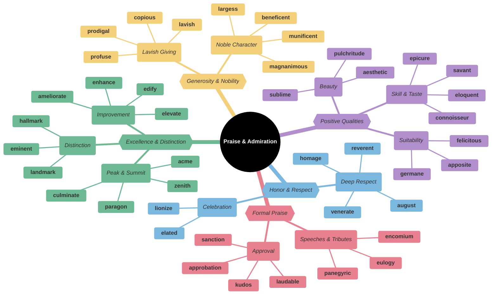
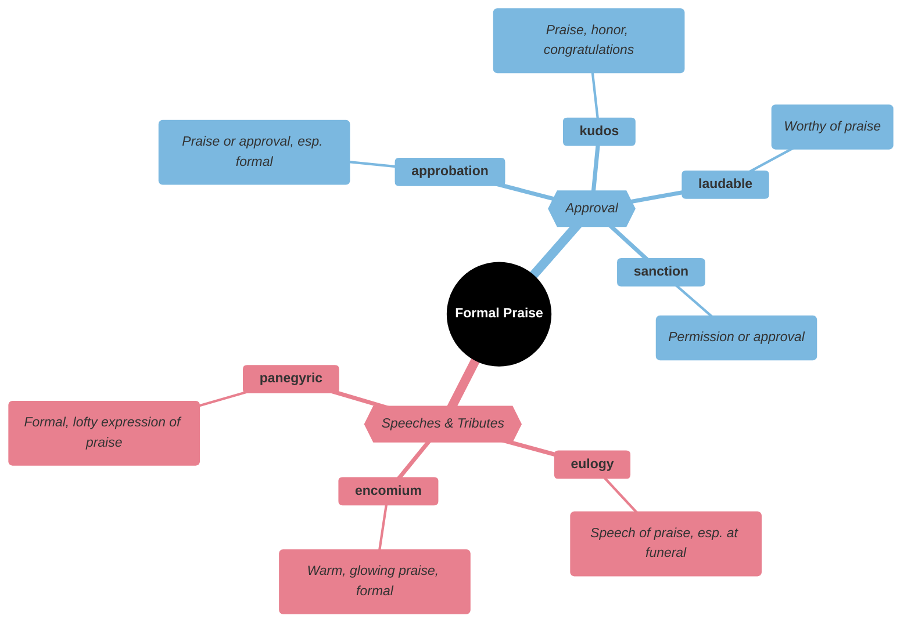
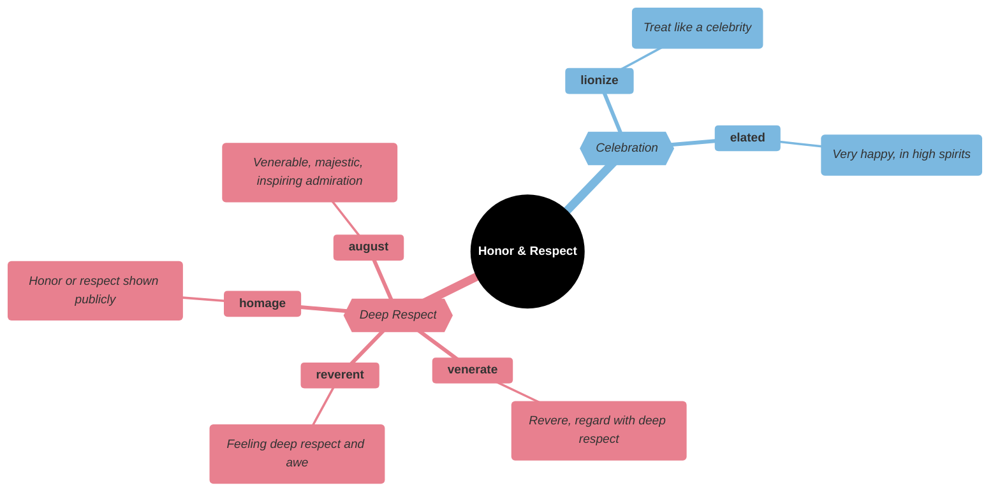
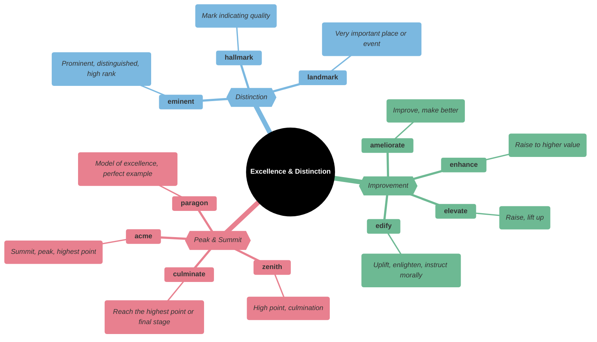
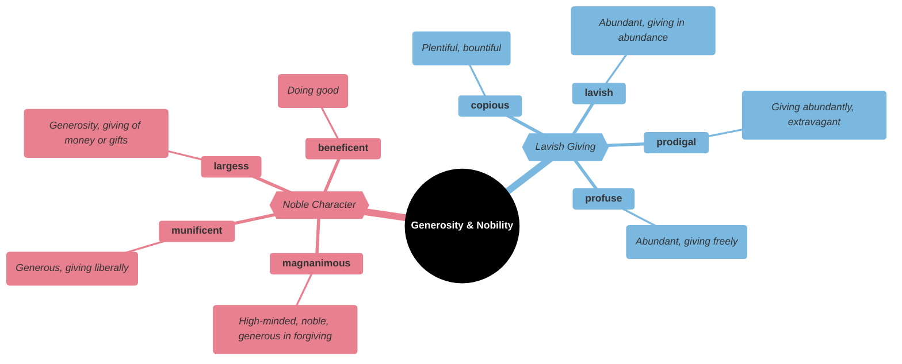
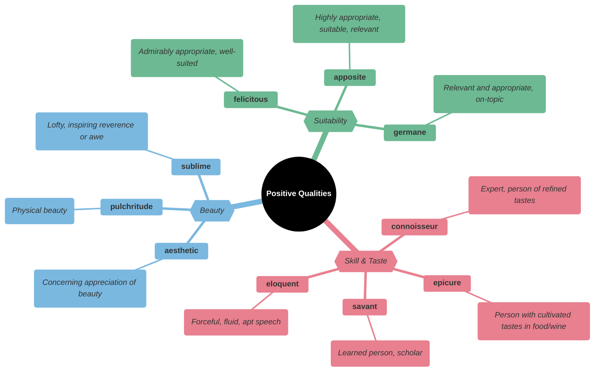
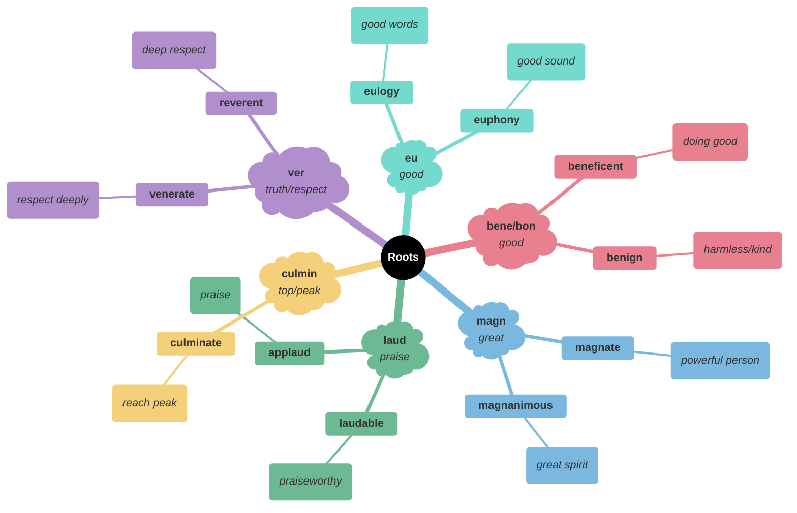

# 🌟 Praise, Admiration & Excellence

## Main Mindmap

---

## Detailed Focus

### Formal Praise

| Word            | Definition                                                                         | Memory Hook                                       | Example Sentence                                                     |
| --------------- | ---------------------------------------------------------------------------------- | ------------------------------------------------- | -------------------------------------------------------------------- |
| **eulogy**      | A speech or piece of writing that praises someone, typically one who has just died | **EU**-logy → **EU** (good) **LOG**os (word)      | He delivered a touching **eulogy** at his father's funeral.          |
| **encomium**    | A speech or piece of writing that praises someone highly                           | **EN-COM**-ium → **IN**-**COM**e of praise        | The retiring teacher received an **encomium** from the principal.    |
| **panegyric**   | A public speech or published text in praise of someone or something                | **PAN**-egyric → **PAN** (all) praise             | The poet wrote a **panegyric** to the beauty of nature.              |
| **approbation** | Approval or praise                                                                 | **APPROB**-ation → **APPROV**-al                  | The proposal met with the **approbation** of the board of directors. |
| **kudos**       | Praise and honor received for an achievement                                       | **KUDOS** bars → A treat for doing well           | **Kudos** to the team for finishing the project ahead of schedule.   |
| **laudable**    | Deserving praise and commendation                                                  | **LAUD**-able → Ap-**PLAUD**-able                 | Her efforts to help the homeless are truly **laudable**.             |
| **sanction**    | To give official permission or approval for                                        | **SANCT**-ion → **SANCT**ify (make holy/approved) | The government **sanctioned** the use of force.                      |

### Honor & Respect

| Word         | Definition                                                                        | Memory Hook                                          | Example Sentence                                                                    |
| ------------ | --------------------------------------------------------------------------------- | ---------------------------------------------------- | ----------------------------------------------------------------------------------- |
| **venerate** | To regard with great respect; revere                                              | **VENER**-ate → **VENER**able                        | In many cultures, people **venerate** their ancestors.                              |
| **reverent** | Feeling or showing deep and solemn respect                                        | **REVER**-ent → **REVER**e                           | The crowd maintained a **reverent** silence during the ceremony.                    |
| **homage**   | Special honor or respect shown publicly                                           | **HOM**-age → To the **HOM**e or man (homme)         | The film pays **homage** to the classic westerns of the 1950s.                      |
| **august**   | Inspiring reverence or admiration; majestic                                       | **AUGUST** (month) → Named after **AUGUST**us Caesar | The **august** presence of the Queen silenced the room.                             |
| **lionize**  | To give a lot of public attention and approval to (someone); treat as a celebrity | **LION**-ize → Treat like the King of Beasts         | The media **lionized** the young athlete after his Olympic victory.                 |
| **elated**   | Ecstatically happy                                                                | **ELEVAT**-ed → Lifted up in spirit                  | She was **elated** when she found out she had been accepted into her dream college. |

### Excellence & Distinction

| Word           | Definition                                                                     | Memory Hook                                                      | Example Sentence                                                                       |
| -------------- | ------------------------------------------------------------------------------ | ---------------------------------------------------------------- | -------------------------------------------------------------------------------------- |
| **acme**       | The highest point; summit; peak                                                | **ACME** Corp → Wile E. Coyote wants the **PEAK** products       | The cathedral is considered the **acme** of Gothic architecture.                       |
| **zenith**     | The time at which something is most powerful or successful                     | **Z**enith → **Z** is the peak letter                            | At the **zenith** of his career, he was the most famous actor in the world.            |
| **culminate**  | To reach a climax or point of highest development                              | **CULMIN**-ate → **COLUMN** top                                  | The celebration will **culminate** in a spectacular fireworks display.                 |
| **paragon**    | A person or thing regarded as a perfect example of a particular quality        | **PARA-GON** → **PARA**llel to none                              | She is a **paragon** of virtue and patience.                                           |
| **eminent**    | Famous and respected within a particular sphere                                | **EMIN**-ent → Like **EMIN**em (famous)                          | An **eminent** scientist was invited to speak at the conference.                       |
| **hallmark**   | A distinctive feature                                                          | **HALL-MARK** → Stamped mark on silver in a hall                 | Attention to detail is the **hallmark** of a great craftsman.                          |
| **landmark**   | An object or feature of a landscape or town that is easily seen and recognized | **LAND-MARK** → Marks the land                                   | The Eiffel Tower is a famous Parisian **landmark**.                                    |
| **ameliorate** | To make better; improve                                                        | **AMELIA-RATE** → Amelia Earhart improved the **RATE** of flight | The new laws were designed to **ameliorate** the suffering of the poor.                |
| **enhance**    | To intensify, increase, or further improve the quality of                      | **ENHANCE** → Make it advance                                    | Adding fresh herbs will **enhance** the flavor of the sauce.                           |
| **elevate**    | To raise or lift up                                                            | **ELEVAT**-or → Goes up                                          | The promotion will **elevate** him to a management position.                           |
| **edify**      | To instruct or improve (someone) morally or intellectually                     | **ED**-ify → **ED**ucate                                         | The sermon was intended to **edify** the congregation rather than just entertain them. |

### Generosity & Nobility

| Word            | Definition                                                                | Memory Hook                                            | Example Sentence                                                                    |
| --------------- | ------------------------------------------------------------------------- | ------------------------------------------------------ | ----------------------------------------------------------------------------------- |
| **magnanimous** | Very generous or forgiving, especially toward a rival                     | **MAGN-ANIM**-ous → **MAGN** (great) **ANIM** (spirit) | He was **magnanimous** in victory, shaking hands with his opponent.                 |
| **munificent**  | Larger or more generous than is usual or necessary                        | **MUNI**-ficent → **MONEY**-ficent                     | The museum received a **munificent** donation of rare paintings.                    |
| **largess**     | Generosity in bestowing money or gifts upon others                        | **LARG**-ess → **LARG**e giving                        | The university library was built through the **largess** of a wealthy alumnus.      |
| **beneficent**  | Doing good or causing good to be done                                     | **BENE**-ficent → **BENE**fit sent                     | The **beneficent** donor gave millions to the hospital.                             |
| **lavish**      | Sumptuously rich, elaborate, or luxurious                                 | **LAV**-ish → **LAV**atory of gold                     | They threw a **lavish** party with champagne and caviar.                            |
| **prodigal**    | Spending money or resources freely and recklessly; wastefully extravagant | **PRODIG**-al → **PRO** at **DIG**ging into savings    | The **prodigal** son returned home after spending all his inheritance.              |
| **profuse**     | Exuberantly plentiful; abundant                                           | **PRO-FUSE** → **FUSE** (pour) forth                   | She offered **profuse** apologies for being late.                                   |
| **copious**     | Abundant in supply or quantity                                            | **COPY**-ous → Make many **COPIES**                    | She took **copious** notes during the lecture to ensure she wouldn't miss anything. |

### Positive Qualities

| Word            | Definition                                                                    | Memory Hook                                      | Example Sentence                                                                    |
| --------------- | ----------------------------------------------------------------------------- | ------------------------------------------------ | ----------------------------------------------------------------------------------- |
| **connoisseur** | An expert judge in matters of taste                                           | **CON**-noisseur → **KNOW**-sier (knows more)    | He is a **connoisseur** of fine wines and can identify the vineyard by taste alone. |
| **epicure**     | A person with refined taste in food and wine                                  | **EPIC-CURE** → Cures hunger with **EPIC** food  | As a true **epicure**, he refused to eat at fast-food restaurants.                  |
| **savant**      | A learned person, especially a distinguished scientist                        | **SAV**-ant → **SAV**vy person                   | He is a **savant** in the field of quantum physics.                                 |
| **eloquent**    | Fluent or persuasive in speaking or writing                                   | **ELOQU**-ent → **LOQU** (speak) well            | His **eloquent** speech moved the audience to tears.                                |
| **aesthetic**   | Concerned with beauty or the appreciation of beauty                           | **AESTHETIC** → **A**rtistic beauty              | The new building has a modern **aesthetic** that appeals to young designers.        |
| **pulchritude** | Beauty                                                                        | Sounds ugly but means **BEAUTY**                 | The contest was a celebration of feminine **pulchritude**.                          |
| **sublime**     | Of such excellence, grandeur, or beauty as to inspire great admiration or awe | **SUB-LIME** → Under the **LIME**light of god    | The view from the mountain top was absolutely **sublime**.                          |
| **felicitous**  | Well-chosen or suited to the circumstances                                    | **FELICIT**-ous → **FELICIT**y (happiness)       | Her **felicitous** choice of words calmed the angry crowd.                          |
| **apposite**    | Highly appropriate; suitable; relevant                                        | **OPPOSITE** of inappropriate                    | Her **apposite** remarks clarified the confusing situation immediately.             |
| **germane**     | Relevant to a subject under consideration                                     | **GERMAN**-e → **GERMAN** is relevant in Germany | Please keep your comments **germane** to the topic of discussion.                   |

---

## Etymology & Roots

