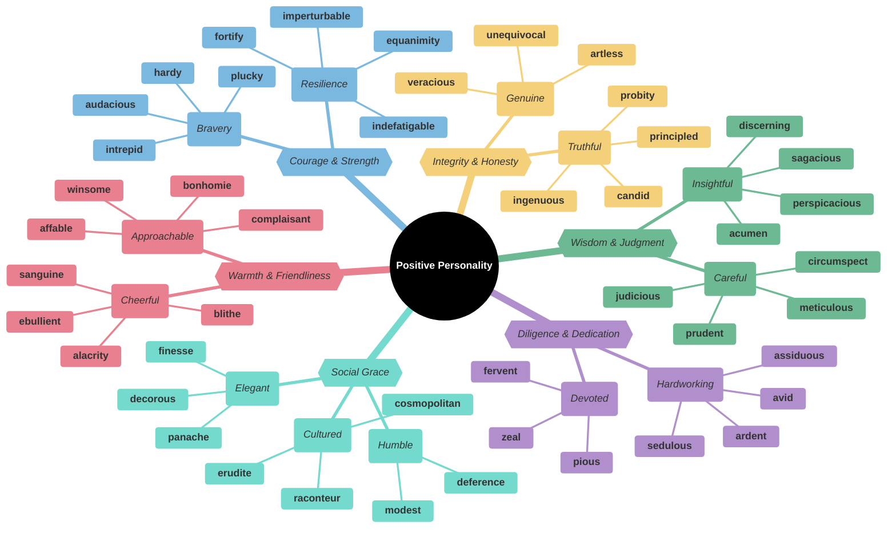
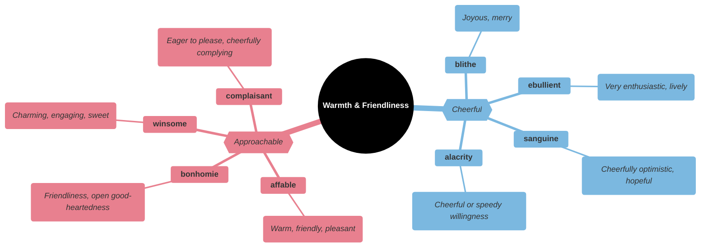
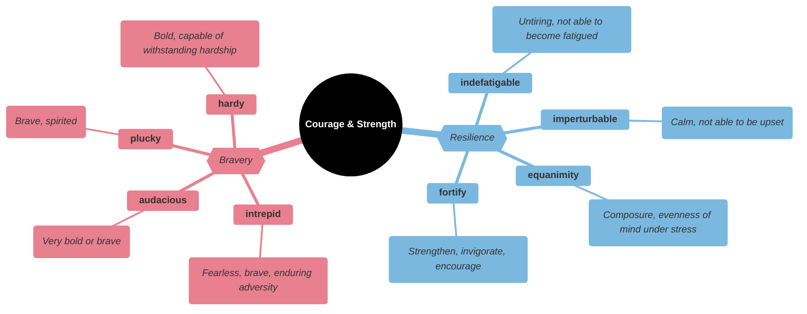
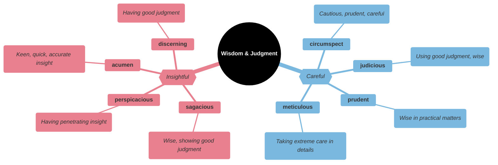
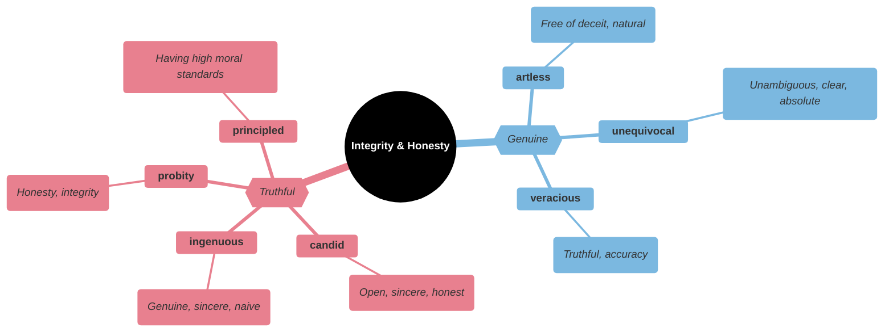
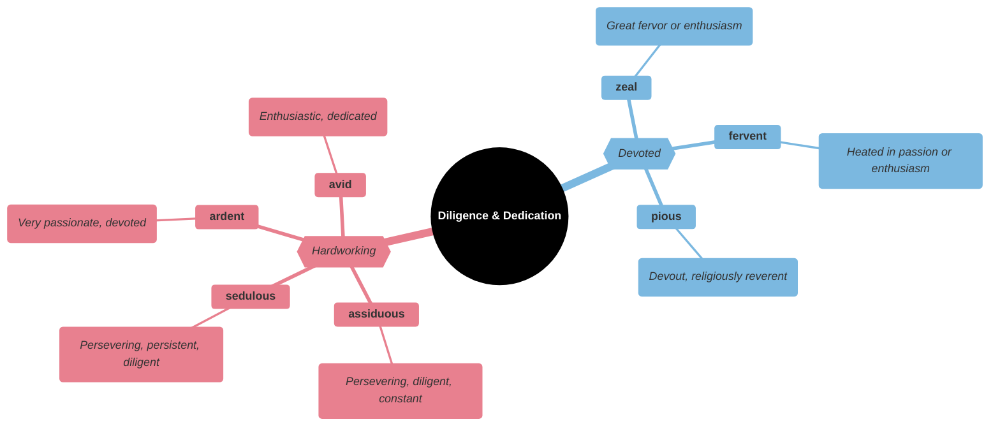
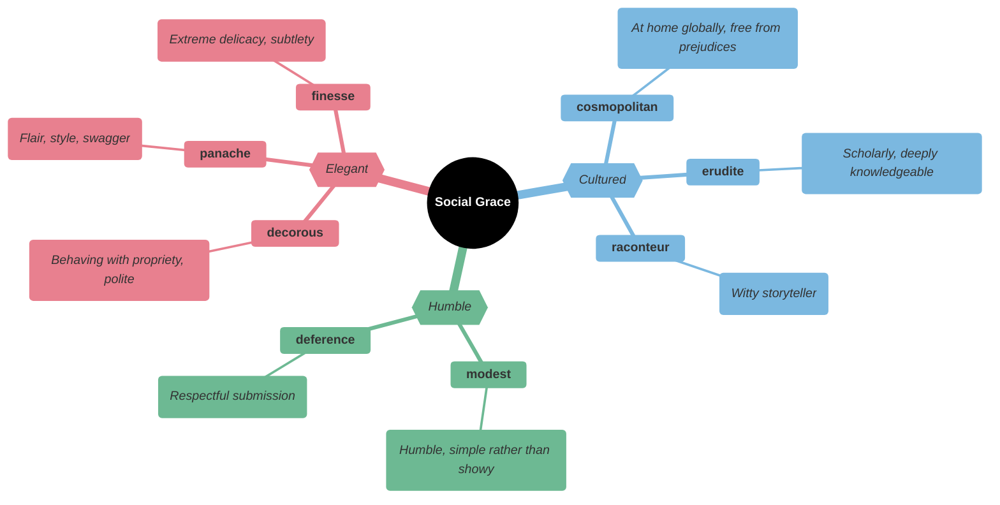
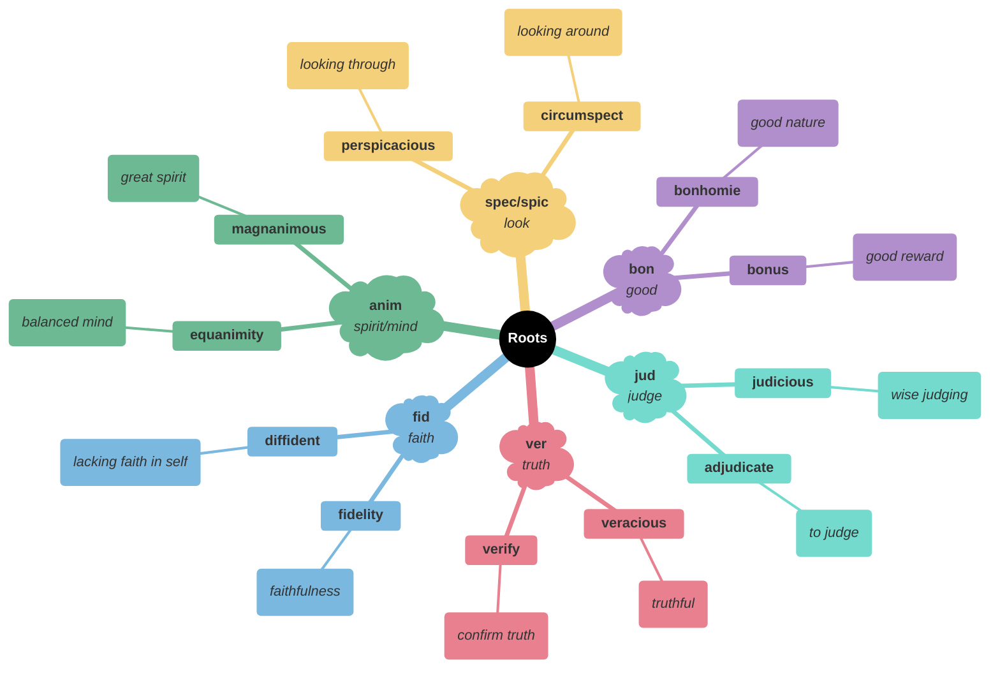

# Positive Personality Traits

## Main Mindmap

---

## Detailed Focus

### Warmth & Friendliness

| Word            | Phonetics       | Definition                                                                             | Memory Hook                                            | Example Sentence                                                               |
| --------------- | --------------- | -------------------------------------------------------------------------------------- | ------------------------------------------------------ | ------------------------------------------------------------------------------ |
| **affable**     | AFF-uh-bull     | Friendly, good-natured, or easy to talk to                                             | **A-FABLE** → Pleasant as a fable character            | The new neighbor was **affable** and quickly made friends on the block.        |
| **bonhomie**    | bon-uh-MEE      | Cheerful friendliness; geniality                                                       | **BON**-homie → **BON** (good) **HOMME** (man)         | The party was filled with **bonhomie** and laughter.                           |
| **winsome**     | WIN-sum         | Attractive or appealing in appearance or character                                     | **WIN**-some → **WIN**s **SOME** hearts                | She had a **winsome** smile that charmed everyone she met.                     |
| **complaisant** | kom-PLAY-sunt   | Willing to please others; obliging; agreeable                                          | **COMPLAI**-sant → **COMPLY**-sant                     | The **complaisant** child did exactly what his mother asked.                   |
| **blithe**      | blythe          | Showing a casual and cheerful indifference considered to be callous or improper; happy | **BLITHE** spirit → Light and happy                    | She showed a **blithe** disregard for the rules.                               |
| **ebullient**   | ih-BULL-yunt    | Cheerful and full of energy                                                            | **E-BULL**-ient → Like a **BULL** bubbling with energy | Her **ebullient** personality made her the life of the party.                  |
| **sanguine**    | SANG-gwin       | Optimistic or positive, especially in an apparently bad or difficult situation         | **SANGUIN** (blood) → Red-cheeked (healthy/happy)      | He remained **sanguine** about the company's future despite the recent losses. |
| **alacrity**    | uh-LACK-rih-tee | Brisk and cheerful readiness                                                           | **A-LACK**-rity → **LACK** of hesitation               | He accepted the job offer with **alacrity**.                                   |

### Courage & Strength

| Word              | Phonetics             | Definition                                                                               | Memory Hook                                      | Example Sentence                                                        |
| ----------------- | --------------------- | ---------------------------------------------------------------------------------------- | ------------------------------------------------ | ----------------------------------------------------------------------- |
| **intrepid**      | in-TREP-id            | Fearless; adventurous (often used for rhetorical or humorous effect)                     | **IN-TREPID** → Not **TREPID** (fearful)         | The **intrepid** explorer ventured deep into the jungle.                |
| **audacious**     | aw-DAY-shus           | Showing a willingness to take surprisingly bold risks                                    | **AUD**-acious → **AUD**acity                    | The general made an **audacious** plan to attack the enemy at dawn.     |
| **plucky**        | PLUCK-ee              | Having or showing determined courage in the face of difficulties                         | **PLUCK**-y → **PLUCK**ing up courage            | The **plucky** underdog team won the championship.                      |
| **hardy**         | HAR-dee               | Robust; capable of enduring difficult conditions                                         | **HARD**-y → **HARD** to kill                    | These **hardy** plants can survive the winter frost.                    |
| **indefatigable** | in-duh-FAT-ig-uh-bull | (of a person or their efforts) persisting tirelessly                                     | **IN-DE-FATIG**-able → Cannot be **FATIG**ued    | The **indefatigable** campaigner visited every house in the district.   |
| **imperturbable** | im-per-TUR-buh-bull   | Unable to be upset or excited; calm                                                      | **IM-PERTURB**-able → Cannot be **PERTURB**ed    | The **imperturbable** butler never lost his cool, even during the fire. |
| **equanimity**    | ee-kwuh-NIM-ih-tee    | Mental calmness, composure, and evenness of temper, especially in a difficult situation  | **EQUA-NIM**-ity → **EQUA**l (balanced) **MIND** | He accepted the bad news with **equanimity**.                           |
| **fortify**       | FOR-tih-fy            | Strengthen (a place) with defensive works so as to protect it against attack; invigorate | **FORT**-ify → Make like a **FORT**              | He drank some coffee to **fortify** himself for the long drive.         |

### Wisdom & Judgment

| Word              | Phonetics         | Definition                                                          | Memory Hook                                              | Example Sentence                                                            |
| ----------------- | ----------------- | ------------------------------------------------------------------- | -------------------------------------------------------- | --------------------------------------------------------------------------- |
| **sagacious**     | suh-GAY-shus      | Having or showing keen mental discernment and good judgment; shrewd | **SAGE**-acious → Like a **SAGE**                        | The **sagacious** old woman gave the young traveler good advice.            |
| **perspicacious** | per-spih-KAY-shus | Having a ready insight into and understanding of things             | **PER-SPIC**-acious → **PER**fect **SPEC**tacles (sight) | The **perspicacious** detective solved the crime in record time.            |
| **acumen**        | AK-yoo-men        | The ability to make good judgments and quick decisions              | **ACU**-men → **ACCU**rate men                           | Her business **acumen** helped her turn the failing company into a success. |
| **discerning**    | dih-SUR-ning      | Having or showing good judgment                                     | **DISCERN**-ing → Able to **DISCERN** (see clearly)      | The **discerning** customer noticed the slight flaw in the fabric.          |
| **circumspect**   | SUR-kum-spekt     | Wary and unwilling to take risks                                    | **CIRCUM-SPECT** → **SPECT** (look) **CIRCUM** (around)  | The politician was **circumspect** in his answers to the press.             |
| **judicious**     | joo-DISH-us       | Having, showing, or done with good judgment or sense                | **JUDIC**-ious → Like a **JUDGE**                        | We need to make a **judicious** use of our limited resources.               |
| **prudent**       | PROO-dent         | Acting with or showing care and thought for the future              | **PRUDE**-nt → Careful like a **PRUDE**                  | It would be **prudent** to save some money for a rainy day.                 |
| **meticulous**    | meh-TIK-yoo-lus   | Showing great attention to detail; very careful and precise         | **METICUL**-ous → **MET**iculous **MET**ric              | He was **meticulous** about keeping his records organized.                  |

### Integrity & Honesty

| Word            | Phonetics          | Definition                                                                                                    | Memory Hook                                                | Example Sentence                                                    |
| --------------- | ------------------ | ------------------------------------------------------------------------------------------------------------- | ---------------------------------------------------------- | ------------------------------------------------------------------- |
| **candid**      | CAN-did            | Truthful and straightforward; frank                                                                           | **CANDID** camera → Real, unscripted                       | She gave a **candid** interview about her struggles with addiction. |
| **ingenuous**   | in-JEN-yoo-us      | (of a person or action) innocent and unsuspecting                                                             | **IN-GENU**-ous → **GENU**ine inside                       | The **ingenuous** child asked why the man was bald.                 |
| **probity**     | PRO-bih-tee        | The quality of having strong moral principles; honesty and decency                                            | **PROB**-ity → **PROB**ing finds nothing wrong             | The judge was known for his **probity** and fairness.               |
| **principled**  | PRIN-suh-pulld     | (of a person or their behavior) acting in accordance with morality and showing recognition of right and wrong | **PRINCIPL**-ed → Follows **PRINCIPL**es                   | He was a **principled** man who refused to compromise his ethics.   |
| **artless**     | ART-less           | Without guile or deception; natural and simple                                                                | **ART**-less → No **ART**ifice (tricks)                    | Her **artless** sincerity won over the cynical reporter.            |
| **unequivocal** | un-ee-KWIV-uh-kull | Leaving no doubt; unambiguous                                                                                 | **UN-EQUI-VOCAL** → Not **EQUAL VOICE** (only one meaning) | The answer was an **unequivocal** "no."                             |
| **veracious**   | vuh-RAY-shus       | Speaking or representing the truth                                                                            | **VER**-acious → **VER**y truthful                         | The witness gave a **veracious** account of the accident.           |

### Diligence & Dedication

| Word          | Phonetics    | Definition                                                       | Memory Hook                                         | Example Sentence                                          |
| ------------- | ------------ | ---------------------------------------------------------------- | --------------------------------------------------- | --------------------------------------------------------- |
| **assiduous** | uh-SIJ-oo-us | Showing great care and perseverance                              | **ASS-ID**-uous → Sit on your **ASS** and do **IT** | The **assiduous** student studied for hours every night.  |
| **sedulous**  | SED-yoo-lus  | (of a person or action) showing dedication and diligence         | **SED**-ulous → **SED**entary (sitting) and working | The writer was **sedulous** in his research for the book. |
| **ardent**    | AR-dent      | Enthusiastic or passionate                                       | **ARD**-ent → **HARD**-core fan                     | She is an **ardent** supporter of animal rights.          |
| **avid**      | AV-id        | Having or showing a keen interest in or enthusiasm for something | **AV**-id → **AV**id gamer                          | He is an **avid** reader of science fiction novels.       |
| **zeal**      | zeel         | Great energy or enthusiasm in pursuit of a cause or an objective | **ZEAL**-ous → **ZEAL**ot                           | He attacked his work with **zeal**.                       |
| **fervent**   | FUR-vent     | Having or displaying a passionate intensity                      | **FERV**-ent → **FEV**erish passion                 | He was a **fervent** believer in the cause.               |
| **pious**     | PY-us        | Devoutly religious                                               | **PI**-ous → **PI**ety                              | The **pious** woman went to church every day.             |

### Social Grace

| Word             | Phonetics        | Definition                                                                  | Memory Hook                                       | Example Sentence                                                             |
| ---------------- | ---------------- | --------------------------------------------------------------------------- | ------------------------------------------------- | ---------------------------------------------------------------------------- |
| **decorous**     | DEK-er-us        | In keeping with good taste and propriety; polite and restrained             | **DECOR**-ous → Like good **DECOR**ation, fitting | The children were remarkably **decorous** during the wedding ceremony.       |
| **panache**      | puh-NASH         | Flamboyant confidence of style or manner                                    | **PAN**-ache → Like Peter **PAN**'s hat feather   | She wore the outrageous hat with great **panache**.                          |
| **finesse**      | fih-NESS         | Intricate and refined delicacy                                              | **FINE**-sse → **FINE** skill                     | She handled the difficult negotiation with great **finesse**.                |
| **cosmopolitan** | koz-mo-POL-i-tan | Familiar with and at ease in many different countries and cultures          | **COSMO**-politan → **COSMOS** (world) citizen    | New York is a **cosmopolitan** city with people from all over the world.     |
| **erudite**      | ER-yoo-dyt       | Having or showing great knowledge or learning                               | **ERU-DITE** → **ERU**pting with knowledge        | The professor's **erudite** lecture was fascinating but difficult to follow. |
| **raconteur**    | rak-on-TUR       | A person who tells anecdotes in a skillful and amusing way                  | **RACON**-teur → **RECOUN**ts stories             | He was a born **raconteur** who could keep the whole table entertained.      |
| **modest**       | MOD-est          | Unassuming or moderate in the estimation of one's abilities or achievements | **MOD**-est → **MOD**erate ego                    | Despite his fame, he remained a **modest** man.                              |
| **deference**    | DEF-er-ens       | Humble submission and respect                                               | **DEFER**-ence → **DEFER** to others              | He treated the elder with great **deference**.                               |

---

## Etymology & Roots

