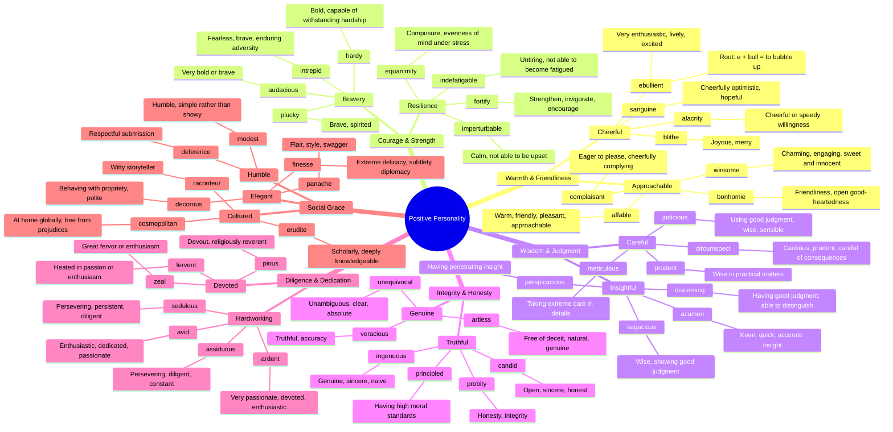

# 😊 Positive Personality Traits

> GRE vocabulary for virtuous, admirable character qualities and behaviors.

## Mind Map

## Quick Memory Hooks

| Word          | Memory Hook                                             |
| ------------- | ------------------------------------------------------- |
| affable       | A-FABLE → Pleasant as a fable                           |
| ebullient     | E-BULL-ient → A bull bubbling with energy               |
| intrepid      | IN-TREPID → Not trepidatious, so fearless               |
| sagacious     | SAGE-acious → Wise like a sage                          |
| perspicacious | PERSPIC-acious → See through (perspective) with insight |
| assiduous     | ASS-ID-uous → Sit on your "seat" and work diligently    |
| sanguine      | SANGUIN = blood → Rosy-cheeked, healthy, optimistic     |
