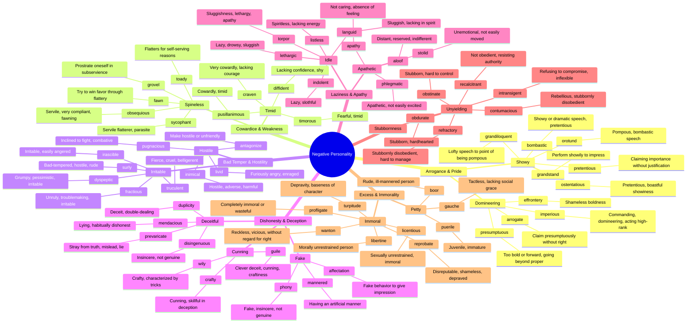

# 😤 Negative Personality Traits

> GRE vocabulary for vices, flaws, and undesirable character qualities.

## Mind Map

## Quick Memory Hooks

| Word          | Memory Hook                                          |
| ------------- | ---------------------------------------------------- |
| pusillanimous | PUSSY-llanimous → Scaredy-cat                        |
| obsequious    | OB-SEQUI-ous → Follows (sequi) around like a servant |
| irascible     | IRAS-cible → Full of IRE (anger)                     |
| sycophant     | SYCO-phant → Sick-o-phant, sickeningly flattering    |
| indolent      | IN-DOLENT → In-dolent, doing nothing, no "doing"     |
| intransigent  | IN-TRANSIG-ent → Won't transition, won't budge       |
| truculent     | TRUCK-ulent → Like a truck, fierce and forceful      |
| obdurate      | OB-DUR-ATE → Hard (durable) and stubborn             |
