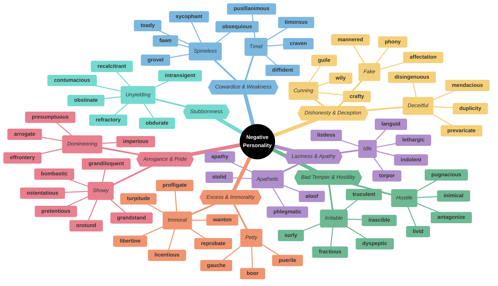
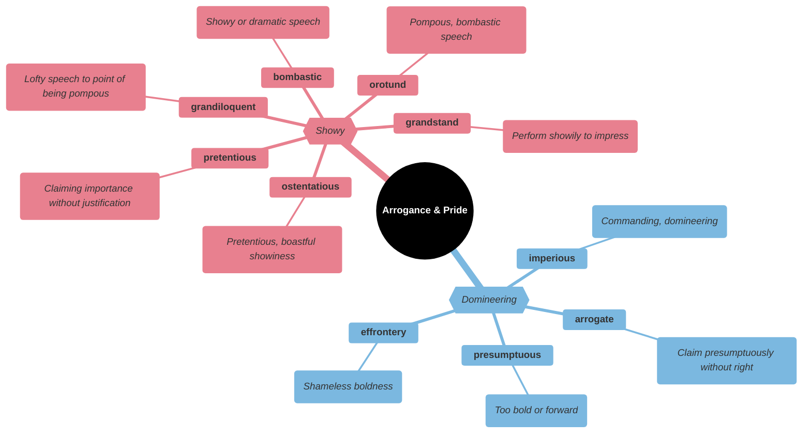
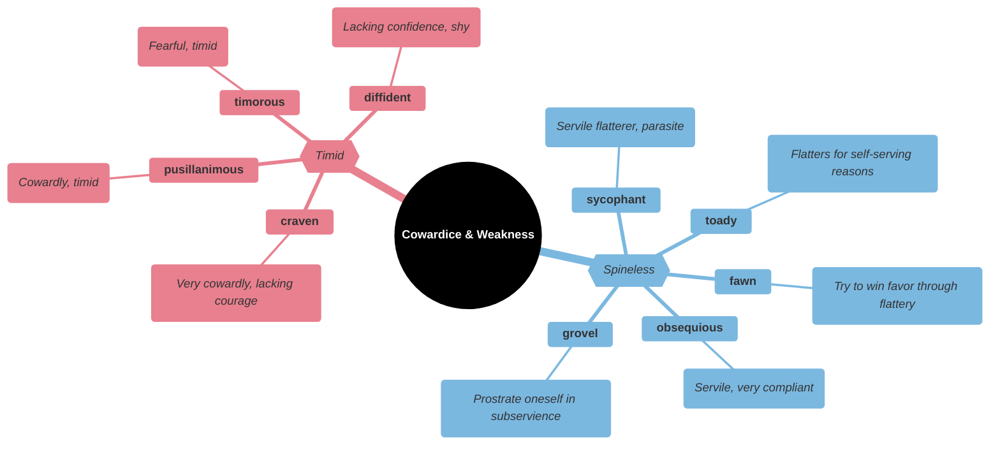
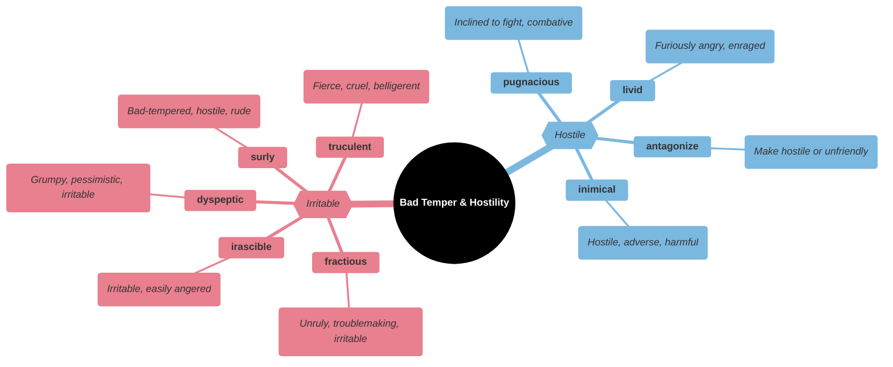
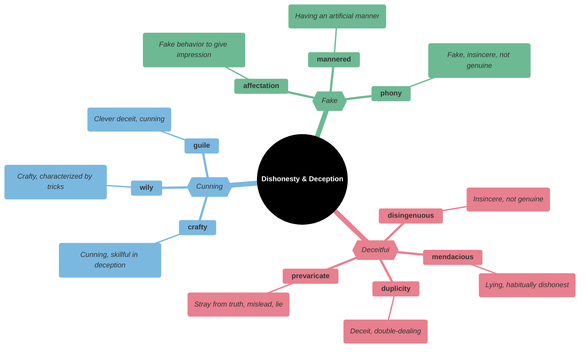
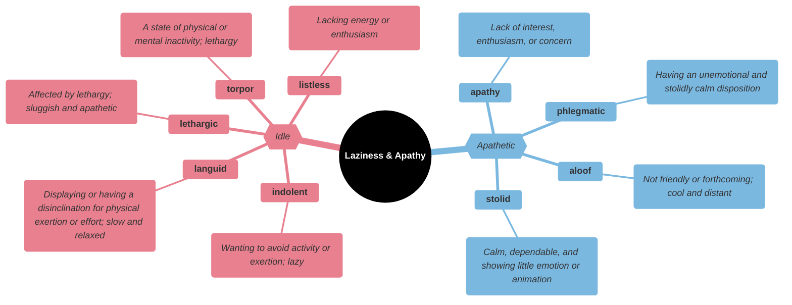
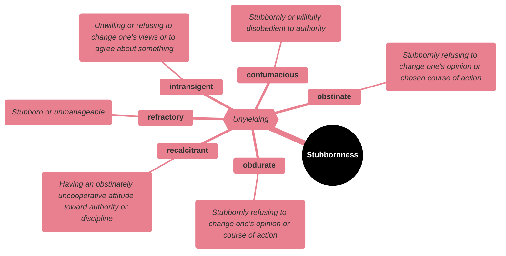
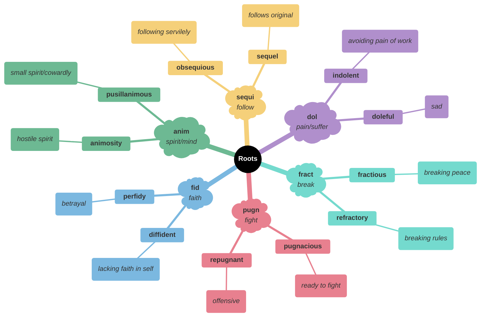

# 😤 Negative Personality Traits

## Main Mindmap



---

## Detailed Focus

### Arrogance & Pride



| Word | Phonetics |Definition | Memory Hook | Example Sentence |
| --- | --- | --- | --- | --- |
| **ostentatious** | ah-sten-TAY-shus | Characterized by vulgar or pretentious display; designed to impress or attract notice | **OSTENT**-atious → **OSTENT**atiously showing off | She wore an **ostentatious** diamond necklace to the grocery store. |
| **pretentious** | pree-TEN-shus | Attempting to impress by affecting greater importance, talent, culture, etc., than is actually possessed | **PRETEND**-tious → **PRETEND**ing to be important | The restaurant was **pretentious** and overpriced. |
| **bombastic** | bom-BAS-tik | High-sounding but with little meaning; inflated | **BOMB**-astic → Speech like a **BOMB** (loud but destructive) | His **bombastic** speech was full of big words but offered no real solutions. |
| **grandiloquent** | gran-DIL-o-kwent | Pompous or extravagant in language, style, or manner | **GRAND**-iloquent → **GRAND** speaking | The politician's **grandiloquent** promises turned out to be empty words. |
| **orotund** | OR-o-tund | (of the voice or phrasing) full, round, and imposing | **ORO-TUND** → **ORO** (mouth) ro**TUND** (round) | The actor's **orotund** voice filled the theater. |
| **grandstand** | GRAND-stand | Seek to attract applause or favorable attention from spectators or the media | **GRANDSTAND** → Playing to the **GRANDSTAND** (audience) | Instead of debating the issues, he chose to **grandstand** for the cameras. |
| **imperious** | im-PEER-ee-us | Assuming power or authority without justification; arrogant and domineering | **IMPER**-ious → **EMPER**or-like | She issued **imperious** commands to the waiters as if she owned the restaurant. |
| **arrogate** | AR-o-gate | Take or claim (something) without justification | **ARROG**-ate → **ARROG**ant taking | The president tried to **arrogate** more power to himself than the constitution allowed. |
| **presumptuous** | pre-ZUMP-choo-us | Too bold or forward | **PRE-SUM**-ptuous → **PRE-SUM**ing too much | It was **presumptuous** of him to assume he was invited to the wedding. |
| **effrontery** | eh-FRUN-ter-ee | Insolent or impertinent behavior | **EFFRONT**-ery → In **FRONT** of your face rudeness | He had the **effrontery** to ask for a raise after being late every day for a month. |

### Cowardice & Weakness



| Word | Phonetics |Definition | Memory Hook | Example Sentence |
| --- | --- | --- | --- | --- |
| **craven** | KRAY-ven | Contemptibly lacking in courage; cowardly | **CRAVEN** → **CAVE**-in (hiding in a cave) | The **craven** soldier hid in the ditch while his comrades fought. |
| **pusillanimous** | pyoo-sil-AN-ih-mus | Showing a lack of courage or determination; timid | **PUSSY**-llanimous → Scaredy-cat | The **pusillanimous** leader refused to take a stand on the controversial issue. |
| **timorous** | TIM-er-us | Showing or suffering from nervousness, fear, or a lack of confidence | **TIM**-orous → **TIM**id | The **timorous** mouse scurried across the floor. |
| **diffident** | DIF-i-dent | Modest or shy because of a lack of self-confidence | **DIFF**-ident → **DIFF**icult to be conf**IDENT** | The **diffident** student was afraid to raise her hand in class. |
| **obsequious** | ob-SEE-kwee-us | Obedient or attentive to an excessive or servile degree | **OB-SEQUI**-ous → **SEQUI** (follow) like a servant | The **obsequious** waiter bowed every time he brought a dish. |
| **sycophant** | SIK-o-fant | A person who acts obsequiously toward someone important in order to gain advantage | **SYCO**-phant → **SICK**-o-phant (sickening flatterer) | The dictator was surrounded by **sycophants** who agreed with everything he said. |
| **toady** | TOH-dee | A person who behaves obsequiously to someone important | **TOAD**-y → Like a **TOAD** | He is just a **toady** who does whatever the boss says. |
| **fawn** | FAWN | Give a servile display of exaggerated flattery or affection | **FAWN** (baby deer) → Weak and cute to get love | The interns **fawned** over the CEO, hoping for a promotion. |
| **grovel** | GROV-el | Act in an obsequious manner in order to obtain someone's forgiveness or favor | **GROVEL** → **GRAVEL** (face in the dirt) | He had to **grovel** to his boss to get his job back. |

### Bad Temper & Hostility



| Word | Phonetics |Definition | Memory Hook | Example Sentence |
| --- | --- | --- | --- | --- |
| **irascible** | ih-RAS-uh-bull | Having or showing a tendency to be easily angered | **IRAS**-cible → **IRATE**-able | The **irascible** coach threw his clipboard on the ground after the bad call. |
| **fractious** | FRAK-shus | (typically of children) irritable and quarrelsome | **FRACT**-ious → **FRACT**ure peace | The **fractious** child screamed and kicked when he didn't get his way. |
| **dyspeptic** | dis-PEP-tik | Having indigestion or a consequent irritable depression | **DYS-PEP**-tic → **DYS** (bad) **PEP**si (stomach) | The **dyspeptic** old man complained about everything on the menu. |
| **surly** | SUR-lee | Bad-tempered and unfriendly | **SUR**-ly → **SIR**-ly (acting like a mean lord) | The **surly** bus driver yelled at the passengers to move back. |
| **truculent** | TRUCK-yoo-lent | Eager or quick to argue or fight; aggressively defiant | **TRUCK**-ulent → Like a **TRUCK** coming at you | The **truculent** teenager slammed the door in his mother's face. |
| **pugnacious** | pug-NAY-shus | Eager or quick to argue, quarrel, or fight | **PUG**-nacious → Like a **PUG** dog / **PUG**ilist (boxer) | The **pugnacious** hockey player spent more time in the penalty box than on the ice. |
| **antagonize** | an-TAG-uh-nize | Cause (someone) to become hostile | **ANTAGON**-ize → Create an **ANTAGON**ist | Don't **antagonize** the dog, or it might bite you. |
| **inimical** | in-IM-ih-cal | Tending to obstruct or harm | **INIM**-ical → **ENEM**y-like | High inflation is **inimical** to economic growth. |
| **livid** | LIV-id | Furiously angry | **LIVID** → **LIV**ing dead (pale with rage) | He was **livid** when he found out his car had been stolen. |

### Dishonesty & Deception



| Word | Phonetics |Definition | Memory Hook | Example Sentence |
| --- | --- | --- | --- | --- |
| **disingenuous** | dis-in-JEN-yoo-us | Not candid or sincere, typically by pretending that one knows less about something than one really does | **DIS-IN-GENU**-ous → Not **GENU**ine | It was **disingenuous** of him to claim he knew nothing about the scandal. |
| **mendacious** | men-DAY-shus | Not telling the truth; lying | **MEND**-acious → Needs to **MEND** their lying ways | The politician's **mendacious** claims were quickly debunked by fact-checkers. |
| **duplicity** | doo-PLIS-it-ee | Deceitfulness; double-dealing | **DUPLIC**-ity → **DUPLIC**ate faces | The spy was a master of **duplicity**, working for both sides at once. |
| **prevaricate** | pre-VAR-i-kate | Speak or act in an evasive way | **PRE-VAR**-icate → **VAR**y the truth | Stop **prevaricating** and give me a straight answer! |
| **crafty** | KRAF-tee | Clever at achieving one's aims by indirect or deceitful methods | **CRAFT**-y → Good at **CRAFT**ing lies | The **crafty** fox tricked the crow into dropping the cheese. |
| **wily** | WYE-lee | Skilled at gaining an advantage, especially deceitfully | **WIL**-y → **WIL** E. Coyote | The **wily** veteran pitcher used a slow curveball to strike out the batter. |
| **guile** | GILE | Sly or cunning intelligence | **GUILE** → **GUY** who **LIE**s | She used her **guile** to trick the guard into letting her pass. |
| **affectation** | af-ek-TAY-shun | Behavior, speech, or writing that is artificial and designed to impress | **AFFECT**-ation → **AFFECT**ing a fake pose | His British accent was just an **affectation**; he was actually from Ohio. |
| **mannered** | MAN-erd | (of behavior, speech, or writing) artificial, stilted, and over-elaborate | **MANNER**-ed → Too many **MANNER**s | His writing style is highly **mannered** and difficult to read. |
| **phony** | FO-nee | Not genuine; fraudulent | **PHON**-y → **PHON**e scam | He gave a **phony** name to the police. |

### Laziness & Apathy



| Word | Phonetics |Definition | Memory Hook | Example Sentence |
| --- | --- | --- | --- | --- |
| **indolent** | IN-duh-lunt | Wanting to avoid activity or exertion; lazy | **IN-DOL**-ent → **IN** (not) **DO**ing | The **indolent** teenager slept until noon every day of his summer vacation. |
| **lethargic** | luh-THAR-jik | Affected by lethargy; sluggish and apathetic | **LETHARG**-ic → **LETHARG**y | The hot weather made everyone feel **lethargic**. |
| **languid** | LANG-gwid | (of a person, manner, or gesture) displaying or having a disinclination for physical exertion or effort; slow and relaxed | **LANG**-uid → **LANG**uish | They spent a **languid** afternoon lying in the hammock. |
| **torpor** | TOR-per | A state of physical or mental inactivity; lethargy | **TORP**-or → **TORP**edoed energy | The bear spent the winter in a state of **torpor**. |
| **listless** | LIST-less | (of a person or their manner) lacking energy or enthusiasm | **LIST**-less → **LESS** energy to make a **LIST** | The fever left him feeling weak and **listless**. |
| **apathy** | AP-uh-thee | Lack of interest, enthusiasm, or concern | **A-PATH**-y → No **PATH** or feeling | Voter **apathy** led to a very low turnout in the election. |
| **phlegmatic** | fleg-MAT-ik | (of a person) having an unemotional and stolidly calm disposition | **PHLEG**-matic → **PHLEGM** (slow moving fluid) | The **phlegmatic** driver didn't even blink when the other car cut him off. |
| **aloof** | uh-LOOF | Not friendly or forthcoming; cool and distant | **A-LOOF** → Alone on the **ROOF** | The cat remained **aloof**, watching the guests from the top of the bookshelf. |
| **stolid** | STOL-id | (of a person) calm, dependable, and showing little emotion or animation | **STOL**-id → **SOL**id as a rock | The **stolid** guard stood at attention for hours without moving. |

### Stubbornness



| Word | Phonetics |Definition | Memory Hook | Example Sentence |
| --- | --- | --- | --- | --- |
| **obstinate** | OB-sti-nit | Stubbornly refusing to change one's opinion or chosen course of action | **OBSTIN**-ate → **OBSTIN**ate obstacle | He was too **obstinate** to ask for directions, so they drove around for hours. |
| **obdurate** | OB-doo-rit | Stubbornly refusing to change one's opinion or course of action | **OB-DUR**-ate → **DUR**able (hard) obstacle | Despite the evidence, he remained **obdurate** in his refusal to admit he was wrong. |
| **intransigent** | in-TRAN-si-jent | Unwilling or refusing to change one's views or to agree about something | **IN-TRANS**-igent → Not **TRANS**itioning | The **intransigent** union leaders refused to compromise on their demands. |
| **recalcitrant** | ri-KAL-si-trant | Having an obstinately uncooperative attitude toward authority or discipline | **RE-CALC**-itrant → **CALC**ified (hard) against rules | The **recalcitrant** mule refused to move no matter how much they pulled. |
| **refractory** | ri-FRAK-tor-ee | Stubborn or unmanageable | **REFRACT**-ory → **FRACT**ure rules | The **refractory** infection did not respond to antibiotics. |
| **contumacious** | kon-too-MAY-shus | Stubbornly or willfully disobedient to authority | **CONTUM**-acious → **CONT**rary to **TUM**my (gut feeling of rules) | The **contumacious** rebel refused to appear in court. |

### Excess & Immorality

```mermaid
%%{
  init: {
    "theme": "base",
    "themeVariables": {
      "primaryColor": "#000000",
      "cScale1": "#e8808f",  "cScaleInv1": "#a33445",
      "cScale2": "#7bb8e0",  "cScaleInv2": "#266a93",
      "cScale3": "#6db993",  "cScaleInv3": "#23543f",
      "cScale4": "#f5d07a",  "cScaleInv4": "#c4903b",
      "cScale5": "#b08fcc",  "cScaleInv5": "#5d3b75",
      "cScale6": "#74dace",  "cScaleInv6": "#217d72",
      "cScale7": "#f09570",  "cScaleInv7": "#b84112",
      "cScale8": "#8ea8c2",  "cScaleInv8": "#32465e",
      "cScale9": "#cc7fba",  "cScaleInv9": "#7d2868",
      "cScale10": "#c99a78", "cScaleInv10": "#7c4e32",
      "cScale11": "#a3a3a3", "cScaleInv11": "#3d3d3d"
    }
  }
}%%
mindmap
  root((<font color=white>**Excess & Immorality**</font>))
    {{_Immoral_}}
      **profligate**
        (_Recklessly extravagant or wasteful in the use of resources_)
      **libertine**
        (_A person, especially a man, who behaves without moral principles or a sense of responsibility, especially in sexual matters_)
      **licentious**
        (_Promiscuous and unprincipled in sexual matters_)
      **wanton**
        (_(of a cruel or violent action) deliberate and unprovoked_)
      **turpitude**
        (_Depravity; wickedness_)
      **reprobate**
        (_An unprincipled person (often used humorously or affectionately)_)
    {{_Petty_}}
      **boor**
        (_An unrefined, ill-mannered person_)
      **gauche**
        (_Lacking ease or grace; unsophisticated and socially awkward_)
      **puerile**
        (_Childishly silly and trivial_)
```

| Word | Phonetics |Definition | Memory Hook | Example Sentence |
| --- | --- | --- | --- | --- |
| **profligate** | PROF-li-git | Recklessly extravagant or wasteful in the use of resources | **PRO-FLIG**-ate → **FLIG**ht of money away | The **profligate** spending of the government led to a massive deficit. |
| **libertine** | LIB-er-teen | A person, especially a man, who behaves without moral principles or a sense of responsibility, especially in sexual matters | **LIBERT**-ine → **LIBERT**y taken too far | The novel depicts the life of a wealthy **libertine** in 18th-century France. |
| **licentious** | ly-SEN-shus | Promiscuous and unprincipled in sexual matters | **LICENT**-ious → **LICENSE** to do anything | The **licentious** behavior at the party shocked the neighbors. |
| **wanton** | WON-ton | (of a cruel or violent action) deliberate and unprovoked | **WANT**-on → **WANT**ing to do bad | The vandals caused **wanton** destruction to the park. |
| **turpitude** | TUR-pi-tood | Depravity; wickedness | **TURP**-itude → **TURP**entine (dirty solvent) | He was fired for moral **turpitude** after stealing from the company. |
| **reprobate** | REP-ruh-bate | An unprincipled person (often used humorously or affectionately) | **RE-PROB**-ate → **PROB**lem person | That old **reprobate** has been drinking at the pub since noon. |
| **boor** | BOOR | An unrefined, ill-mannered person | **BOOR** → **BOAR** (pig-like) | He acted like a **boor** at the dinner party, chewing with his mouth open. |
| **gauche** | GOHSH | Lacking ease or grace; unsophisticated and socially awkward | **GAUCHE** (left in French) → Left-handed (clumsy) | It was **gauche** of him to ask how much money she made. |
| **puerile** | PYOO-er-ile | Childishly silly and trivial | **PUER**-ile → **PUER** (boy in Latin) | His **puerile** jokes were not appropriate for a business meeting. |

---

## Etymology & Roots


