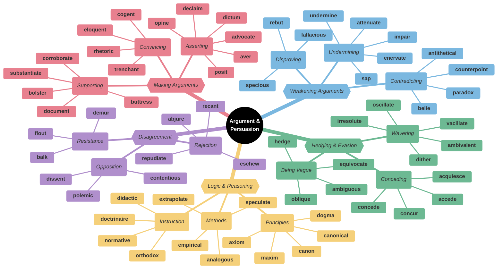
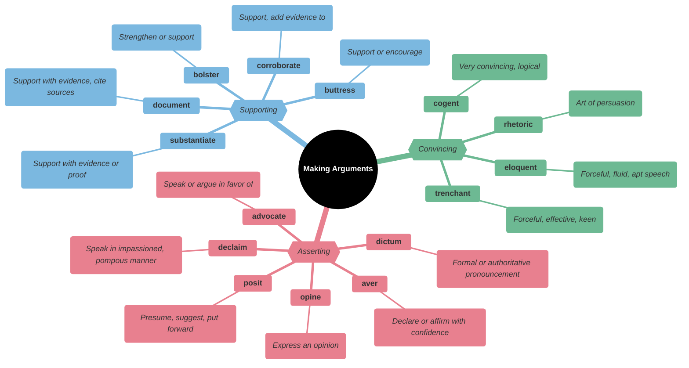
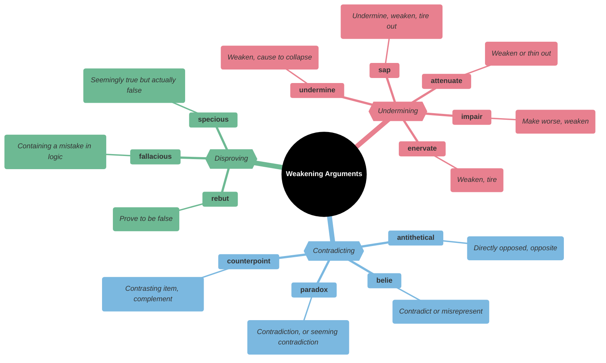
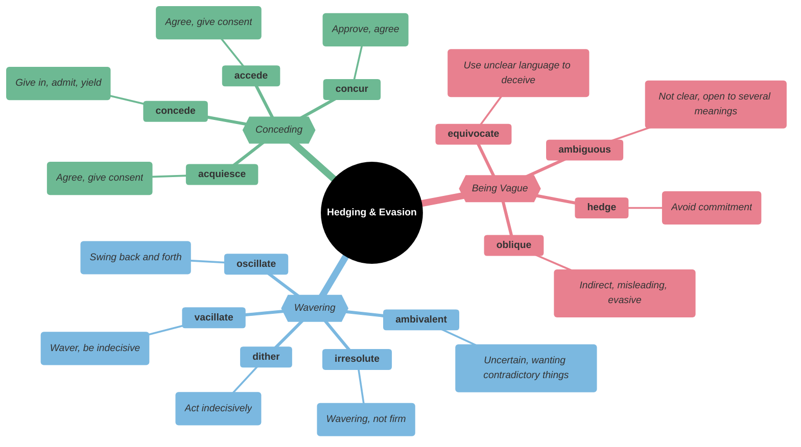
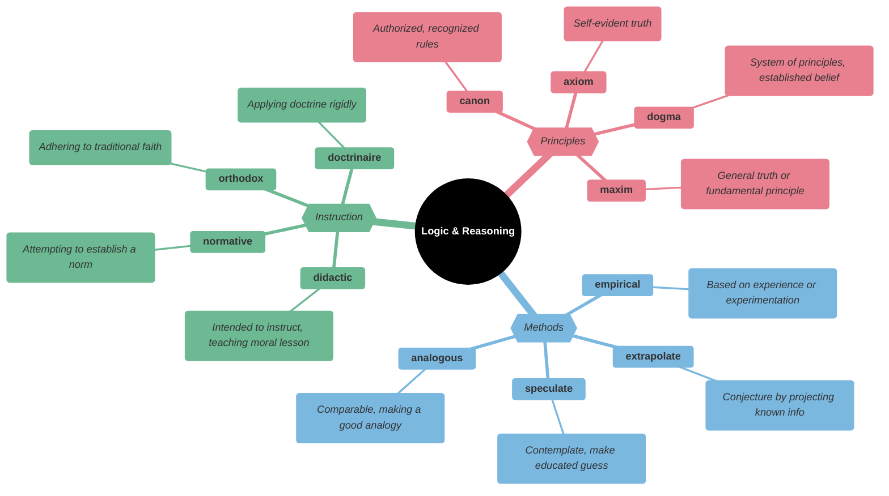
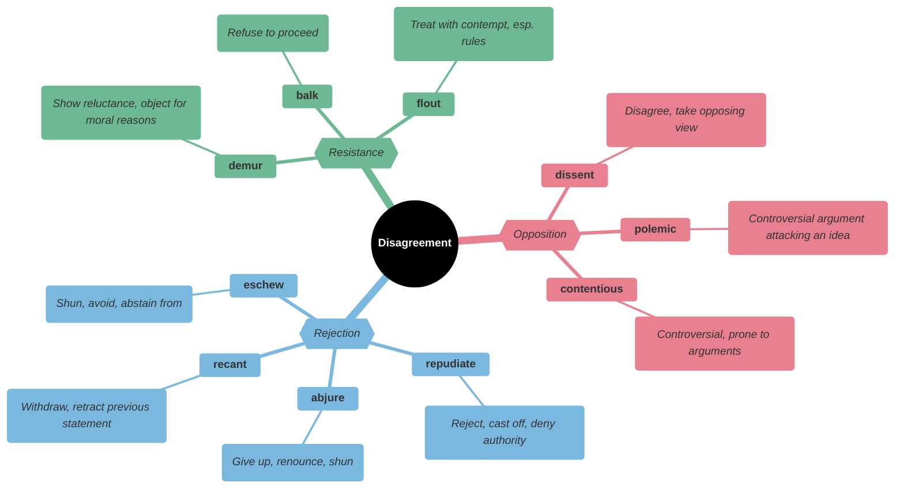
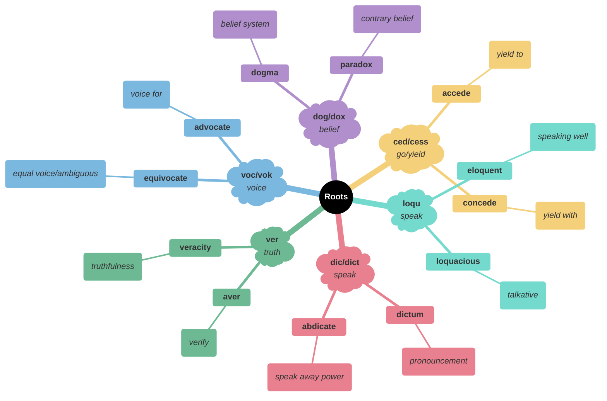

# 🗣️ Argument, Persuasion & Rhetoric

## Main Mindmap

---

## Detailed Focus

### Making Arguments

<vocabulary_table>

| Word             | Definition                                                                                                                         | Memory Hook                                         | Example Sentence                                                        |
| ---------------- | ---------------------------------------------------------------------------------------------------------------------------------- | --------------------------------------------------- | ----------------------------------------------------------------------- |
| **aver**         | Declare or affirm with confidence                                                                                                  | **A-VER** → **VER**ify truth                        | He **averred** that he was innocent of the charges.                     |
| **posit**        | Presume, suggest, put forward                                                                                                      | **POSIT**-ion → Put in **POSIT**ion                 | The theory **posits** that the universe is expanding.                   |
| **advocate**     | Publicly recommend or support                                                                                                      | **AD-VOC**-ate → Add **VOC**al support              | He is a strong **advocate** for renewable energy.                       |
| **opine**        | Hold and state as one's opinion                                                                                                    | **OPIN**-e → **OPIN**ion                            | The critic **opined** that the movie was a masterpiece.                 |
| **dictum**       | A formal pronouncement from an authoritative source                                                                                | **DICT**-um → **DICT**ator speaks                   | He followed the old **dictum**: "Early to bed, early to rise."          |
| **declaim**      | Utter or deliver words or a speech in a rhetorical or impassioned way, as if to an audience                                        | **DE-CLAIM** → **CLAIM** loudly                     | He stood on the soapbox to **declaim** against the evils of capitalism. |
| **corroborate**  | Confirm or give support to (a statement, theory, or finding)                                                                       | **CO-ROBOR**-ate → **ROBOT**s supporting each other | The witness **corroborated** the victim's account of the attack.        |
| **substantiate** | Provide evidence to support or prove the truth of                                                                                  | **SUBSTANT**-iate → Give **SUBSTANC**e              | Can you **substantiate** your claim with proof?                         |
| **document**     | Support or accompany with documentation                                                                                            | **DOC**-ument → Provide **DOC**s                    | Please **document** all your expenses for reimbursement.                |
| **bolster**      | Support or strengthen; prop up                                                                                                     | **BOLSTER** pillow → Supports you                   | The new evidence **bolstered** the prosecution's case.                  |
| **buttress**     | Provide (a building or structure) with projecting supports built against its walls; strengthen or support                          | **BUTT**-ress → **BUTT**ress supports the wall      | The theory was **buttressed** by years of research.                     |
| **cogent**       | (of an argument or case) clear, logical, and convincing                                                                            | **CO-GENT** → **GENT**leman's logic                 | She presented a **cogent** argument for why the law should be changed.  |
| **rhetoric**     | The art of effective or persuasive speaking or writing, especially the use of figures of speech and other compositional techniques | **RHETOR**-ic → **RHETOR**ical question             | His speech was full of fiery **rhetoric** but lacked substance.         |
| **eloquent**     | Fluent or persuasive in speaking or writing                                                                                        | **ELOQU**-ent → **LOQU** (speak) well               | Her **eloquent** eulogy moved everyone to tears.                        |
| **trenchant**    | Vigorous or incisive in expression or style                                                                                        | **TRENCH**-ant → Cut a **TRENCH** (deep/sharp)      | She wrote a **trenchant** critique of the government's policy.          |

</vocabulary_table>

### Weakening Arguments

<vocabulary_table>

| Word             | Definition                                                                                                                                 | Memory Hook                                         | Example Sentence                                                              |
| ---------------- | ------------------------------------------------------------------------------------------------------------------------------------------ | --------------------------------------------------- | ----------------------------------------------------------------------------- |
| **undermine**    | Damage or weaken (someone or something), especially gradually or insidiously                                                               | **UNDER-MINE** → Dig **MINE** **UNDER**             | Constant criticism can **undermine** a child's self-confidence.               |
| **attenuate**    | Reduce the force, effect, or value of                                                                                                      | **AT-TEN**-uate → Make **THIN** (tenuous)           | The vaccine **attenuates** the virus so it doesn't cause severe illness.      |
| **impair**       | Weaken or damage something (especially a human faculty or function)                                                                        | **IM-PAIR** → Make im**PER**fect                    | Alcohol can **impair** your ability to drive.                                 |
| **enervate**     | Cause (someone) to feel drained of energy or vitality; weaken                                                                              | **E-NERV**-ate → Remove **NERV**e/energy            | The hot sun **enervated** the runners.                                        |
| **sap**          | Gradually weaken or destroy (a person's strength or power)                                                                                 | **SAP** (tree blood) → Drain the **SAP**            | The long illness **sapped** his strength.                                     |
| **belie**        | (of an appearance) fail to give a true notion or impression of (something); disguise or contradict                                         | **BE-LIE** → To **BE** a **LIE**                    | Her calm demeanor **belied** the panic she was feeling inside.                |
| **antithetical** | Directly opposed or contrasted; mutually incompatible                                                                                      | **ANTI-THET**-ical → **ANTI**-thesis                | His lifestyle was **antithetical** to everything his parents stood for.       |
| **paradox**      | A seemingly absurd or self-contradictory statement or proposition that when investigated or explained may prove to be well founded or true | **PARA-DOX** → **PARA** (beyond) **DOX** (belief)   | It is a **paradox** that computers need maintenance so they can save us time. |
| **counterpoint** | An argument, idea, or theme used to create a contrast with the main element                                                                | **COUNTER-POINT** → Point against                   | The upbeat music provided a strange **counterpoint** to the tragic scene.     |
| **rebut**        | Claim or prove that (evidence or an accusation) is false                                                                                   | **RE-BUT** → **BUT** wait, that's wrong             | The lawyer **rebutted** the witness's testimony.                              |
| **fallacious**   | Based on a mistaken belief                                                                                                                 | **FALL**-acious → Argument **FALL**s down           | His argument was based on **fallacious** reasoning.                           |
| **specious**     | Superficially plausible, but actually wrong                                                                                                | **SPECI**-ous → **SPECI**es (looks like, but isn't) | The politician's argument was **specious** and misleading.                    |

</vocabulary_table>

### Hedging & Evasion

<vocabulary_table>

| Word           | Definition                                                                    | Memory Hook                                         | Example Sentence                                                                |
| -------------- | ----------------------------------------------------------------------------- | --------------------------------------------------- | ------------------------------------------------------------------------------- |
| **equivocate** | Use ambiguous language so as to conceal the truth or avoid committing oneself | **EQUI-VOC**-ate → **EQUAL VOC**al (two voices)     | When asked about the scandal, the politician **equivocated**.                   |
| **ambiguous**  | Open to more than one interpretation; having a double meaning                 | **AMBI**-guous → **AMBI** (both) meanings           | The ending of the movie was **ambiguous**, leaving the audience guessing.       |
| **hedge**      | Limit or qualify (something) by conditions or exceptions                      | **HEDGE** → Hide behind a **HEDGE**                 | He **hedged** his bets by investing in both companies.                          |
| **oblique**    | Not explicit or direct in addressing a point                                  | **OBLIQUE** angle → Slanted/indirect                | He made an **oblique** reference to the scandal but didn't mention it directly. |
| **vacillate**  | Alternate or waver between different opinions or actions; be indecisive       | **VACILL**-ate → **VAC**uum back and forth          | He **vacillated** between buying a car and a motorcycle.                        |
| **ambivalent** | Having mixed feelings or contradictory ideas about something or someone       | **AMBI-VAL**-ent → **AMBI** (both) **VAL**ues       | She was **ambivalent** about moving to a new city.                              |
| **irresolute** | Showing or feeling hesitancy; uncertain                                       | **IR-RESOLUTE** → Not **RESOLUTE**                  | The **irresolute** leader failed to act in time.                                |
| **dither**     | Be indecisive                                                                 | **DITHER** → **DIT**-**DAH** (morse code confusion) | Stop **dithering** and pick a restaurant!                                       |
| **oscillate**  | Move or swing back and forth at a regular speed                               | **OSCILL**-ate → **OSCILL**ating fan                | His mood **oscillated** between hope and despair.                               |
| **concede**    | Admit that something is true or valid after first denying or resisting it     | **CON-CEDE** → **CEDE** (give up) the point         | After hours of debate, he finally **conceded** that she was right.              |
| **acquiesce**  | Accept something reluctantly but without protest                              | **AC-QUIET**-sce → Agree **QUIET**ly                | She **acquiesced** to her boss's plan despite her reservations.                 |
| **accede**     | Assent or agree to a demand, request, or treaty                               | **AC-CEDE** → **CEDE** (give up) to agree           | The government **acceded** to the demands of the protesters.                    |
| **concur**     | Be of the same opinion; agree                                                 | **CON-CUR** → **CUR**rent runs together             | I **concur** with the committee's findings.                                     |

</vocabulary_table>

### Logic & Reasoning

<vocabulary_table>

| Word            | Definition                                                                                                                                                                                               | Memory Hook                                           | Example Sentence                                                                                         |
| --------------- | -------------------------------------------------------------------------------------------------------------------------------------------------------------------------------------------------------- | ----------------------------------------------------- | -------------------------------------------------------------------------------------------------------- |
| **axiom**       | A statement or proposition that is regarded as being established, accepted, or self-evidently true                                                                                                       | **AXI**-om → **AXI**s of truth                        | It is a widely held **axiom** that governments should not negotiate with terrorists.                     |
| **dogma**       | A principle or set of principles laid down by an authority as incontrovertibly true                                                                                                                      | **DOG**-ma → **DOG**matic belief                      | He challenged the political **dogma** of his time.                                                       |
| **maxim**       | A short, pithy statement expressing a general truth or rule of conduct                                                                                                                                   | **MAX**-im → **MAX**imum truth                        | "Actions speak louder than words" is a well-known **maxim**.                                             |
| **canon**       | A general law, rule, principle, or criterion by which something is judged                                                                                                                                | **CAN**-on → **CAN**onical law                        | The **canon** of Western literature includes Shakespeare and Dickens.                                    |
| **canonical**   | Included in the list of sacred books officially accepted as genuine                                                                                                                                      | **CANON**-ical → Official rule                        | The **canonical** gospels are Matthew, Mark, Luke, and John.                                             |
| **empirical**   | Based on, concerned with, or verifiable by observation or experience rather than theory or pure logic                                                                                                    | **EMPIR**-ical → **EMPIR**e built on facts            | The scientist relied on **empirical** data to support his hypothesis.                                    |
| **extrapolate** | Extend the application of (a method or conclusion, especially one based on statistics) to an unknown situation by assuming that existing trends will continue                                            | **EXTRA-POL**-ate → **POL**e vault to future          | We can **extrapolate** the future population based on current growth rates.                              |
| **speculate**   | Form a theory or conjecture about a subject without firm evidence                                                                                                                                        | **SPEC**-ulate → **SPEC**tator guessing               | We can only **speculate** about the reasons for his resignation.                                         |
| **analogous**   | Comparable in certain respects                                                                                                                                                                           | **ANA-LOG**-ous → **ANA**logy                         | The relationship between a ruler and his subjects is **analogous** to that of a father and his children. |
| **didactic**    | Intended to teach, particularly in having moral instruction as an ulterior motive                                                                                                                        | **DID-ACT**-ic → **DID** you **ACT** on the lesson?   | The children's book was a bit too **didactic** for my taste.                                             |
| **normative**   | Establishing, relating to, or deriving from a standard or norm, especially of behavior                                                                                                                   | **NORM**-ative → Setting the **NORM**                 | The report made **normative** recommendations for future policy.                                         |
| **orthodox**    | (of a person or their views, especially religious or political ones, or other beliefs or practices) conforming to what is generally or traditionally accepted as right or true; established and approved | **ORTHO-DOX** → **ORTHO** (straight) **DOX** (belief) | He holds **orthodox** views on education.                                                                |
| **doctrinaire** | Seeking to impose a doctrine in all circumstances without regard to practical considerations                                                                                                             | **DOCTRIN**-aire → **DOCTRIN**e airhead               | His **doctrinaire** approach to economics ignored the reality of the situation.                          |

</vocabulary_table>

### Disagreement

<vocabulary_table>

| Word            | Definition                                                                                            | Memory Hook                                         | Example Sentence                                                      |
| --------------- | ----------------------------------------------------------------------------------------------------- | --------------------------------------------------- | --------------------------------------------------------------------- |
| **dissent**     | The expression or holding of opinions at variance with those previously, commonly, or officially held | **DIS-SENT** → **SENT** away feeling                | There was some **dissent** within the party regarding the new policy. |
| **polemic**     | A strong verbal or written attack on someone or something                                             | **POLE**-mic → **POLE**s apart (fighting)           | He wrote a fierce **polemic** against the war.                        |
| **contentious** | Causing or likely to cause an argument; controversial                                                 | **CONTENT**-ious → Not **CONTENT**, wants to fight  | The issue of gun control is highly **contentious**.                   |
| **repudiate**   | Refuse to accept or be associated with                                                                | **RE-PUD**-iate → **PUD**dle (step away from)       | She **repudiated** the allegations of corruption.                     |
| **abjure**      | Solemnly renounce (a belief, cause, or claim)                                                         | **AB-JUR**-e → **JUR**y (law) says away             | He **abjured** his allegiance to the king.                            |
| **recant**      | Say that one no longer holds an opinion or belief, especially one considered heretical                | **RE-CANT** → **CANT** (sing) again/backwards       | He was forced to **recant** his statement under pressure.             |
| **eschew**      | Deliberately avoid using; abstain from                                                                | **ES-CHEW** → **CHEW** something else (spit it out) | He **eschewed** violence and advocated for peaceful protest.          |
| **demur**       | Raise doubts or objections or show reluctance                                                         | **DE-MUR** → **MUR**mur against                     | She **demurred** when asked to speak at the conference.               |
| **balk**        | Hesitate or be unwilling to accept an idea or undertaking                                             | **BALK** → Like a baseball pitcher stopping         | The horse **balked** at the jump and refused to go over.              |
| **flout**       | Openly disregard (a rule, law or convention)                                                          | **FLOUT** → **FL**y **OUT** of rules                | Many drivers **flout** the speed limit on this highway.               |

</vocabulary_table>

---

## Etymology & Roots

