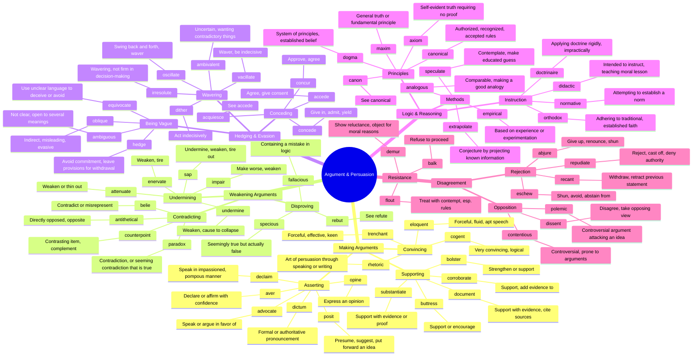

# 🗣️ Argument, Persuasion & Rhetoric

> GRE vocabulary for debate, logic, rhetoric, and persuasion.

## Mind Map

## Quick Memory Hooks

| Word        | Memory Hook                                         |
| ----------- | --------------------------------------------------- |
| cogent      | CO-GENT → A gentleman's convincing argument         |
| equivocate  | EQUI-VOCATE → Equal voices on both sides, so vague  |
| vacillate   | VACILL-ate → Oscillate like a vacuum back and forth |
| fallacious  | FALL-acious → Your argument FALLS apart             |
| specious    | SPECI-ous → Looks special but is false              |
| axiom       | AXI-om → The AXIS around which truth revolves       |
| corroborate | CO-ROBORATE → Robots working together to support    |
| polemic     | POLE-mic → Opposite poles, controversial            |
