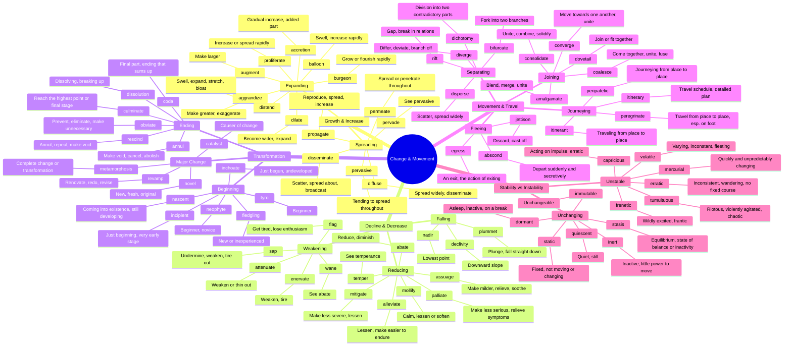

# 🔄 Change, Movement & Transformation

> GRE vocabulary for growth, decline, transformation, and motion.

## Mind Map

## Quick Memory Hooks

| Word          | Memory Hook                                     |
| ------------- | ----------------------------------------------- |
| burgeon       | BURGER-on → Growing like burgers piling on      |
| nascent       | NASC-ent → Like being BORN (natal, nascent)     |
| peripatetic   | PERI-PATETIC → Walking around the perimeter     |
| coalesce      | COAL-ESCE → Coals coming together to form fire  |
| abscond       | ABS-COND → Absolutely in hiding (concealed)     |
| mercurial     | MERCUR-ial → Like Mercury, the fastest planet   |
| plummet       | PLUM-met → Drop like a plum from a tree         |
| metamorphosis | META-MORPH → Beyond form, complete shape change |
