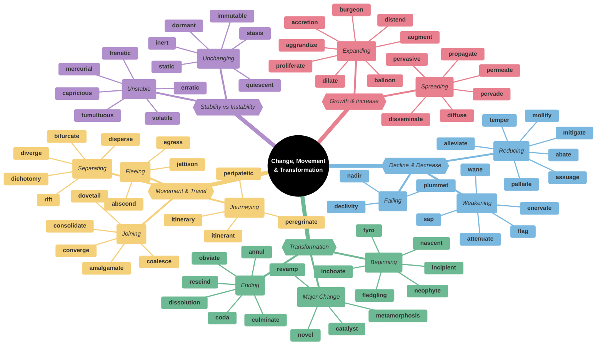
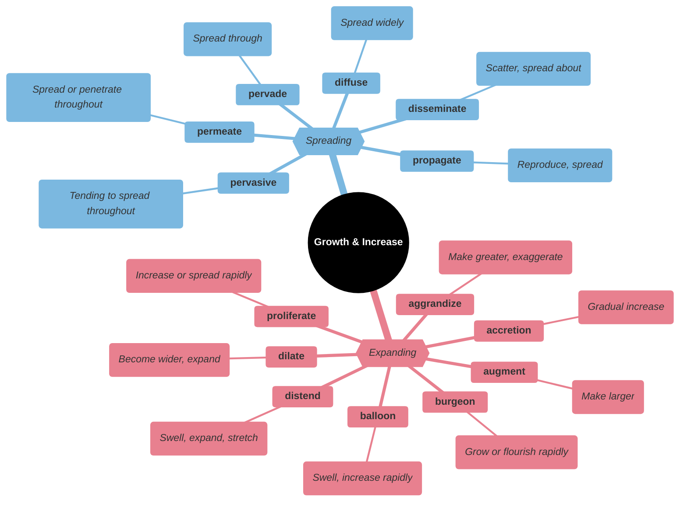
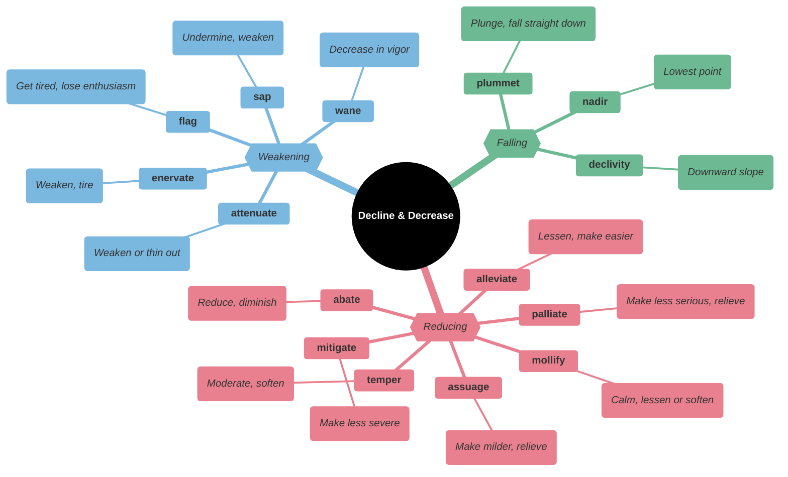
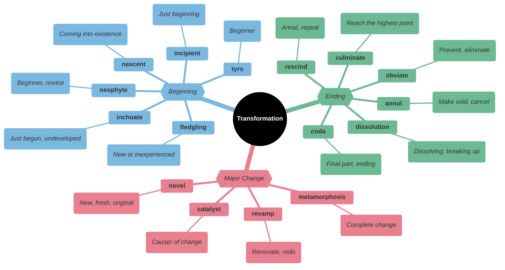
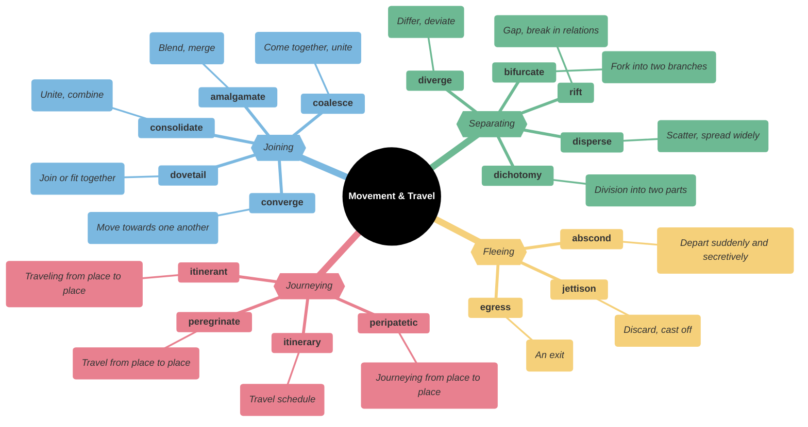
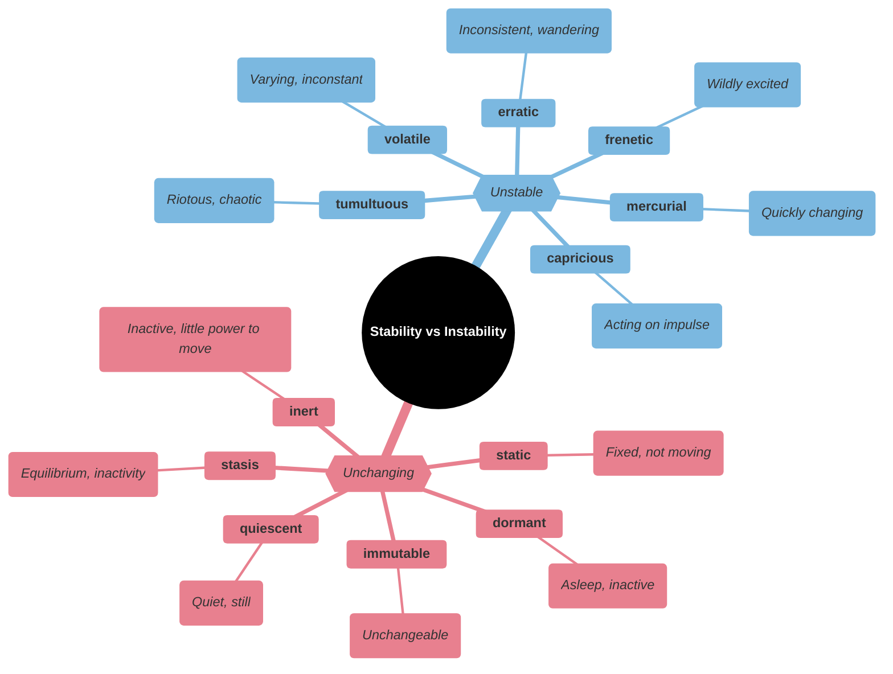
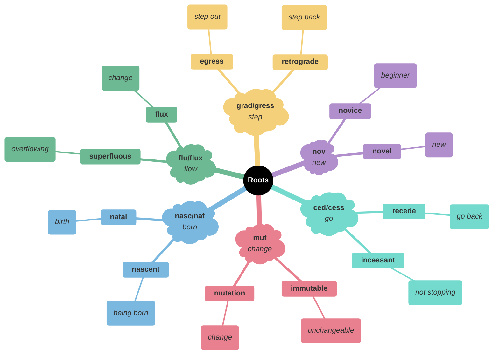

# 🔄 Change, Movement & Transformation

## Main Mindmap

---

## Detailed Focus

### Growth & Increase

| Word            | Definition                                                                                                         | Memory Hook                                              | Example Sentence                                                   |
| --------------- | ------------------------------------------------------------------------------------------------------------------ | -------------------------------------------------------- | ------------------------------------------------------------------ |
| **accretion**   | The process of growth or increase, typically by the gradual accumulation of additional layers or matter            | **AC-CRET**-ion → **A**dd **C**oncrete layers            | The **accretion** of barnacles slowed the ship down.               |
| **aggrandize**  | Increase the power, status, or wealth of                                                                           | **AG-GRAND**-ize → Make **GRAND**er                      | The dictator sought to **aggrandize** himself by building statues. |
| **augment**     | Make (something) greater by adding to it; increase                                                                 | **AUG**-ment → **AUG**ust (grand)                        | He **augmented** his income by working a second job.               |
| **balloon**     | Swell out in shape; increase rapidly                                                                               | **BALLOON** → Expands with air                           | The budget deficit **ballooned** during the recession.             |
| **burgeon**     | Begin to grow or increase rapidly; flourish                                                                        | **BURG**-eon → **BURG**er (eating makes you grow)        | The town **burgeoned** into a city after the railroad was built.   |
| **diffuse**     | Spread or cause to spread over a wide area or among a large number of people                                       | **DIF-FUSE** → **FUSE** (melt/pour) apart                | The fan helped **diffuse** the smoke from the kitchen.             |
| **dilate**      | Make or become wider, larger, or more open                                                                         | **DI-LATE** → **DIE** **LATE** (live longer/expand life) | The doctor put drops in my eyes to **dilate** the pupils.          |
| **disseminate** | Spread or disperse (something, especially information) widely                                                      | **DIS-SEMIN**-ate → **SEMEN** (seeds) scattered          | The internet allows us to **disseminate** information instantly.   |
| **distend**     | Swell or cause to swell by pressure from inside                                                                    | **DIS-TEND** → **TEND** to extend                        | The starving child's belly was **distended**.                      |
| **permeate**    | Spread throughout (something); pervade                                                                             | **PER-MEAT** → Marinade goes through **MEAT**            | The smell of baking bread **permeated** the house.                 |
| **pervade**     | (especially of a smell) spread through and be perceived in every part of                                           | **PER-VADE** → **PER**manently in**VADE**                | A sense of gloom **pervaded** the locker room after the loss.      |
| **pervasive**   | (especially of an unwelcome influence or physical effect) spreading widely throughout an area or a group of people | **PERVAS**-ive → **PERVAD**ing                           | The corruption was **pervasive** in the local government.          |
| **proliferate** | Increase rapidly in numbers; multiply                                                                              | **PRO-LIFE**-rate → **LIFE** grows at high **RATE**      | Weeds tend to **proliferate** in neglected gardens.                |
| **propagate**   | Spread and promote (an idea, theory, etc.) widely                                                                  | **PROP**-agate → **PROP** up and grow                    | The group uses social media to **propagate** its message.          |

### Decline & Decrease

| Word          | Definition                                                                                                                 | Memory Hook                                           | Example Sentence                                                     |
| ------------- | -------------------------------------------------------------------------------------------------------------------------- | ----------------------------------------------------- | -------------------------------------------------------------------- |
| **abate**     | (of something perceived as hostile, threatening, or negative) become less intense or widespread                            | **A-BATE** → **A** **B**it l**ATE** (storm is ending) | The storm finally **abated** after three days of heavy rain.         |
| **alleviate** | Make (suffering, deficiency, or a problem) less severe                                                                     | **A-LLEV**-iate → **ELEV**ate the pain (lift it off)  | The medicine helped **alleviate** her headache.                      |
| **assuage**   | Make (an unpleasant feeling) less intense                                                                                  | **ASSUAGE** → **SAUSAGE** (comfort food)              | He tried to **assuage** his guilt by apologizing.                    |
| **attenuate** | Reduce the force, effect, or value of                                                                                      | **AT-TEN**-uate → Make **THIN** (tenuous)             | The heavy curtains **attenuated** the noise from the street.         |
| **declivity** | A downward slope                                                                                                           | **DE-CLIV**-ity → **DE**cline **CLIF**f               | The steep **declivity** made the hike dangerous.                     |
| **enervate**  | Cause (someone) to feel drained of energy or vitality; weaken                                                              | **E-NERV**-ate → No **NERV**e/energy                  | The heat wave **enervated** the entire city.                         |
| **flag**      | Become tired, weaker, or less enthusiastic                                                                                 | **FLAG** → Drooping like a **FLAG** without wind      | My energy began to **flag** after the third hour of the lecture.     |
| **mitigate**  | Make less severe, serious, or painful                                                                                      | **MITI-GATE** → **GATE** to stop pain                 | The new sea wall helped **mitigate** the damage from the storm.      |
| **mollify**   | Appease the anger or anxiety of (someone)                                                                                  | **MOLL**-ify → Make **MILD**                          | He tried to **mollify** the angry customer with a refund.            |
| **nadir**     | The lowest point in the fortunes of a person or organization                                                               | **NADIR** → **NA**-dear (nothing dear left)           | The loss of his job was the **nadir** of his career.                 |
| **palliate**  | Make (a disease or its symptoms) less severe or unpleasant without removing the cause                                      | **PALL**-iate → Put a **PALL** (cloak) over pain      | The drugs were given to **palliate** the pain, not cure the disease. |
| **plummet**   | Fall or drop straight down at high speed                                                                                   | **PLUM**-met → Drop like a **PLUM**                   | The stock market **plummeted** after the bad news.                   |
| **sap**       | Gradually weaken or destroy (a person's strength or power)                                                                 | **SAP** (tree blood) → Drain the **SAP**              | The heat **sapped** my energy.                                       |
| **temper**    | Act as a neutralizing or counterbalancing force to (something)                                                             | **TEMPER**-ature → Regulate heat                      | You should **temper** your criticism with some praise.               |
| **wane**      | (of the moon) have a progressively smaller part of its visible surface illuminated, so that it appears to decrease in size | **WANE** → **W**eak**ANE**                            | His influence began to **wane** as he got older.                     |

### Transformation

| Word              | Definition                                                                                                                      | Memory Hook                                         | Example Sentence                                                         |
| ----------------- | ------------------------------------------------------------------------------------------------------------------------------- | --------------------------------------------------- | ------------------------------------------------------------------------ |
| **annul**         | Declare invalid (an official agreement, decision, or result)                                                                    | **A-NULL** → Make **NULL** and void                 | The marriage was **annulled** after only two weeks.                      |
| **catalyst**      | A person or thing that precipitates an event                                                                                    | **CAT**-alyst → **CAT** starts the chase            | The protest was the **catalyst** for major political reform.             |
| **coda**          | A concluding event, remark, or section                                                                                          | **CODA** → **CO**ncluding **DA**ta                  | The scandal was a sad **coda** to his distinguished career.              |
| **culminate**     | Reach a climax or point of highest development                                                                                  | **CULMIN**-ate → **COLUMN** top                     | The investigation **culminated** in the arrest of the mayor.             |
| **dissolution**   | The closing down or dismissal of an assembly, partnership, or official body                                                     | **DIS-SOLU**-tion → **SOLU**tion dissolves          | The **dissolution** of the Soviet Union changed the world map.           |
| **fledgling**     | A person or organization that is immature, inexperienced, or underdeveloped                                                     | **FLEDG**-ling → Just got **FEATHER**s (fledge)     | The **fledgling** company struggled to compete with the industry giants. |
| **inchoate**      | Just begun and so not fully formed or developed; rudimentary                                                                    | **IN-CHO**-ate → **IN** **CHO**colate (messy start) | He had only a vague, **inchoate** idea of what he wanted to do.          |
| **incipient**     | In an initial stage; beginning to happen or develop                                                                             | **IN-CIPI**-ent → **IN**side **SIP**ping (starting) | The project is still in its **incipient** phase.                         |
| **metamorphosis** | (in an insect or amphibian) the process of transformation from an immature form to an adult form in two or more distinct stages | **META-MORPH**-osis → **MORPH**ing shape            | The caterpillar's **metamorphosis** into a butterfly is amazing.         |
| **nascent**       | (especially of a process or organization) just coming into existence and beginning to display signs of future potential         | **NASC**-ent → **NA**tal (birth)                    | The **nascent** democracy faced many challenges.                         |
| **neophyte**      | A person who is new to a subject, skill, or belief                                                                              | **NEO-PHYTE** → **NEO** (new) **PHYTE** (plant)     | As a **neophyte** to the game of golf, he missed the ball completely.    |
| **novel**         | New or unusual in an interesting way                                                                                            | **NOVEL** → New book                                | She came up with a **novel** solution to the problem.                    |
| **obviate**       | Remove (a need or difficulty)                                                                                                   | **OB-VI**-ate → **OB**vious way to a**VOI**d        | The new medical treatment **obviates** the need for surgery.             |
| **rescind**       | Revoke, cancel, or repeal (a law, order, or agreement)                                                                          | **RE-SCIND** → **SCISS**ors (cut back)              | The library **rescinded** the late fees.                                 |
| **revamp**        | Give new and improved form, structure, or appearance to                                                                         | **RE-VAMP** → **VAMP**ire gets new life             | The company plans to **revamp** its image.                               |
| **tyro**          | A beginner or novice                                                                                                            | **TYRO** → **TRY**-o (trying for first time)        | He is a **tyro** in the world of finance.                                |

### Movement & Travel

| Word            | Definition                                                                                                      | Memory Hook                                         | Example Sentence                                                                 |
| --------------- | --------------------------------------------------------------------------------------------------------------- | --------------------------------------------------- | -------------------------------------------------------------------------------- |
| **abscond**     | Leave hurriedly and secretly, typically to avoid detection of or arrest for an unlawful action                  | **ABS-COND** → **ABS**ent in a se**COND**           | The treasurer **absconded** with the club's funds.                               |
| **amalgamate**  | Combine or unite to form one organization or structure                                                          | **AMALGAM**-ate → **GUM** together                  | The two companies decided to **amalgamate** to increase their market share.      |
| **bifurcate**   | Divide into two branches or forks                                                                               | **BI-FURC**-ate → **BI** (two) **FORK**s            | The river **bifurcates** just before it reaches the sea.                         |
| **coalesce**    | Come together and form one mass or whole                                                                        | **COAL-ESCE** → **COAL**s burning together          | The different groups **coalesced** into a unified movement.                      |
| **consolidate** | Make (something) physically stronger or more solid; combine                                                     | **CON-SOLID**-ate → Make **SOLID** together         | The company **consolidated** its debts into a single loan.                       |
| **converge**    | (of lines) tend to meet at a point                                                                              | **CON-VERGE** → **VERGE** together                  | The two roads **converge** at the center of town.                                |
| **dichotomy**   | A division or contrast between two things that are or are represented as being opposed or entirely different    | **DI-CHOT**-omy → **DI** (two) **CUT**s             | There is a **dichotomy** between what he says and what he does.                  |
| **disperse**    | Scatter, spread widely                                                                                          | **DIS-PERSE** → **PERSE**cute apart                 | The crowd began to **disperse** after the concert.                               |
| **diverge**     | (of a road, route, or line) separate from another route, especially a main one, and go in a different direction | **DI-VERGE** → **DI** (two) ways                    | Their paths **diverged** after college.                                          |
| **dovetail**    | Join together harmoniously                                                                                      | **DOVE-TAIL** → Wood joint shaped like tail         | Our schedules **dovetailed** perfectly, so we could carpool.                     |
| **egress**      | The action of going out of or leaving a place                                                                   | **E-GRESS** → **E**xit pro**GRESS**                 | The fire blocked the main **egress** from the building.                          |
| **itinerant**   | Traveling from place to place                                                                                   | **ITINER**-ant → **ITINER**ary follower             | The **itinerant** preacher traveled from town to town.                           |
| **itinerary**   | A planned route or journey                                                                                      | **ITINER**-ary → Plan for **ITINER**ant             | We planned a detailed **itinerary** for our trip to Europe.                      |
| **jettison**    | Throw or drop (something) from an aircraft or ship                                                              | **JET**-ison → Throw from a **JET**                 | The captain ordered the crew to **jettison** the cargo to save the sinking ship. |
| **peregrinate** | Travel or wander around from place to place                                                                     | **PEREGRIN**-ate → **PEREGRIN**e falcon (traveler)  | He spent a year **peregrinating** through South America.                         |
| **peripatetic** | Traveling from place to place, especially working or based in various places for relatively short periods       | **PERI-PAT**-etic → **PAT**ter around **PERI**meter | The **peripatetic** nurse worked in three different hospitals.                   |
| **rift**        | A crack, split, or break in something                                                                           | **RIFT** → **RIP**t                                 | The argument caused a deep **rift** in their friendship.                         |

### Stability vs Instability

| Word           | Definition                                                                                                                 | Memory Hook                                           | Example Sentence                                                            |
| -------------- | -------------------------------------------------------------------------------------------------------------------------- | ----------------------------------------------------- | --------------------------------------------------------------------------- |
| **capricious** | Given to sudden and unaccountable changes of mood or behavior                                                              | **CAPRIC**-ious → **CAPRIC**orn (goat jumping around) | The **capricious** weather made it difficult to plan a picnic.              |
| **dormant**    | (of an animal) having normal physical functions suspended or slowed down for a period of time; in or as if in a deep sleep | **DORM**-ant → **DORM**itory (sleeping place)         | The volcano has been **dormant** for hundreds of years.                     |
| **erratic**    | Not even or regular in pattern or movement; unpredictable                                                                  | **ERR**-atic → **ERR**or prone wandering              | His **erratic** driving attracted the attention of the police.              |
| **frenetic**   | Fast and energetic in a rather wild and uncontrolled way                                                                   | **FREN**-etic → **FREN**zy                            | The office was a scene of **frenetic** activity as the deadline approached. |
| **immutable**  | Unchanging over time or unable to be changed                                                                               | **IM-MUT**-able → Not **MUT**able (mutant/change)     | The laws of physics are **immutable**.                                      |
| **inert**      | Lacking the ability or strength to move                                                                                    | **IN-ERT** → **IN**-**ART** (no skill/move)           | The gas is chemically **inert** and rarely reacts with other substances.    |
| **mercurial**  | (of a person) subject to sudden or unpredictable changes of mood or mind                                                   | **MERCUR**-ial → Like **MERCUR**y (liquid metal)      | His **mercurial** temperament made him difficult to work with.              |
| **quiescent**  | In a state or period of inactivity or dormancy                                                                             | **QUIET**-scent → **QUIET**                           | The political situation remained **quiescent** for a few months.            |
| **stasis**     | A period or state of inactivity or equilibrium                                                                             | **STA**-sis → **STA**y still                          | The project was in **stasis** while they waited for funding.                |
| **static**     | Lacking in movement, action, or change                                                                                     | **STAT**-ic → **STAT**ue                              | House prices have remained **static** for the last year.                    |
| **tumultuous** | Making a loud, confused noise; uproarious                                                                                  | **TUMULT**-uous → **TUMULT** (uproar)                 | The crowd gave the band a **tumultuous** welcome.                           |
| **volatile**   | (of a substance) easily evaporated at normal temperatures; liable to change rapidly and unpredictably                      | **VOL**-atile → **VOL**cano                           | The stock market is very **volatile** right now.                            |

---

## Etymology & Roots

