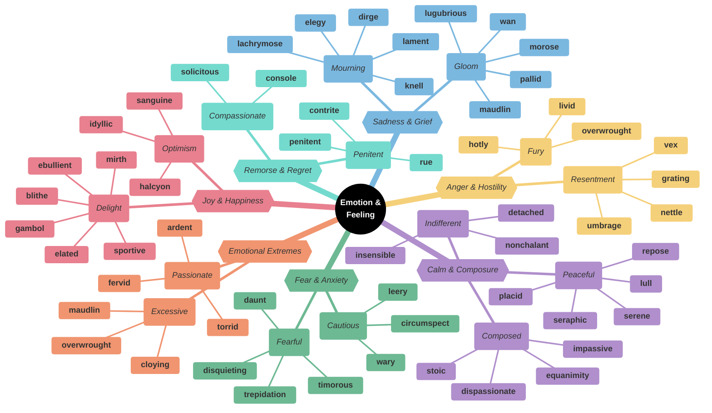
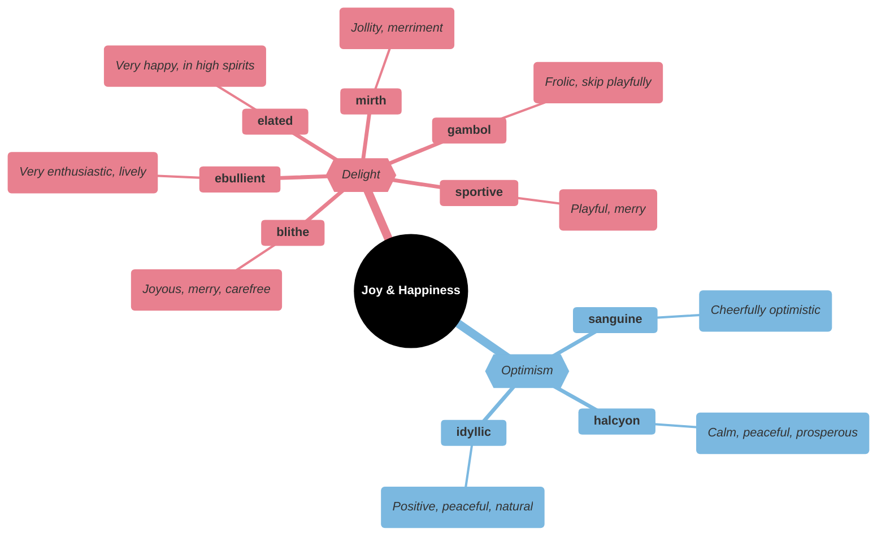
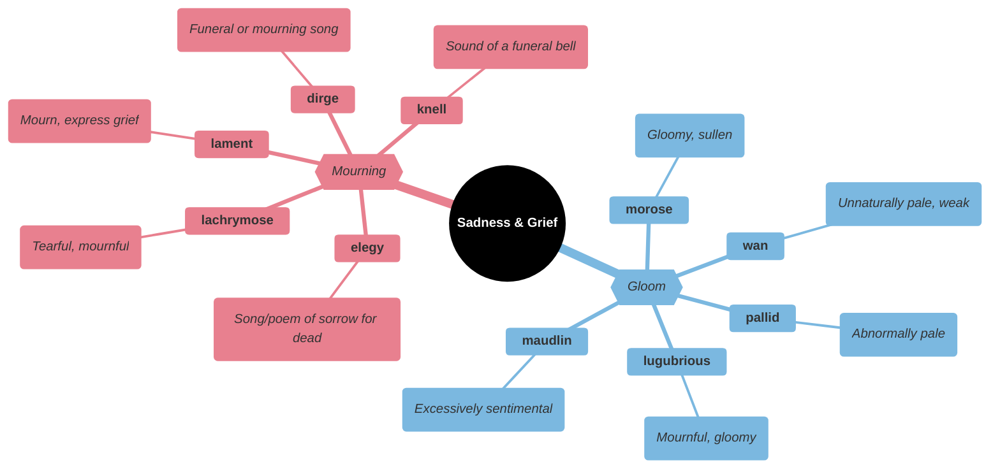
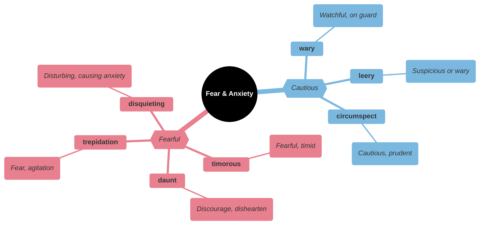
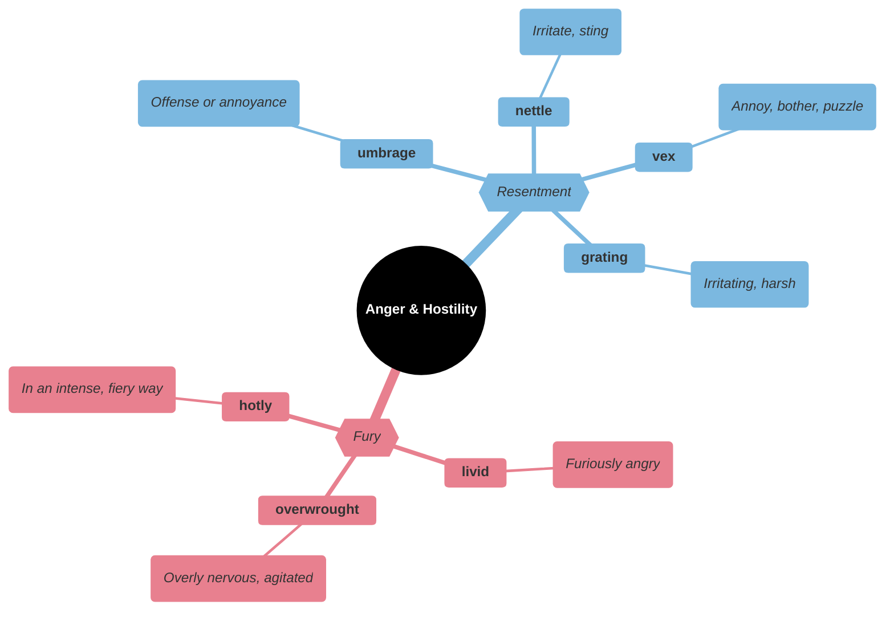
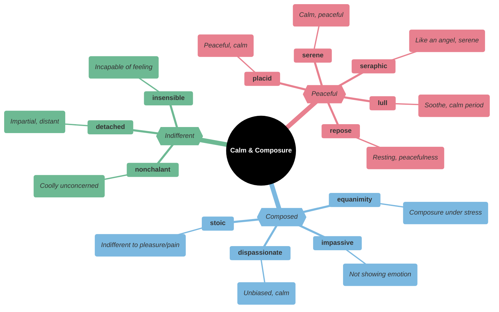
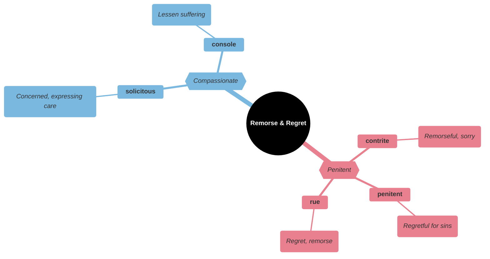
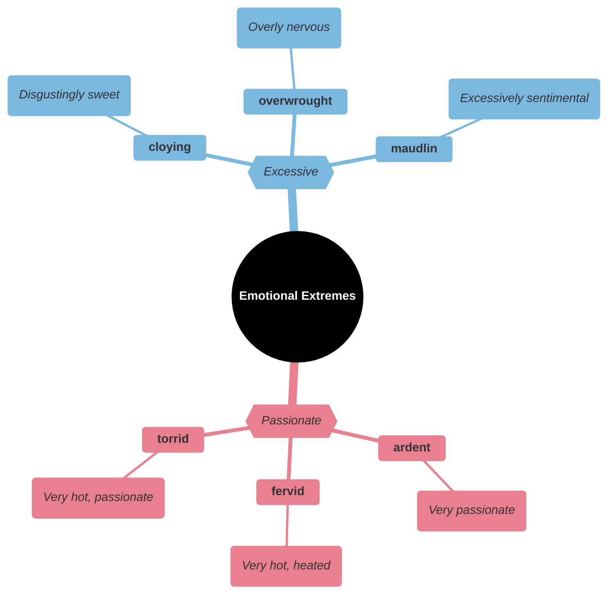
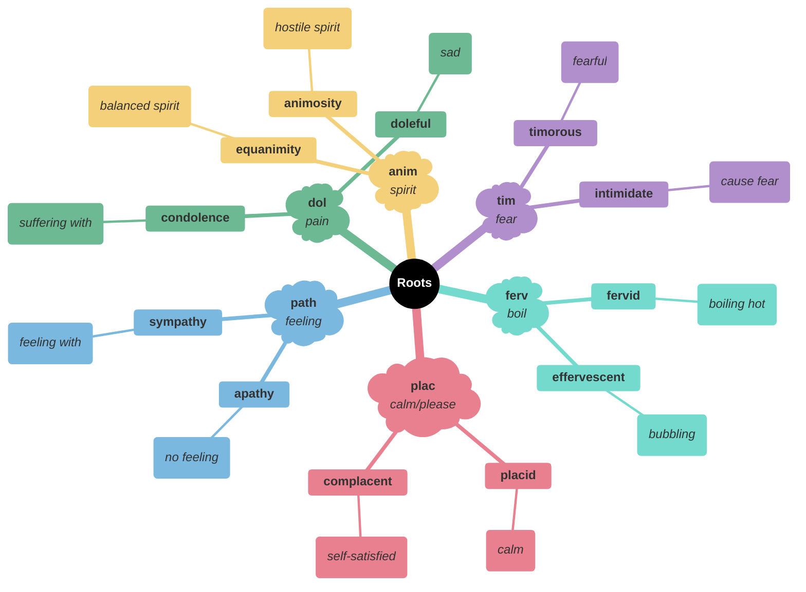

# 💭 Emotion, Feeling & Temperament

## Main Mindmap

---

## Detailed Focus

### Joy & Happiness

| Word          | Phonetics     | Definition                                                                               | Memory Hook                                                     | Example Sentence                                                                    |
| ------------- | ------------- | ---------------------------------------------------------------------------------------- | --------------------------------------------------------------- | ----------------------------------------------------------------------------------- |
| **elated**    | ee-LAY-tid    | Ecstatically happy                                                                       | **ELEVAT**-ed → Lifted up in spirit                             | She was **elated** when she found out she had been accepted into her dream college. |
| **blithe**    | blythe        | Showing a casual and cheerful indifference considered to be callous or improper; happy   | **BLITHE** spirit → Light and happy                             | She showed a **blithe** disregard for the rules.                                    |
| **ebullient** | ih-BUHL-yuhnt | Cheerful and full of energy                                                              | **E-BULL**-ient → Like a **BULL** bubbling with energy          | Her **ebullient** personality made her the life of the party.                       |
| **mirth**     | murth         | Amusement, especially as expressed in laughter                                           | **MIRTH** → **M**erriment and b**IRTH**day fun                  | The room was filled with **mirth** and laughter.                                    |
| **gambol**    | GAM-buhl      | Run or jump about playfully                                                              | **GAMB**-ol → **GAMB**le (play) / **GAME**-ball                 | The lambs **gamboled** in the meadow.                                               |
| **sportive**  | SPOR-tiv      | Playful; lighthearted                                                                    | **SPORT**-ive → Like a **SPORT**                                | The **sportive** puppy chased its tail.                                             |
| **sanguine**  | SAN-gwin      | Optimistic or positive, especially in an apparently bad or difficult situation           | **SANGUIN** (blood) → Red-cheeked (healthy/happy)               | He remained **sanguine** about the company's future despite the recent losses.      |
| **halcyon**   | HAL-see-uhn   | Denoting a period of time in the past that was idyllically happy and peaceful            | **HALCYON** → **HAL**l of **CYON** (mythical bird calming seas) | She recalled the **halcyon** days of her youth.                                     |
| **idyllic**   | ahy-DIL-ik    | (especially of a time or place) like an idyll; extremely happy, peaceful, or picturesque | **IDYLL**-ic → **IDLE** and perfect                             | They spent an **idyllic** vacation in a cottage by the sea.                         |

### Sadness & Grief

| Word           | Phonetics    | Definition                                                                                       | Memory Hook                                    | Example Sentence                                                                      |
| -------------- | ------------ | ------------------------------------------------------------------------------------------------ | ---------------------------------------------- | ------------------------------------------------------------------------------------- |
| **elegy**      | EL-ih-jee    | A poem of serious reflection, typically a lament for the dead                                    | **E-LEG**-y → **LEG**acy poem                  | He wrote a moving **elegy** for his fallen comrades.                                  |
| **dirge**      | durj         | A lament for the dead, especially one forming part of a funeral rite                             | **DIRGE** → **DIR**t grave song                | The slow, mournful **dirge** played as the coffin was lowered.                        |
| **lament**     | luh-MENT     | A passionate expression of grief or sorrow                                                       | **LAMENT** → **LAM**b la**MENT**ing            | The nation **lamented** the death of its leader.                                      |
| **lachrymose** | lak-ruh-mohs | Tearful or given to weeping                                                                      | **LACHRY**-mose → **LACHRY**mal glands (tears) | The **lachrymose** movie left the entire audience in tears.                           |
| **knell**      | nel          | The sound of a bell, especially when rung solemnly for a death or funeral                        | **KNELL** → **K**ill be**LL**                  | The closing of the factory sounded the death **knell** for the town.                  |
| **morose**     | muh-ROHS     | Sullen and ill-tempered                                                                          | **MOR**-ose → **MOR**bid/no **ROS**es          | He became **morose** and withdrawn after losing his job.                              |
| **lugubrious** | loo-GOO-bree-uhs | Looking or sounding sad and dismal                                                               | **LUG**-ubrious → **LUG**ging grief around     | The **lugubrious** music set a somber tone for the funeral.                           |
| **wan**        | wahn         | (of a person's complexion or appearance) pale and giving the impression of illness or exhaustion | **WAN** → **WAN**ing moon (pale)               | She gave a **wan** smile as she lay in the hospital bed.                              |
| **pallid**     | PAL-id       | (of a person's face) pale, typically because of poor health                                      | **PALL**-id → **PALL**or (pale)                | Her face was **pallid** and drawn from her illness.                                   |
| **maudlin**    | MAWD-lin     | Self-pityingly or tearfully sentimental, often through drunkenness                               | **MAUD**-lin → Mary **MAGD**alene weeping      | After a few drinks, he became **maudlin** and started crying about his ex-girlfriend. |

### Fear & Anxiety

| Word            | Phonetics     | Definition                                                           | Memory Hook                                             | Example Sentence                                                    |
| --------------- | ------------- | -------------------------------------------------------------------- | ------------------------------------------------------- | ------------------------------------------------------------------- |
| **daunt**       | dawnt         | Make (someone) feel intimidated or apprehensive                      | **DAUNT** → **DON'T** do it (scared)                    | The steep mountain did not **daunt** the experienced climbers.      |
| **timorous**    | TIM-er-uhs    | Showing or suffering from nervousness, fear, or a lack of confidence | **TIM**-orous → **TIM**id                               | The **timorous** mouse scurried across the floor.                   |
| **trepidation** | trep-i-DEY-shuhn | A feeling of fear or agitation about something that may happen       | **TREPID**-ation → **TRAP**ped feeling                  | She opened the letter with **trepidation**.                         |
| **disquieting** | dis-KWAHY-i-ting | Inducing feelings of anxiety or worry                                | **DIS-QUIET**-ing → Not **QUIET** (peaceful)            | There was a **disquieting** silence in the room.                    |
| **wary**        | WAIR-ee       | Feeling or showing caution about possible dangers or problems        | **WAR**-y → In a **WAR** zone (careful)                 | Be **wary** of strangers offering free candy.                       |
| **leery**       | LEER-ee       | Cautious or wary due to realistic suspicions                         | **LEER**-y → **LEER**ing suspiciously                   | I was **leery** of the deal because it sounded too good to be true. |
| **circumspect** | SUR-kuhm-spekt | Wary and unwilling to take risks                                     | **CIRCUM-SPECT** → **SPECT** (look) **CIRCUM** (around) | The politician was **circumspect** in his answers to the press.     |

### Anger & Hostility

| Word            | Phonetics   | Definition                                                                           | Memory Hook                                           | Example Sentence                                            |
| --------------- | ----------- | ------------------------------------------------------------------------------------ | ----------------------------------------------------- | ----------------------------------------------------------- |
| **livid**       | LIV-id      | Furiously angry                                                                      | **LIVID** → **LIV**ing dead (pale with rage)          | He was **livid** when he found out his car had been stolen. |
| **overwrought** | oh-ver-RAWT | In a state of nervous excitement or anxiety                                          | **OVER-WROUGHT** → **OVER**-worked/twisted            | The **overwrought** mother couldn't stop crying.            |
| **hotly**       | HOT-lee     | In an intense, fiery, or heated way                                                  | **HOT**-ly → With heat                                | The issue was **hotly** debated in parliament.              |
| **umbrage**     | UHM-brij    | Offense or annoyance                                                                 | **UMBR**-age → **UMBR**ella (shade/shadow of offense) | He took **umbrage** at her remarks about his weight.        |
| **nettle**      | NET-l       | Irritate or annoy (someone)                                                          | **NETTLE** → Stinging plant                           | She was **nettled** by his constant criticism.              |
| **vex**         | veks        | Make (someone) feel annoyed, frustrated, or worried, especially with trivial matters | **VEX** → **HEX** (curse/annoy)                       | The math problem **vexed** the students for hours.          |
| **grating**     | GRAY-ting   | Sounding harsh and unpleasant; irritating                                            | **GRAT**-ing → Like a cheese **GRAT**er on nerves     | His **grating** voice annoyed everyone in the office.       |

### Calm & Composure

| Word              | Phonetics      | Definition                                                                                                              | Memory Hook                                         | Example Sentence                                                    |
| ----------------- | -------------- | ----------------------------------------------------------------------------------------------------------------------- | --------------------------------------------------- | ------------------------------------------------------------------- |
| **placid**        | PLAS-id        | (of a person or animal) not easily upset or excited; calm                                                               | **PLAC**-id → **PLAC**ate (make calm)               | The **placid** lake reflected the mountains like a mirror.          |
| **serene**        | suh-REEN       | Calm, peaceful, and untroubled; tranquil                                                                                | **SERENE** → **SIREN** (singing calmly)             | The **serene** landscape painted a picture of perfect peace.        |
| **seraphic**      | suh-RAF-ik     | Characteristic of or resembling a seraph or seraphim; angelic                                                           | **SERAPH**-ic → **SERAPH**im (angel)                | The baby had a **seraphic** smile while sleeping.                   |
| **lull**          | luhl           | Calm or send to sleep, typically with soothing sounds or movements                                                      | **LULL**-aby                                        | The rhythmic sound of the waves **lulled** him to sleep.            |
| **repose**        | ri-POHZ        | A state of rest, sleep, or tranquility                                                                                  | **RE-POSE** → **RE**sting **POS**ition              | The statue captured the figure in a state of **repose**.            |
| **equanimity**    | ee-kwuh-NIM-i-tee | Mental calmness, composure, and evenness of temper, especially in a difficult situation                                 | **EQUA-NIM**-ity → **EQUA**l (balanced) **MIND**    | He accepted the bad news with **equanimity**.                       |
| **impassive**     | im-PAS-iv      | Not feeling or showing emotion                                                                                          | **IM-PASS**-ive → **PASS**ive face                  | He remained **impassive** as the verdict was read.                  |
| **dispassionate** | dis-PASH-uh-nit | Not influenced by strong emotion, and so able to be rational and impartial                                              | **DIS-PASSION**-ate → No **PASSION** (bias)         | A judge must be **dispassionate** when hearing a case.              |
| **stoic**         | STOH-ik        | A person who can endure pain or hardship without showing their feelings or complaining                                  | **STOIC** → **STO**ne-like                          | He remained **stoic** throughout the funeral service.               |
| **nonchalant**    | non-shuh-LAHNT | (of a person or manner) feeling or appearing casually calm and relaxed; not displaying anxiety, interest, or enthusiasm | **NON-CHAL**-ant → **NON**-**CAL**orie (light/easy) | He was surprisingly **nonchalant** about winning the lottery.       |
| **detached**      | di-TACHT       | Separate or disconnected; aloof and objective                                                                           | **DE-TACH**-ed → Not **ATTACH**ed                   | He tried to remain **detached** and professional during the crisis. |
| **insensible**    | in-SEN-suh-buhl | Without one's mental faculties, typically a result of violence or intoxication; unaware of                              | **IN-SENS**-ible → No **SENS**e/feeling             | He was **insensible** to the pain after the shock.                  |

### Remorse & Regret

| Word           | Phonetics   | Definition                                                            | Memory Hook                                           | Example Sentence                                               |
| -------------- | ----------- | --------------------------------------------------------------------- | ----------------------------------------------------- | -------------------------------------------------------------- |
| **contrite**   | kuhn-TRYT   | Feeling or expressing remorse or penitence; affected by guilt         | **CON-TRITE** → **TRITE** (worn out) with guilt       | He was **contrite** after breaking his mother's favorite vase. |
| **penitent**   | PEN-i-tuhnt | Feeling or showing sorrow and regret for having done wrong; repentant | **PENIT**-ent → **PENIT**entiary (prison for sinners) | The **penitent** thief returned the stolen money.              |
| **rue**        | roo         | Bitterly regret (something one has done or allowed to happen)         | **RUE** the day                                       | He will **rue** the day he crossed me.                         |
| **solicitous** | suh-LIS-i-tuhs | Characterized by or showing interest or concern                       | **SOLICIT**-ous → **SOLICIT**ing care                 | The **solicitous** nurse checked on her patient every hour.    |
| **console**    | kuhn-SOHL   | Comfort (someone) at a time of grief or disappointment                | **CONSOLE** → **CON**-**SOL** (with sun/warmth)       | Friends gathered to **console** the widow after the funeral.   |

### Emotional Extremes

| Word            | Phonetics   | Definition                                                              | Memory Hook                                          | Example Sentence                                                                      |
| --------------- | ----------- | ----------------------------------------------------------------------- | ---------------------------------------------------- | ------------------------------------------------------------------------------------- |
| **ardent**      | AHR-dnt     | Enthusiastic or passionate                                              | **ARD**-ent → **HARD**-core fan                      | He was an **ardent** supporter of the local football team.                            |
| **fervid**      | FUR-vid     | Intensely enthusiastic or passionate, especially to an excessive degree | **FERV**-id → **FEV**erish                           | The candidate spoke with **fervid** intensity about the need for change.              |
| **torrid**      | TOR-id      | Very hot and dry; full of difficulty or tribulation                     | **TORR**-id → **TORR**id zone (equator)              | They had a **torrid** love affair that ended badly.                                   |
| **cloying**     | KLOI-ing    | Disgustingly or excessively sweet or sentimental                        | **CLOY**-ing → **C**hoke on j**OY** (too much sweet) | The movie was ruined by a **cloying** romantic subplot.                               |
| **overwrought** | oh-ver-RAWT | In a state of nervous excitement or anxiety                             | **OVER-WROUGHT** → **OVER**-worked/twisted           | The **overwrought** mother couldn't stop crying.                                      |
| **maudlin**     | MAWD-lin    | Self-pityingly or tearfully sentimental, often through drunkenness      | **MAUD**-lin → Mary **MAGD**alene weeping            | After a few drinks, he became **maudlin** and started crying about his ex-girlfriend. |

---

## Etymology & Roots

