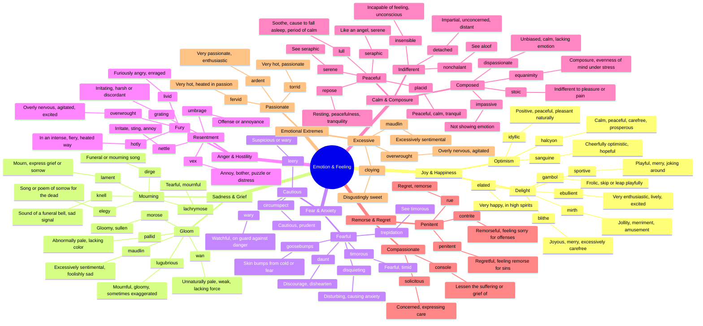

# 💭 Emotion, Feeling & Temperament

> GRE vocabulary for emotional states, moods, and dispositions.

## Mind Map

## Quick Memory Hooks

| Word       | Memory Hook                                  |
| ---------- | -------------------------------------------- |
| lachrymose | LACHRY-mose → LACHRYmal glands produce tears |
| lugubrious | Like LUGGAGE weighing you down with gloom    |
| umbrage    | UMBR-age → Under an umbrella of offense      |
| equanimity | EQUA-NIMITY → Equal mind, balanced           |
| contrite   | CON-TRITE → Feeling sorry and worn (trite)   |
| placid     | PLAC-id → Like a placid lake, calm           |
| sanguine   | SANGUIN = blood → Rosy-cheeked optimism      |
| maudlin    | Like Mary MAGDALENE weeping                  |
