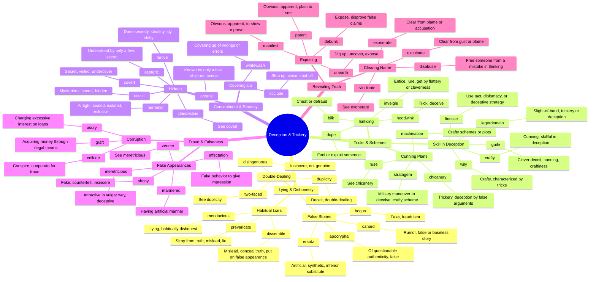

# 🎭 Deception, Trickery & Concealment

> GRE vocabulary for dishonesty, fraud, concealment, and subterfuge.

## Mind Map

## Quick Memory Hooks

| Word        | Memory Hook                                          |
| ----------- | ---------------------------------------------------- |
| chicanery   | CHIC-anery → A chic way of cheating                  |
| legerdemain | LEGER-DE-MAIN → Light of hand (French)               |
| mendacious  | MEND-acious → Needs to MEND their lying ways         |
| furtive     | FURT-ive → Like a thief, FURTher into shadows        |
| hoodwink    | HOOD-WINK → Pull the hood over eyes and wink         |
| collude     | COL-LUDE → Come together (col) to play (lude) tricks |
| exculpate   | EX-CULP-ate → Remove (ex) the culprit label          |
| dissemble   | DIS-SEMBLE → Not what it SEEMS                       |
