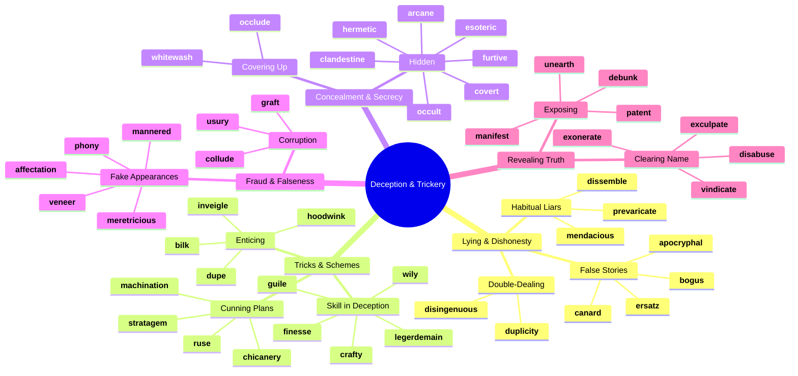
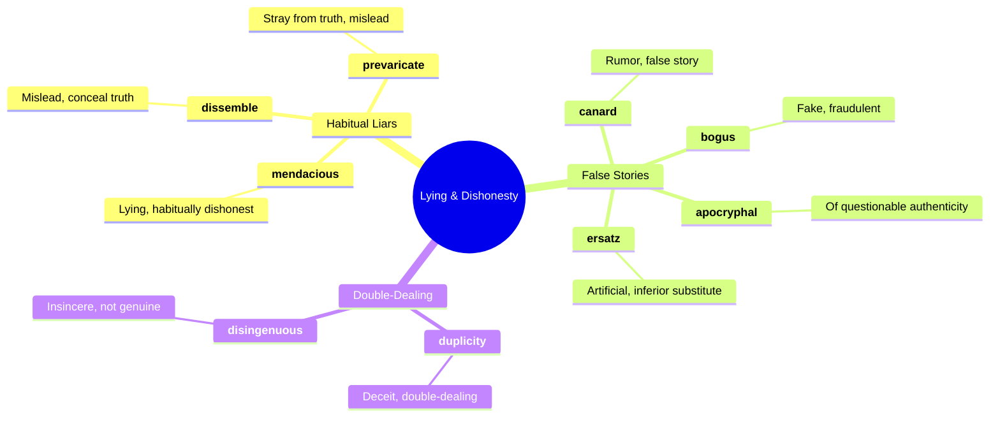
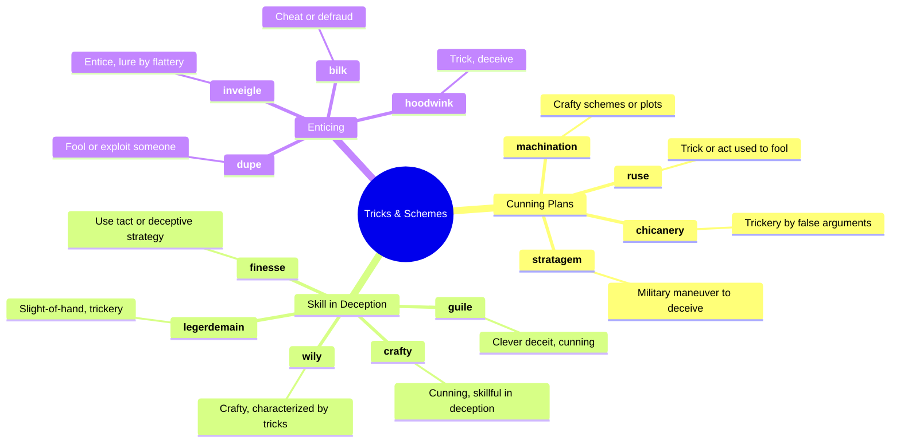
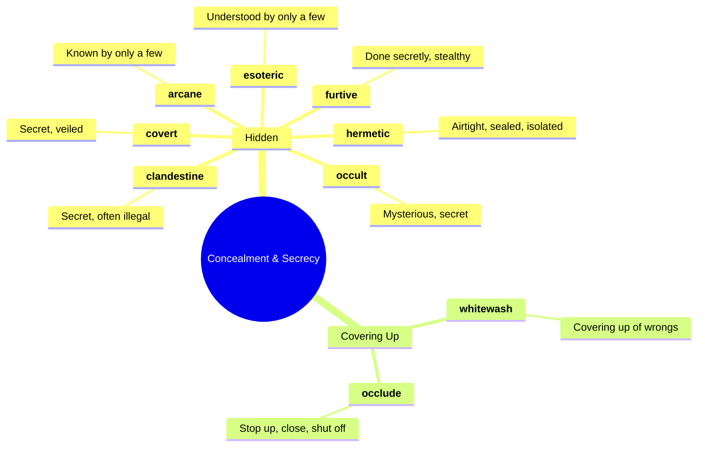
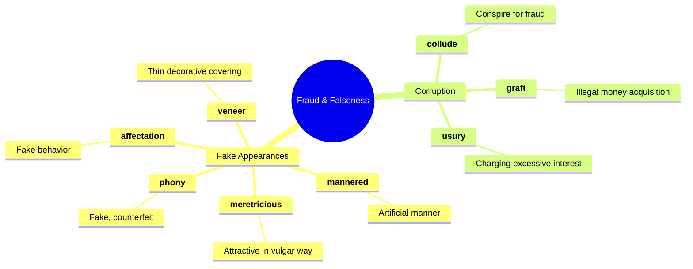
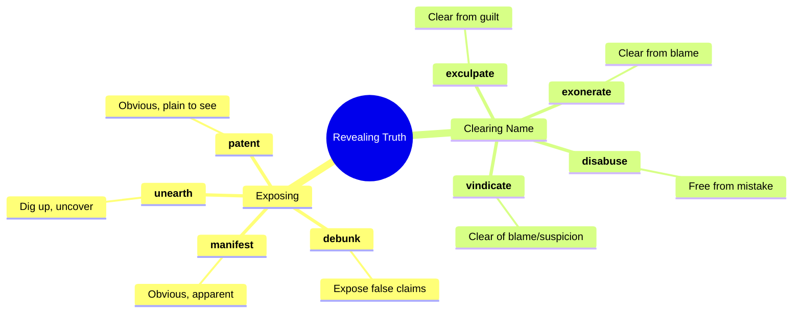
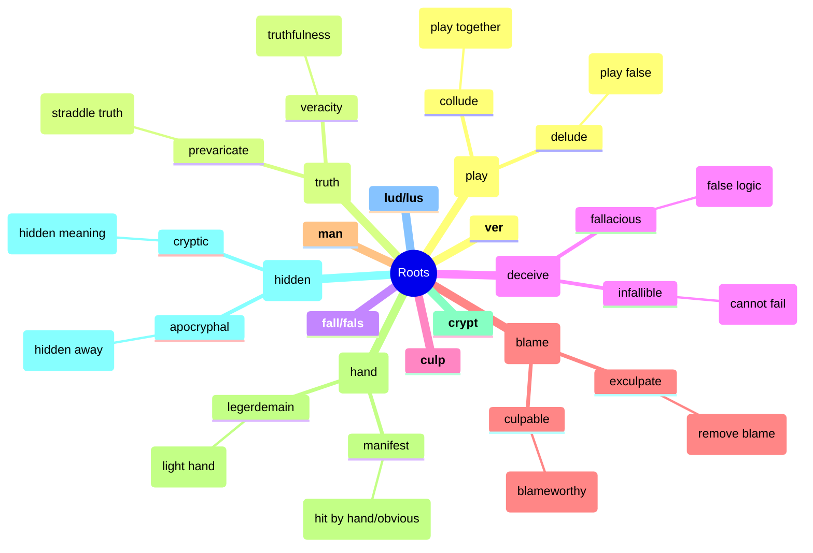

# 🎭 Deception, Trickery & Concealment

## 🗺️ Main Mind Map

---

## 🔍 Detailed Focus

### 🤥 Lying & Dishonesty

### 🃏 Tricks & Schemes

### 🕵️ Concealment & Secrecy

### 💰 Fraud & Falseness

### 🔦 Revealing Truth

---

## 📚 Vocabulary List

| Word             | Definition                                                                                                                      | Memory Hook                                          | Example Sentence                                                                |
| ---------------- | ------------------------------------------------------------------------------------------------------------------------------- | ---------------------------------------------------- | ------------------------------------------------------------------------------- |
| **affectation**  | Behavior, speech, or writing that is artificial and designed to impress                                                         | **AFFECT**-ation → **AFFECT**ing a fake pose         | His British accent was just an **affectation**; he was actually from Ohio.      |
| **apocryphal**   | (of a story or statement) of doubtful authenticity, although widely circulated as being true                                    | **APOCRYPHA**-l → **APOCRYPHA** (hidden books)       | The story about George Washington and the cherry tree is likely **apocryphal**. |
| **arcane**       | Understood by few; mysterious or secret                                                                                         | **ARCANE** → **ARK** (hidden secrets)                | The rules of the game were so **arcane** that no one understood them.           |
| **bilk**         | Obtain or withhold money from (someone) by deceit or without justification; cheat or defraud                                    | **BILK** → **BILL** (fake bill)                      | The con artist **bilked** investors out of millions of dollars.                 |
| **bogus**        | Not genuine or true; fake                                                                                                       | **BOGUS** → **BOG** (swamp/bad ground)               | He was arrested for trying to pass a **bogus** check.                           |
| **canard**       | An unfounded rumor or story                                                                                                     | **CANARD** (duck) → Quacking nonsense                | The report that the company was going bankrupt turned out to be a **canard**.   |
| **chicanery**    | The use of trickery to achieve a political, financial, or legal purpose                                                         | **CHIC**-anery → **CHIC**ken trickery                | The lawyer used legal **chicanery** to get his client off the hook.             |
| **clandestine**  | Kept secret or done secretively, especially because illicit                                                                     | **CLAN**-destine → **CLAN** meeting in secret        | The spies held a **clandestine** meeting in the park.                           |
| **collude**      | Cooperate in a secret or unlawful way in order to deceive or gain an advantage over others                                      | **COL-LUDE** → **COL** (together) **LUDE** (play)    | The two companies **colluded** to fix prices.                                   |
| **covert**       | Not openly acknowledged or displayed                                                                                            | **COVER**-t → Under **COVER**                        | The government launched a **covert** operation to rescue the hostages.          |
| **crafty**       | Clever at achieving one's aims by indirect or deceitful methods                                                                 | **CRAFT**-y → Good at **CRAFT**ing lies              | The **crafty** fox tricked the crow into dropping the cheese.                   |
| **debunk**       | Expose the falseness or hollowness of (a myth, idea, or belief)                                                                 | **DE-BUNK** → Remove the **BUNK** (nonsense)         | The show **debunks** common urban legends.                                      |
| **disabuse**     | Persuade (someone) that an idea or belief is mistaken                                                                           | **DIS-ABUSE** → Stop **ABUS**ing the truth           | I had to **disabuse** him of the notion that the job would be easy.             |
| **disingenuous** | Not candid or sincere, typically by pretending that one knows less about something than one really does                         | **DIS-IN-GENU**-ous → Not **GENU**ine                | It was **disingenuous** of him to claim he knew nothing about the scandal.      |
| **dissemble**    | Conceal one's true motives, feelings, or beliefs                                                                                | **DIS-SEMBLE** → **DIS**guise re**SEMBLE**ance       | He tried to **dissemble** his anger with a fake smile.                          |
| **dupe**         | Deceive; trick                                                                                                                  | **DUPE** → **DUP**licate (fake copy)                 | He was **duped** into buying a fake Rolex.                                      |
| **duplicity**    | Deceitfulness; double-dealing                                                                                                   | **DUPLIC**-ity → **DUPLIC**ate faces                 | The spy was a master of **duplicity**, working for both sides at once.          |
| **ersatz**       | (of a product) made or used as a substitute, typically an inferior one, for something else                                      | **ERSATZ** → **E**rror **S**ubstitute                | During the war, people drank **ersatz** coffee made from acorns.                |
| **esoteric**     | Intended for or likely to be understood by only a small number of people with a specialized knowledge or interest               | **ESO-TERIC** → **ESO** (within) **TERR**itory       | He has an **esoteric** collection of ancient coins.                             |
| **exculpate**    | Show or declare that (someone) is not guilty of wrongdoing                                                                      | **EX-CULP**-ate → **EX** (out) **CULP**rit           | The DNA evidence **exculpated** the suspect.                                    |
| **exonerate**    | (especially of an official body) absolve (someone) from blame for a fault or wrongdoing                                         | **EX-ONER**-ate → **EX** (out) **ONUS** (burden)     | The investigation **exonerated** the police officer of any misconduct.          |
| **finesse**      | Intricate and refined delicacy                                                                                                  | **FINE**-sse → **FINE** skill                        | She handled the difficult negotiation with great **finesse**.                   |
| **furtive**      | Attempting to avoid notice or attention, typically because of guilt or a belief that discovery would lead to trouble; secretive | **FURT**-ive → **FUG**itive style                    | He cast a **furtive** glance at the answers on his neighbor's test.             |
| **graft**        | Practices, especially bribery, used to secure illicit gains in politics or business                                             | **GRAFT** → **GR**ab **AFT**er                       | The mayor was accused of **graft** and corruption.                              |
| **guile**        | Sly or cunning intelligence                                                                                                     | **GUILE** → **GUY** who **LIE**s                     | She used her **guile** to trick the guard into letting her pass.                |
| **hermetic**     | (of a seal or closure) complete and airtight                                                                                    | **HERMET**-ic → **HERMIT** (sealed off)              | The jar had a **hermetic** seal to keep the food fresh.                         |
| **hoodwink**     | Deceive or trick (someone)                                                                                                      | **HOOD-WINK** → **HOOD** over eyes                   | Don't let the salesman **hoodwink** you into buying a lemon.                    |
| **inveigle**     | Persuade (someone) to do something by means of deception or flattery                                                            | **IN-VEIGLE** → **VEIL**ed eagle (trick)             | She **inveigled** her way into the exclusive party.                             |
| **legerdemain**  | Skillful use of one's hands when performing conjuring tricks                                                                    | **LEGER-DE-MAIN** → Light of hand                    | The magician's **legerdemain** dazzled the audience.                            |
| **machination**  | A plot or scheme                                                                                                                | **MACHIN**-ation → **MACHIN**e of evil               | The villain's evil **machinations** were foiled by the hero.                    |
| **manifest**     | Clear or obvious to the eye or mind                                                                                             | **MANI-FEST** → **MANY** **FEST**ivals (obvious fun) | His anger was **manifest** in his shaking hands.                                |
| **mannered**     | (of behavior, speech, or writing) artificial, stilted, and over-elaborate                                                       | **MANNER**-ed → Too many **MANNER**s                 | His writing style is highly **mannered** and difficult to read.                 |
| **mendacious**   | Not telling the truth; lying                                                                                                    | **MEND**-acious → Needs to **MEND** their lying ways | The politician's **mendacious** claims were quickly debunked by fact-checkers.  |
| **meretricious** | Apparently attractive but having in reality no value or integrity                                                               | **MERETRIC**-ious → **MERIT**-less t**RIC**ks        | The store was full of **meretricious** souvenirs.                               |
| **occlude**      | Stop, close up, or obstruct (an opening, orifice, or passage)                                                                   | **OCCLUDE** → **OC**topus **GLUED** shut             | A blood clot **occluded** the artery.                                           |
| **occult**       | Supernatural, mystical, or magical beliefs, practices, or phenomena                                                             | **OCCULT** → **CULT** (hidden)                       | He was interested in the **occult** and studied astrology.                      |
| **patent**       | Easily recognizable; obvious                                                                                                    | **PAT**-ent → **PAT** on head (obvious)              | It was a **patent** lie that no one believed.                                   |
| **phony**        | Not genuine; fraudulent                                                                                                         | **PHON**-y → **PHON**e scam                          | He gave a **phony** name to the police.                                         |
| **prevaricate**  | Speak or act in an evasive way                                                                                                  | **PRE-VAR**-icate → **VAR**y the truth               | Stop **prevaricating** and give me a straight answer!                           |
| **ruse**         | An action intended to deceive someone; a trick                                                                                  | **RUSE** → **USE** a **R**use                        | The phone call was just a **ruse** to get him out of the house.                 |
| **stratagem**    | A plan or scheme, especially one used to outwit an opponent or achieve an end                                                   | **STRAT**-agem → **STRAT**egy gem                    | The general devised a brilliant **stratagem** to defeat the enemy.              |
| **unearth**      | Find (something) in the ground by digging                                                                                       | **UN-EARTH** → Dig out of **EARTH**                  | Archaeologists **unearthed** a pot of gold coins.                               |
| **usury**        | The illegal action or practice of lending money at unreasonably high rates of interest                                          | **US**-ury → **US**e money for money                 | The loan shark was arrested for **usury**.                                      |
| **veneer**       | A thin decorative covering of fine wood applied to a coarser wood or other material                                             | **VENEER** → **V**ery **NEAR** surface               | Beneath his polite **veneer**, he was a cruel man.                              |
| **vindicate**    | Clear (someone) of blame or suspicion                                                                                           | **VINDIC**-ate → **WIN** the **DIC**tation (verdict) | The new evidence **vindicated** the suspect.                                    |
| **whitewash**    | A deliberate attempt to conceal unpleasant or incriminating facts about a person or organization                                | **WHITE-WASH** → Paint over dirt                     | The report was a **whitewash** that ignored the real problems.                  |
| **wily**         | Skilled at gaining an advantage, especially deceitfully                                                                         | **WIL**-y → **WIL** E. Coyote                        | The **wily** veteran pitcher used a slow curveball to strike out the batter.    |

---

## 🌱 Etymology & Roots

