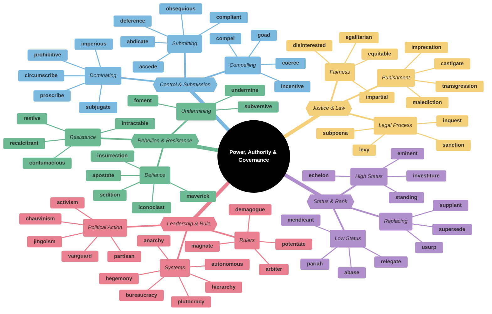
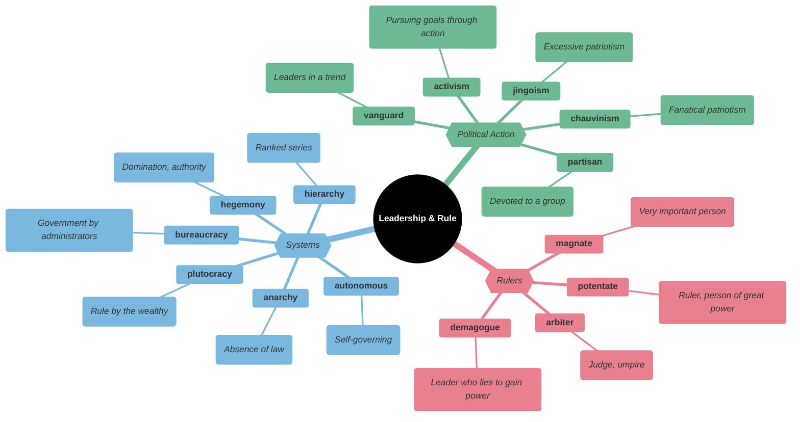
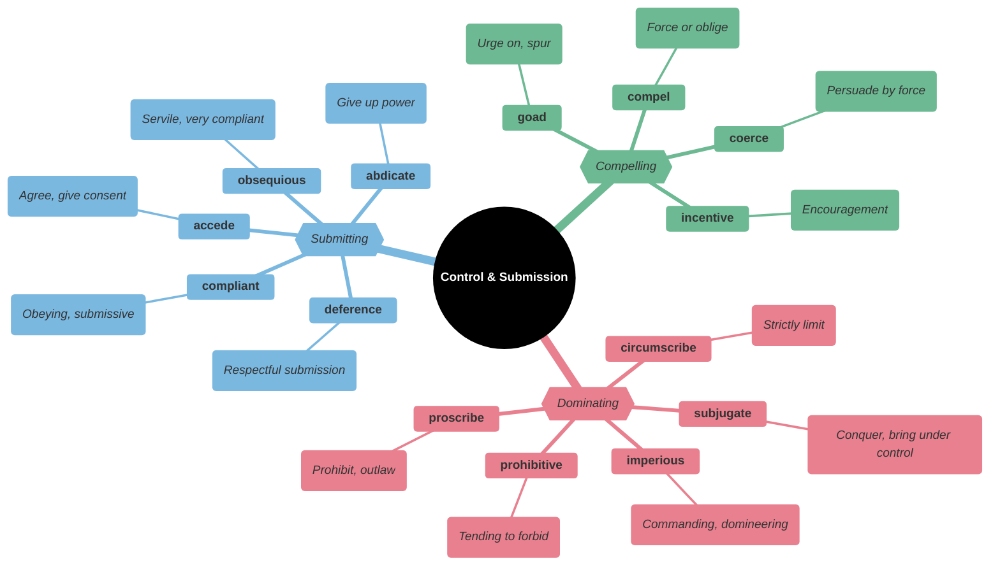
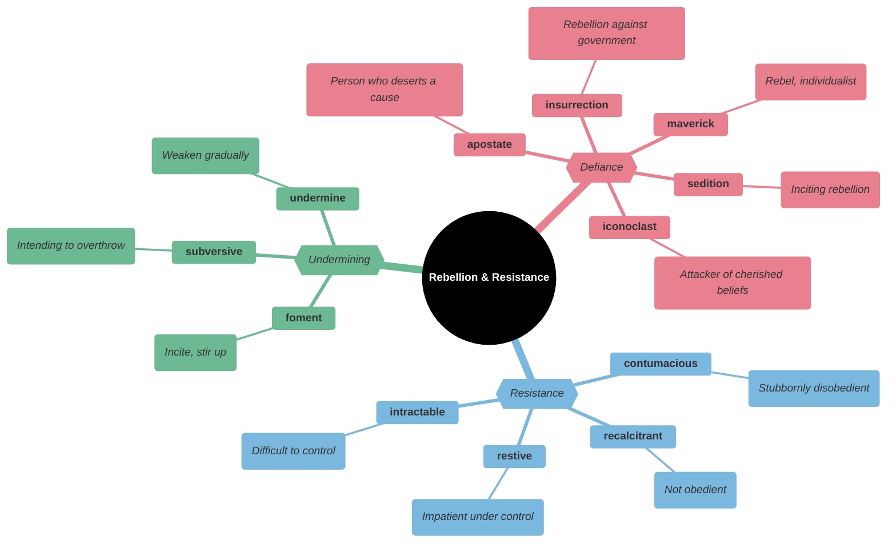
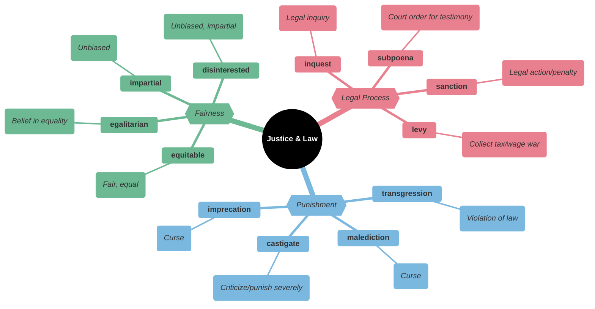
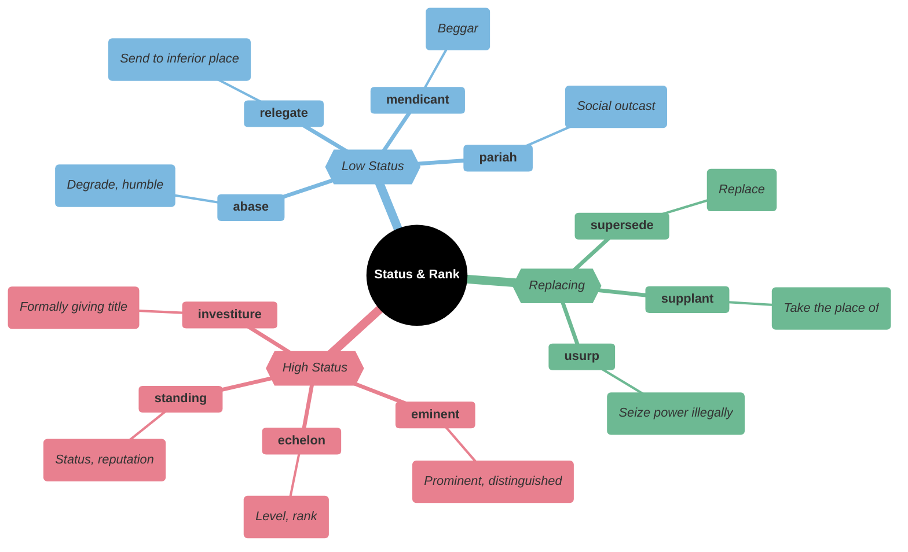
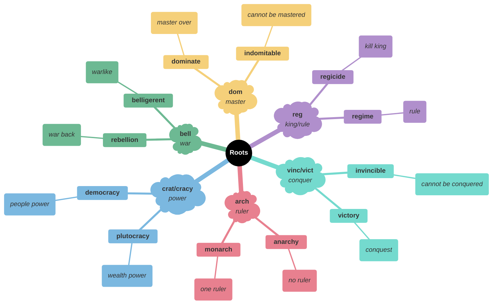

# 👑 Power, Authority & Governance

## Main Mindmap

---

## Detailed Focus

### 🏛️ Leadership & Rule

| Word            | Definition                                                                                                                                | Memory Hook                                                     | Example Sentence                                                           |
| --------------- | ----------------------------------------------------------------------------------------------------------------------------------------- | --------------------------------------------------------------- | -------------------------------------------------------------------------- |
| **potentate**   | A monarch or ruler, especially an autocratic one                                                                                          | **POTENT**-ate → **POTENT** (powerful) ruler                    | The local **potentate** ruled with an iron fist.                           |
| **magnate**     | A wealthy and influential person, especially in business                                                                                  | **MAGN**-ate → **MAGN**itude (great)                            | The oil **magnate** donated millions to charity.                           |
| **arbiter**     | A person who settles a dispute or has ultimate authority in a matter                                                                      | **ARBIT**-er → **ARBIT**rator                                   | The Supreme Court is the final **arbiter** of the law.                     |
| **demagogue**   | A political leader who seeks support by appealing to the desires and prejudices of ordinary people rather than by using rational argument | **DEMA-GOGUE** → **DEM**o (people) **GOGUE** (leader/misleader) | The **demagogue** whipped the crowd into a frenzy with his hateful speech. |
| **hegemony**    | Leadership or dominance, especially by one country or social group over others                                                            | **HE-GEM**-ony → **HE** has the **GEM**s (power)                | The US maintained its **hegemony** over the region for decades.            |
| **hierarchy**   | A system or organization in which people or groups are ranked one above the other according to status or authority                        | **HIER-ARCH**-y → **HIGH**er **ARCH** (ruler)                   | He worked his way up the corporate **hierarchy**.                          |
| **bureaucracy** | A system of government in which most of the important decisions are made by state officials rather than by elected representatives        | **BUREAU**-cracy → Rule by **BUREAU** (desk)                    | The project was bogged down in red tape and **bureaucracy**.               |
| **plutocracy**  | Government by the wealthy                                                                                                                 | **PLUTO**-cracy → **PLUTO** (god of wealth) rules               | Critics argue that the country has become a **plutocracy**.                |
| **anarchy**     | A state of disorder due to absence or nonrecognition of authority                                                                         | **AN-ARCH**-y → No **ARCH** (ruler)                             | The country descended into **anarchy** after the government collapsed.     |
| **autonomous**  | (of a country or region) having the freedom to govern itself or control its own affairs                                                   | **AUTO-NOM**-ous → **AUTO** (self) **NOM** (law)                | The university is an **autonomous** institution.                           |
| **activism**    | The policy or action of using vigorous campaigning to bring about political or social change                                              | **ACT**-ivism → Taking **ACT**ion                               | Her **activism** helped raise awareness about climate change.              |
| **vanguard**    | A group of people leading the way in new developments or ideas                                                                            | **VAN-GUARD** → Ad**VAN**ce **GUARD**                           | The company is in the **vanguard** of the green energy revolution.         |
| **partisan**    | A strong supporter of a party, cause, or person                                                                                           | **PART**-isan → Takes a **PART** (side)                         | The news channel was criticized for its **partisan** coverage.             |
| **jingoism**    | Extreme patriotism, especially in the form of aggressive or warlike foreign policy                                                        | **JINGO**-ism → By **JINGO**! (war cry)                         | The newspaper was accused of stirring up **jingoism**.                     |
| **chauvinism**  | Exaggerated or aggressive patriotism                                                                                                      | **CHAUVIN**-ism → Named after Nicolas **CHAUVIN**               | His male **chauvinism** made it difficult for him to work with women.      |

### ⛓️ Control & Submission

| Word             | Definition                                                                     | Memory Hook                                           | Example Sentence                                                       |
| ---------------- | ------------------------------------------------------------------------------ | ----------------------------------------------------- | ---------------------------------------------------------------------- |
| **imperious**    | Assuming power or authority without justification; arrogant and domineering    | **IMPER**-ious → **EMPER**or-like                     | She waved her hand in an **imperious** gesture of dismissal.           |
| **subjugate**    | Bring under domination or control, especially by conquest                      | **SUB-JUG**-ate → Under (**SUB**) the **JUG** (yoke)  | The emperor sought to **subjugate** the neighboring tribes.            |
| **circumscribe** | Restrict (something) within limits                                             | **CIRCUM-SCRIBE** → **SCRIBE** (draw) a circle around | The president's power is **circumscribed** by the constitution.        |
| **proscribe**    | Forbid, especially by law                                                      | **PRO-SCRIBE** → **SCRIBE** (write) against           | The law **proscribes** the use of cell phones while driving.           |
| **prohibitive**  | (of a price or charge) excessively high; difficult or impossible to pay        | **PROHIBIT**-ive → **PROHIBIT**s buying               | The cost of housing in the city is **prohibitive**.                    |
| **obsequious**   | Obedient or attentive to an excessive or servile degree                        | **OB-SEQUI**-ous → **SEQUI** (follow) like a servant  | The **obsequious** assistant agreed with everything the boss said.     |
| **compliant**    | Inclined to agree with others or obey rules, especially to an excessive degree | **COMPLI**-ant → **COMPLY**-ant                       | The **compliant** child did exactly what he was told.                  |
| **deference**    | Humble submission and respect                                                  | **DEFER**-ence → **DEFER** to others                  | He treated the general with great **deference**.                       |
| **accede**       | Assent or agree to a demand, request, or treaty                                | **AC-CEDE** → **CEDE** (give up) to agree             | The government **acceded** to the demands of the protesters.           |
| **abdicate**     | (of a monarch) renounce one's throne                                           | **AB-DIC**-ate → **DIC**tate away power               | The king chose to **abdicate** rather than give up the woman he loved. |
| **compel**       | Force or oblige (someone) to do something                                      | **COM-PEL** → **P**ush/drive                          | The law **compels** employers to provide safe working conditions.      |
| **coerce**       | Persuade (an unwilling person) to do something by using force or threats       | **CO-ERCE** → **FORCE**                               | He claimed he was **coerced** into signing the confession.             |
| **goad**         | Provoke or annoy (someone) so as to stimulate some action or reaction          | **GOAD** → **GO** **AD** (to it)                      | He **goaded** his brother into a fight.                                |
| **incentive**    | A thing that motivates or encourages one to do something                       | **IN-CENT**-ive → **CENT**s (money) motivate          | The bonus was a strong **incentive** to work harder.                   |

### ✊ Rebellion & Resistance

| Word             | Definition                                                                                                                                                 | Memory Hook                                                          | Example Sentence                                                                    |
| ---------------- | ---------------------------------------------------------------------------------------------------------------------------------------------------------- | -------------------------------------------------------------------- | ----------------------------------------------------------------------------------- |
| **insurrection** | A violent uprising against an authority or government                                                                                                      | **IN-SURRECT**-ion → **RESURRECT**ion of anger                       | The army crushed the **insurrection**.                                              |
| **sedition**     | Conduct or speech inciting people to rebel against the authority of a state or monarch                                                                     | **SED**-ition → **S**aid **ED**ition (bad words)                     | He was arrested for **sedition** after calling for the overthrow of the government. |
| **maverick**     | An unorthodox or independent-minded person                                                                                                                 | **MAVERICK** → Top Gun pilot                                         | He was a political **maverick** who often voted against his party.                  |
| **iconoclast**   | A person who attacks cherished beliefs or institutions                                                                                                     | **ICON-O-CLAST** → **ICON** **CLASH**er                              | As an **iconoclast**, he enjoyed challenging traditional views.                     |
| **apostate**     | A person who renounces a religious or political belief or principle                                                                                        | **A-POST**-ate → Moved away from his **POST**                        | He was branded an **apostate** for leaving the church.                              |
| **recalcitrant** | Having an obstinately uncooperative attitude toward authority or discipline                                                                                | **RE-CALC**-itrant → **CALC**ified (hard) against                    | The **recalcitrant** student was sent to the principal's office.                    |
| **contumacious** | Stubbornly or willfully disobedient to authority                                                                                                           | **CONTUM**-acious → **CONT**rary to **TUM**my (gut feeling of rules) | The **contumacious** prisoner refused to follow the guard's orders.                 |
| **restive**      | (of a person) unable to keep still or silent and becoming increasingly difficult to control, especially because of impatience, dissatisfaction, or boredom | **REST**-ive → Can't **REST**                                        | The crowd became **restive** as they waited for the show to start.                  |
| **intractable**  | Hard to control or deal with                                                                                                                               | **IN-TRACT**-able → Can't **TRACT**or (pull) it                      | The conflict proved to be **intractable**.                                          |
| **foment**       | Instigate or stir up (an undesirable or violent sentiment or course of action)                                                                             | **FO-MENT** → **FERMENT** (bubble up)                                | The rebels tried to **foment** a revolution.                                        |
| **subversive**   | Seeking or intended to subvert an established system or institution                                                                                        | **SUB-VERS**-ive → **SUB** (under) **VERS**e (turn)                  | The group was accused of **subversive** activities.                                 |
| **undermine**    | Damage or weaken (someone or something), especially gradually or insidiously                                                                               | **UNDER-MINE** → Dig **MINE** **UNDER**                              | The scandal **undermined** the president's authority.                               |

### ⚖️ Justice & Law

| Word              | Definition                                                                                                  | Memory Hook                                              | Example Sentence                                                    |
| ----------------- | ----------------------------------------------------------------------------------------------------------- | -------------------------------------------------------- | ------------------------------------------------------------------- |
| **subpoena**      | A writ ordering a person to attend a court                                                                  | **SUB-POENA** → Under (**SUB**) **PENAL**ty              | She received a **subpoena** to testify in the trial.                |
| **inquest**       | A judicial inquiry to ascertain the facts relating to an incident, such as a death                          | **IN-QUEST** → **QUEST**ioning inside                    | An **inquest** was held to determine the cause of the fire.         |
| **sanction**      | A threatened penalty for disobeying a law or rule                                                           | **SANCT**-ion → **SANCT**ify (make law)                  | The UN imposed **sanctions** on the country.                        |
| **levy**          | Impose (a tax, fee, or fine)                                                                                | **LEV**-y → **LEV**el a tax                              | The government decided to **levy** a new tax on luxury goods.       |
| **castigate**     | Reprimand (someone) severely                                                                                | **CAST**-i-**GATE** → **CAST** out the **GATE**          | The judge **castigated** the lawyers for their lack of preparation. |
| **transgression** | An act that goes against a law, rule, or code of conduct; an offense                                        | **TRANS-GRESS** → **GRESS** (step) a**CROSS** (trans)    | He asked for forgiveness for his **transgressions**.                |
| **imprecation**   | A spoken curse                                                                                              | **IM-PREC**-ation → **PRAY**ing for bad                  | The witch muttered an **imprecation** under her breath.             |
| **malediction**   | A magical word or phrase uttered with the intention of bringing about evil or destruction; a curse          | **MAL-DICT**-ion → **MAL** (bad) **DICT**ion (speech)    | He shouted a **malediction** at the driver who cut him off.         |
| **equitable**     | Fair and impartial                                                                                          | **EQUIT**-able → **EQUAL**-able                          | We need to find an **equitable** solution to the problem.           |
| **egalitarian**   | Believing in or based on the principle that all people are equal and deserve equal rights and opportunities | **EGAL**-itarian → **EQUAL**-itarian                     | The party's platform is based on **egalitarian** principles.        |
| **impartial**     | Treating all rivals or disputants equally; fair and just                                                    | **IM-PART**-ial → Not taking **PART**                    | A jury must be **impartial**.                                       |
| **disinterested** | Not influenced by considerations of personal advantage                                                      | **DIS-INTEREST**-ed → No **INTEREST** (stake) in outcome | We need a **disinterested** third party to mediate the dispute.     |

### 📊 Status & Rank

| Word            | Definition                                                                     | Memory Hook                                       | Example Sentence                                                     |
| --------------- | ------------------------------------------------------------------------------ | ------------------------------------------------- | -------------------------------------------------------------------- |
| **eminent**     | (of a person) famous and respected within a particular sphere or profession    | **EMIN**-ent → Like **EMIN**em (famous)           | An **eminent** historian wrote the biography.                        |
| **echelon**     | A level or rank in an organization, a profession, or society                   | **ECHELON** → Ladder rung                         | He rose to the upper **echelons** of the corporate world.            |
| **standing**    | Position, status, or reputation                                                | **STAND**-ing → Where you **STAND**               | The scandal damaged his **standing** in the community.               |
| **investiture** | The action of formally investing a person with honors or rank                  | **INVEST**-iture → **VEST** (clothing) of power   | The **investiture** of the new prince was a grand ceremony.          |
| **abase**       | Behave in a way that belittles or degrades (someone)                           | **A-BASE** → Bring to the **BASE** (bottom)       | He refused to **abase** himself by apologizing to a man he despised. |
| **relegate**    | Consign or dismiss to an inferior rank or position                             | **RE-LEG**-ate → **LEG**s walk down               | The team was **relegated** to the minor leagues.                     |
| **pariah**      | An outcast                                                                     | **PARIAH** → **PIRANHA** (avoid!)                 | After the scandal, he became a social **pariah**.                    |
| **mendicant**   | Given to begging                                                               | **MEND**-icant → Needs **MEND**ing/help           | The **mendicant** friar relied on the charity of others.             |
| **supersede**   | Take the place of (a person or thing previously in authority or use); supplant | **SUPER-SEDE** → **SEDE** (sit) **SUPER** (above) | The new regulations **supersede** the old ones.                      |
| **supplant**    | Supersede and replace                                                          | **SUP-PLANT** → **PLANT** under (uproot)          | Robots are beginning to **supplant** human workers in factories.     |
| **usurp**       | Take (a position of power or importance) illegally or by force                 | **U-SURP** → **U** **S**lurp up power             | The general tried to **usurp** the throne.                           |

---

## Etymology & Roots

