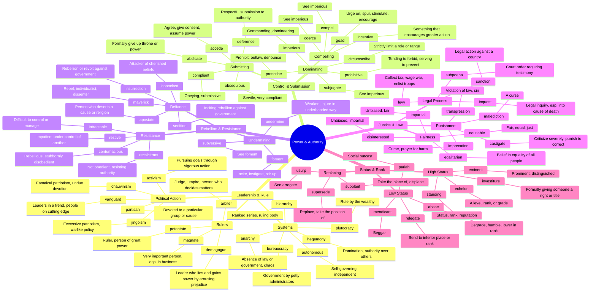

# 👑 Power, Authority & Governance

> GRE vocabulary for leadership, control, rebellion, and political structures.

## Mind Map

## Quick Memory Hooks

| Word       | Memory Hook                                       |
| ---------- | ------------------------------------------------- |
| hegemony   | HE-GEM-ony → He who has the gems has power        |
| demagogue  | DEMA-GOGUE → A demon in a toga, lying leader      |
| iconoclast | ICON-O-CLAST → Clashing against icons             |
| plutocracy | PLUTO-cracy → Planet of wealth rules              |
| sedition   | SED-ition → Sitting down in rebellion             |
| maverick   | Like Tom Cruise in Top Gun, a rebel               |
| potentate  | POTENT-ate → A potent ruler                       |
| proscribe  | PRO-SCRIBE → Writing (scribing) the rules against |
