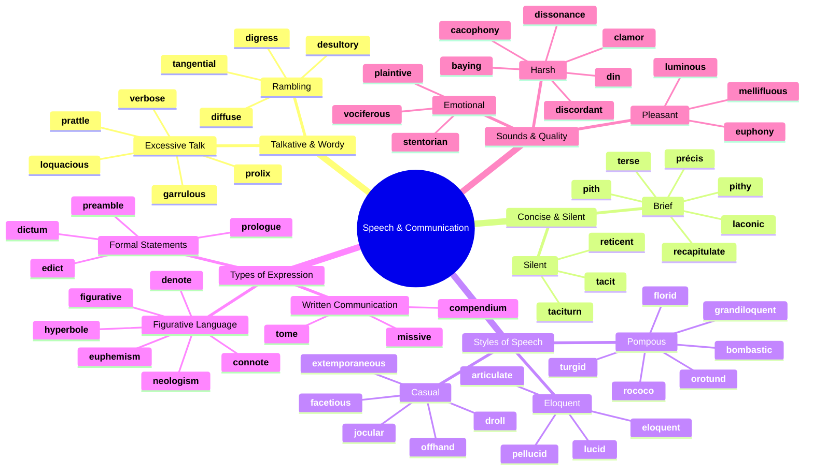
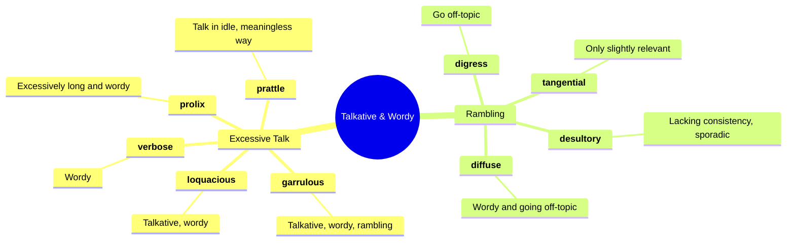
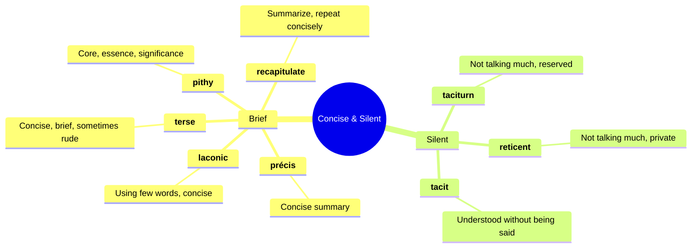
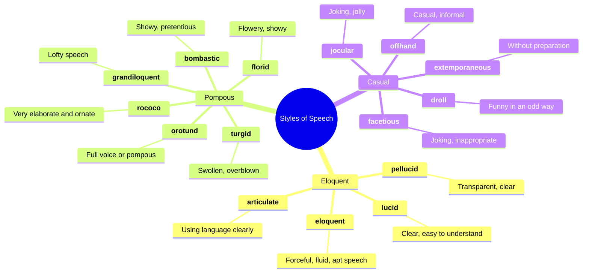
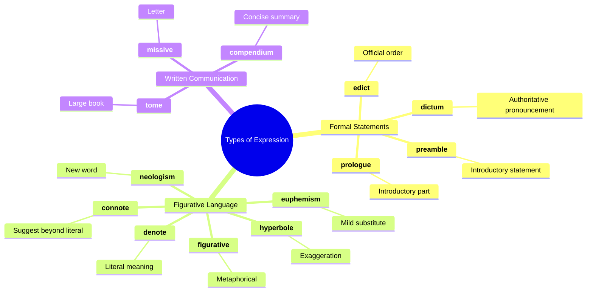
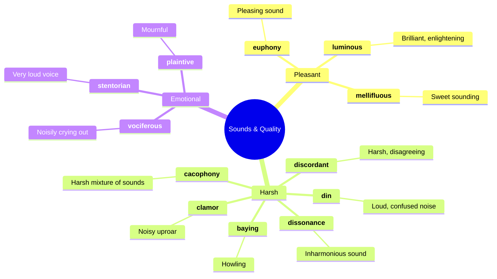
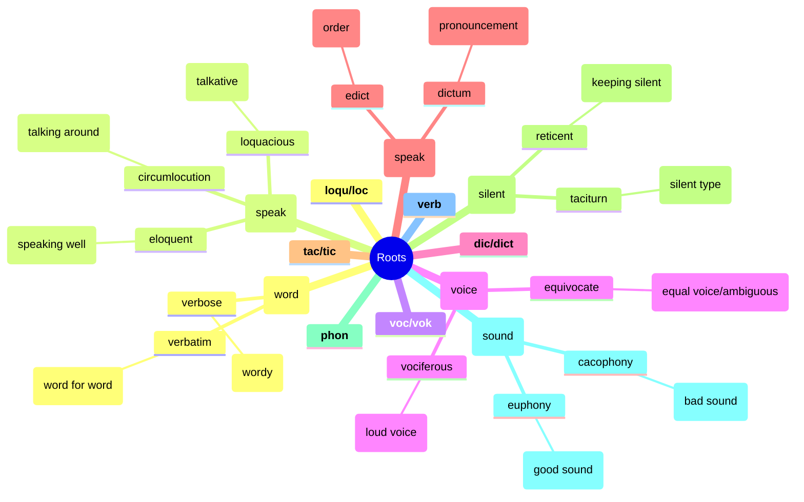

# 📢 Speech, Communication & Language

## 🗺️ Main Mind Map

---

## 🔍 Detailed Focus

### 🗣️ Talkative & Wordy

### 🤐 Concise & Silent

### 🎭 Styles of Speech

### 📝 Types of Expression

### 🔊 Sounds & Quality

---

## 📚 Vocabulary List

| Word               | Definition                                                                                       | Memory Hook                                                    | Example Sentence                                                              |
| ------------------ | ------------------------------------------------------------------------------------------------ | -------------------------------------------------------------- | ----------------------------------------------------------------------------- |
| **articulate**     | (of a person or a person's words) having or showing the ability to speak fluently and coherently | **ART**-iculate → Making **ART** with speech                   | She is an **articulate** speaker who can explain complex ideas clearly.       |
| **baying**         | (of a dog or wolf) bark or howl loudly                                                           | **BAY**-ing → Howling at the **BAY**                           | The hounds were **baying** at the moon.                                       |
| **bombastic**      | High-sounding but with little meaning; inflated                                                  | **BOMB**-astic → Speech like a **BOMB** (loud but destructive) | His **bombastic** speech was full of big words but offered no real solutions. |
| **cacophony**      | A harsh, discordant mixture of sounds                                                            | **CACO-PHONY** → **CACO** (bad) **PHONY** (sound)              | The **cacophony** of traffic and construction noise made it hard to sleep.    |
| **clamor**         | A loud and confused noise, especially that of people shouting vehemently                         | **CLAM**-or → **CLAM**s banging shells                         | The crowd **clamored** for the band to return to the stage.                   |
| **compendium**     | A collection of concise but detailed information about a particular subject                      | **COM-PEND**-ium → **COM**plete **PEND**ing (hanging) together | The book is a **compendium** of gardening tips.                               |
| **connote**        | (of a word) imply or suggest (an idea or feeling) in addition to the literal or primary meaning  | **CON-NOTE** → **CON**nected **NOTE**                          | The word "home" **connotes** warmth and safety.                               |
| **denote**         | Be a sign of; indicate; stand for                                                                | **DE-NOTE** → **DE**fine **NOTE**                              | The red light **denotes** danger.                                             |
| **desultory**      | Lacking a plan, purpose, or enthusiasm                                                           | **DE-SULT**-ory → **SULT**an jumping around                    | He made a **desultory** attempt to clean his room.                            |
| **dictum**         | A formal pronouncement from an authoritative source                                              | **DICT**-um → **DICT**ator speaks                              | He followed the old **dictum**: "Early to bed, early to rise."                |
| **diffuse**        | Spread out over a large area; not concentrated                                                   | **DIF-FUSE** → **FUSE** (melt/pour) apart                      | His writing is **diffuse** and hard to follow.                                |
| **digress**        | Leave the main subject temporarily in speech or writing                                          | **DI-GRESS** → **DI** (away) **GRESS** (step)                  | Let me **digress** for a moment to tell you a story.                          |
| **din**            | A loud, unpleasant, and prolonged noise                                                          | **DIN**-ner noise                                              | The **din** of the cafeteria made conversation impossible.                    |
| **discordant**     | Disagreeing or incongruous                                                                       | **DIS-CORD**-ant → **DIS** (not) **CORD** (heart/agreement)    | The **discordant** notes ruined the harmony of the song.                      |
| **dissonance**     | Lack of harmony among musical notes                                                              | **DIS-SON**-ance → **DIS** (bad) **SON**ic (sound)             | There is a cognitive **dissonance** between what he says and what he does.    |
| **droll**          | Curious or unusual in a way that provokes dry amusement                                          | **DROLL** → **ROLL** on floor laughing (dryly)                 | He had a **droll** sense of humor that not everyone understood.               |
| **edict**          | An official order or proclamation issued by a person in authority                                | **E-DICT** → **E**xit **DICT**ation                            | The king issued an **edict** banning public gatherings.                       |
| **eloquent**       | Fluent or persuasive in speaking or writing                                                      | **ELOQU**-ent → **LOQU** (speak) well                          | Her **eloquent** eulogy moved everyone to tears.                              |
| **euphemism**      | A mild or indirect word or expression substituted for one considered to be too harsh or blunt    | **EU-PHEM**-ism → **EU** (good) **PHEM** (speech)              | "Passed away" is a **euphemism** for "died."                                  |
| **euphony**        | The quality of being pleasing to the ear                                                         | **EU-PHONY** → **EU** (good) **PHONY** (sound)                 | The poet loved the **euphony** of the words.                                  |
| **extemporaneous** | Spoken or done without preparation                                                               | **EX-TEMPOR**-aneous → **EX** (out of) **TEMPOR** (time)       | He gave an **extemporaneous** speech when the guest speaker failed to arrive. |
| **facetious**      | Treating serious issues with deliberately inappropriate humor; flippant                          | **FACE**-tious → Making a funny **FACE**                       | Stop being **facetious**; this is a serious matter.                           |
| **figurative**     | Departing from a literal use of words; metaphorical                                              | **FIGURE**-ative → Using **FIGURE**s of speech                 | The phrase "raining cats and dogs" is **figurative**.                         |
| **florid**         | Having a red or flushed complexion; elaborately or excessively intricate                         | **FLOR**-id → **FLOR**al (flowery)                             | His writing style was too **florid** for the scientific report.               |
| **garrulous**      | Excessively talkative, especially on trivial matters                                             | **GARR**-ulous → **GAR**gling words                            | The **garrulous** neighbor wouldn't let me leave.                             |
| **grandiloquent**  | Pompous or extravagant in language, style, or manner                                             | **GRAND**-iloquent → **GRAND** speaking                        | The politician's **grandiloquent** promises turned out to be empty words.     |
| **hyperbole**      | Exaggerated statements or claims not meant to be taken literally                                 | **HYPER-BOLE** → **HYPER** (over) **BOLE** (throw)             | "I'm so hungry I could eat a horse" is **hyperbole**.                         |
| **jocular**        | Fond of or characterized by joking; humorous or playful                                          | **JOC**-ular → **JOK**er                                       | He was in a **jocular** mood after winning the game.                          |
| **laconic**        | (of a person, speech, or style of writing) using very few words                                  | **LACON**-ic → **LACON**ia (Sparta)                            | His **laconic** reply was simply "No."                                        |
| **loquacious**     | Tending to talk a great deal; talkative                                                          | **LOQU**-acious → **LOQU** (speak) a lot                       | The **loquacious** host kept the conversation going all night.                |
| **lucid**          | Expressed clearly; easy to understand                                                            | **LUC**-id → **LUC** (light)                                   | She gave a **lucid** explanation of the complex theory.                       |
| **luminous**       | Full of or shedding light; bright or shining, especially in the dark                             | **LUMIN**-ous → **LUM**ens (light)                             | The **luminous** dial of the watch glowed in the dark.                        |
| **mellifluous**    | (of a voice or words) sweet or musical; pleasant to hear                                         | **MELLI-FLU**-ous → **MEL** (honey) **FLU** (flow)             | She had a rich, **mellifluous** voice.                                        |
| **missive**        | A letter, especially a long or official one                                                      | **MISS**-ive → **MISS**ile (sent)                              | He received a **missive** from the tax office.                                |
| **neologism**      | A newly coined word or expression                                                                | **NEO-LOG**-ism → **NEO** (new) **LOG**os (word)               | "Selfie" is a relatively recent **neologism**.                                |
| **offhand**        | Ungraciously or offensively nonchalant or cool in manner                                         | **OFF-HAND** → From the **HAND** (without thought)             | His **offhand** remark hurt her feelings.                                     |
| **orotund**        | (of the voice or phrasing) full, round, and imposing                                             | **ORO-TUND** → **ORO** (mouth) ro**TUND** (round)              | The actor's **orotund** voice filled the theater.                             |
| **pellucid**       | Translucently clear                                                                              | **PEL-LUCID** → **PER**fectly **LUCID**                        | The water in the mountain stream was **pellucid**.                            |
| **pith**           | The essence of something                                                                         | **PITH** → **PIT** (center)                                    | The **pith** of his argument was that we need to save money.                  |
| **pithy**          | (of language or style) concise and forcefully expressive                                         | **PITH**-y → Full of **PITH** (substance)                      | He made a **pithy** comment that summed up the situation perfectly.           |
| **plaintive**      | Sounding sad and mournful                                                                        | **PLAINT**-ive → **PLAINT**iff (complainer)                    | The **plaintive** cry of a seagull echoed across the beach.                   |
| **prattle**        | Talk at length in a foolish or inconsequential way                                               | **PRAT**-tle → **PRAT** (fool) talk                            | She **prattled** on about her cats for an hour.                               |
| **preamble**       | A preliminary or preparatory statement; an introduction                                          | **PRE-AMBLE** → **PRE** (before) **AMBLE** (walk)              | The **preamble** to the Constitution sets out its purpose.                    |
| **précis**         | A summary or abstract of a text or speech                                                        | **PRECISE** → Concise summary                                  | Write a **précis** of the chapter in 100 words or less.                       |
| **prolix**         | (of speech or writing) using or containing too many words; tediously lengthy                     | **PRO-LIX** → **PRO**longed **LICK**s (tongue/speech)          | His **prolix** writing style made the book difficult to finish.               |
| **prologue**       | A separate introductory section of a literary or musical work                                    | **PRO-LOG**-ue → **PRO** (before) **LOG**os (word)             | The **prologue** set the scene for the play.                                  |
| **recapitulate**   | Summarize and state again the main points of                                                     | **RE-CAPIT**-ulate → **RE** (again) **CAPIT** (head/heading)   | Let me **recapitulate** the main points of our discussion.                    |
| **reticent**       | Not revealing one's thoughts or feelings readily                                                 | **RE-TIC**-ent → **RE**sting **TIC**ket (keeping quiet)        | He was **reticent** about his past.                                           |
| **rococo**         | Characterized by an elaborately ornamental late baroque style of decoration                      | **ROCOCO** → **COCO**a (swirly)                                | The furniture was in the **rococo** style, full of curves and gold leaf.      |
| **stentorian**     | (of a person's voice) loud and powerful                                                          | **STENTOR**-ian → **STENTOR** (loud Greek herald)              | The sergeant shouted orders in a **stentorian** voice.                        |
| **tacit**          | Understood or implied without being stated                                                       | **TACIT** → **TACIT**urn (silent)                              | We had a **tacit** agreement not to talk about politics.                      |
| **taciturn**       | (of a person) reserved or uncommunicative in speech; saying little                               | **TACIT**-urn → **TACIT** (silent) turn                        | The **taciturn** cowboy just nodded his head.                                 |
| **tangential**     | Diverging from a previous course or line; erratic                                                | **TANGENT**-ial → Going off on a **TANGENT**                   | His remarks were **tangential** to the main topic.                            |
| **terse**          | Sparing in the use of words; abrupt                                                              | **TERSE** → **VERSE** (short poem)                             | He gave a **terse** "no" to the request.                                      |
| **tome**           | A book, especially a large, heavy, scholarly one                                                 | **TOME** → **TOMB**stone (heavy)                               | He spent the weekend reading a dusty old **tome** on history.                 |
| **turgid**         | (of language or style) tediously pompous or bombastic                                            | **TURG**-id → **TURG**ey (swollen)                             | His **turgid** prose was full of unnecessary adjectives.                      |
| **verbose**        | Using or expressed in more words than are needed                                                 | **VERB**-ose → **VERB**s (words) overdose                      | The **verbose** report could have been summarized in one page.                |
| **vociferous**     | (especially of a person or speech) vehement or clamorous                                         | **VOC**-iferous → **VOC**al (voice) ferous (carrying)          | The **vociferous** protesters demanded the mayor's resignation.               |

---

## 🌱 Etymology & Roots

