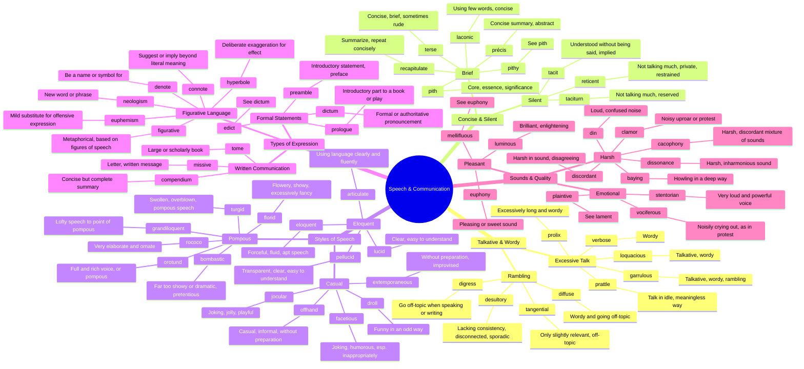

# 📢 Speech, Communication & Language

> GRE vocabulary for talking, writing, silence, and styles of expression.

## Mind Map

## Quick Memory Hooks

| Word       | Memory Hook                                                 |
| ---------- | ----------------------------------------------------------- |
| garrulous  | GAR-RUL-ous → GARgling with RULes of speech, can't stop     |
| laconic    | LACON-ic → People from Laconia (Sparta) were famously brief |
| taciturn   | TACIT-urn → Tacitly turning away from conversation          |
| bombastic  | BOMB-astic → Speech that drops like a bomb, too explosive   |
| cacophony  | CACO-phony → Caco = bad, phony = sound                      |
| euphemism  | EU-PHEM-ism → EU = good, PHEM = speech                      |
| loquacious | LOQU-acious → LOQUacious = talks (loqui) a lot              |
| turgid     | TURG-id → Like a bloated turkey, swollen speech             |
