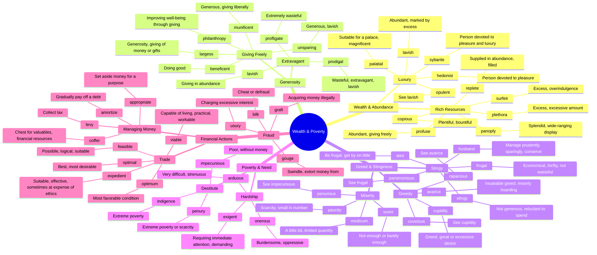

# 💰 Wealth, Poverty & Resources

> GRE vocabulary for money, generosity, greed, and economic conditions.

## Mind Map

## Quick Memory Hooks

| Word        | Memory Hook                                         |
| ----------- | --------------------------------------------------- |
| avarice     | AVAR-ICE → Cold as ICE in their greed               |
| cupidity    | CUPID-ity → Cupid's excessive desire, but for money |
| munificent  | MUNI-ficent → Like a municipality giving generously |
| impecunious | IM-PECUN-ious → No pecunia (Latin for money)        |
| penury      | PEN-URY → Can only afford a pen, extreme poverty    |
| frugal      | FRUG-al → Eating only fruit, living simply          |
| prodigal    | PRODIG-al → The prodigal son wasted his inheritance |
| indigence   | INDIGEN-ce → Indigenous poverty, deeply rooted need |
