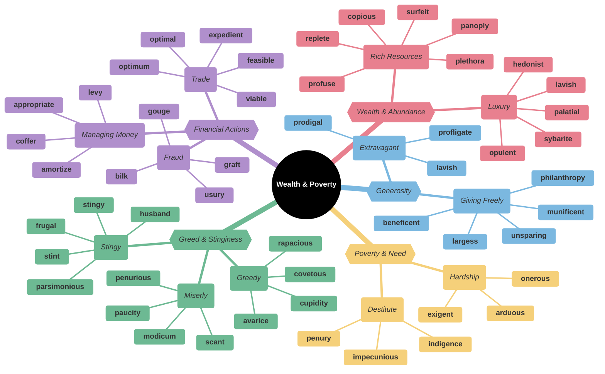
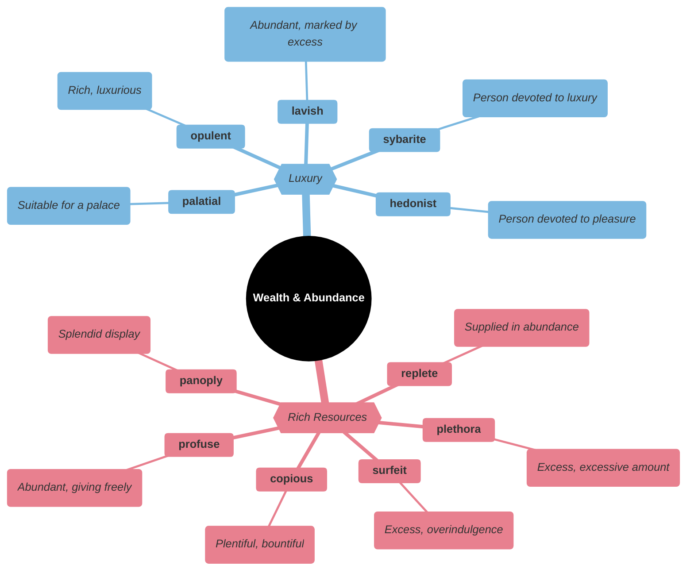
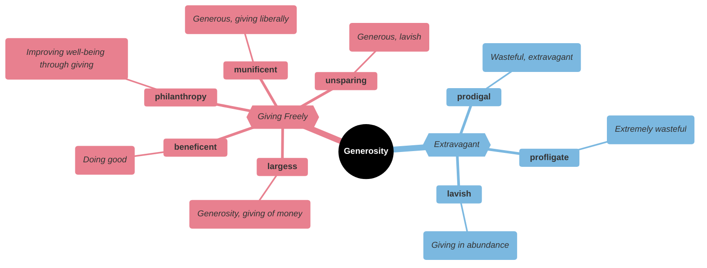
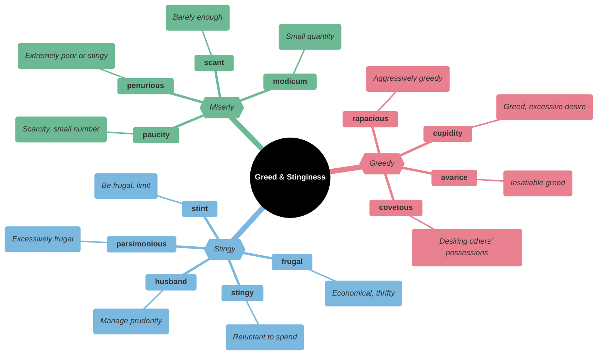
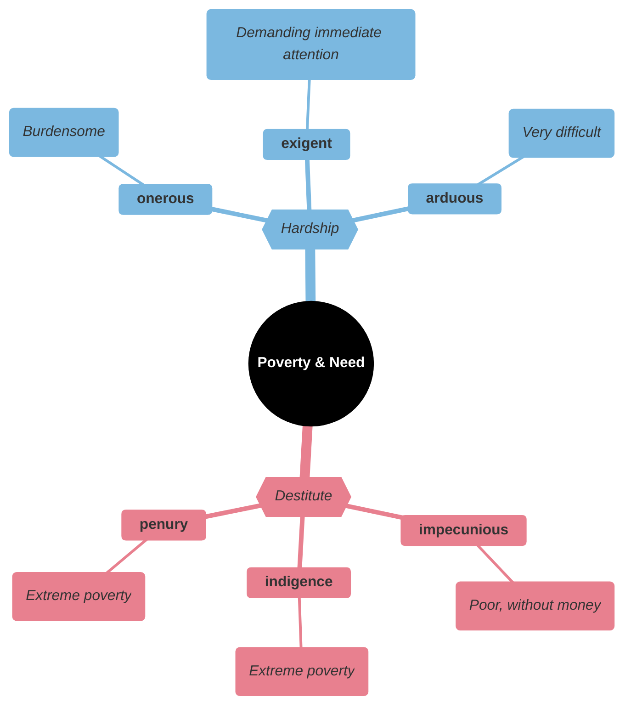
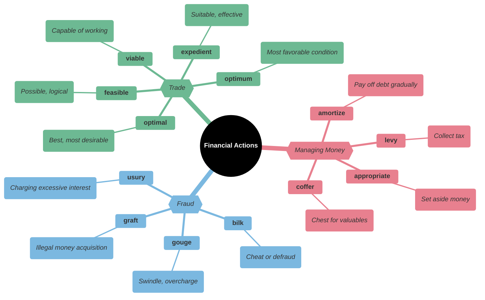
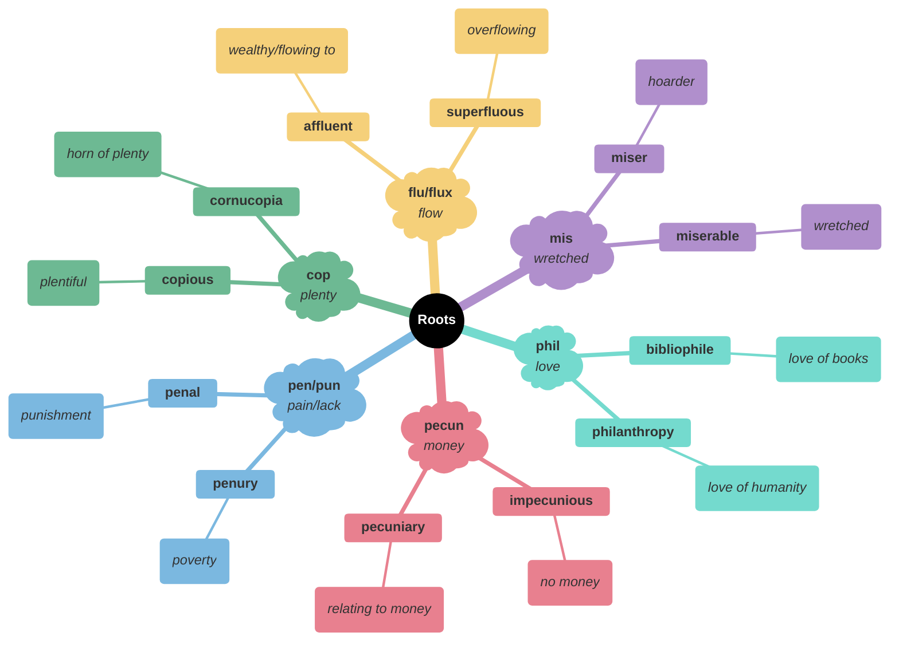

# 💰 Wealth, Poverty & Resources

## Main Mindmap

---

## Detailed Focus

### 💎 Wealth & Abundance

| Word         | Phonetics | Definition                                                                             | Memory Hook                                   | Example Sentence                                                                    |
| ------------ | --- | -------------------------------------------------------------------------------------- | --------------------------------------------- | ----------------------------------------------------------------------------------- |
| **copious**  | KOH-pee-uhs | Abundant in supply or quantity                                                         | **COPY**-ous → Make many **COPIES**           | She took **copious** notes during the lecture.                                      |
| **replete**  | ri-PLEET | Filled or well-supplied with something                                                 | **REPLETE** → **RE**-com**PLETE**             | The book is **replete** with photographs and illustrations.                         |
| **plethora** | PLETH-er-uh | A large or excessive amount of (something)                                             | **PLETH**-ora → **PLENT**y                    | There is a **plethora** of diet books on the market.                                |
| **surfeit**  | SUR-fit | An excessive amount of something                                                       | **SUR-FEIT** → **SUR** (over) **FEIT** (done) | We had a **surfeit** of food after the party.                                       |
| **panoply**  | PAN-uh-plee | A complete or impressive collection of things                                          | **PAN**-oply → **PAN** (all) **OP**tics       | The store offered a **panoply** of cheeses from around the world.                   |
| **profuse**  | pro-FYOOS | (especially of something offered or discharged) exuberantly plentiful; abundant        | **PRO-FUSE** → **FUSE** (pour) forth          | She offered **profuse** apologies for being late.                                   |
| **palatial** | puh-LEY-shuhl | Resembling a palace in being spacious and splendid                                     | **PALAT**-ial → **PALAC**e-ial                | The hotel had a **palatial** lobby with marble floors.                              |
| **opulent**  | OP-yuh-luhnt | Ostentatiously rich and luxurious or lavish                                            | **OPUL**-ent → **OPAL**s and jewels           | They lived in an **opulent** mansion with gold fixtures.                            |
| **lavish**   | LAV-ish | Sumptuously rich, elaborate, or luxurious                                              | **LAV**-ish → **LAV**atory of gold            | They threw a **lavish** party with champagne and caviar.                            |
| **sybarite** | SIB-uh-rite | A person who is self-indulgent in their fondness for sensuous luxury                   | **SYBAR**-ite → **S**ip at **BAR**            | The **sybarite** spent his days at the spa and his nights at expensive restaurants. |
| **hedonist** | HEE-dn-ist | A person who believes that the pursuit of pleasure is the most important thing in life | **HEDON**-ist → **HEAD** on pleasure          | As a **hedonist**, he spent all his money on parties and travel.                    |

### 🎁 Generosity

| Word             | Phonetics | Definition                                                                                                         | Memory Hook                                             | Example Sentence                                                                 |
| ---------------- | --- | ------------------------------------------------------------------------------------------------------------------ | ------------------------------------------------------- | -------------------------------------------------------------------------------- |
| **munificent**   | myoo-NIF-uh-suhnt | (of a gift or sum of money) larger or more generous than is usual or necessary                                     | **MUNI**-ficent → **MONEY**-ficent                      | The museum received a **munificent** donation of rare paintings.                 |
| **largess**      | lahr-JES | Generosity in bestowing money or gifts upon others                                                                 | **LARG**-ess → **LARG**e giving                         | The university library was built through the **largess** of a wealthy alumnus.   |
| **beneficent**   | buh-NEF-uh-suhnt | (of a person) generous or doing good                                                                               | **BENE**-ficent → **BENE**fit sent                      | The **beneficent** donor gave millions to the hospital.                          |
| **philanthropy** | fi-LAN-thruh-pee | The desire to promote the welfare of others, expressed especially by the generous donation of money to good causes | **PHIL**-anthropy → **PHIL** (love) **ANTHROP** (human) | His **philanthropy** helped build schools and hospitals in developing countries. |
| **unsparing**    | uhn-SPAIR-ing | Merciless; severe                                                                                                  | **UN-SPAR**-ing → Not **SPAR**ing anything              | The critic was **unsparing** in his review of the play.                          |
| **prodigal**     | PROD-i-guhl | Spending money or resources freely and recklessly; wastefully extravagant                                          | **PRODIG**-al → **PRO** at **DIG**ging into savings     | The **prodigal** son returned home after spending all his inheritance.           |
| **profligate**   | PROF-li-git | Recklessly extravagant or wasteful in the use of resources                                                         | **PRO-FLIG**-ate → **FLIG**ht of money away             | The **profligate** spending of the government led to a massive deficit.          |
| **lavish**       | LAV-ish | Sumptuously rich, elaborate, or luxurious                                                                          | **LAV**-ish → **LAV**atory of gold                      | They threw a **lavish** party with champagne and caviar.                         |

### 🤑 Greed & Stinginess

| Word             | Phonetics | Definition                                                                                    | Memory Hook                                               | Example Sentence                                               |
| ---------------- | --- | --------------------------------------------------------------------------------------------- | --------------------------------------------------------- | -------------------------------------------------------------- |
| **avarice**      | AV-er-is | Extreme greed for wealth or material gain                                                     | **AVAR-ICE** → Cold as **ICE** in greed                   | His **avarice** led him to exploit his workers.                |
| **cupidity**     | kyoo-PID-i-tee | Greed for money or possessions                                                                | **CUPID**-ity → **CUPID**'s desire (for money)            | His crime was motivated by simple **cupidity**.                |
| **rapacious**    | ruh-PEY-shuhs | Aggressively greedy or grasping                                                               | **RAP**-acious → **RAPE** (seize)                         | The **rapacious** landlord raised the rent every year.         |
| **covetous**     | KUV-i-tuhs | Having or showing a great desire to possess something belonging to someone else               | **COVET**-ous → **COVET** thy neighbor's goods            | He looked at his neighbor's new car with **covetous** eyes.    |
| **stingy**       | STIN-jee | Unwilling to give or spend; ungenerous                                                        | **STING**-y → **STING**s to give                          | He is too **stingy** to tip the waiter.                        |
| **frugal**       | FROO-guhl | Sparing or economical with regard to money or food                                            | **FRUG**-al → **FRU**it and **GAL**lons of water (simple) | He lived a **frugal** life, saving every penny.                |
| **parsimonious** | pahr-si-MOH-nee-uhs | Unwilling to spend money or use resources; stingy or frugal                                   | **PARSI**-monious → **PURS**e money (keep in purse)       | The **parsimonious** owner refused to buy new equipment.       |
| **husband**      | HUZ-buhnd | Use (resources) economically; conserve                                                        | **HUSBAND** → Manage the house                            | We need to **husband** our water resources during the drought. |
| **stint**        | stint | Supply an ungenerous or inadequate amount of (something)                                      | **STINT** → **STUNT**ed giving                            | Don't **stint** on the butter when making the cake.            |
| **penurious**    | puh-NOOR-ee-uhs | Extremely poor; poverty-stricken                                                              | **PENUR**-ious → **PEN**ny user                           | The **penurious** old man lived in a shack despite his wealth. |
| **scant**        | skant | Barely sufficient or adequate                                                                 | **SCANT** → **SCANT**y                                    | There was **scant** evidence to support the claim.             |
| **paucity**      | PAW-si-tee | The presence of something only in small or insufficient quantities or amounts; scarcity       | **PAUCI**-ty → **PAU**per city                            | There is a **paucity** of information on the subject.          |
| **modicum**      | MOD-i-kuhm | A small quantity of a particular thing, especially something considered desirable or valuable | **MOD**-icum → **MOD**erate amount                        | He didn't even have a **modicum** of common sense.             |

### 🏚️ Poverty & Need

| Word            | Phonetics | Definition                                                                                                        | Memory Hook                                     | Example Sentence                                                      |
| --------------- | --- | ----------------------------------------------------------------------------------------------------------------- | ----------------------------------------------- | --------------------------------------------------------------------- |
| **impecunious** | im-pi-KYOO-nee-uhs | Having little or no money                                                                                         | **IM-PECUN**-ious → No **PECUN**ia (money)      | The **impecunious** student could not afford textbooks.               |
| **indigence**   | IN-di-juhns | A state of extreme poverty                                                                                        | **INDIGEN**-ce → **INDIGEN**ous poverty         | The charity works to relieve **indigence** in the inner city.         |
| **penury**      | PEN-yuh-ree | Extreme poverty; destitution                                                                                      | **PENUR**-y → **PEN**ny only                    | He died in **penury**, forgotten by the world.                        |
| **onerous**     | ON-er-uhs | (of a task, duty, or responsibility) involving an amount of effort and difficulty that is oppressively burdensome | **ONER**-ous → **ON** us (burden)               | The new regulations placed an **onerous** burden on small businesses. |
| **exigent**     | EK-si-juhnt | Pressing; demanding                                                                                               | **EXI-GENT** → **EXIT** **GENT**ly? No, urgent! | The **exigent** demands of the crisis required immediate action.      |
| **arduous**     | AHR-joo-uhs | Involving or requiring strenuous effort; difficult and tiring                                                     | **ARD**-uous → **HARD**-uous                    | The climb to the summit was **arduous**.                              |

### 🏦 Financial Actions

| Word            | Phonetics | Definition                                                                                   | Memory Hook                                    | Example Sentence                                                         |
| --------------- | --- | -------------------------------------------------------------------------------------------- | ---------------------------------------------- | ------------------------------------------------------------------------ |
| **amortize**    | uh-MAWR-tahyz | Gradually write off the initial cost of (an asset)                                           | **A-MORT**-ize → To **MORT**al (death) of debt | We will **amortize** the loan over 30 years.                             |
| **appropriate** | uh-PROH-pree-eyt | Devote (money or assets) to a special purpose                                                | **APPROPRIATE** → Make it **PROP**erty         | The city **appropriated** funds for the new park.                        |
| **levy**        | LEV-ee | Impose (a tax, fee, or fine)                                                                 | **LEV**-y → **LEV**el a tax                    | The government decided to **levy** a new tax on luxury goods.            |
| **coffer**      | KAW-fer | A strongbox or small chest for holding valuables                                             | **COFFER** → **COFF**in for money              | The state **coffers** were empty after the war.                          |
| **bilk**        | bilk | Obtain or withhold money from (someone) by deceit or without justification; cheat or defraud | **BILK** → **BILL** (fake bill)                | The con artist **bilked** investors out of their savings.                |
| **gouge**       | gouj | Overcharge; swindle                                                                          | **GOUGE** → Dig out money                      | The store was accused of **gouging** customers during the shortage.      |
| **usury**       | YOO-zhuh-ree | The illegal action or practice of lending money at unreasonably high rates of interest       | **US**-ury → **US**e money for money           | The loan shark was arrested for **usury**.                               |
| **graft**       | graft | Practices, especially bribery, used to secure illicit gains in politics or business          | **GRAFT** → **GR**ab **AFT**er                 | The politician was investigated for **graft** and corruption.            |
| **feasible**    | FEE-zuh-buhl | Possible to do easily or conveniently                                                        | **FEAS**-ible → **EAS**y-ible                  | It is not **feasible** to drive to New York and back in one day.         |
| **viable**      | VAHY-uh-buhl | Capable of working successfully; feasible                                                    | **VI**-able → **VI**ta (life) able             | We need to come up with a **viable** plan to save the company.           |
| **expedient**   | ik-SPEE-dee-uhnt | (of an action) convenient and practical although possibly improper or immoral                | **EXPED**-ient → **SPEED**y solution           | It was **expedient** to ignore the safety regulations to finish on time. |
| **optimal**     | OP-tuh-muhl | Best or most favorable; optimum                                                              | **OPTIM**-al → **OPTIM**um                     | We need to find the **optimal** solution to the problem.                 |
| **optimum**     | OP-tuh-muhm | The most favorable conditions or level for growth, reproduction, or success                  | **OPTIM**-um → **OPTIM**ist's choice           | The plants grow best under **optimum** conditions of light and water.    |

---

## Etymology & Roots

