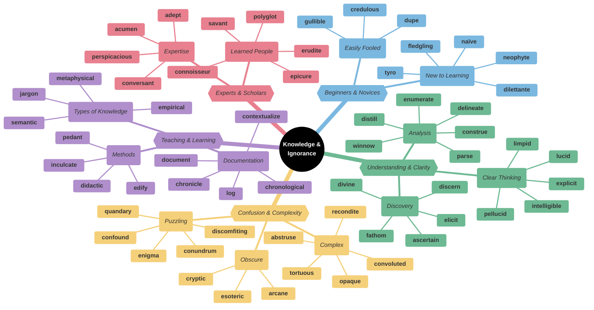
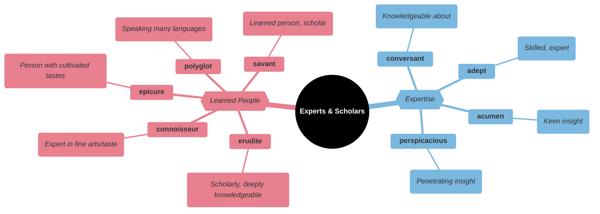
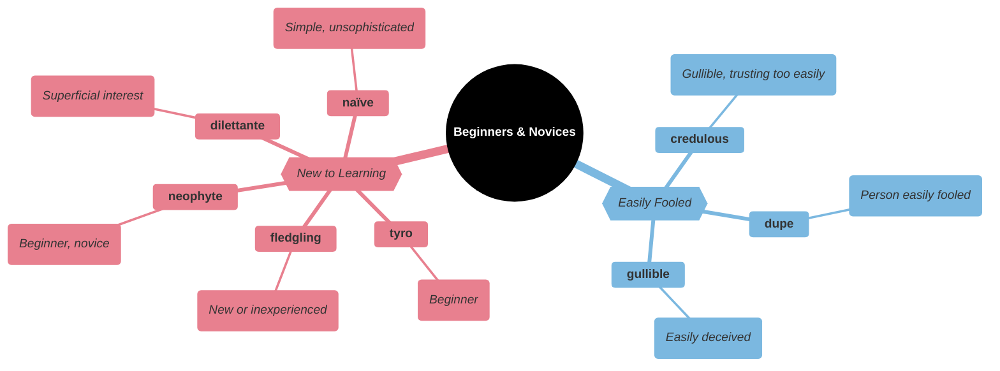
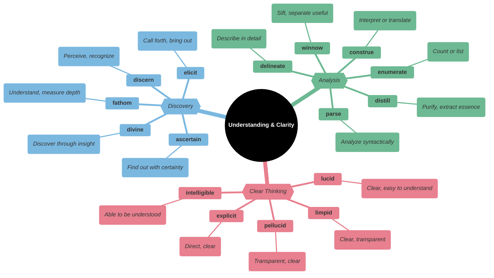
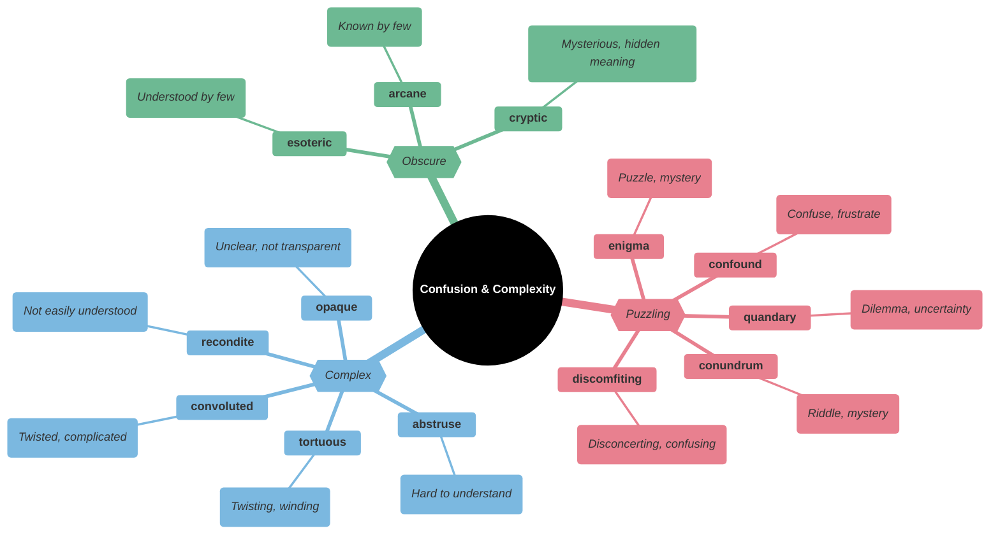
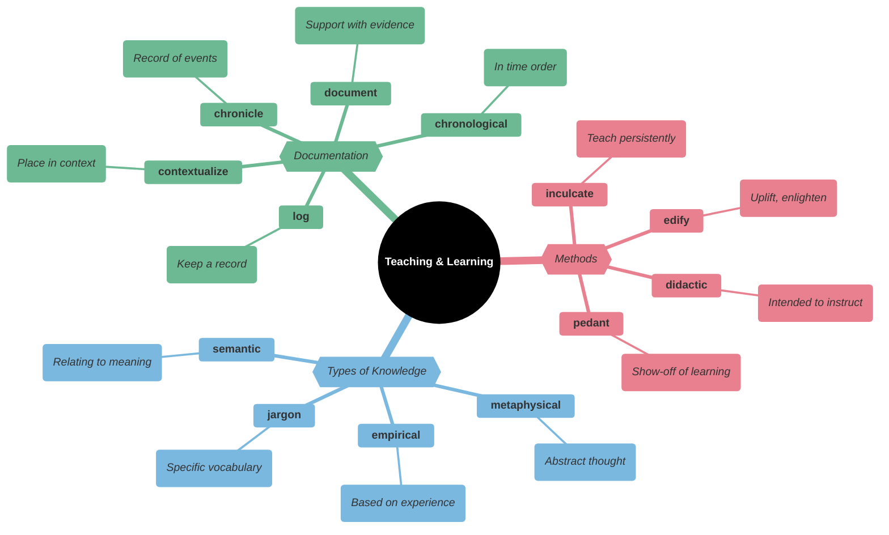
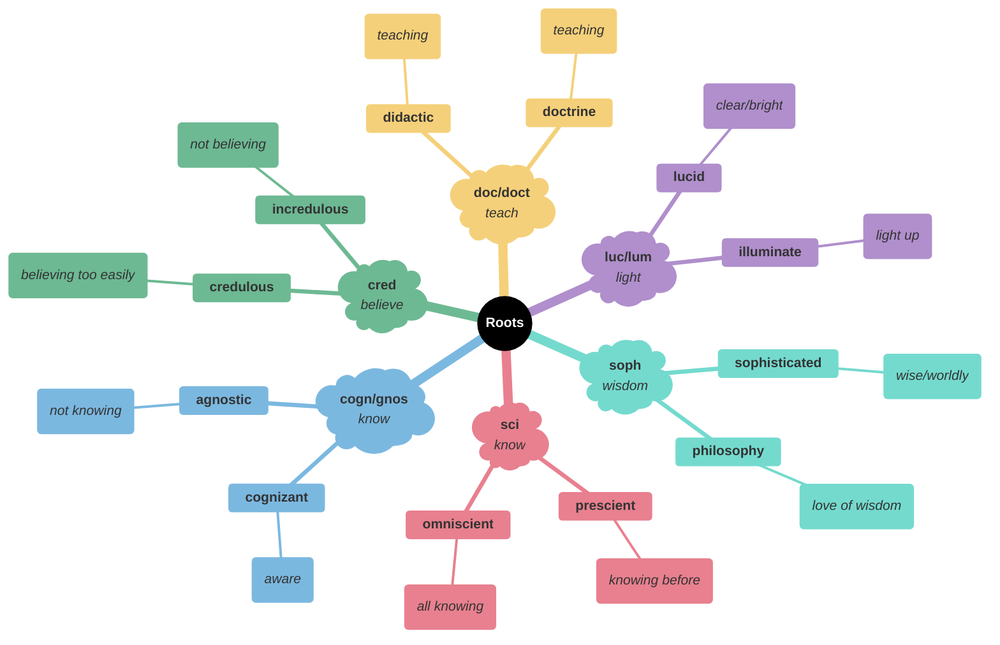

# 📚 Knowledge, Learning & Ignorance

## Main Mindmap

---

## Detailed Focus

### 🎓 Experts & Scholars

<vocabulary_table>

| Word              | Definition                                              | Memory Hook                                              | Example Sentence                                                              |
| ----------------- | ------------------------------------------------------- | -------------------------------------------------------- | ----------------------------------------------------------------------------- |
| **erudite**       | Having or showing great knowledge or learning           | **ERU-DITE** → **ERU**pting with knowledge               | The professor's **erudite** lecture was fascinating.                          |
| **savant**        | A learned person, especially a distinguished scientist  | **SAV**-ant → **SAV**vy person                           | He is a **savant** in the field of mathematics.                               |
| **connoisseur**   | An expert judge in matters of taste                     | **CON**-noisseur → **KNOW**-sier (knows more)            | He is a **connoisseur** of fine wines.                                        |
| **epicure**       | A person with refined taste in food and wine            | **EPIC-CURE** → Cures hunger with **EPIC** food          | As an **epicure**, he refused to eat at fast-food restaurants.                |
| **polyglot**      | Knowing or using several languages                      | **POLY-GLOT** → **POLY** (many) **GLOT** (tongues)       | As a **polyglot**, she could communicate with people from all over the world. |
| **conversant**    | Familiar with or knowledgeable about something          | **CONVERS**-ant → Can hold a **CONVERS**ation about it   | She is **conversant** in several languages.                                   |
| **adept**         | Very skilled or proficient at something                 | **A-DEPT** → **A** **DEEP** talent                       | He is an **adept** guitar player.                                             |
| **acumen**        | The ability to make good judgments and quick decisions  | **ACU**-men → **ACCU**rate men                           | Her business **acumen** helped her build a successful company.                |
| **perspicacious** | Having a ready insight into and understanding of things | **PER-SPIC**-acious → **PER**fect **SPEC**tacles (sight) | The **perspicacious** detective solved the crime.                             |

</vocabulary_table>

### 🌱 Beginners & Novices

<vocabulary_table>

| Word           | Definition                                                                                          | Memory Hook                                                | Example Sentence                                                        |
| -------------- | --------------------------------------------------------------------------------------------------- | ---------------------------------------------------------- | ----------------------------------------------------------------------- |
| **neophyte**   | A person who is new to a subject, skill, or belief                                                  | **NEO-PHYTE** → **NEO** (new) **PHYTE** (plant)            | As a **neophyte** to the game of golf, he missed the ball completely.   |
| **tyro**       | A beginner or novice                                                                                | **TYRO** → **TRY**-o (trying for first time)               | He is a **tyro** in the world of finance.                               |
| **fledgling**  | A person or organization that is immature, inexperienced, or underdeveloped                         | **FLEDG**-ling → Just got **FEATHER**s (fledge)            | The **fledgling** company struggled to compete.                         |
| **dilettante** | A person who cultivates an area of interest, such as the arts, without real commitment or knowledge | **DILETT**-ante → **DELIGHT** (just for fun)               | He is a **dilettante** who dabbles in painting and photography.         |
| **naïve**      | (of a person or action) showing a lack of experience, wisdom, or judgment                           | **NAIVE** → **NA**tive (born yesterday)                    | He was **naïve** to think that he could get rich quick.                 |
| **credulous**  | Having or showing too great a readiness to believe things                                           | **CRED**-ulous → Give **CRED**it too easily                | The **credulous** child believed everything his older brother told him. |
| **dupe**       | Deceive; trick                                                                                      | **DUPE** → **DUP**licate (fake copy)                       | He was **duped** into buying a fake Rolex.                              |
| **gullible**   | Easily persuaded to believe something; credulous                                                    | **GULL**-ible → Like a **GULL** (bird) swallowing anything | He is so **gullible** that he believed the moon was made of cheese.     |

</vocabulary_table>

### 💡 Understanding & Clarity

<vocabulary_table>

| Word             | Definition                                                                 | Memory Hook                                          | Example Sentence                                                 |
| ---------------- | -------------------------------------------------------------------------- | ---------------------------------------------------- | ---------------------------------------------------------------- |
| **lucid**        | Expressed clearly; easy to understand                                      | **LUC**-id → **LUC** (light)                         | She gave a **lucid** explanation of the complex theory.          |
| **pellucid**     | Translucently clear                                                        | **PEL-LUCID** → **PER**fectly **LUCID**              | The water in the mountain stream was **pellucid**.               |
| **limpid**       | (of a liquid) free of anything that darkens; completely clear              | **LIMP**-id → **LIMP** (clear) water                 | The **limpid** waters of the Caribbean.                          |
| **intelligible** | Able to be understood; comprehensible                                      | **INTELLIG**-ible → **INTELLIG**ent can understand   | His handwriting was barely **intelligible**.                     |
| **explicit**     | Stated clearly and in detail, leaving no room for confusion or doubt       | **EX-PLICIT** → **EX**plained **P**erfectly          | The instructions were **explicit**.                              |
| **ascertain**    | Find (something) out for certain; make sure of                             | **AS-CERTAIN** → Make **CERTAIN**                    | We need to **ascertain** the cause of the fire.                  |
| **discern**      | Perceive or recognize (something)                                          | **DISCERN** → **DIS**tinguish con**CERN**            | It was difficult to **discern** the truth from the lies.         |
| **fathom**       | Understand (a difficult problem or an enigmatic person) after much thought | **FATHOM** → Measure depth                           | I cannot **fathom** why he would do such a thing.                |
| **divine**       | Discover (something) by guesswork or intuition                             | **DIVINE** → Like a god knowing                      | He could **divine** the answer just by looking at her face.      |
| **elicit**       | Evoke or draw out (a response, answer, or fact) from someone               | **E-LICIT** → **E**xtract il**LICIT**ly (or legally) | The teacher tried to **elicit** a response from the shy student. |
| **winnow**       | Blow a current of air through (grain) in order to remove the chaff         | **WIN-NOW** → **WIN**now out the bad                 | We need to **winnow** down the list of candidates.               |
| **distill**      | Extract the essential meaning or most important aspects of                 | **DISTILL** → Like making whiskey (pure essence)     | The writer **distilled** complex ideas into simple language.     |
| **construe**     | Interpret (a word or action) in a particular way                           | **CON-STRUE** → **CON**struct meaning                | Her silence was **construed** as agreement.                      |
| **parse**        | Analyze (a sentence) into its parts and describe their syntactic roles     | **PARSE** → **PAR**t**S**                            | The computer program **parsed** the data.                        |
| **delineate**    | Describe or portray (something) precisely                                  | **DE-LINE**-ate → Draw a **LINE** around             | The report **delineated** the steps needed to solve the problem. |
| **enumerate**    | Mention (a number of things) one by one                                    | **E-NUMER**-ate → **NUMER**ate (number) them         | He **enumerated** the reasons why he should get a raise.         |

</vocabulary_table>

### 🧩 Confusion & Complexity

<vocabulary_table>

| Word             | Definition                                                                                                        | Memory Hook                                                  | Example Sentence                                                            |
| ---------------- | ----------------------------------------------------------------------------------------------------------------- | ------------------------------------------------------------ | --------------------------------------------------------------------------- |
| **enigma**       | A person or thing that is mysterious, puzzling, or difficult to understand                                        | **ENIGMA** machine → Puzzle                                  | The Mona Lisa's smile is an **enigma**.                                     |
| **conundrum**    | A confusing and difficult problem or question                                                                     | **CON-UNDRUM** → **CON**fusing **DRUM** beat                 | The budget deficit is a major **conundrum** for the government.             |
| **quandary**     | A state of perplexity or uncertainty over what to do in a difficult situation                                     | **QUAND**-ary → **WAND**ering what to do                     | He was in a **quandary** about which job offer to accept.                   |
| **confound**     | Cause surprise or confusion in (someone), especially by acting against their expectations                         | **CON-FOUND** → **CON**fused and dumb**FOUND**ed             | The magician's tricks **confounded** the audience.                          |
| **discomfiting** | Making someone feel uneasy or embarrassed                                                                         | **DIS-COMFIT**-ing → **DIS-COMFORT**-ing                     | The silence in the room was **discomfiting**.                               |
| **convoluted**   | (of an argument, story, or sentence) extremely complex and difficult to follow                                    | **CON-VOLU**-ted → **VOLU**me turned/twisted                 | The plot of the movie was so **convoluted** that I couldn't follow it.      |
| **tortuous**     | Full of twists and turns                                                                                          | **TORT**-uous → **TORT**ure path                             | The road up the mountain was **tortuous**.                                  |
| **recondite**    | (of a subject or knowledge) little known; abstruse                                                                | **RE-COND**-ite → **RE**ally **CON**cealed                   | The book covers **recondite** aspects of quantum physics.                   |
| **abstruse**     | Difficult to understand; obscure                                                                                  | **ABS**-truse → **ABS**tract and confusing                   | The professor's lecture was so **abstruse** that most students fell asleep. |
| **opaque**       | Not able to be seen through; not transparent                                                                      | **OPAQUE** → **O**h, **P**aint **A**ll **QUE**er (can't see) | The windows were **opaque** with dirt.                                      |
| **arcane**       | Understood by few; mysterious or secret                                                                           | **ARCANE** → **ARK** (hidden secrets)                        | The rules of the game were so **arcane** that no one understood them.       |
| **esoteric**     | Intended for or likely to be understood by only a small number of people with a specialized knowledge or interest | **ESO-TERIC** → **ESO** (within) **TERR**itory               | He has an **esoteric** collection of ancient coins.                         |
| **cryptic**      | Having a meaning that is mysterious or obscure                                                                    | **CRYPT**-ic → Like a **CRYPT** (hidden)                     | He left a **cryptic** message on my voicemail.                              |

</vocabulary_table>

### 🏫 Teaching & Learning

<vocabulary_table>

| Word              | Definition                                                                                                                | Memory Hook                                            | Example Sentence                                                       |
| ----------------- | ------------------------------------------------------------------------------------------------------------------------- | ------------------------------------------------------ | ---------------------------------------------------------------------- |
| **didactic**      | Intended to teach, particularly in having moral instruction as an ulterior motive                                         | **DID-ACT**-ic → **DID** you **ACT** on the lesson?    | The children's book was a bit too **didactic** for my taste.           |
| **edify**         | Instruct or improve (someone) morally or intellectually                                                                   | **ED**-ify → **ED**ucate                               | The sermon was intended to **edify** the congregation.                 |
| **inculcate**     | Instill (an attitude, idea, or habit) by persistent instruction                                                           | **IN-CULC**-ate → **IN** **CULT**ure (teach culture)   | Parents try to **inculcate** good values in their children.            |
| **pedant**        | A person who is excessively concerned with minor details and rules or with displaying academic learning                   | **PED**-ant → **PED**antic teacher                     | The **pedant** corrected everyone's grammar.                           |
| **empirical**     | Based on, concerned with, or verifiable by observation or experience rather than theory or pure logic                     | **EMPIR**-ical → **EMPIR**e built on facts             | The scientist relied on **empirical** data.                            |
| **semantic**      | Relating to meaning in language or logic                                                                                  | **SEMANTIC** → **SE**e **M**e**AN**ing                 | It was just a **semantic** difference; they actually agreed.           |
| **metaphysical**  | Relating to metaphysics (abstract theory with no basis in reality)                                                        | **META-PHYSICAL** → Beyond **PHYSICAL**                | They had a deep **metaphysical** discussion about the meaning of life. |
| **jargon**        | Special words or expressions that are used by a particular profession or group and are difficult for others to understand | **JAR-GON** → **JAR**ring **GON**e (language gone bad) | The contract was full of legal **jargon**.                             |
| **document**      | Record (something) in written, photographic, or other form                                                                | **DOC**-ument → Make a **DOC**                         | Please **document** all your expenses.                                 |
| **log**           | Keep a systematic record of (something, especially events or observations)                                                | **LOG**book                                            | The captain **logged** the ship's position every hour.                 |
| **contextualize** | Place or study in context                                                                                                 | **CONTEXT**-ualize → Put in **CONTEXT**                | The historian tried to **contextualize** the events of the past.       |
| **chronicle**     | A factual written account of important or historical events in the order of their occurrence                              | **CHRON**-icle → **CHRON**ological record              | The book **chronicles** the history of the Civil War.                  |
| **chronological** | (of a record of events) starting with the earliest and following the order in which they occurred                         | **CHRONO**-logical → **CHRONO**s (time) logic          | The events were listed in **chronological** order.                     |

</vocabulary_table>

---

## Etymology & Roots

