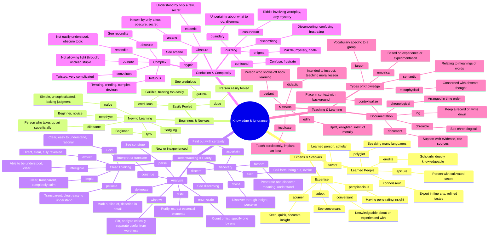

# 📚 Knowledge, Learning & Ignorance

> GRE vocabulary for wisdom, education, expertise, and lack thereof.

## Mind Map

## Quick Memory Hooks

| Word          | Memory Hook                                             |
| ------------- | ------------------------------------------------------- |
| erudite       | ERU-DITE → Erupting with knowledge                      |
| perspicacious | PERSPIC-acious → Clear perspective, penetrating insight |
| conundrum     | CON-UNDRUM → A con(fusing) drum to beat                 |
| pellucid      | PEL-LUCID → Pellucidly LUCID, crystal clear             |
| enigma        | Like the ENIGMA machine, a puzzle                       |
| didactic      | DID-ACTIC → Did you act on the teaching?                |
| credulous     | CREDUL-ous → Too much credit given to others' claims    |
| neophyte      | NEO-PHYTE → NEO means new, a new plant/person           |
