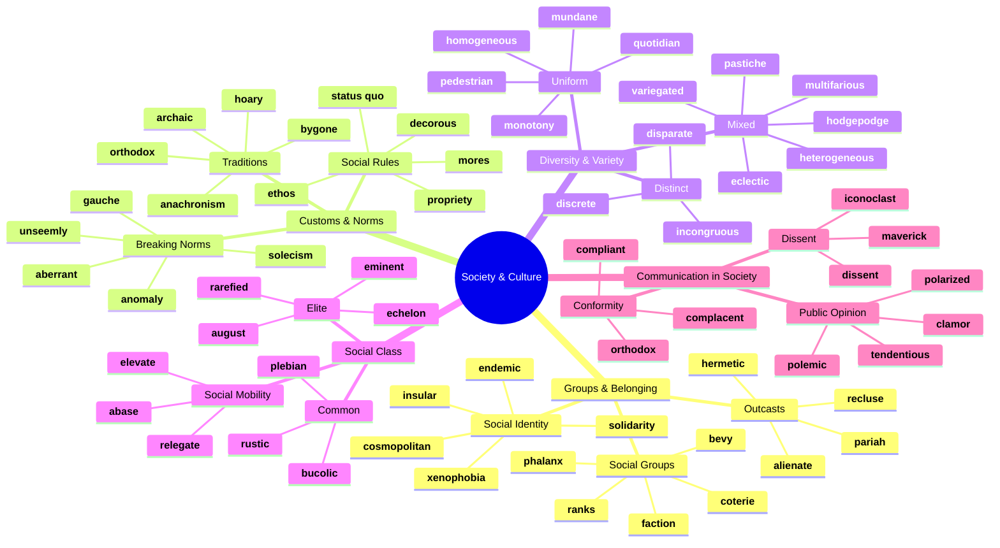
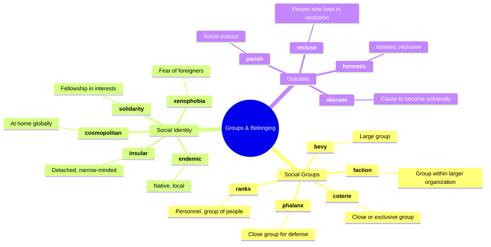
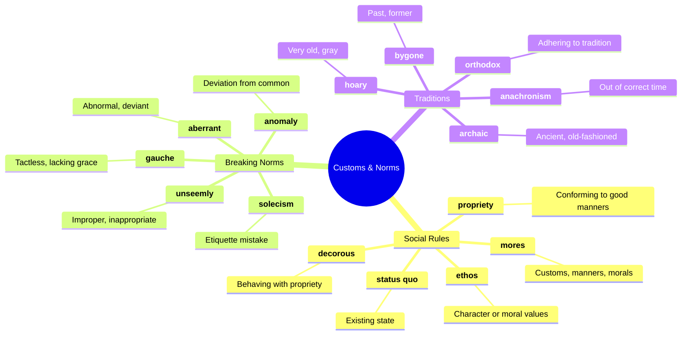
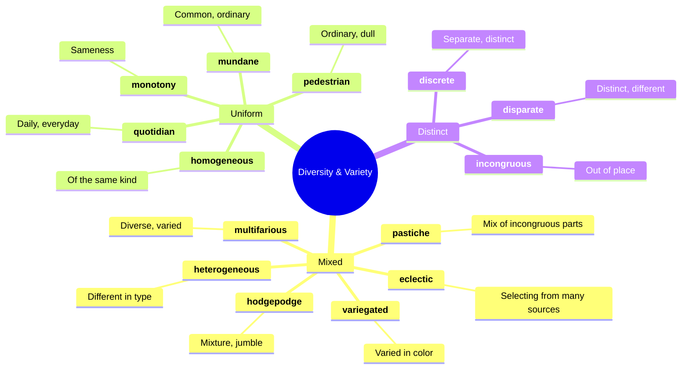
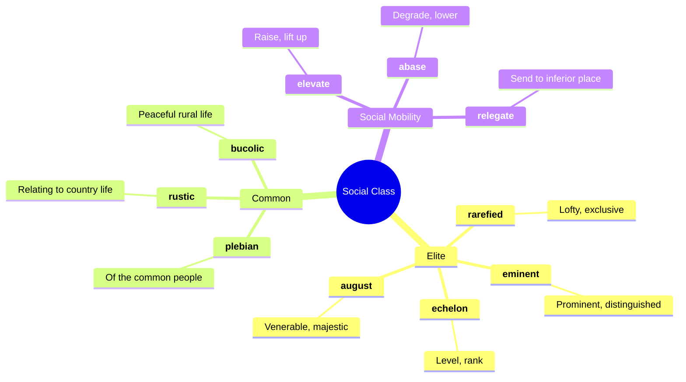
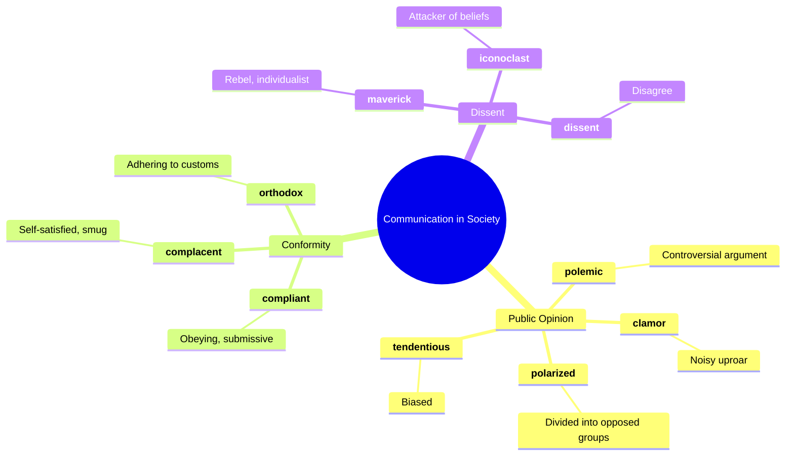
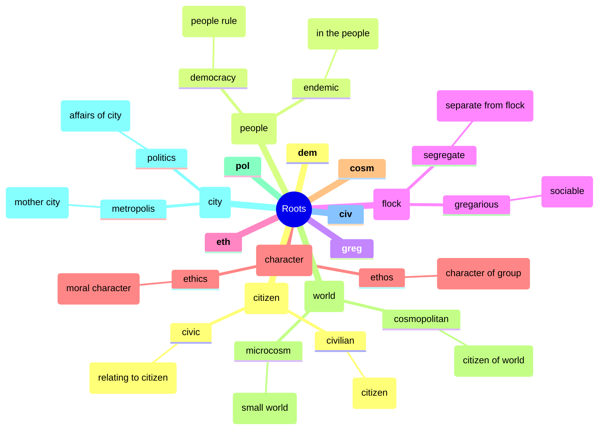

# 🏛️ Society, Culture & Groups

## 🗺️ Main Mind Map

---

## 🔍 Detailed Focus

### 👥 Groups & Belonging

### 📜 Customs & Norms

### 🌈 Diversity & Variety

### 🎩 Social Class

### 🗣️ Communication in Society

---

## 📚 Vocabulary List

| Word              | Definition                                                                                                                                                                     | Memory Hook                                              | Example Sentence                                                           |
| ----------------- | ------------------------------------------------------------------------------------------------------------------------------------------------------------------------------ | -------------------------------------------------------- | -------------------------------------------------------------------------- |
| **abase**         | Behave in a way that belittles or degrades (someone)                                                                                                                           | **A-BASE** → Bring to the **BASE** (bottom)              | He refused to **abase** himself by begging for forgiveness.                |
| **aberrant**      | Departing from an accepted standard                                                                                                                                            | **AB-ERR**-ant → **AB**normal **ERR**or                  | His **aberrant** behavior worried his friends.                             |
| **alienate**      | Cause (someone) to feel isolated or estranged                                                                                                                                  | **ALIEN**-ate → Make like an **ALIEN**                   | His rude comments **alienated** him from the rest of the group.            |
| **anachronism**   | A thing belonging or appropriate to a period other than that in which it exists                                                                                                | **ANA-CHRON**-ism → Against **CHRON**os (time)           | The sword in the astronaut's hand was an **anachronism**.                  |
| **anomaly**       | Something that deviates from what is standard, normal, or expected                                                                                                             | **A-NOM**-aly → Not **NOM**inal (normal)                 | The snow in July was a weather **anomaly**.                                |
| **archaic**       | Very old or old-fashioned                                                                                                                                                      | **ARCH**-aic → **ARCH**aeology                           | The computer system was **archaic** and slow.                              |
| **august**        | Respected and impressive                                                                                                                                                       | **AUGUST** (month) → Named after **AUGUST**us Caesar     | The **august** body of the Supreme Court made the decision.                |
| **bevy**          | A large group of people or things of a particular kind                                                                                                                         | **BEV**-y → **BEV**erage party group                     | A **bevy** of reporters waited outside the courthouse.                     |
| **bucolic**       | Relating to the pleasant aspects of the countryside and country life                                                                                                           | **BU-COLIC** → **BU**ll in a field (peaceful)            | They spent a **bucolic** weekend at a farm.                                |
| **bygone**        | Belonging to an earlier time                                                                                                                                                   | **BY-GONE** → Gone **BY**                                | The museum displayed artifacts from a **bygone** era.                      |
| **clamor**        | A loud and confused noise, especially that of people shouting vehemently                                                                                                       | **CLAM**-or → **CLAM**s banging shells                   | The public **clamor** for change could not be ignored.                     |
| **complacent**    | Showing smug or uncritical satisfaction with oneself or one's achievements                                                                                                     | **COM-PLAC**-ent → **PLAC**ed in comfort                 | We cannot afford to be **complacent** about safety.                        |
| **compliant**     | Inclined to agree with others or obey rules, especially to an excessive degree                                                                                                 | **COMPLI**-ant → **COMPLY**-ant                          | The **compliant** employee always did what he was told.                    |
| **cosmopolitan**  | Familiar with and at ease in many different countries and cultures                                                                                                             | **COSMO**-politan → **COSMOS** (world) citizen           | London is a **cosmopolitan** city with a diverse population.               |
| **coterie**       | A small group of people with shared interests or tastes, especially one that is exclusive of other people                                                                      | **COTER**-ie → **COAT**s together (close group)          | A **coterie** of advisors surrounded the president.                        |
| **decorous**      | In keeping with good taste and propriety; polite and restrained                                                                                                                | **DECOR**-ous → Like good **DECOR**ation                 | The guests were **decorous** and well-behaved.                             |
| **discrete**      | Individually separate and distinct                                                                                                                                             | **DIS-CRETE** → **DIS**tinct **CRETE** (concrete blocks) | The data was broken down into **discrete** categories.                     |
| **disparate**     | Essentially different in kind; not allowing comparison                                                                                                                         | **DIS-PAR**-ate → **PAR**tially different                | The group was made up of people with **disparate** backgrounds.            |
| **dissent**       | The expression or holding of opinions at variance with those previously, commonly, or officially held                                                                          | **DIS-SENT** → **SENT** away feeling                     | There was growing **dissent** within the ruling party.                     |
| **eclectic**      | Deriving ideas, style, or taste from a broad and diverse range of sources                                                                                                      | **E-CLECT**-ic → **ELECT**ing from everywhere            | Her musical tastes are **eclectic**, ranging from jazz to heavy metal.     |
| **echelon**       | A level or rank in an organization, a profession, or society                                                                                                                   | **ECHELON** → Ladder rung                                | He reached the upper **echelons** of the military.                         |
| **elevate**       | Raise or lift (something) up to a higher position                                                                                                                              | **ELEVAT**-or → Goes up                                  | The promotion **elevated** her status in the company.                      |
| **eminent**       | (of a person) famous and respected within a particular sphere or profession                                                                                                    | **EMIN**-ent → Like **EMIN**em (famous)                  | An **eminent** scientist was invited to speak.                             |
| **endemic**       | (of a disease or condition) regularly found among particular people or in a certain area                                                                                       | **EN-DEM**-ic → **IN** the **DEM**os (people)            | Malaria is **endemic** in some tropical regions.                           |
| **ethos**         | The characteristic spirit of a culture, era, or community as manifested in its beliefs and aspirations                                                                         | **ETHOS** → **ETH**ics of a group                        | The company's **ethos** is built on innovation and teamwork.               |
| **faction**       | A small organized dissenting group within a larger one, especially in politics                                                                                                 | **FACT**-ion → **FACT**ory of dissent                    | A **faction** of the party broke away to form a new group.                 |
| **gauche**        | Lacking ease or grace; unsophisticated and socially awkward                                                                                                                    | **GAUCHE** (left in French) → Left-handed (clumsy)       | It was **gauche** of him to mention the price of the gift.                 |
| **hermetic**      | (of a seal or closure) complete and airtight                                                                                                                                   | **HERMET**-ic → **HERMIT** (sealed off)                  | The jar had a **hermetic** seal.                                           |
| **heterogeneous** | Diverse in character or content                                                                                                                                                | **HETERO-GEN**-eous → **HETERO** (different) **GEN**es   | The population of the city is highly **heterogeneous**.                    |
| **hoary**         | Grayish white; old and trite                                                                                                                                                   | **HOAR**-y → **H**air **O**ld **A**nd **R**are           | He told a **hoary** old joke that everyone had heard before.               |
| **hodgepodge**    | A confused mixture                                                                                                                                                             | **HODGE-PODGE** → **HOT POT** (stew of everything)       | The room was a **hodgepodge** of furniture styles.                         |
| **homogeneous**   | Of the same kind; alike                                                                                                                                                        | **HOMO-GEN**-eous → **HOMO** (same) **GEN**es            | The neighborhood was racially **homogeneous**.                             |
| **iconoclast**    | A person who attacks cherished beliefs or institutions                                                                                                                         | **ICON-O-CLAST** → **ICON** **CLASH**er                  | As an **iconoclast**, he challenged the established dogmas of the church.  |
| **incongruous**   | Not in harmony or keeping with the surroundings or other aspects of something                                                                                                  | **IN-CONGRU**-ous → Not **CONGRU**ent (matching)         | The modern building looked **incongruous** in the historic district.       |
| **insular**       | Ignorant of or uninterested in cultures, ideas, or peoples outside one's own experience                                                                                        | **INSUL**-ar → **INSUL**ated (island-like)               | The **insular** community was suspicious of outsiders.                     |
| **maverick**      | An unorthodox or independent-minded person                                                                                                                                     | **MAVERICK** → Top Gun pilot                             | He was a **maverick** who refused to follow the party line.                |
| **monotony**      | Lack of variety and interest; tedious repetition and routine                                                                                                                   | **MONO-TON**-y → **ONE TONE**                            | The **monotony** of the job made him want to quit.                         |
| **mores**         | The essential or characteristic customs and conventions of a community                                                                                                         | **MORE**-s → **MOR**als                                  | The social **mores** of the Victorian era were very strict.                |
| **multifarious**  | Many and of various types                                                                                                                                                      | **MULTI-FAR**-ious → **MULTI** (many) **FAR** (wide)     | The job requires **multifarious** skills.                                  |
| **mundane**       | Lacking interest or excitement; dull                                                                                                                                           | **MUND**-ane → **MUND**o (world) - worldly/ordinary      | He was tired of his **mundane** daily routine.                             |
| **orthodox**      | (of a person or their views, especially religious or political ones, or other beliefs or practices) conforming to what is generally or traditionally accepted as right or true | **ORTHO-DOX** → **ORTHO** (straight) **DOX** (belief)    | He holds **orthodox** views on religion.                                   |
| **pariah**        | An outcast                                                                                                                                                                     | **PARIAH** → **PIRANHA** (avoid!)                        | After the scandal, he became a **pariah** in the town.                     |
| **pastiche**      | An artistic work in a style that imitates that of another work, artist, or period                                                                                              | **PAST**-iche → **PAST**e together                       | The movie was a **pastiche** of classic sci-fi films.                      |
| **pedestrian**    | Lacking inspiration or excitement; dull                                                                                                                                        | **PED**-estrian → On foot (slow/boring)                  | His writing style is rather **pedestrian**.                                |
| **phalanx**       | A body of troops or police officers, standing or moving in close formation                                                                                                     | **PHALANX** → **PHALANG**es (fingers close together)     | A **phalanx** of police officers blocked the street.                       |
| **plebian**       | (in ancient Rome) a commoner                                                                                                                                                   | **PLEB**-ian → **PLEB**s (common people)                 | He had **plebian** tastes in food and entertainment.                       |
| **polarized**     | Divided into two sharply contrasting groups or sets of opinions or beliefs                                                                                                     | **POLAR**-ized → North and South **POLE**s               | The country is deeply **polarized** over the issue.                        |
| **polemic**       | A strong verbal or written attack on someone or something                                                                                                                      | **POLE**-mic → **POLE**s apart (fighting)                | He wrote a fierce **polemic** against the government.                      |
| **propriety**     | The state or quality of conforming to conventionally accepted standards of behavior or morals                                                                                  | **PROPRI**-ety → **PROP**er behavior                     | She always behaved with the utmost **propriety**.                          |
| **quotidian**     | Of or occurring every day; daily                                                                                                                                               | **QUOT**-idian → **QUOT**a per day                       | He was bogged down in the **quotidian** details of running the business.   |
| **ranks**         | The people belonging to or constituting a group or class                                                                                                                       | **RANK**s → Soldiers in line                             | He rose through the **ranks** to become CEO.                               |
| **rarefied**      | Distant from the lives and concerns of ordinary people                                                                                                                         | **RARE**-fied → **RARE** air (high up)                   | She moved in the **rarefied** circles of high society.                     |
| **recluse**       | A person who lives a solitary life and tends to avoid other people                                                                                                             | **RE-CLUSE** → **CLOSE**d off                            | The famous author lived as a **recluse** in the mountains.                 |
| **relegate**      | Consign or dismiss to an inferior rank or position                                                                                                                             | **RE-LEG**-ate → **LEG**s walk down                      | The team was **relegated** to the second division.                         |
| **rustic**        | Relating to the countryside; rural                                                                                                                                             | **RUST**-ic → **RUST**y old farm                         | They stayed in a **rustic** cabin in the woods.                            |
| **solecism**      | A grammatical mistake in speech or writing; a breach of good manners                                                                                                           | **SOLE**-cism → **SOLE** (only) mistake                  | Using the wrong fork was a social **solecism**.                            |
| **solidarity**    | Unity or agreement of feeling or action, especially among individuals with a common interest                                                                                   | **SOLID**-arity → **SOLID** together                     | The workers stood in **solidarity** with the strikers.                     |
| **status quo**    | The existing state of affairs, especially regarding social or political issues                                                                                                 | **STATUS QUO** → State in which                          | He is content with the **status quo** and opposes change.                  |
| **tendentious**   | Expressing or intending to promote a particular cause or point of view, especially a controversial one                                                                         | **TEND**-entious → **TEND**ency to bias                  | The book was criticized for its **tendentious** interpretation of history. |
| **unseemly**      | (of behavior or actions) not proper or appropriate                                                                                                                             | **UN-SEEM**-ly → Not **SEEM**ing right                   | It was **unseemly** for them to argue in public.                           |
| **variegated**    | Exhibiting different colors, especially as irregular patches or streaks                                                                                                        | **VARI**-egated → **VARI**ed colors                      | The garden was filled with **variegated** flowers.                         |
| **xenophobia**    | Dislike of or prejudice against people from other countries                                                                                                                    | **XENO-PHOBIA** → **XENO** (stranger) **PHOBIA** (fear)  | The rise in **xenophobia** is a concern for the government.                |

---

## 🌱 Etymology & Roots

