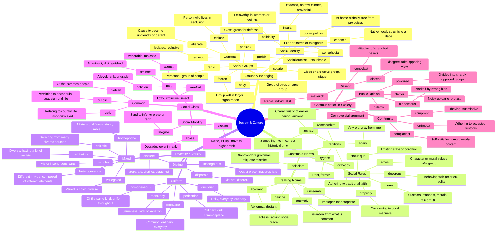

# 🏛️ Society, Culture & Groups

> GRE vocabulary for social structures, customs, diversity, and belonging.

## Mind Map

## Quick Memory Hooks

| Word          | Memory Hook                                            |
| ------------- | ------------------------------------------------------ |
| coterie       | COTER-ie → A cozy circle of close friends              |
| xenophobia    | XENO-phobia → Xeno = foreign, fear of strangers        |
| propriety     | PROPRI-ety → Proper behavior, property of good manners |
| eclectic      | E-CLECT-ic → Selecting from everywhere                 |
| anachronism   | ANA-CHRON-ism → Against (ana) time (chronos)           |
| bucolic       | BU-COLIC → Like a bull in a peaceful field             |
| heterogeneous | HETERO-geneous → Different (hetero) types              |
| pariah        | Like a PIRANHA, everyone stays away                    |
