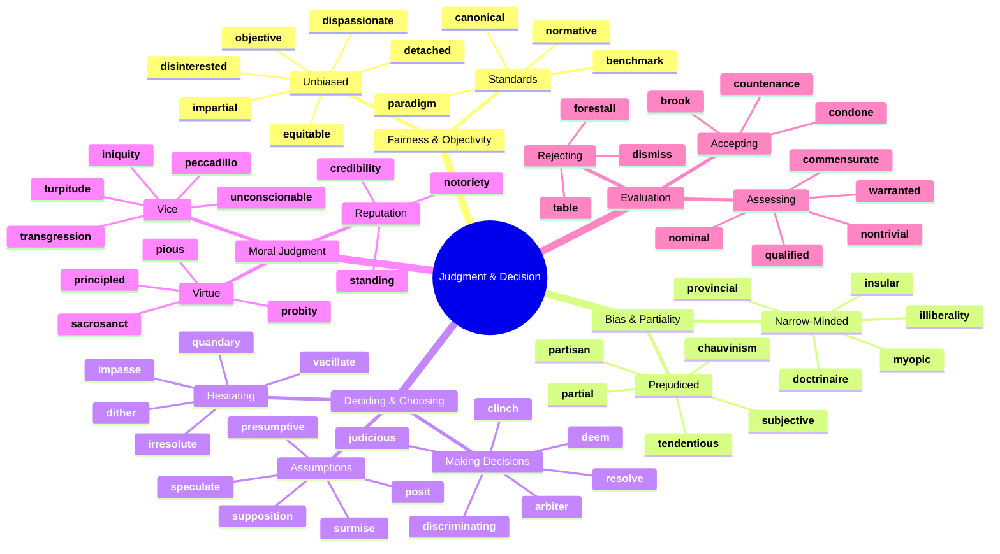
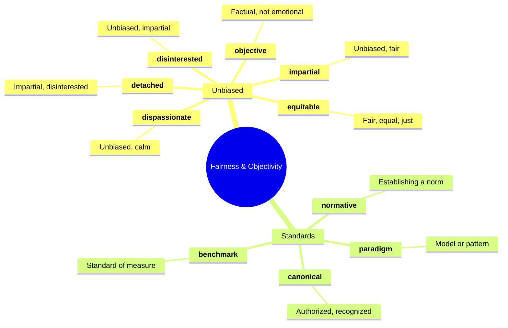
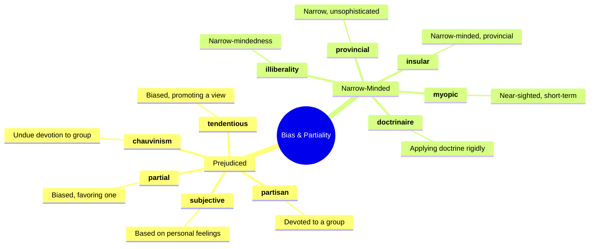
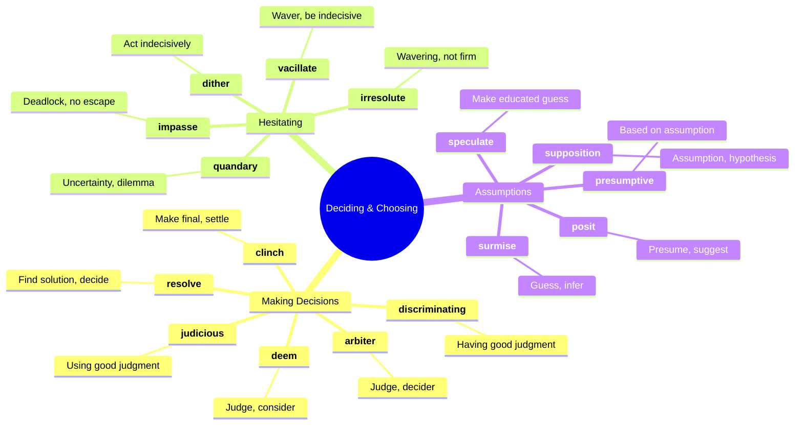
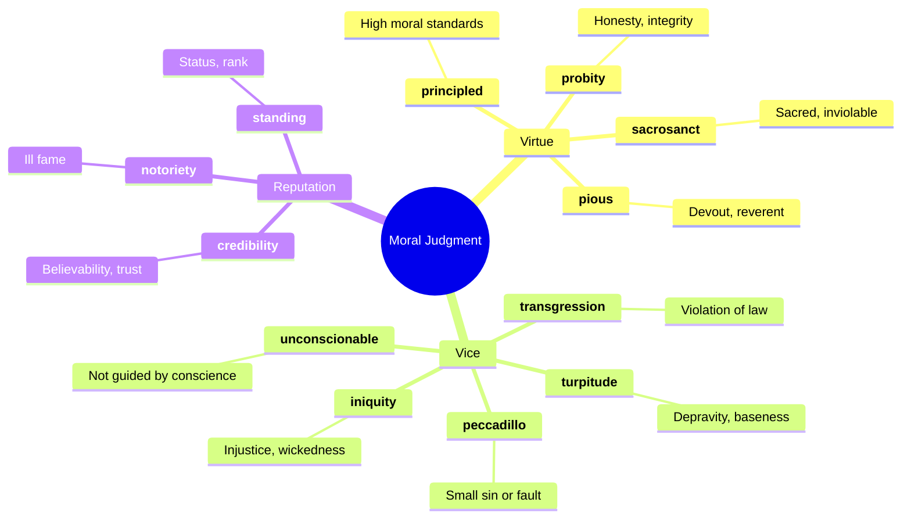
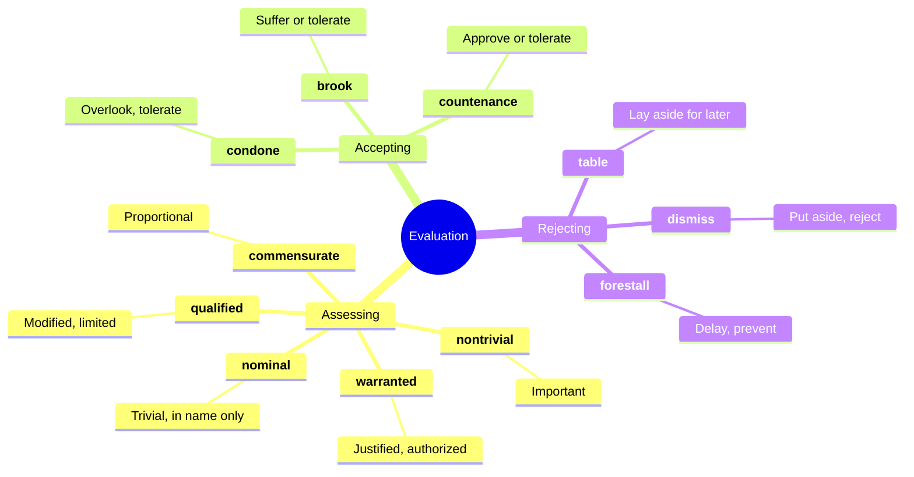
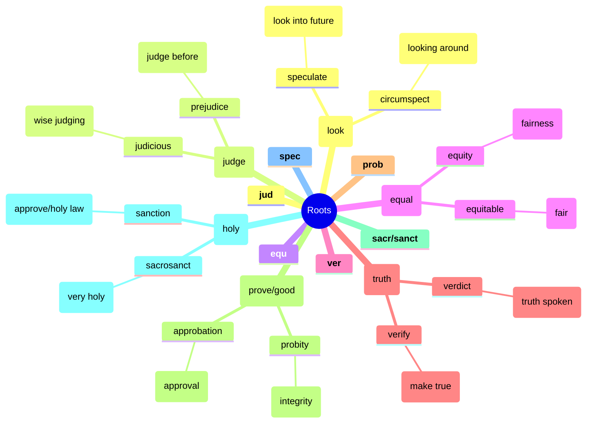

# ⚖️ Judgment, Bias & Decision-Making

## 🗺️ Main Mind Map

---

## 🔍 Detailed Focus

### ⚖️ Fairness & Objectivity

### 🙈 Bias & Partiality

### 🤔 Deciding & Choosing

### 😇 Moral Judgment

### 📝 Evaluation

---

## 📚 Vocabulary List

| Word               | Definition                                                                                                             | Memory Hook                                                   | Example Sentence                                                                        |
| ------------------ | ---------------------------------------------------------------------------------------------------------------------- | ------------------------------------------------------------- | --------------------------------------------------------------------------------------- |
| **arbiter**        | A person who settles a dispute or has ultimate authority in a matter                                                   | **ARBIT**-er → **ARBIT**rator                                 | The Supreme Court is the final **arbiter** of the law.                                  |
| **benchmark**      | A standard or point of reference against which things may be compared or assessed                                      | **BENCH-MARK** → Mark on a bench to measure                   | This new computer sets the **benchmark** for speed and performance.                     |
| **brook**          | Tolerate or allow (something, typically dissent or opposition)                                                         | **BROOK** → Don't **BROOK** the babbling **BROOK** (noise)    | The teacher would **brook** no nonsense in her classroom.                               |
| **canonical**      | Included in the list of sacred books officially accepted as genuine; accepted as being accurate and authoritative      | **CANON**-ical → Official rule                                | The **canonical** works of Shakespeare are studied in schools everywhere.               |
| **chauvinism**     | Exaggerated or aggressive patriotism; excessive or prejudiced loyalty or support for one's own cause, group, or gender | **CHAUVIN**-ism → Named after Nicolas **CHAUVIN**             | His male **chauvinism** was offensive to his female colleagues.                         |
| **clinch**         | Confirm or settle (a contract or bargain)                                                                              | **CLINCH** → **CLENCH** the deal                              | The final goal **clinched** the victory for the team.                                   |
| **commensurate**   | Corresponding in size or degree; in proportion                                                                         | **CO-MENSUR**-ate → **MENSUR** (measure) together             | Her salary is **commensurate** with her experience and skills.                          |
| **condone**        | Accept and allow (behavior that is considered morally wrong or offensive) to continue                                  | **CON-DONE** → **DONE** with it (ignore it)                   | The school does not **condone** bullying of any kind.                                   |
| **countenance**    | Admit as acceptable or possible                                                                                        | **COUNT**-enance → **COUNT** on support                       | I will not **countenance** such rude behavior in my house.                              |
| **credibility**    | The quality of being trusted and believed in                                                                           | **CRED**-ibility → **CRED**it                                 | The scandal damaged the politician's **credibility**.                                   |
| **deem**           | Regard or consider in a specified way                                                                                  | **DEEM** → **D**ecide/est**EEM**                              | The building was **deemed** unsafe by the inspectors.                                   |
| **detached**       | Separate or disconnected; aloof and objective                                                                          | **DE-TACH**-ed → Not **ATTACH**ed                             | A judge must remain **detached** from the emotional aspects of the case.                |
| **discriminating** | Having or showing refined taste or good judgment                                                                       | **DISCRIMIN**-ating → **DISCRIMIN**ating between good and bad | She is a **discriminating** collector of modern art.                                    |
| **disinterested**  | Not influenced by considerations of personal advantage                                                                 | **DIS-INTEREST**-ed → No **INTEREST** (stake) in outcome      | We need a **disinterested** observer to judge the competition.                          |
| **dismiss**        | Treat as unworthy of serious consideration                                                                             | **DIS-MISS** → **MISS** the point/send away                   | He **dismissed** the idea as impractical.                                               |
| **dispassionate**  | Not influenced by strong emotion, and so able to be rational and impartial                                             | **DIS-PASSION**-ate → No **PASSION** (bias)                   | The journalist gave a **dispassionate** account of the events.                          |
| **dither**         | Be indecisive                                                                                                          | **DITHER** → **DIT**-**DAH** (morse code confusion)           | Stop **dithering** and make a decision!                                                 |
| **doctrinaire**    | Seeking to impose a doctrine in all circumstances without regard to practical considerations                           | **DOCTRIN**-aire → **DOCTRIN**e airhead                       | His **doctrinaire** approach alienated many potential supporters.                       |
| **equitable**      | Fair and impartial                                                                                                     | **EQUIT**-able → **EQUAL**-able                               | The divorce settlement was **equitable** to both parties.                               |
| **forestall**      | Prevent or obstruct (an anticipated event or action) by taking action ahead of time                                    | **FORE-STALL** → **STALL** be**FORE**                         | He tried to **forestall** the criticism by admitting his mistake early.                 |
| **illiberality**   | Narrow-mindedness; bigotry                                                                                             | **IL-LIBERAL**-ity → Not **LIBERAL** (free/open)              | The **illiberality** of the regime stifled all dissent.                                 |
| **impartial**      | Treating all rivals or disputants equally; fair and just                                                               | **IM-PART**-ial → Not taking **PART**                         | The referee must be **impartial**.                                                      |
| **impasse**        | A situation in which no progress is possible, especially because of disagreement; a deadlock                           | **IM-PASSE** → **IM-PASS**able                                | The negotiations reached an **impasse**.                                                |
| **iniquity**       | Immoral or grossly unfair behavior                                                                                     | **IN-IQU**-ity → **IN-EQU**ity (inequality/unfairness)        | The **iniquity** of the slave trade is a stain on history.                              |
| **insular**        | Ignorant of or uninterested in cultures, ideas, or peoples outside one's own experience                                | **INSUL**-ar → **INSUL**ated (island-like)                    | The **insular** community refused to accept outsiders.                                  |
| **irresolute**     | Showing or feeling hesitancy; uncertain                                                                                | **IR-RESOLUTE** → Not **RESOLUTE**                            | The **irresolute** leader failed to act in the crisis.                                  |
| **judicious**      | Having, showing, or done with good judgment or sense                                                                   | **JUDIC**-ious → Like a **JUDGE**                             | We need to make a **judicious** use of our time.                                        |
| **myopic**         | Nearsighted; lacking imagination, foresight, or intellectual insight                                                   | **MY-OPIC** → **MY** **OP**tics (eyes) only see close         | The company's **myopic** focus on short-term profits hurt its long-term growth.         |
| **nominal**        | (of a role or status) existing in name only                                                                            | **NOMIN**-al → **NAME** only                                  | He is the **nominal** head of the organization, but his deputy makes all the decisions. |
| **nontrivial**     | Significant or important                                                                                               | **NON-TRIVIAL** → Not **TRIVIAL**                             | The cost of the project is **nontrivial**.                                              |
| **normative**      | Establishing, relating to, or deriving from a standard or norm, especially of behavior                                 | **NORM**-ative → Setting the **NORM**                         | The study provides **normative** data on child development.                             |
| **notoriety**      | The state of being famous or well known for some bad quality or deed                                                   | **NOTOR**-iety → **NOTOR**ious                                | The gangster achieved **notoriety** for his brutal crimes.                              |
| **objective**      | (of a person or their judgment) not influenced by personal feelings or opinions in considering and representing facts  | **OBJECT**-ive → Focus on the **OBJECT** (fact)               | A scientist must try to be **objective** in their research.                             |
| **paradigm**       | A typical example or pattern of something; a model                                                                     | **PARA-DIGM** → **PARA**llel **DIG**ram                       | The discovery shifted the scientific **paradigm**.                                      |
| **partial**        | Favoring one side in a dispute above the other; biased                                                                 | **PART**-ial → Taking a **PART**                              | The referee was accused of being **partial** to the home team.                          |
| **partisan**       | A strong supporter of a party, cause, or person                                                                        | **PART**-isan → Takes a **PART** (side)                       | The debate became highly **partisan**.                                                  |
| **peccadillo**     | A small, relatively unimportant offense or sin                                                                         | **PECCA-DILLO** → Small **PECK** of sin                       | He was willing to overlook her minor **peccadilloes**.                                  |
| **pious**          | Devoutly religious                                                                                                     | **PI**-ous → **PI**ety                                        | The **pious** woman attended mass every morning.                                        |
| **posit**          | Assume as a fact; put forward as a basis of argument                                                                   | **POSIT**-ion → Put in **POSIT**ion                           | The theory **posits** that the universe is expanding.                                   |
| **presumptive**    | Of the nature of a presumption; presumed in the absence of further information                                         | **PRE-SUMP**-tive → **PRE-SUM**ing                            | He is the **presumptive** nominee for the party.                                        |
| **principled**     | (of a person or their behavior) acting in accordance with morality and showing recognition of right and wrong          | **PRINCIPL**-ed → Follows **PRINCIPL**es                      | She took a **principled** stand against the corruption.                                 |
| **probity**        | The quality of having strong moral principles; honesty and decency                                                     | **PROB**-ity → **PROB**ing finds nothing wrong                | The judge was known for his **probity** and fairness.                                   |
| **provincial**     | Of or concerning a province of a country or empire; unsophisticated or narrow-minded                                   | **PROVINC**-ial → From the **PROVINC**es (countryside)        | His **provincial** attitude annoyed the city dwellers.                                  |
| **qualified**      | Not complete or absolute; limited                                                                                      | **QUALIFI**-ed → **QUALIFI**cations added                     | The plan was a **qualified** success.                                                   |
| **quandary**       | A state of perplexity or uncertainty over what to do in a difficult situation                                          | **QUAND**-ary → **WAND**ering what to do                      | He was in a **quandary** about which job to take.                                       |
| **resolve**        | Settle or find a solution to (a problem, dispute, or contentious matter)                                               | **RE-SOLVE** → **SOLVE** again/finally                        | We need to **resolve** this issue before we can move forward.                           |
| **sacrosanct**     | (especially of a principle, place, or routine) regarded as too important or valuable to be interfered with             | **SACRO-SANCT** → **SACR**ed and **SANCT**ified               | The weekend schedule is **sacrosanct**; we never work on Sundays.                       |
| **speculate**      | Form a theory or conjecture about a subject without firm evidence                                                      | **SPEC**-ulate → **SPEC**tator guessing                       | We can only **speculate** about the future.                                             |
| **subjective**     | Based on or influenced by personal feelings, tastes, or opinions                                                       | **SUBJECT**-ive → The **SUBJECT** (person) decides            | Taste in art is highly **subjective**.                                                  |
| **supposition**    | An uncertain belief                                                                                                    | **SUP-POS**-ition → **SUPPOS**ing                             | The report is based on **supposition**, not fact.                                       |
| **surmise**        | Suppose that something is true without having evidence to confirm it                                                   | **SUR-MISE** → **SUR** (over) **MISE** (put/guess)            | I **surmised** that he was angry from his tone of voice.                                |
| **table**          | Postpone consideration of                                                                                              | **TABLE** → Put on the **TABLE** for later                    | Let's **table** this discussion until the next meeting.                                 |
| **tendentious**    | Expressing or intending to promote a particular cause or point of view, especially a controversial one                 | **TEND**-entious → **TEND**ency to bias                       | The article was criticized for its **tendentious** reporting.                           |
| **transgression**  | An act that goes against a law, rule, or code of conduct; an offense                                                   | **TRANS-GRESS** → **GRESS** (step) a**CROSS** (trans)         | He asked for forgiveness for his **transgressions**.                                    |
| **turpitude**      | Depravity; wickedness                                                                                                  | **TURP**-itude → **TURP**entine (dirty solvent)               | He was fired for moral **turpitude**.                                                   |
| **unconscionable** | Not right or reasonable                                                                                                | **UN-CONSCION**-able → No **CONSCIEN**ce                      | It is **unconscionable** to leave people to starve.                                     |
| **vacillate**      | Alternate or waver between different opinions or actions; be indecisive                                                | **VACILL**-ate → **VAC**uum back and forth                    | He **vacillated** between the two options for weeks.                                    |
| **warranted**      | Justify or necessitate (a certain course of action)                                                                    | **WARRANT**-ed → With a **WARRANT** (permission)              | The criticism was **warranted** given the poor performance.                             |

---

## 🌱 Etymology & Roots

