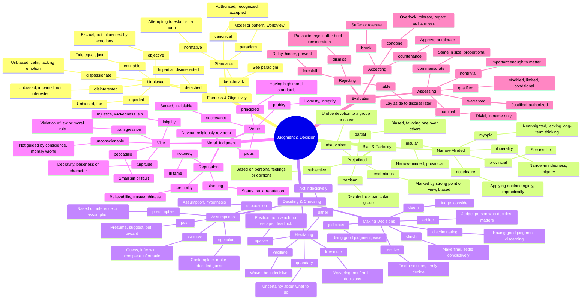

# ⚖️ Judgment, Bias & Decision-Making

> GRE vocabulary for fairness, bias, opinions, and the process of deciding.

## Mind Map

## Quick Memory Hooks

| Word          | Memory Hook                                      |
| ------------- | ------------------------------------------------ |
| disinterested | DIS-INTERESTED → Not interested in taking sides  |
| partisan      | PART-isan → Taking PART for one side             |
| sacrosanct    | SACRO-SANCT → Sacred and sanctified, untouchable |
| myopic        | MY-OPIC → My optics are short-sighted            |
| peccadillo    | PECCA-DILLO → A small peck of sin                |
| equitable     | EQUIT-able → Equal and fair                      |
| vacillate     | Like a VACUUM going back and forth               |
| surmise       | SUR-MISE → Over (sur) a guess (mise)             |
