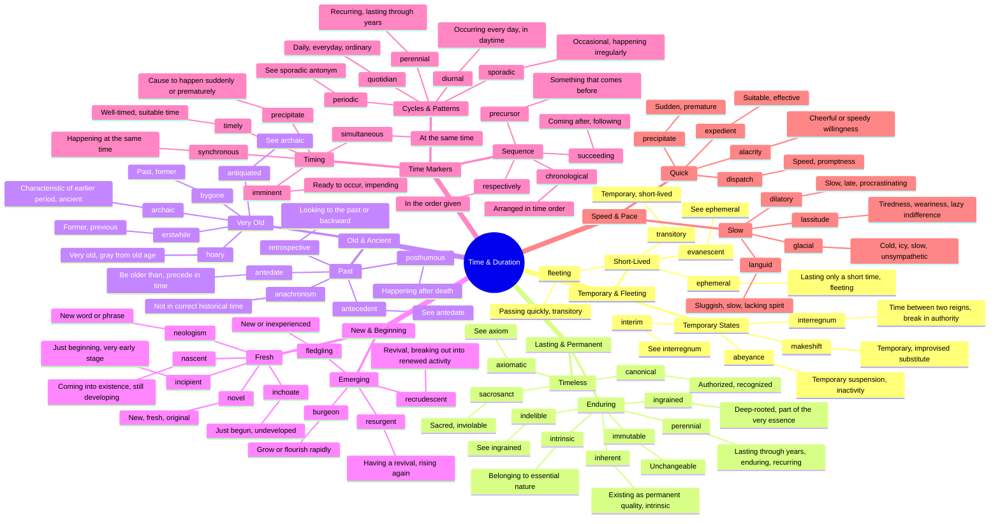

# ⏳ Time, Duration & Permanence

> GRE vocabulary for temporal concepts — old, new, lasting, fleeting, and cycles.

## Mind Map

## Quick Memory Hooks

| Word       | Memory Hook                                                |
| ---------- | ---------------------------------------------------------- |
| ephemeral  | EPHEM-eral → Like a mayfly (ephemera), gone in a day       |
| perennial  | PER-ENNIAL → Through (per) the years (annual)              |
| nascent    | NASC-ent → Being born (natal), just starting               |
| archaic    | ARCH-aic → Like ancient arches, from old times             |
| imminent   | IMMIN-ent → It's coming IN any MINute                      |
| dilatory   | DILA-tory → Delaying, like dilly-dallying                  |
| posthumous | POST-HUMOUS → After (post) being put in the ground (humus) |
| sporadic   | SPORAD-ic → Like spores scattered randomly                 |
