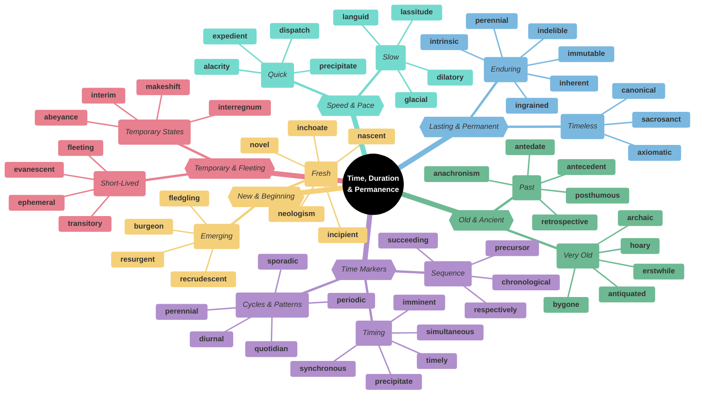
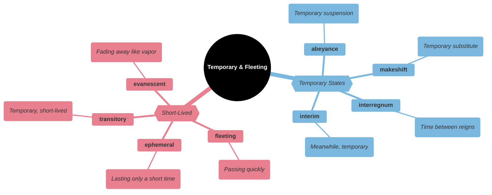
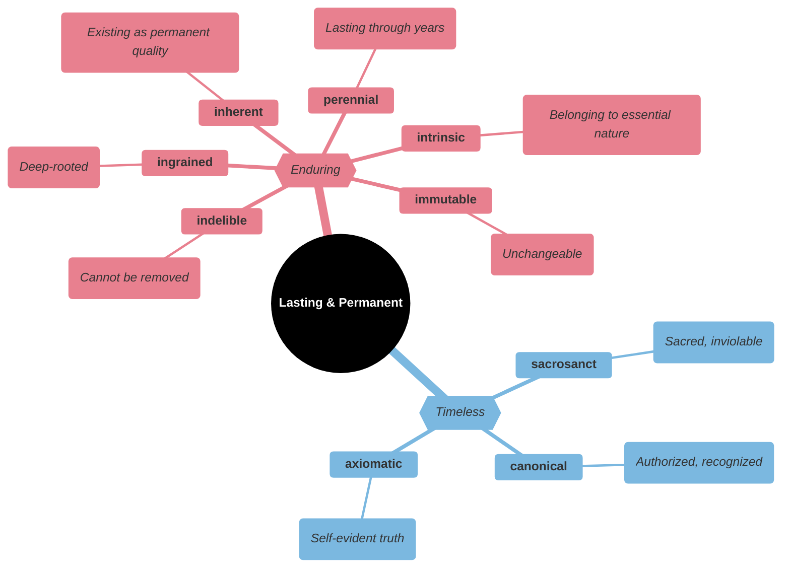
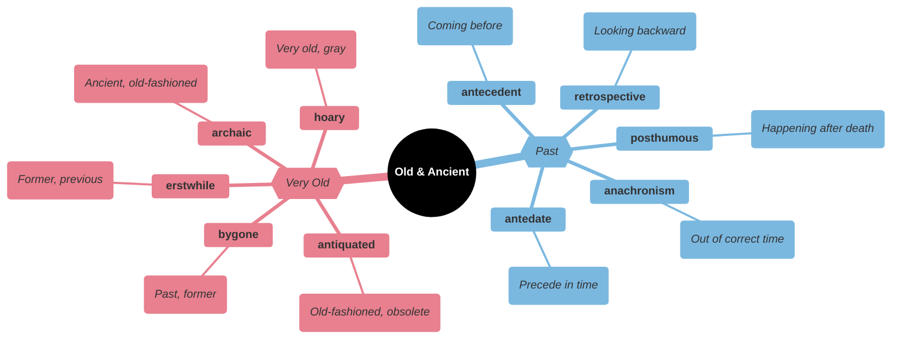
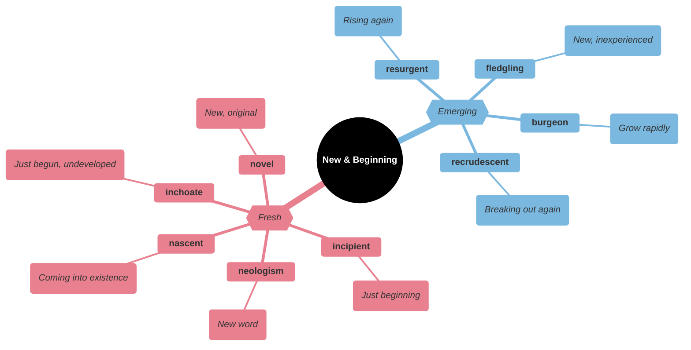
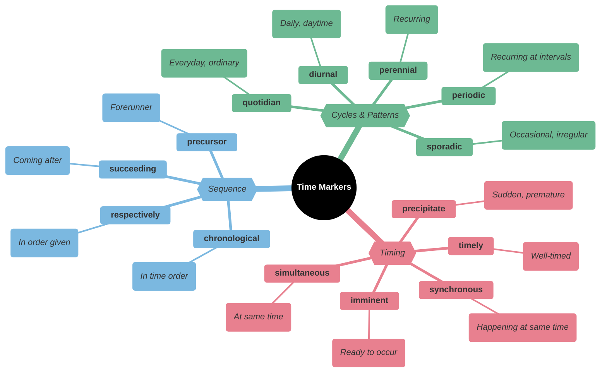
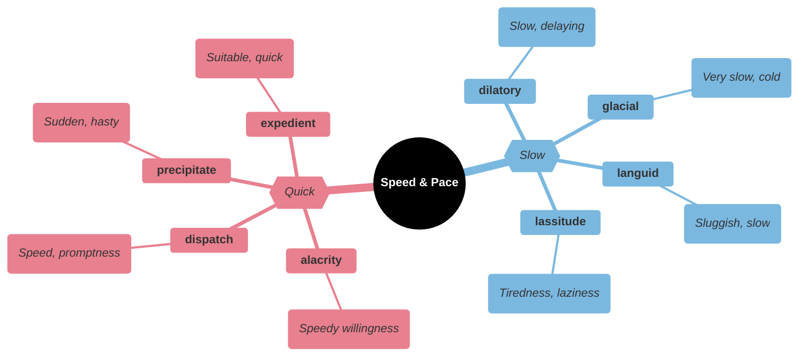
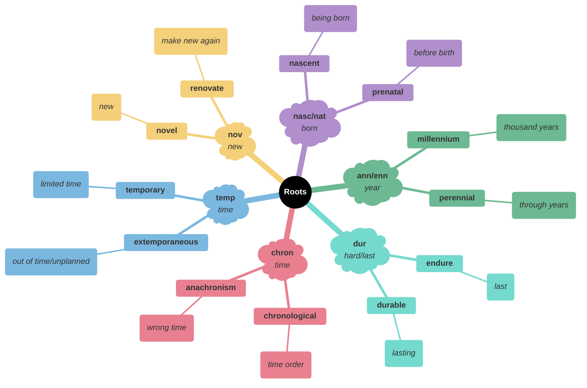

# ⏳ Time, Duration & Permanence

## Main Mindmap

---

## Detailed Focus

### Temporary & Fleeting

| Word            | Definition                                                                                    | Memory Hook                                              | Example Sentence                                                          |
| --------------- | --------------------------------------------------------------------------------------------- | -------------------------------------------------------- | ------------------------------------------------------------------------- |
| **ephemeral**   | Lasting for a very short time                                                                 | **EPHEM**-eral → **E**vaporates **PHE**nominally fast    | Fashion trends are often **ephemeral**.                                   |
| **fleeting**    | Lasting for a very short time                                                                 | **FLEET**-ing → **FLEET** (fast) footed                  | I caught a **fleeting** glimpse of the deer before it ran into the woods. |
| **transitory**  | Not permanent                                                                                 | **TRANSIT**-ory → In **TRANSIT** (moving)                | Happiness is often **transitory**.                                        |
| **evanescent**  | Soon passing out of sight, memory, or existence; quickly fading or disappearing               | **E-VAN**-escent → **VAN**ishing **SCENT**               | The rainbow was **evanescent**, disappearing as quickly as it appeared.   |
| **abeyance**    | A state of temporary disuse or suspension                                                     | **A-BEY**-ance → **AT BAY** (held back)                  | The project was held in **abeyance** until funding could be secured.      |
| **makeshift**   | Serving as a temporary substitute; sufficient for the time being                              | **MAKE-SHIFT** → **MAKE** it **SHIFT** (work) for now    | We used a folded coat as a **makeshift** pillow.                          |
| **interregnum** | A period when normal government is suspended, especially between successive reigns or regimes | **INTER-REG**-num → **INTER** (between) **REG**s (kings) | The country suffered from chaos during the **interregnum**.               |
| **interim**     | The intervening time                                                                          | **INTER**-im → **INTER**val t**IM**e                     | An **interim** government was set up until elections could be held.       |

### Lasting & Permanent

| Word           | Definition                                                                                                        | Memory Hook                                            | Example Sentence                                                |
| -------------- | ----------------------------------------------------------------------------------------------------------------- | ------------------------------------------------------ | --------------------------------------------------------------- |
| **perennial**  | Lasting or existing for a long or apparently infinite time; enduring or continually recurring                     | **PER-ENN**-ial → **PER** (through) **ANN**ual (years) | The rose bush is a **perennial** favorite in gardens.           |
| **immutable**  | Unchanging over time or unable to be changed                                                                      | **IM-MUT**-able → Not **MUT**able (mutant/change)      | The laws of nature are **immutable**.                           |
| **indelible**  | (of ink or a pen) making marks that cannot be removed                                                             | **IN-DEL**-ible → **IN**-**DEL**ete-able               | The experience left an **indelible** impression on his mind.    |
| **ingrained**  | (of a habit, belief, or attitude) firmly fixed or established; difficult to change                                | **IN-GRAIN**-ed → In the **GRAIN** of the wood         | His prejudice was deeply **ingrained**.                         |
| **inherent**   | Existing in something as a permanent, essential, or characteristic attribute                                      | **IN-HERE**-nt → **IN** **HERE** (inside)              | There are risks **inherent** in any investment.                 |
| **intrinsic**  | Belonging naturally; essential                                                                                    | **IN-TRIN**-sic → **IN**side **TR**uth                 | Freedom of speech is an **intrinsic** human right.              |
| **sacrosanct** | (especially of a principle, place, or routine) regarded as too important or valuable to be interfered with        | **SACRO-SANCT** → **SACR**ed and **SANCT**ified        | The tradition of Sunday dinner is **sacrosanct** in our family. |
| **canonical**  | Included in the list of sacred books officially accepted as genuine; accepted as being accurate and authoritative | **CANON**-ical → Official rule                         | The **canonical** texts of the religion are kept in the temple. |
| **axiomatic**  | Self-evident or unquestionable                                                                                    | **AXIOM**-atic → **AXI**s of truth                     | It is **axiomatic** that life is not always fair.               |

### Old & Ancient

| Word              | Definition                                                                      | Memory Hook                                                  | Example Sentence                                                          |
| ----------------- | ------------------------------------------------------------------------------- | ------------------------------------------------------------ | ------------------------------------------------------------------------- |
| **archaic**       | Very old or old-fashioned                                                       | **ARCH**-aic → **ARCH**aeology                               | "Thou" and "thee" are **archaic** forms of "you."                         |
| **hoary**         | Grayish white; old and trite                                                    | **HOAR**-y → **H**air **O**ld **A**nd **R**are               | He told a **hoary** old joke that everyone had heard a thousand times.    |
| **bygone**        | Belonging to an earlier time                                                    | **BY-GONE** → Gone **BY**                                    | Let **bygones** be **bygones**; let's forgive and forget.                 |
| **erstwhile**     | Former                                                                          | **ERST**-while → **E**a**R**lie**ST** **WHILE**              | His **erstwhile** friend became his bitter enemy.                         |
| **antiquated**    | Old-fashioned or outdated                                                       | **ANTIQUE**-ated → Like an **ANTIQUE**                       | The factory's equipment was **antiquated** and inefficient.               |
| **posthumous**    | Occurring, awarded, or appearing after the death of the originator              | **POST-HUM**-ous → **POST** (after) **HUM**us (earth/burial) | He received a **posthumous** award for bravery.                           |
| **retrospective** | Looking back on or dealing with past events or situations                       | **RETRO-SPECT**-ive → **RETRO** (back) **SPECT** (look)      | The museum is holding a **retrospective** of the artist's work.           |
| **anachronism**   | A thing belonging or appropriate to a period other than that in which it exists | **ANA-CHRON**-ism → Against **CHRON**os (time)               | The typewriter in the movie set in 1800 was an **anachronism**.           |
| **antecedent**    | A thing or event that existed before or logically precedes another              | **ANTE-CED**-ent → **ANTE** (before) **CED**e (go)           | The horse-drawn carriage was the **antecedent** of the modern automobile. |
| **antedate**      | Precede in time; come before (something) in date                                | **ANTE-DATE** → **DATE** be**FORE**                          | The civilization **antedates** the Roman Empire by centuries.             |

### New & Beginning

| Word             | Definition                                                                                                              | Memory Hook                                         | Example Sentence                                                      |
| ---------------- | ----------------------------------------------------------------------------------------------------------------------- | --------------------------------------------------- | --------------------------------------------------------------------- |
| **novel**        | New or unusual in an interesting way                                                                                    | **NOVEL** → New book                                | That's a **novel** idea; I've never heard it before.                  |
| **nascent**      | (especially of a process or organization) just coming into existence and beginning to display signs of future potential | **NASC**-ent → **NA**tal (birth)                    | The **nascent** space industry is growing rapidly.                    |
| **inchoate**     | Just begun and so not fully formed or developed; rudimentary                                                            | **IN-CHO**-ate → **IN** **CHO**colate (messy start) | His ideas were still **inchoate** and needed more work.               |
| **incipient**    | In an initial stage; beginning to happen or develop                                                                     | **IN-CIPI**-ent → **IN**side **SIP**ping (starting) | The **incipient** rebellion was quickly crushed.                      |
| **neologism**    | A newly coined word or expression                                                                                       | **NEO-LOG**-ism → **NEO** (new) **LOG**os (word)    | "Blog" is a **neologism** that combines "web" and "log."              |
| **fledgling**    | A person or organization that is immature, inexperienced, or underdeveloped                                             | **FLEDG**-ling → Just got **FEATHER**s (fledge)     | The **fledgling** democracy is still fragile.                         |
| **burgeon**      | Begin to grow or increase rapidly; flourish                                                                             | **BURG**-eon → **BURG**er (eating makes you grow)   | The city's population **burgeoned** during the industrial revolution. |
| **resurgent**    | Increasing or reviving after a period of little activity, popularity, or occurrence                                     | **RE-SURG**-ent → **RE**-**SURG**e (rise again)     | There has been a **resurgent** interest in vinyl records.             |
| **recrudescent** | Breaking out again; recurring                                                                                           | **RE-CRUD**-escent → **RE**-**CRUD**e (raw again)   | The **recrudescent** virus caused a new outbreak.                     |

### Time Markers

| Word              | Definition                                                                                        | Memory Hook                                                       | Example Sentence                                                         |
| ----------------- | ------------------------------------------------------------------------------------------------- | ----------------------------------------------------------------- | ------------------------------------------------------------------------ |
| **timely**        | Done or occurring at a favorable or useful time; opportune                                        | **TIME**-ly → Good **TIME**                                       | His **timely** intervention saved the deal.                              |
| **precipitate**   | Done, made, or acting suddenly or without careful consideration                                   | **PRE-CIPIT**-ate → **PRE** (before) **CAPIT** (head) - headfirst | His **precipitate** decision to quit his job was a mistake.              |
| **imminent**      | About to happen                                                                                   | **IM-MIN**-ent → **IN** a **MIN**ute                              | The dark clouds signaled that a storm was **imminent**.                  |
| **simultaneous**  | Occurring, operating, or done at the same time                                                    | **SIMUL**-taneous → **SIMUL**ated time                            | The two explosions were **simultaneous**.                                |
| **synchronous**   | Existing or occurring at the same time                                                            | **SYN-CHRON**-ous → **SYN** (same) **CHRON**os (time)             | The dancers' movements were perfectly **synchronous**.                   |
| **chronological** | (of a record of events) starting with the earliest and following the order in which they occurred | **CHRONO**-logical → **CHRONO**s (time) logic                     | The history book presented the events in **chronological** order.        |
| **precursor**     | A person or thing that comes before another of the same kind; a forerunner                        | **PRE-CURS**-or → **PRE** (before) **CURS**or (runner)            | The typewriter was the **precursor** to the computer keyboard.           |
| **succeeding**    | Coming after something in time; subsequent                                                        | **SUCCEED**-ing → **SUCCEED**ing to the throne                    | In **succeeding** years, the company grew rapidly.                       |
| **respectively**  | Separately or individually and in the order already mentioned                                     | **RESPECT**-ively → **RESPECT** the order                         | Alice and Bob are 10 and 12 years old, **respectively**.                 |
| **diurnal**       | Of or during the day                                                                              | **DI**-urnal → **DI**a (day in Spanish)                           | Most birds are **diurnal**, sleeping at night and active during the day. |
| **quotidian**     | Of or occurring every day; daily                                                                  | **QUOT**-idian → **QUOT**a per day                                | He was bored by the **quotidian** routine of his job.                    |
| **perennial**     | Lasting or existing for a long or apparently infinite time; enduring or continually recurring     | **PER-ENN**-ial → **PER** (through) **ANN**ual (years)            | The rose bush is a **perennial** favorite in gardens.                    |
| **sporadic**      | Occurring at irregular intervals or only in a few places; scattered or isolated                   | **SPORAD**-ic → **SPORE**s scattered                              | The gunfire was **sporadic** throughout the night.                       |
| **periodic**      | Appearing or occurring at intervals                                                               | **PERIOD**-ic → **PERIOD**s of time                               | We conduct **periodic** reviews of our safety procedures.                |

### Speed & Pace

| Word            | Definition                                                                                                                | Memory Hook                                                       | Example Sentence                                                           |
| --------------- | ------------------------------------------------------------------------------------------------------------------------- | ----------------------------------------------------------------- | -------------------------------------------------------------------------- |
| **alacrity**    | Brisk and cheerful readiness                                                                                              | **A-LACK**-rity → **LACK** of hesitation                          | He accepted the invitation with **alacrity**.                              |
| **dispatch**    | Speed in action                                                                                                           | **DIS-PATCH** → Send **PATCH** quickly                            | He completed the task with great **dispatch**.                             |
| **precipitate** | Done, made, or acting suddenly or without careful consideration                                                           | **PRE-CIPIT**-ate → **PRE** (before) **CAPIT** (head) - headfirst | His **precipitate** decision to quit his job was a mistake.                |
| **expedient**   | (of an action) convenient and practical although possibly improper or immoral                                             | **EXPED**-ient → **SPEED**y solution                              | It was **expedient** to cut corners to finish the project on time.         |
| **dilatory**    | Slow to act                                                                                                               | **DILA**-tory → **DILA**te (expand time) / **DILLY**-dally        | The government was criticized for its **dilatory** response to the crisis. |
| **glacial**     | Extremely slow (like a glacier)                                                                                           | **GLACIER**-al                                                    | Progress on the construction project has been **glacial**.                 |
| **languid**     | (of a person, manner, or gesture) displaying or having a disinclination for physical exertion or effort; slow and relaxed | **LANG**-uid → **LANG**uish                                       | She waved a **languid** hand from the chaise longue.                       |
| **lassitude**   | A state of physical or mental weariness; lack of energy                                                                   | **LASS**-itude → **LAZ**y attitude                                | A feeling of **lassitude** overcame him after the heavy meal.              |

---

## Etymology & Roots

