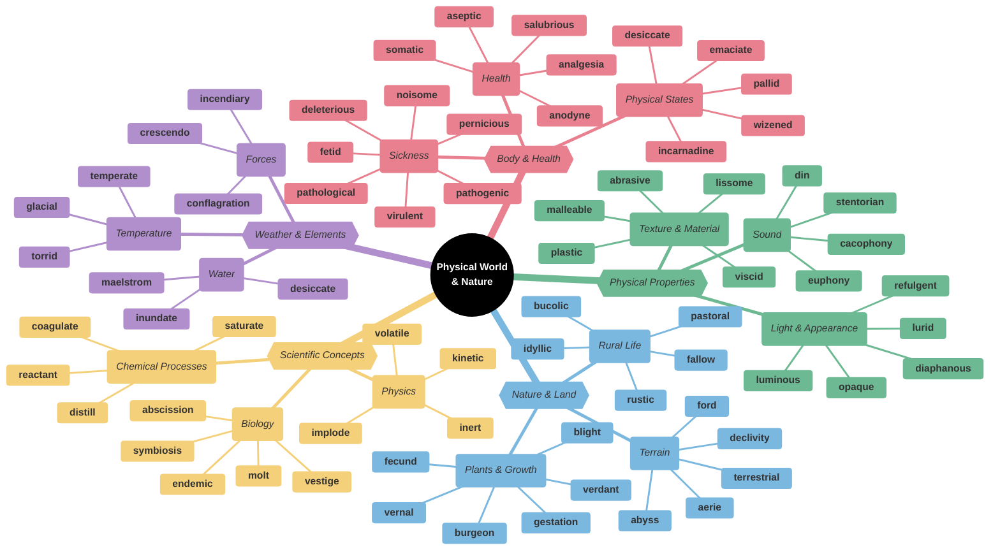
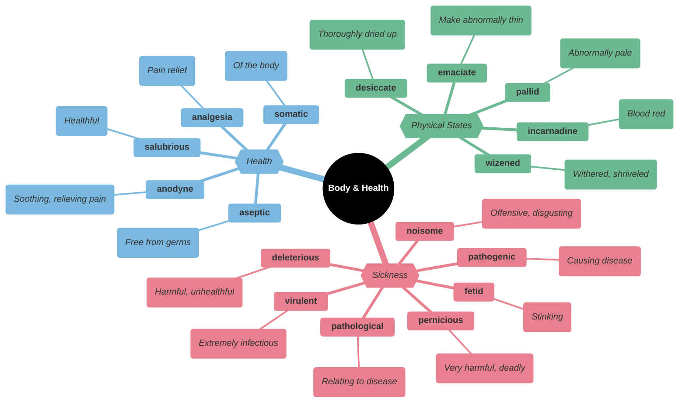
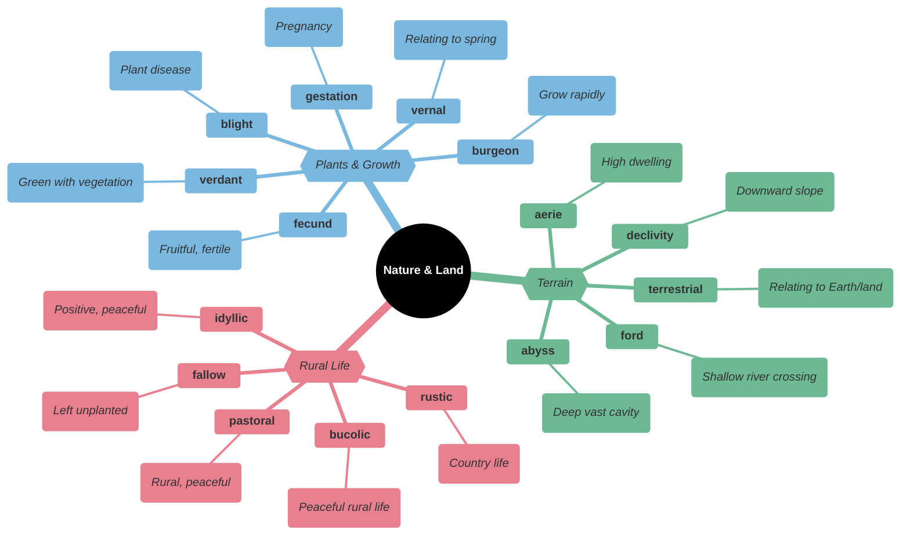
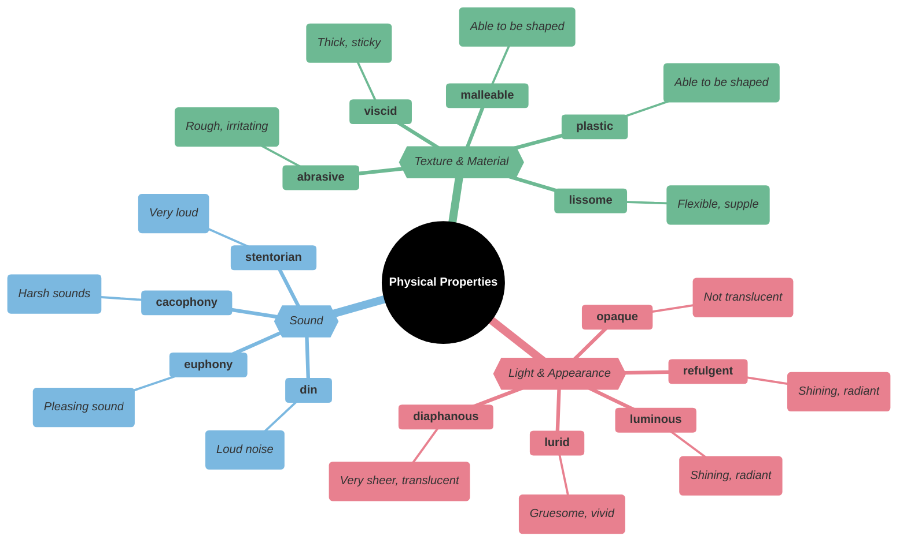
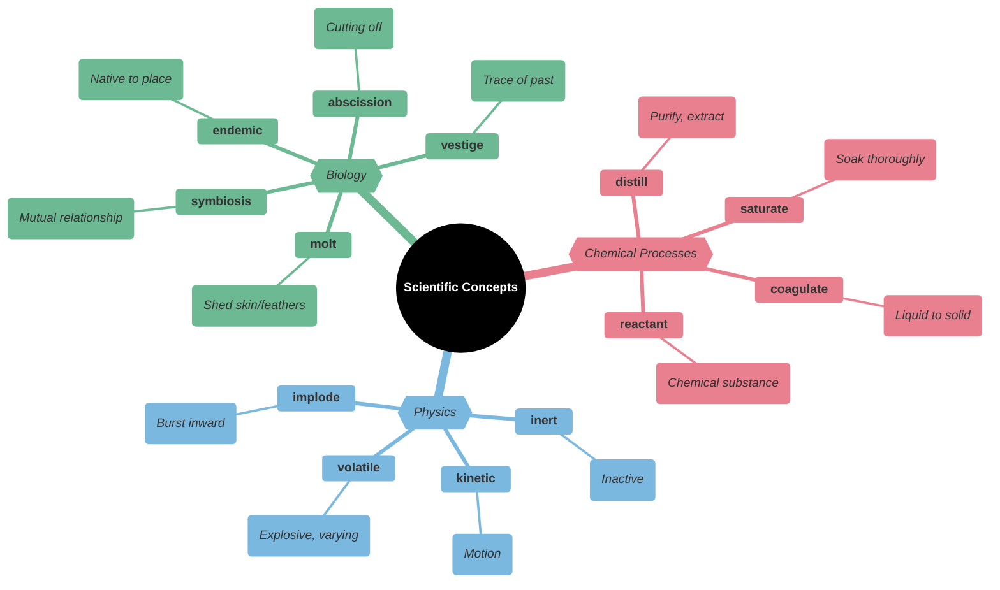
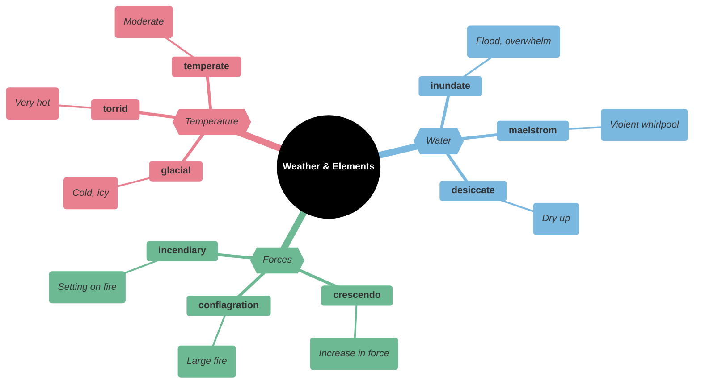
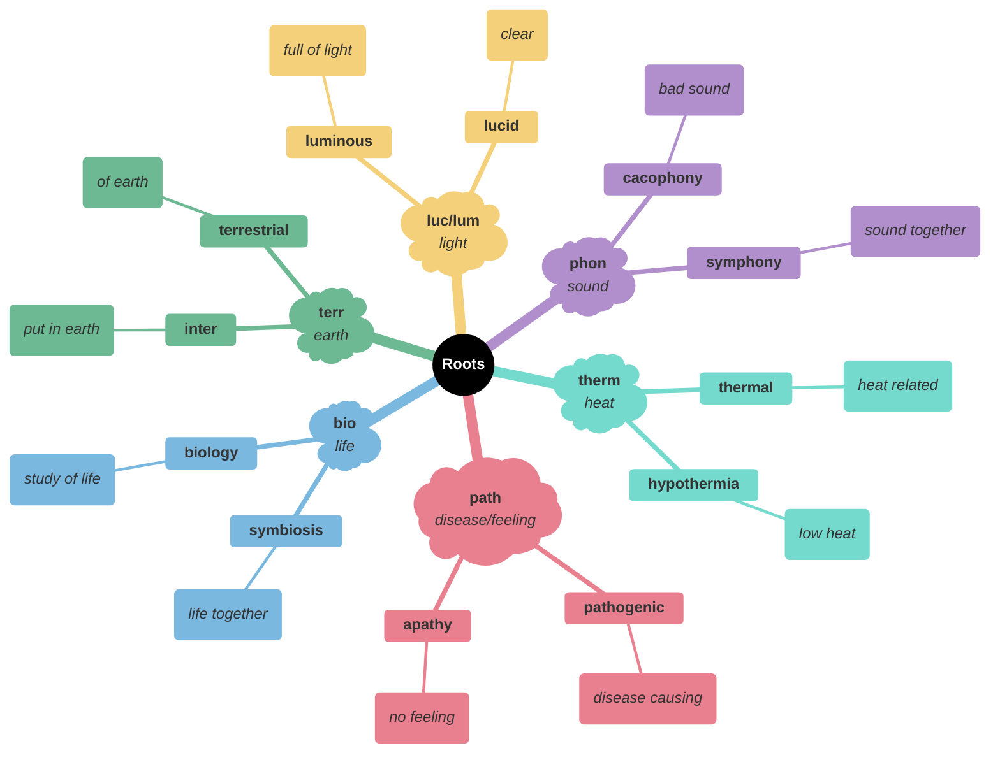

# 🌿 Physical World, Nature & Science

## 🗺️ Main Mindmap

---

## 🔍 Detailed Focus

### 🏥 Body & Health

| Word | Phonetics | Definition | Memory Hook | Example Sentence |
| --- | --- | --- | --- | --- |
| **pathogenic** | path-uh-JEN-ik | Causing disease | **PATHO-GEN**-ic → **PATHO** (disease) **GEN**erator | Bacteria and viruses are **pathogenic** organisms. |
| **pathological** | path-uh-LOJ-i-kuhl | Involving, caused by, or of the nature of a physical or mental disease | **PATHO-LOG**-ical → **PATHO** (disease) **LOG**ic | He is a **pathological** liar. |
| **virulent** | VIR-yuh-luhnt | (of a disease or poison) extremely severe or harmful in its effects | **VIRU**-lent → **VIRU**s | The **virulent** strain of the flu spread quickly. |
| **pernicious** | per-NISH-uhs | Having a harmful effect, especially in a gradual or subtle way | **PER-NIC**-ious → **NEC**ro (death) | The **pernicious** influence of the drug destroyed his life. |
| **deleterious** | del-i-TEER-ee-uhs | Causing harm or damage | **DELETE**-rious → **DELETE**s health | Smoking has a **deleterious** effect on your lungs. |
| **noisome** | NOI-suhm | Having an extremely offensive smell | **NOIS**-ome → An**NOY**s nose | The **noisome** fumes from the factory made the residents sick. |
| **fetid** | FET-id | Smelling extremely unpleasant | **FET**-id → **FEET**-id (smelly feet) | The **fetid** odor of the swamp made us gag. |
| **salubrious** | suh-LOO-bree-uhs | Health-giving; healthy | **SALU**-brious → **SALU**te (health) | The mountain air was **salubrious**. |
| **analgesia** | an-l-JEE-zee-uh | The inability to feel pain | **AN-ALGES**-ia → **AN** (no) **ALGES** (pain) | The doctor administered a drug to induce **analgesia**. |
| **anodyne** | AN-uh-dahyn | Not likely to provoke dissent or offense; inoffensive, often deliberately so; a painkilling drug or medicine | **AN-ODYNE** → **AN** (no) **DYNE** (pain) | He gave an **anodyne** speech that avoided all controversial topics. |
| **somatic** | soh-MAT-ik | Relating to the body, especially as distinct from the mind | **SOMA**-tic → **SOMA** (body) | He suffered from **somatic** symptoms of stress. |
| **aseptic** | ey-SEP-tik | Free from contamination caused by harmful bacteria, viruses, or other microorganisms | **A-SEPT**-ic → **A** (no) **SEPT**ic (infection) | The surgery was performed under **aseptic** conditions. |
| **emaciate** | ih-MEY-shee-eyt | Abnormally thin or weak, especially because of illness or a lack of food | **E-MACI**-ate → **MACI** (thin) | The rescued prisoners were **emaciated** and weak. |
| **desiccate** | DES-i-keyt | Remove the moisture from (something), typically in order to preserve it | **DES-ICCATE** → **DES**ert dry | The hot sun **desiccated** the soil. |
| **wizened** | WIZ-uhnd | Shriveled or wrinkled with age | **WIZEN**-ed → **WIZ**ard (old) | The **wizened** old woman told us stories of the past. |
| **pallid** | PAL-id | (of a person's face) pale, typically because of poor health | **PALL**-id → **PALL**or (pale) | Her face was **pallid** and drawn from her illness. |
| **incarnadine** | in-KAHR-nuh-dahyn | A bright crimson or pinkish-red color | **IN-CARNA**-dine → **IN** **CARN**e (flesh/meat) | The sunset turned the sky **incarnadine**. |

### 🌳 Nature & Land

| Word | Phonetics | Definition | Memory Hook | Example Sentence |
| --- | --- | --- | --- | --- |
| **bucolic** | byoo-KOL-ik | Relating to the pleasant aspects of the countryside and country life | **BU-COLIC** → **BU**ll in a field (peaceful) | The painting depicted a **bucolic** scene of sheep grazing in a meadow. |
| **rustic** | RUHS-tik | Relating to the countryside; rural | **RUST**-ic → **RUST**y old farm | They stayed in a **rustic** cabin in the woods. |
| **idyllic** | ahy-DIL-ik | (especially of a time or place) like an idyll; extremely happy, peaceful, or picturesque | **IDYLL**-ic → **IDLE** and perfect | They spent an **idyllic** vacation in a cottage by the sea. |
| **pastoral** | PAS-ter-uhl | (especially of land or a farm) used for or related to the keeping or grazing of sheep or cattle | **PASTOR**-al → **PASTOR** (shepherd) | The poem described a peaceful **pastoral** scene. |
| **fallow** | FAL-oh | (of farmland) plowed and harrowed but left unsown for a period in order to restore its fertility as part of a crop rotation or to avoid surplus production | **FALL**-ow → **FALL** asleep (rest) | The field lay **fallow** for a year. |
| **burgeon** | BUR-juhn | Begin to grow or increase rapidly; flourish | **BURG**-eon → **BURG**er (eating makes you grow) | The city's population **burgeoned** during the industrial revolution. |
| **blight** | blahyt | A plant disease, especially one caused by fungi such as mildews, rusts, and smuts | **B-LIGHT** → **B**ad **LIGHT** kills plants | The potato **blight** caused a famine. |
| **fecund** | FEE-kuhnd | Producing or capable of producing an abundance of offspring or new growth; fertile | **FEC**-und → **FEC**es (fertilizer) | The **fecund** soil produced a bumper crop. |
| **verdant** | VUR-dnt | (of countryside) green with grass or other rich vegetation | **VERD**-ant → **VERD**e (green) | The **verdant** hills rolled into the distance. |
| **vernal** | VUR-nl | Of, in, or appropriate to spring | **VERN**-al → **VERN**al equinox (spring) | The **vernal** flowers bloomed early this year. |
| **gestation** | je-STEY-shuhn | The process of carrying or being carried in the womb between conception and birth | **GEST**-ation → **GUEST** inside | The **gestation** period of an elephant is about 22 months. |
| **abyss** | uh-BIS | A deep or seemingly bottomless chasm | **A-BYSS** → **A** **B**ig m**ISS** (fall forever) | He stared into the **abyss** of the canyon. |
| **declivity** | dih-KLIV-i-tee | A downward slope | **DE-CLIV**-ity → **DE**cline **CLIF**f | The steep **declivity** made the hike dangerous. |
| **ford** | fawrd | A shallow place in a river or stream allowing it to be walked or driven across | **FORD** truck → Crosses river | We crossed the river at a shallow **ford**. |
| **aerie** | AIR-ee | A large nest of a bird of prey, typically built high in a tree or on a cliff | **AER**-ie → **AIR**-y home | The eagle's **aerie** was perched on a high ledge. |
| **terrestrial** | tuh-RES-tree-uhl | Of, on, or relating to the earth | **TERR**-estrial → **TERR**a (earth) | Humans are **terrestrial** animals. |

### 💎 Physical Properties

| Word | Phonetics | Definition | Memory Hook | Example Sentence |
| --- | --- | --- | --- | --- |
| **diaphanous** | dahy-AF-uh-nuhs | (especially of fabric) light, delicate, and translucent | **DIA-PHAN**-ous → **DIA** (through) **PHAN** (show) | She wore a **diaphanous** silk scarf. |
| **luminous** | LOO-muh-nuhs | Full of or shedding light; bright or shining, especially in the dark | **LUMIN**-ous → **LUM**ens (light) | The **luminous** dial of the watch glowed in the dark. |
| **refulgent** | ri-FUHL-juhnt | Shining brightly | **RE-FULG**-ent → **FULL** of light | The **refulgent** sun rose over the mountains. |
| **opaque** | oh-PEYK | Not able to be seen through; not transparent | **OPAQUE** → **O**h, **P**aint **A**ll **QUE**er (can't see) | The windows were **opaque** with dirt. |
| **lurid** | LOOR-id | Very vivid in color, especially so as to create an unpleasantly harsh or unnatural effect | **LUR**-id → **LUR**e (attract attention) | The tabloids were full of **lurid** details about the murder. |
| **cacophony** | kuh-KOF-uh-nee | A harsh, discordant mixture of sounds | **CACO-PHONY** → **CACO** (bad) **PHONY** (sound) | The **cacophony** of the city street was overwhelming. |
| **euphony** | YOO-fuh-nee | The quality of being pleasing to the ear | **EU-PHONY** → **EU** (good) **PHONY** (sound) | The poet loved the **euphony** of the words. |
| **stentorian** | sten-TAWR-ee-uhn | (of a person's voice) loud and powerful | **STENTOR**-ian → **STENTOR** (loud Greek herald) | The sergeant shouted orders in a **stentorian** voice. |
| **din** | din | A loud, unpleasant, and prolonged noise | **DIN**-ner noise | The **din** of the construction work made it impossible to concentrate. |
| **abrasive** | uh-BREY-siv | (of a substance or material) capable of polishing or cleaning a hard surface by rubbing or grinding; showing little concern for the feelings of others | **ABRAS**-ive → **A** **BRAS**s brush (rough) | His **abrasive** personality alienated his coworkers. |
| **viscid** | VIS-id | Having a glutinous or sticky consistency | **VISC**-id → **VISC**ous | The honey was thick and **viscid**. |
| **malleable** | MAL-ee-uh-buhl | (of a metal or other material) able to be hammered or pressed permanently out of shape without breaking or cracking | **MALLET**-able → Can hit with **MALLET** | Gold is a highly **malleable** metal. |
| **plastic** | PLAS-tik | (of a substance or material) easily shaped or molded | **PLAST**-ic → **PLAST**er (moldable) | Clay is a **plastic** material. |
| **lissome** | LIS-uhm | (of a person or their body) thin, supple, and graceful | **LITHE-SOME** → **LITHE** and **SOME** | The **lissome** dancer moved effortlessly across the stage. |

### 🧪 Scientific Concepts

| Word | Phonetics | Definition | Memory Hook | Example Sentence |
| --- | --- | --- | --- | --- |
| **coagulate** | koh-AG-yuh-leyt | (of a fluid, especially blood) change to a solid or semi-solid state | **COAGUL**-ate → **CLOG**-ulate | The blood began to **coagulate** around the wound. |
| **saturate** | SACH-uh-reyt | Cause (something) to become thoroughly soaked with liquid so that no more can be absorbed | **SAT**-urate → **SAT**isfied (full) | The rain **saturated** the ground. |
| **reactant** | ree-AK-tuhnt | A substance that takes part in and undergoes change during a reaction | **REACT**-ant → **REACT**s | Oxygen is a key **reactant** in combustion. |
| **distill** | dih-STIL | Purify (a liquid) by vaporizing it, then condensing it by cooling the vapor, and collecting the resulting liquid | **DISTILL** → **STILL** water (pure) | The report **distills** the main points of the conference. |
| **kinetic** | ki-NET-ik | Relating to or resulting from motion | **KINE**-tic → **KINE**ma (cinema/moving) | **Kinetic** energy is the energy of motion. |
| **inert** | in-URT | Lacking the ability or strength to move | **IN-ERT** → **IN**-**ART** (no skill/move) | The gas is chemically **inert** and rarely reacts with other substances. |
| **volatile** | VOL-uh-tl | (of a substance) easily evaporated at normal temperatures; liable to change rapidly and unpredictably | **VOL**-atile → **VOL**cano | The chemical is highly **volatile** and must be handled with care. |
| **implode** | im-PLOHD | Collapse or cause to collapse violently inwards | **IM-PLODE** → **IM** (in) ex**PLODE** | The building was demolished by **implosion**. |
| **symbiosis** | sim-bahy-OH-sis | Interaction between two different organisms living in close physical association, typically to the advantage of both | **SYM-BIO**-sis → **SYM** (together) **BIO** (life) | The clownfish and the sea anemone live in **symbiosis**. |
| **endemic** | en-DEM-ik | (of a disease or condition) regularly found among particular people or in a certain area | **EN-DEM**-ic → **IN** the **DEM**os (people) | Malaria is **endemic** in some tropical regions. |
| **molt** | mohlt | (of an animal) shed old feathers, hair, or skin, or an old shell, to make way for a new growth | **MOLT**-en → Melt away skin | The snake **molted** its skin. |
| **vestige** | VES-tij | A trace of something that is disappearing or no longer exists | **VEST**-ige → **VEST** (clothing) left behind | The appendix is a **vestige** of our evolutionary past. |
| **abscission** | ab-SISH-uhn | The natural detachment of parts of a plant, such as dead leaves and ripe fruit | **AB-SCISS**-ion → **SCISS**ors cutting off | The **abscission** of leaves occurs in autumn. |

### 🌪️ Weather & Elements

| Word | Phonetics | Definition | Memory Hook | Example Sentence |
| --- | --- | --- | --- | --- |
| **glacial** | GLEY-shuhl | Extremely cold (like a glacier) | **GLACIER**-al | She gave him a **glacial** stare. |
| **torrid** | TAWR-id | Very hot and dry | **TORR**-id → **TORR**id zone (equator) | The **torrid** heat of the desert was unbearable. |
| **temperate** | TEM-per-it | Relating to or denoting a region or climate characterized by mild temperatures | **TEMPER**-ate → **TEMPER**ed (moderate) | The island has a **temperate** climate. |
| **inundate** | IN-uhn-deyt | Overwhelm (someone) with things or people to be dealt with | **IN-UND**-ate → **UND**er waves | We were **inundated** with complaints after the broadcast. |
| **maelstrom** | MEYL-struhm | A powerful whirlpool in the sea or a river | **MAEL-STROM** → **STORM**y whirlpool | The boat was caught in a **maelstrom**. |
| **desiccate** | DES-i-keyt | Remove the moisture from (something), typically in order to preserve it | **DES-ICCATE** → **DES**ert dry | The hot sun **desiccated** the soil. |
| **crescendo** | kruh-SHEN-doh | A gradual increase in loudness in a piece of music | **CRESC**-endo → **CRE**ate **SC**ene (louder) | The music reached a deafening **crescendo**. |
| **conflagration** | kon-fluh-GREY-shuhn | An extensive fire that destroys a great deal of land or property | **CON-FLAG**-ration → **FLAG**s burning | The **conflagration** destroyed the entire forest. |
| **incendiary** | in-SEN-dee-er-ee | (of a device or attack) designed to cause fires | **IN-CEND**-iary → **CAND**le (fire) | The rebels used **incendiary** devices to burn down the building. |

---

## 🌱 Etymology & Roots

