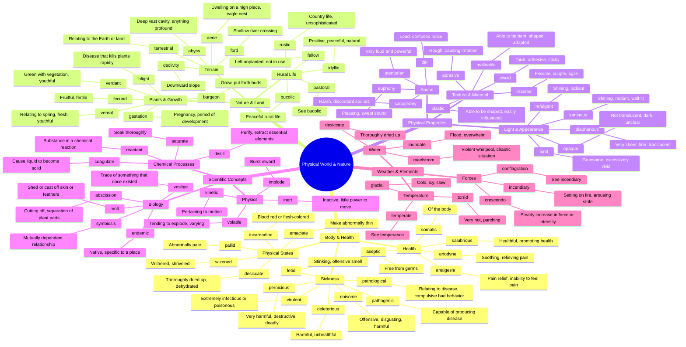

# 🌿 Physical World, Nature & Science

> GRE vocabulary for the physical world, bodily processes, nature, and scientific concepts.

## Mind Map

## Quick Memory Hooks

| Word       | Memory Hook                                          |
| ---------- | ---------------------------------------------------- |
| pathogenic | PATHO-GENIC → Generating (genic) disease (patho)     |
| salubrious | SALUBR-ious → Like a health salute, promoting health |
| diaphanous | DIA-PHAN-ous → Light shows (phainein) through        |
| virulent   | VIRU-LENT → Like a virus, extremely infectious       |
| verdant    | VERD-ant → Verde means green                         |
| symbiosis  | SYM-BIO-sis → Together (sym) life (bio)              |
| maelstrom  | MAEL-STROM → A stormy male whirlpool                 |
| desiccate  | DES-ICCATE → Desert dry, remove moisture             |
