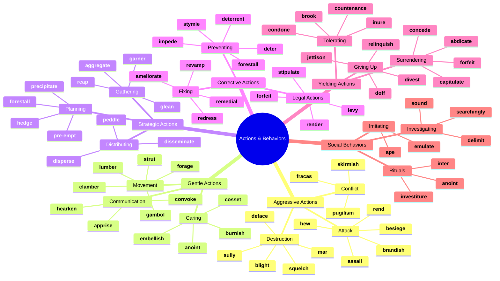
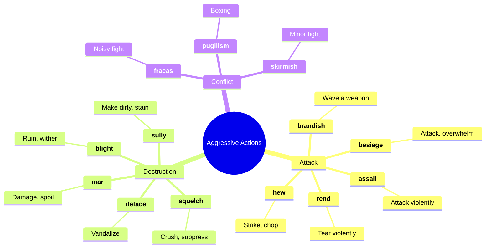
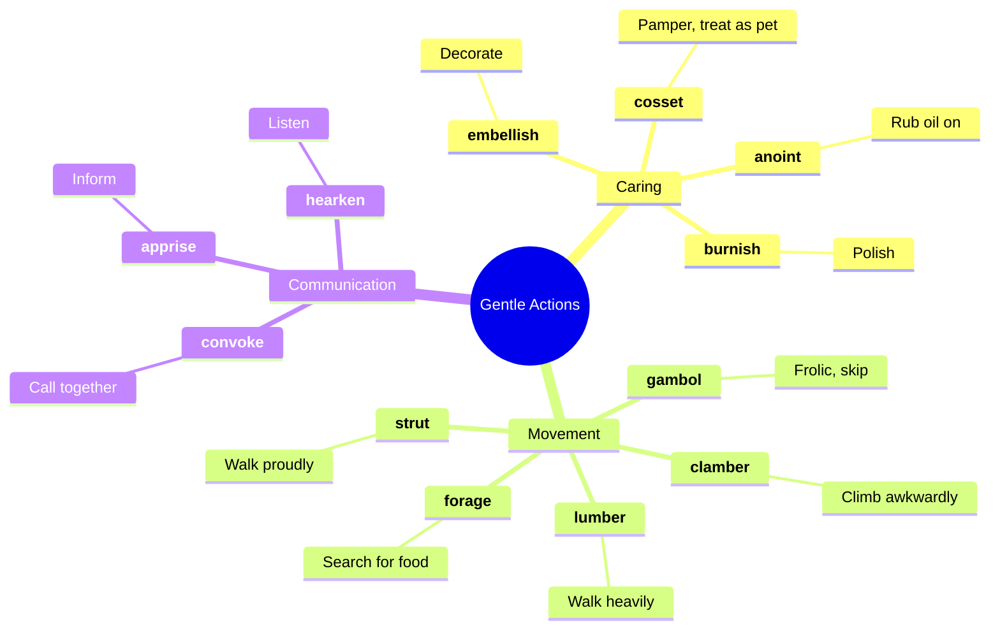
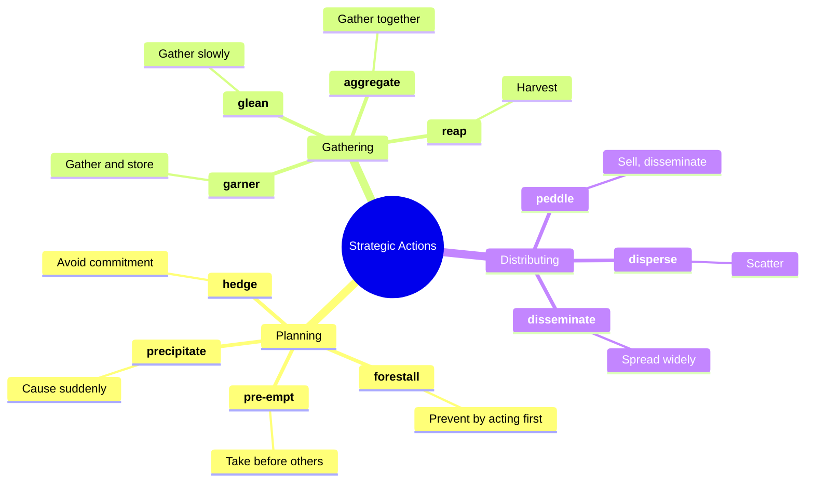
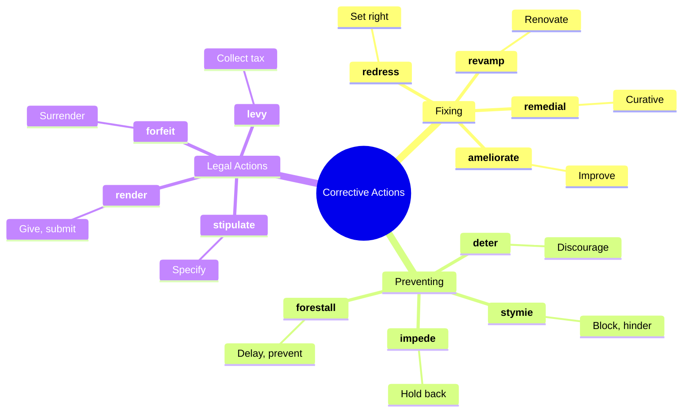
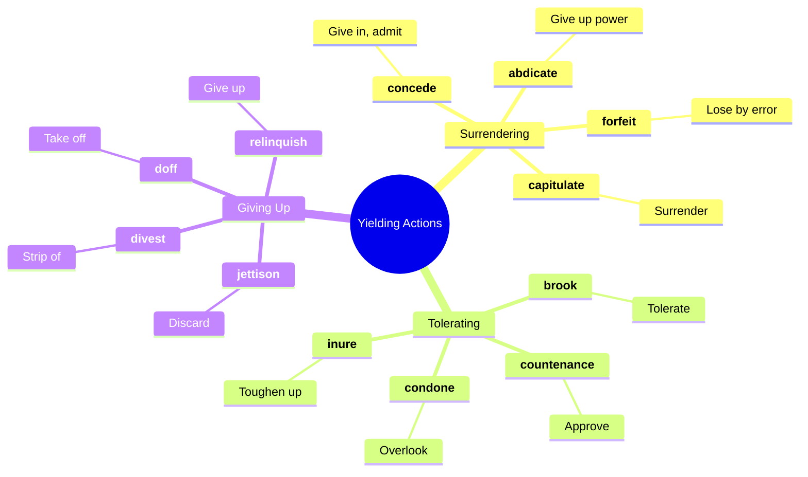
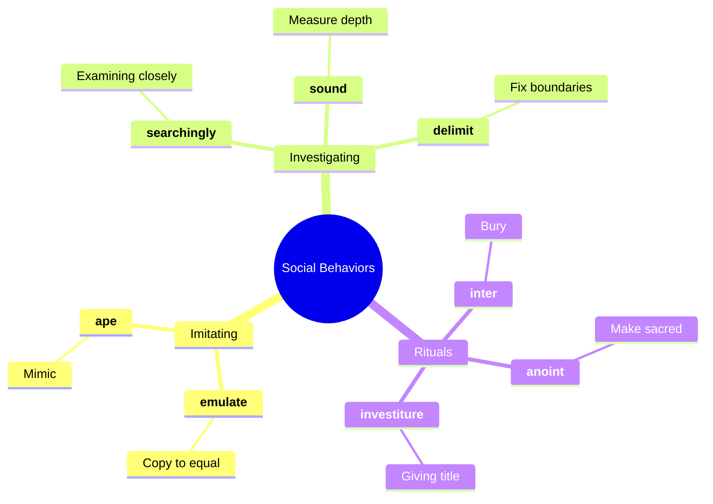
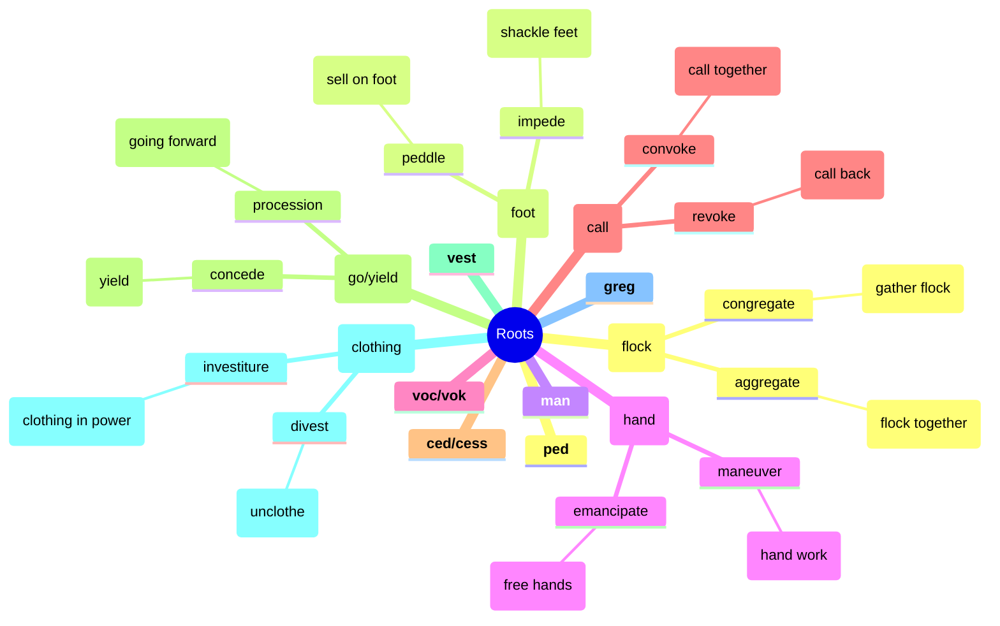

# ⚡ Actions, Behaviors & Human Conduct

## 🗺️ Main Mind Map

---

## 🔍 Detailed Focus

### ⚔️ Aggressive Actions

### 🕊️ Gentle Actions

### ♟️ Strategic Actions

### 🛠️ Corrective Actions

### 🏳️ Yielding Actions

### 🤝 Social Behaviors

---

## 📚 Vocabulary List

| Word            | Definition                                                                                                               | Memory Hook                                                       | Example Sentence                                                                 |
| --------------- | ------------------------------------------------------------------------------------------------------------------------ | ----------------------------------------------------------------- | -------------------------------------------------------------------------------- |
| **abdicate**    | (of a monarch) renounce one's throne                                                                                     | **AB-DIC**-ate → **DIC**tate away power                           | The king chose to **abdicate** rather than give up the woman he loved.           |
| **aggregate**   | Form or group into a class or cluster                                                                                    | **AGGREG**-ate → **GREG**arious (flock together)                  | The website **aggregates** news from various sources.                            |
| **ameliorate**  | Make (something bad or unsatisfactory) better                                                                            | **AMELIA-RATE** → Amelia Earhart improved the **RATE** of flight  | The new laws were designed to **ameliorate** the suffering of the poor.          |
| **anoint**      | Smear or rub with oil, typically as part of a religious ceremony                                                         | **AN-OINT**-ment → **OINT**ment                                   | The priest **anointed** the sick man with holy oil.                              |
| **ape**         | Imitate the behavior or manner of (someone or something), especially in an absurd or unthinking way                      | **APE** (monkey) → Monkey see, monkey do                          | He tried to **ape** the style of his favorite rock star.                         |
| **apprise**     | Inform or tell (someone)                                                                                                 | **APPRISE** → **A PRIZE** of information                          | Please **apprise** me of any changes to the schedule.                            |
| **assail**      | Make a concerted or violent attack on                                                                                    | **A-SAIL** → **SAIL**ing into an attack                           | The army **assailed** the fortress at dawn.                                      |
| **besiege**     | Surround (a place) with armed forces in order to capture it or force its surrender                                       | **BE-SIEGE** → **BE** in a **SIEGE**                              | The city was **besieged** for months before it finally fell.                     |
| **blight**      | Have a severely detrimental effect on                                                                                    | **B-LIGHT** → **B**ad **LIGHT** kills plants                      | The scandal **blighted** his career.                                             |
| **brandish**    | Wave or flourish (something, especially a weapon) as a threat or in anger or excitement                                  | **BRAND**-ish → **BRAND**ing a weapon                             | He **brandished** a sword at the intruders.                                      |
| **brook**       | Tolerate or allow (something, typically dissent or opposition)                                                           | **BROOK** → Don't **BROOK** the babbling **BROOK** (noise)        | The teacher would **brook** no nonsense in her classroom.                        |
| **burnish**     | Polish (something, especially metal) by rubbing                                                                          | **BURN**-ish → Rub until it **BURN**s/shines                      | He **burnished** the silver trophy until it gleamed.                             |
| **capitulate**  | Cease to resist an opponent or an unwelcome demand; surrender                                                            | **CAPIT**-ulate → **CAPIT** (head) off/bow down                   | The rebels finally **capitulated** after weeks of fighting.                      |
| **clamber**     | Climb, move, or get in or out of something in an awkward and laborious way                                               | **CLAM**-ber → **CLIMB**er                                        | The children **clambered** over the rocks.                                       |
| **concede**     | Admit that something is true or valid after first denying or resisting it                                                | **CON-CEDE** → **CEDE** (give up) the point                       | After hours of debate, he finally **conceded** that she was right.               |
| **condone**     | Accept and allow (behavior that is considered morally wrong or offensive) to continue                                    | **CON-DONE** → **DONE** with it (ignore it)                       | The school does not **condone** bullying of any kind.                            |
| **convoke**     | Call together or summon (an assembly or meeting)                                                                         | **CON-VOKE** → **VOC**al call together                            | The king **convoked** a meeting of his advisors.                                 |
| **cosset**      | Care for and protect in an overindulgent way                                                                             | **COSSET** → **C**l**OSET** (keep safe inside)                    | She **cosseted** her dog, feeding it steak and letting it sleep on the bed.      |
| **countenance** | Admit as acceptable or possible                                                                                          | **COUNT**-enance → **COUNT** on support                           | I will not **countenance** such rude behavior in my house.                       |
| **deface**      | Spoil the surface or appearance of (something), e.g., by drawing or writing on it                                        | **DE-FACE** → Ruin the **FACE**                                   | Vandals **defaced** the statue with graffiti.                                    |
| **delimit**     | Determine the limits or boundaries of                                                                                    | **DE-LIMIT** → Set **LIMIT**s                                     | The fence **delimits** the property line.                                        |
| **deter**       | Discourage (someone) from doing something, typically by instilling doubt or fear of the consequences                     | **DE-TER** → **TERR**or stops you                                 | The high fence was intended to **deter** trespassers.                            |
| **deterrent**   | A thing that discourages or is intended to discourage someone from doing something                                       | **DETER**-rent → **DETER**s you                                   | Nuclear weapons are seen as a **deterrent** to war.                              |
| **disseminate** | Spread or disperse (something, especially information) widely                                                            | **DIS-SEMIN**-ate → **SEMEN** (seeds) scattered                   | The internet allows us to **disseminate** information instantly.                 |
| **divest**      | Deprive (someone) of power, rights, or possessions                                                                       | **DI-VEST** → Take off **VEST** (clothing)                        | The company was forced to **divest** itself of its assets.                       |
| **doff**        | Remove (an item of clothing)                                                                                             | **D**-off → **D**o **OFF** (take off)                             | He **doffed** his hat to the lady.                                               |
| **embellish**   | Make (something) more attractive by the addition of decorative details or features                                       | **EM-BELL**-ish → Make **BEAU**tiful                              | She **embellished** the story with a few colorful details.                       |
| **emulate**     | Match or surpass (a person or achievement), typically by imitation                                                       | **EMUL**-ate → **E**qual **MULE** (stubbornly try to equal)       | He tried to **emulate** his father's success in business.                        |
| **forage**      | (of a person or animal) search widely for food or provisions                                                             | **FOR-AGE** → **FOR** **AGE**ing (eating to live)                 | The bears were **foraging** for berries in the woods.                            |
| **forestall**   | Prevent or obstruct (an anticipated event or action) by taking action ahead of time                                      | **FORE-STALL** → **STALL** be**FORE**                             | He tried to **forestall** the criticism by admitting his mistake early.          |
| **forfeit**     | Lose or be deprived of (property or a right or privilege) as a penalty for wrongdoing                                    | **FOR-FEIT** → **FOR** **F**ault                                  | If you cancel now, you will **forfeit** your deposit.                            |
| **fracas**      | A noisy disturbance or quarrel                                                                                           | **FRACAS** → **FRAC**ture peace                                   | The police were called to break up a **fracas** at the bar.                      |
| **gambol**      | Run or jump about playfully                                                                                              | **GAMB**-ol → **GAMB**le (play) / **GAME**-ball                   | The lambs **gamboled** in the meadow.                                            |
| **garner**      | Gather or collect (something, especially information or approval)                                                        | **GARN**-er → **GAR**de**N**er gathers                            | The movie **garnered** rave reviews from critics.                                |
| **glean**       | Extract (information) from various sources                                                                               | **GLEAN** → **CLEAN** up the leftovers                            | I managed to **glean** some information from their conversation.                 |
| **hearken**     | Listen                                                                                                                   | **HEAR**-ken → **HEAR**                                           | **Hearken** to my words!                                                         |
| **hedge**       | Limit or qualify (something) by conditions or exceptions                                                                 | **HEDGE** → Hide behind a **HEDGE**                               | He **hedged** his bets by investing in both companies.                           |
| **hew**         | Chop or cut (something, especially wood or coal) with an axe, pick, or other tool                                        | **HEW** → **H**ack and ch**EW**                                   | They **hewed** a path through the dense jungle.                                  |
| **impede**      | Delay or prevent (someone or something) by obstructing them; hinder                                                      | **IM-PED**-e → **PED**estrian in the way                          | The heavy snow **impeded** our progress.                                         |
| **inter**       | Place (a corpse) in a grave or tomb, typically with funeral rites                                                        | **IN-TER** → **IN** **TERR**a (earth)                             | He was **interred** in the family plot.                                          |
| **inure**       | Accustom (someone) to something, especially something unpleasant                                                         | **IN-URE** → **IN** **Y**o**UR** endurance                        | Living in the city had **inured** him to the noise.                              |
| **investiture** | The action of formally investing a person with honors or rank                                                            | **INVEST**-iture → **VEST** (clothing) of power                   | The **investiture** of the new prince was a grand ceremony.                      |
| **jettison**    | Throw or drop (something) from an aircraft or ship                                                                       | **JET**-ison → Throw from a **JET**                               | The captain ordered the crew to **jettison** the cargo to save the sinking ship. |
| **levy**        | Impose (a tax, fee, or fine)                                                                                             | **LEV**-y → **LEV**el a tax                                       | The government decided to **levy** a new tax on luxury goods.                    |
| **lumber**      | Move in a slow, heavy, awkward way                                                                                       | **LUMBER** → Like a log                                           | The bear **lumbered** through the woods.                                         |
| **mar**         | Impair the appearance of; disfigure                                                                                      | **MAR** → **MAR**k                                                | The table was **marred** by a deep scratch.                                      |
| **peddle**      | Try to sell (something, especially small goods) by going from house to house or place to place                           | **PED**-dle → **PED**estrian seller                               | He traveled around the country **peddling** his wares.                           |
| **precipitate** | Cause (an event or situation, typically one that is bad or undesirable) to happen suddenly, unexpectedly, or prematurely | **PRE-CIPIT**-ate → **PRE** (before) **CAPIT** (head) - headfirst | The assassination **precipitated** a world war.                                  |
| **pre-empt**    | Take action in order to prevent (an anticipated event) from happening; forestall                                         | **PRE-EMPT** → **PRE** (before) **EMPT**y (take)                  | The president's speech was **pre-empted** by breaking news.                      |
| **pugilism**    | The profession or hobby of boxing                                                                                        | **PUG**-ilism → **PUG**nacious                                    | He was a fan of **pugilism** and never missed a fight.                           |
| **reap**        | Cut or gather (a crop or harvest)                                                                                        | **REAP**-er → Grim **REAP**er gathers souls                       | Farmers **reap** what they sow.                                                  |
| **redress**     | Remedy or set right (an undesirable or unfair situation)                                                                 | **RE-DRESS** → **DRESS** the wound again                          | He sought legal **redress** for the damage to his reputation.                    |
| **relinquish**  | Voluntarily cease to keep or claim; give up                                                                              | **RE-LINQU**-ish → **LEAVE** behind                               | He **relinquished** his claim to the throne.                                     |
| **remedial**    | Giving or intended as a remedy or cure                                                                                   | **REMED**-ial → **REMED**y                                        | She needed **remedial** math classes to catch up.                                |
| **rend**        | Tear (something) into two or more pieces                                                                                 | **REND**-er → **REND**ing apart                                   | The explosion **rent** the air.                                                  |
| **render**      | Provide or give (a service, help, etc.)                                                                                  | **RENDER** → Give                                                 | The jury **rendered** a verdict of not guilty.                                   |
| **revamp**      | Give new and improved form, structure, or appearance to                                                                  | **RE-VAMP** → **VAMP**ire gets new life                           | The company plans to **revamp** its image.                                       |
| **skirmish**    | An episode of irregular or unpremeditated fighting, especially between small or outlying parts of armies or fleets       | **SKIRM**-ish → **SCREAM**ish fight                               | There was a brief **skirmish** between the two patrols.                          |
| **squelch**     | Forcefully silence or suppress                                                                                           | **SQUELCH** → **SQUASH**                                          | The government tried to **squelch** the rumors.                                  |
| **stipulate**   | Demand or specify (a requirement), typically as part of a bargain or agreement                                           | **STIPUL**-ate → **STIPUL**ation                                  | The contract **stipulates** that the work must be finished by Friday.            |
| **strut**       | Walk with a stiff, erect, and apparently arrogant or conceited gait                                                      | **STRUT** → Like a peacock                                        | He **strutted** around the room showing off his new suit.                        |
| **stymie**      | Prevent or hinder the progress of                                                                                        | **STY-MIE** → Stuck in a **STY**                                  | The investigation was **stymied** by a lack of evidence.                         |
| **sully**       | Damage the purity or integrity of; defile                                                                                | **SULLY** → **SOIL**-y                                            | The scandal **sullied** his reputation.                                          |

---

## 🌱 Etymology & Roots

