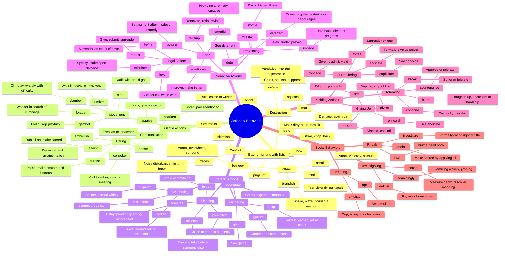

# ⚡ Actions, Behaviors & Human Conduct

> GRE vocabulary for physical actions, behaviors, and ways of conducting oneself.

## Mind Map

## Quick Memory Hooks

| Word      | Memory Hook                                       |
| --------- | ------------------------------------------------- |
| assail    | A-SAIL → Sailing into an attack                   |
| brandish  | BRAND-ish → Branding a weapon by waving it        |
| forestall | FORE-STALL → Stalling something before it happens |
| garner    | GARN-er → Gathering into a garner (barn)          |
| stymie    | STY-MIE → Like being stuck in a pigsty            |
| emulate   | EMUL-ATE → Emulating to become great              |
| redress   | RE-DRESS → Re-dressing a wrong situation          |
| inure     | IN-URE → In your endurance zone                   |
