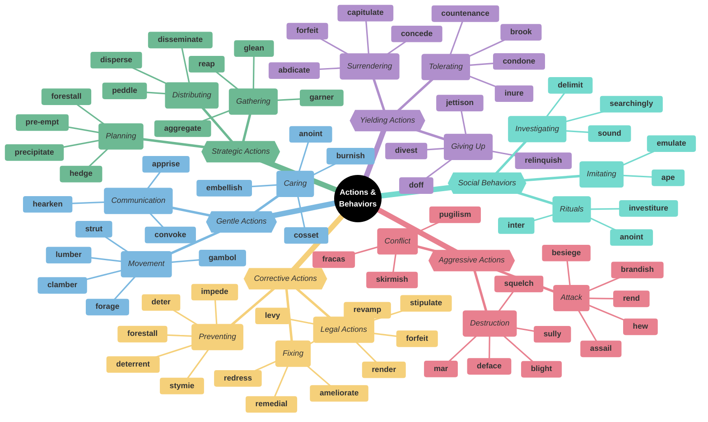
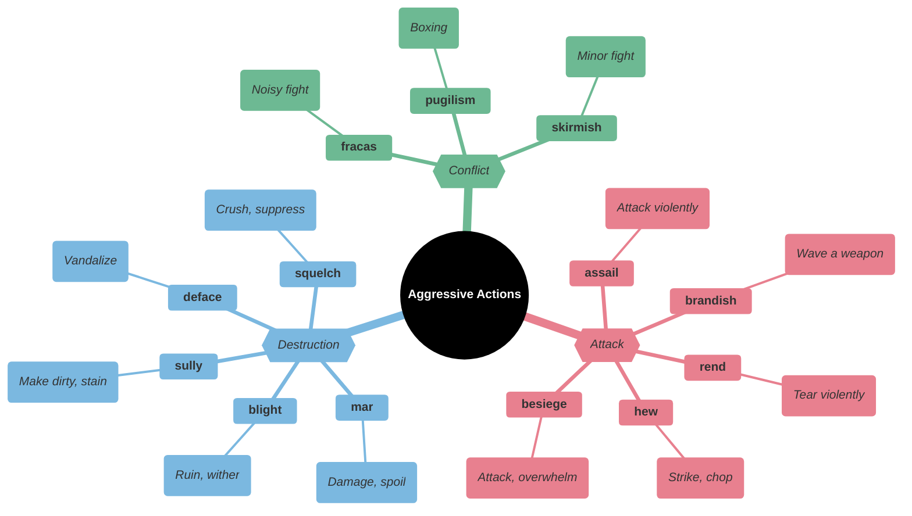
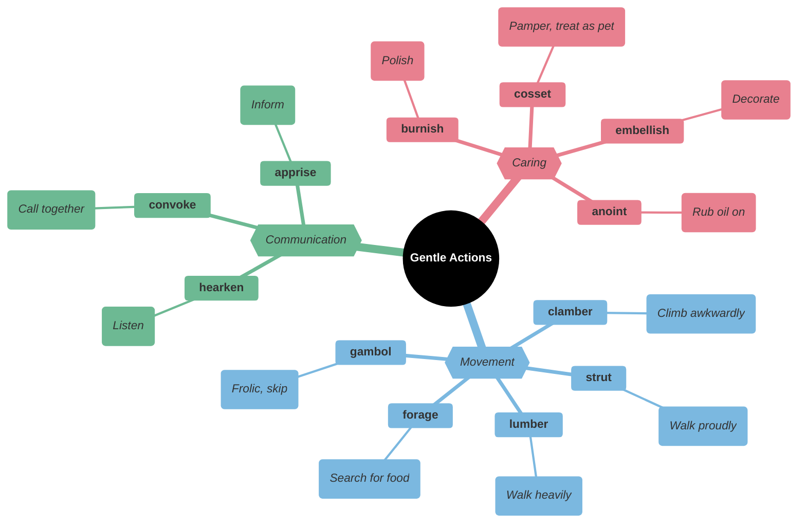
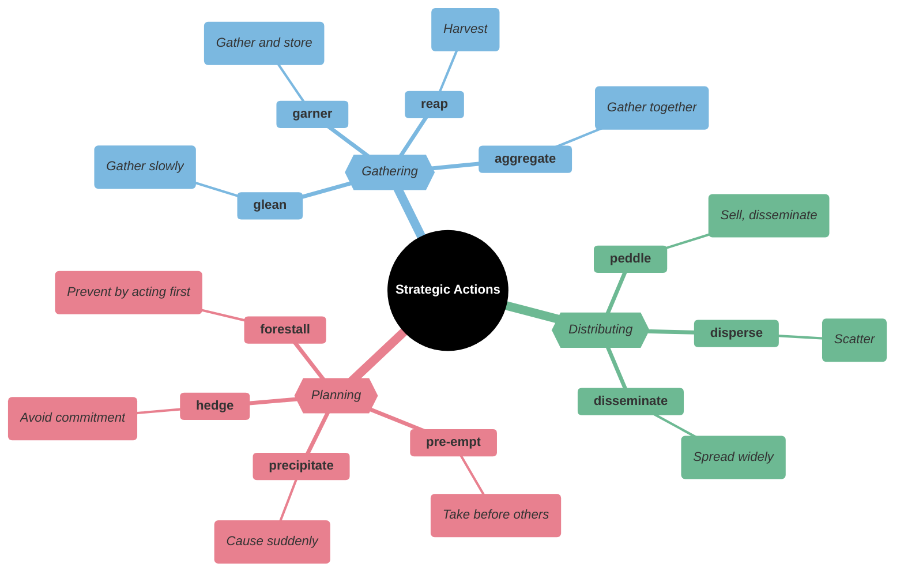
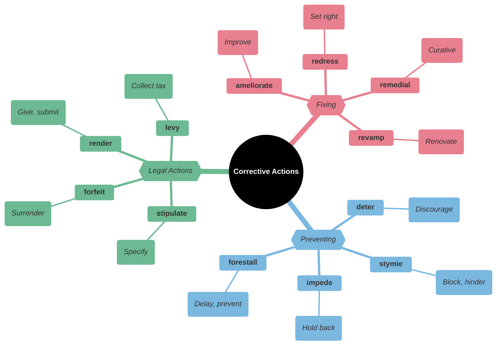
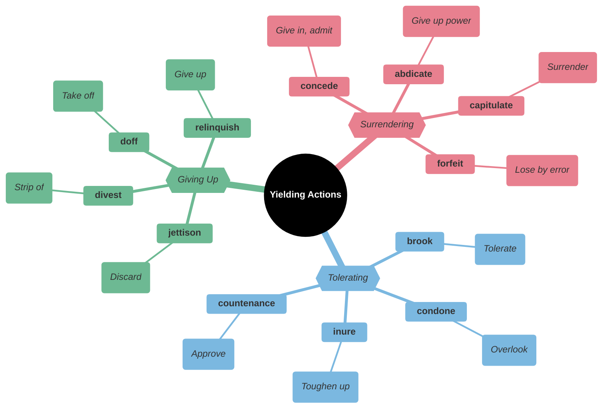
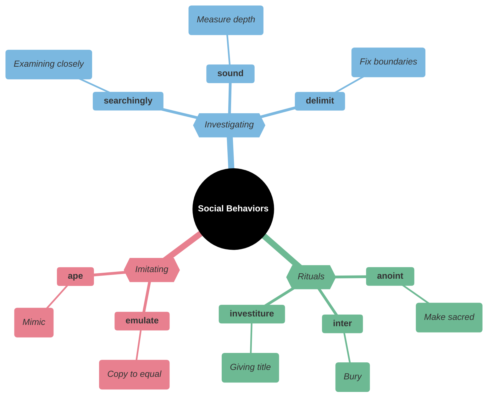
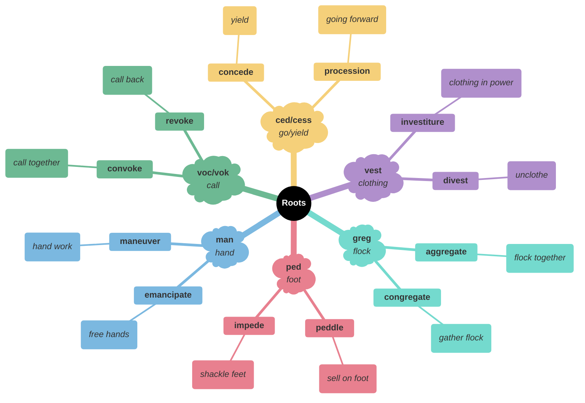

# ⚡ Actions, Behaviors & Human Conduct

## Main Mindmap

---

## Detailed Focus

### Aggressive Actions

| Word         | Phonetics | Definition                                                                                                         | Memory Hook                                  | Example Sentence                                             |
| ------------ | --- | ------------------------------------------------------------------------------------------------------------------ | -------------------------------------------- | ------------------------------------------------------------ |
| **assail**   | uh-SAIL | Make a concerted or violent attack on                                                                              | **A-SAIL** → **SAIL**ing into an attack      | The army **assailed** the fortress at dawn.                  |
| **besiege**  | bih-SEEJ | Surround (a place) with armed forces in order to capture it or force its surrender                                 | **BE-SIEGE** → **BE** in a **SIEGE**         | The city was **besieged** for months before it finally fell. |
| **brandish** | BRAN-dish | Wave or flourish (something, especially a weapon) as a threat or in anger or excitement                            | **BRAND**-ish → **BRAND**ing a weapon        | He **brandished** a sword at the intruders.                  |
| **rend**     | REND | Tear (something) into two or more pieces                                                                           | **REND**-er → **REND**ing apart              | The explosion **rent** the air.                              |
| **hew**      | HYOO | Chop or cut (something, especially wood or coal) with an axe, pick, or other tool                                  | **HEW** → **H**ack and ch**EW**              | They **hewed** a path through the dense jungle.              |
| **mar**      | MAHR | Impair the appearance of; disfigure                                                                                | **MAR** → **MAR**k                           | The table was **marred** by a deep scratch.                  |
| **deface**   | dih-FAYS | Spoil the surface or appearance of (something), e.g., by drawing or writing on it                                  | **DE-FACE** → Ruin the **FACE**              | Vandals **defaced** the statue with graffiti.                |
| **blight**   | BLYT | Have a severely detrimental effect on                                                                              | **B-LIGHT** → **B**ad **LIGHT** kills plants | The scandal **blighted** his career.                         |
| **sully**    | SUH-lee | Damage the purity or integrity of; defile                                                                          | **SULLY** → **SOIL**-y                       | The scandal **sullied** his reputation.                      |
| **squelch**  | SKWELCH | Forcefully silence or suppress                                                                                     | **SQUELCH** → **SQUASH**                     | The government tried to **squelch** the rumors.              |
| **fracas**   | FRAY-kus | A noisy disturbance or quarrel                                                                                     | **FRACAS** → **FRAC**ture peace              | The police were called to break up a **fracas** at the bar.  |
| **pugilism** | PYOO-juh-liz-uhm | The profession or hobby of boxing                                                                                  | **PUG**-ilism → **PUG**nacious               | He was a fan of **pugilism** and never missed a fight.       |
| **skirmish** | SKUR-mish | An episode of irregular or unpremeditated fighting, especially between small or outlying parts of armies or fleets | **SKIRM**-ish → **SCREAM**ish fight          | There was a brief **skirmish** between the two patrols.      |

### Gentle Actions

| Word          | Phonetics | Definition                                                                         | Memory Hook                                       | Example Sentence                                                            |
| ------------- | --- | ---------------------------------------------------------------------------------- | ------------------------------------------------- | --------------------------------------------------------------------------- |
| **cosset**    | KOS-it | Care for and protect in an overindulgent way                                       | **COSSET** → **C**l**OSET** (keep safe inside)    | She **cosseted** her dog, feeding it steak and letting it sleep on the bed. |
| **anoint**    | uh-NOINT | Smear or rub with oil, typically as part of a religious ceremony                   | **AN-OINT**-ment → **OINT**ment                   | The priest **anointed** the sick man with holy oil.                         |
| **burnish**   | BUR-nish | Polish (something, especially metal) by rubbing                                    | **BURN**-ish → Rub until it **BURN**s/shines      | He **burnished** the silver trophy until it gleamed.                        |
| **embellish** | im-BEL-ish | Make (something) more attractive by the addition of decorative details or features | **EM-BELL**-ish → Make **BEAU**tiful              | She **embellished** the story with a few colorful details.                  |
| **gambol**    | GAM-buhl | Run or jump about playfully                                                        | **GAMB**-ol → **GAMB**le (play) / **GAME**-ball   | The lambs **gamboled** in the meadow.                                       |
| **clamber**   | KLAM-ber | Climb, move, or get in or out of something in an awkward and laborious way         | **CLAM**-ber → **CLIMB**er                        | The children **clambered** over the rocks.                                  |
| **lumber**    | LUHM-ber | Move in a slow, heavy, awkward way                                                 | **LUMBER** → Like a log                           | The bear **lumbered** through the woods.                                    |
| **strut**     | STRUHT | Walk with a stiff, erect, and apparently arrogant or conceited gait                | **STRUT** → Like a peacock                        | He **strutted** around the room showing off his new suit.                   |
| **forage**    | FOR-ij | (of a person or animal) search widely for food or provisions                       | **FOR-AGE** → **FOR** **AGE**ing (eating to live) | The bears were **foraging** for berries in the woods.                       |
| **convoke**   | kuhn-VOHK | Call together or summon (an assembly or meeting)                                   | **CON-VOKE** → **VOC**al call together            | The king **convoked** a meeting of his advisors.                            |
| **apprise**   | uh-PRYZ | Inform or tell (someone)                                                           | **APPRISE** → **A PRIZE** of information          | Please **apprise** me of any changes to the schedule.                       |
| **hearken**   | HAHR-kuhn | Listen                                                                             | **HEAR**-ken → **HEAR**                           | **Hearken** to my words!                                                    |

### Strategic Actions

| Word            | Phonetics | Definition                                                                                                               | Memory Hook                                                       | Example Sentence                                                        |
| --------------- | --- | ------------------------------------------------------------------------------------------------------------------------ | ----------------------------------------------------------------- | ----------------------------------------------------------------------- |
| **forestall**   | for-STAWL | Prevent or obstruct (an anticipated event or action) by taking action ahead of time                                      | **FORE-STALL** → **STALL** be**FORE**                             | He tried to **forestall** the criticism by admitting his mistake early. |
| **pre-empt**    | pree-EMPT | Take action in order to prevent (an anticipated event) from happening; forestall                                         | **PRE-EMPT** → **PRE** (before) **EMPT**y (take)                  | The president's speech was **pre-empted** by breaking news.             |
| **precipitate** | prih-SIP-i-teyt | Cause (an event or situation, typically one that is bad or undesirable) to happen suddenly, unexpectedly, or prematurely | **PRE-CIPIT**-ate → **PRE** (before) **CAPIT** (head) - headfirst | The assassination **precipitated** a world war.                         |
| **hedge**       | HEJ | Limit or qualify (something) by conditions or exceptions                                                                 | **HEDGE** → Hide behind a **HEDGE**                               | He **hedged** his bets by investing in both companies.                  |
| **garner**      | GAHR-ner | Gather or collect (something, especially information or approval)                                                        | **GARN**-er → **GAR**de**N**er gathers                            | The movie **garnered** rave reviews from critics.                       |
| **glean**       | GLEEN | Extract (information) from various sources                                                                               | **GLEAN** → **CLEAN** up the leftovers                            | I managed to **glean** some information from their conversation.        |
| **reap**        | REEP | Cut or gather (a crop or harvest)                                                                                        | **REAP**-er → Grim **REAP**er gathers souls                       | Farmers **reap** what they sow.                                         |
| **aggregate**   | AG-ri-geyt | Form or group into a class or cluster                                                                                    | **AGGREG**-ate → **GREG**arious (flock together)                  | The website **aggregates** news from various sources.                   |
| **peddle**      | PED-l | Try to sell (something, especially small goods) by going from house to house or place to place                           | **PED**-dle → **PED**estrian seller                               | He traveled around the country **peddling** his wares.                  |
| **disperse**    | dih-SPURS | Scatter                                                                                                                  |                                                                   | The police used tear gas to **disperse** the crowd.                     |
| **disseminate** | dih-SEM-i-neyt | Spread or disperse (something, especially information) widely                                                            | **DIS-SEMIN**-ate → **SEMEN** (seeds) scattered                   | The internet allows us to **disseminate** information instantly.        |

### Corrective Actions

| Word           | Phonetics | Definition                                                                                           | Memory Hook                                                      | Example Sentence                                                        |
| -------------- | --- | ---------------------------------------------------------------------------------------------------- | ---------------------------------------------------------------- | ----------------------------------------------------------------------- |
| **redress**    | ri-DRES | Remedy or set right (an undesirable or unfair situation)                                             | **RE-DRESS** → **DRESS** the wound again                         | He sought legal **redress** for the damage to his reputation.           |
| **remedial**   | ri-MEE-dee-uhl | Giving or intended as a remedy or cure                                                               | **REMED**-ial → **REMED**y                                       | She needed **remedial** math classes to catch up.                       |
| **revamp**     | ree-VAMP | Give new and improved form, structure, or appearance to                                              | **RE-VAMP** → **VAMP**ire gets new life                          | The company plans to **revamp** its image.                              |
| **ameliorate** | uh-MEEL-yuh-reyt | Make (something bad or unsatisfactory) better                                                        | **AMELIA-RATE** → Amelia Earhart improved the **RATE** of flight | The new laws were designed to **ameliorate** the suffering of the poor. |
| **deter**      | dih-TUR | Discourage (someone) from doing something, typically by instilling doubt or fear of the consequences | **DE-TER** → **TERR**or stops you                                | The high fence was intended to **deter** trespassers.                   |
| **stymie**     | STY-mee | Prevent or hinder the progress of                                                                    | **STY-MIE** → Stuck in a **STY**                                 | The investigation was **stymied** by a lack of evidence.                |
| **impede**     | im-PEED | Delay or prevent (someone or something) by obstructing them; hinder                                  | **IM-PED**-e → **PED**estrian in the way                         | The heavy snow **impeded** our progress.                                |
| **forestall**  | for-STAWL | Prevent or obstruct (an anticipated event or action) by taking action ahead of time                  | **FORE-STALL** → **STALL** be**FORE**                            | He tried to **forestall** the criticism by admitting his mistake early. |
| **stipulate**  | STIP-yuh-leyt | Demand or specify (a requirement), typically as part of a bargain or agreement                       | **STIPUL**-ate → **STIPUL**ation                                 | The contract **stipulates** that the work must be finished by Friday.   |
| **forfeit**    | FOR-fit | Lose or be deprived of (property or a right or privilege) as a penalty for wrongdoing                | **FOR-FEIT** → **FOR** **F**ault                                 | If you cancel now, you will **forfeit** your deposit.                   |
| **render**     | REN-der | Provide or give (a service, help, etc.)                                                              | **RENDER** → Give                                                | The jury **rendered** a verdict of not guilty.                          |
| **levy**       | LEV-ee | Impose (a tax, fee, or fine)                                                                         | **LEV**-y → **LEV**el a tax                                      | The government decided to **levy** a new tax on luxury goods.           |

### Yielding Actions

| Word            | Phonetics | Definition                                                                            | Memory Hook                                                | Example Sentence                                                                 |
| --------------- | --- | ------------------------------------------------------------------------------------- | ---------------------------------------------------------- | -------------------------------------------------------------------------------- |
| **concede**     | kuhn-SEED | Admit that something is true or valid after first denying or resisting it             | **CON-CEDE** → **CEDE** (give up) the point                | After hours of debate, he finally **conceded** that she was right.               |
| **abdicate**    | AB-di-keyt | (of a monarch) renounce one's throne                                                  | **AB-DIC**-ate → **DIC**tate away power                    | The king chose to **abdicate** rather than give up the woman he loved.           |
| **capitulate**  | kuh-PICH-uh-leyt | Cease to resist an opponent or an unwelcome demand; surrender                         | **CAPIT**-ulate → **CAPIT** (head) off/bow down            | The rebels finally **capitulated** after weeks of fighting.                      |
| **forfeit**     | FOR-fit | Lose or be deprived of (property or a right or privilege) as a penalty for wrongdoing | **FOR-FEIT** → **FOR** **F**ault                           | If you cancel now, you will **forfeit** your deposit.                            |
| **brook**       | BRUK | Tolerate or allow (something, typically dissent or opposition)                        | **BROOK** → Don't **BROOK** the babbling **BROOK** (noise) | The teacher would **brook** no nonsense in her classroom.                        |
| **condone**     | kuhn-DOHN | Accept and allow (behavior that is considered morally wrong or offensive) to continue | **CON-DONE** → **DONE** with it (ignore it)                | The school does not **condone** bullying of any kind.                            |
| **countenance** | KOUN-tn-uhns | Admit as acceptable or possible                                                       | **COUNT**-enance → **COUNT** on support                    | I will not **countenance** such rude behavior in my house.                       |
| **inure**       | in-YOOR | Accustom (someone) to something, especially something unpleasant                      | **IN-URE** → **IN** **Y**o**UR** endurance                 | Living in the city had **inured** him to the noise.                              |
| **jettison**    | JET-i-suhn | Throw or drop (something) from an aircraft or ship                                    | **JET**-ison → Throw from a **JET**                        | The captain ordered the crew to **jettison** the cargo to save the sinking ship. |
| **divest**      | dy-VEST | Deprive (someone) of power, rights, or possessions                                    | **DI-VEST** → Take off **VEST** (clothing)                 | The company was forced to **divest** itself of its assets.                       |
| **doff**        | DOF | Remove (an item of clothing)                                                          | **D**-off → **D**o **OFF** (take off)                      | He **doffed** his hat to the lady.                                               |
| **relinquish**  | ri-LING-kwish | Voluntarily cease to keep or claim; give up                                           | **RE-LINQU**-ish → **LEAVE** behind                        | He **relinquished** his claim to the throne.                                     |

### Social Behaviors

| Word            | Phonetics | Definition                                                                                          | Memory Hook                                                 | Example Sentence                                            |
| --------------- | --- | --------------------------------------------------------------------------------------------------- | ----------------------------------------------------------- | ----------------------------------------------------------- |
| **emulate**     | EM-yuh-leyt | Match or surpass (a person or achievement), typically by imitation                                  | **EMUL**-ate → **E**qual **MULE** (stubbornly try to equal) | He tried to **emulate** his father's success in business.   |
| **ape**         | EYP | Imitate the behavior or manner of (someone or something), especially in an absurd or unthinking way | **APE** (monkey) → Monkey see, monkey do                    | He tried to **ape** the style of his favorite rock star.    |
| **searchingly** | SUR-ching-lee | Examining closely                                                                                   |                                                             | He looked at me **searchingly**.                            |
| **sound**       | SOUND | Measure depth                                                                                       |                                                             | They **sound** the depths of the ocean.                     |
| **delimit**     | dih-LIM-it | Determine the limits or boundaries of                                                               | **DE-LIMIT** → Set **LIMIT**s                               | The fence **delimits** the property line.                   |
| **anoint**      | uh-NOINT | Smear or rub with oil, typically as part of a religious ceremony                                    | **AN-OINT**-ment → **OINT**ment                             | The priest **anointed** the sick man with holy oil.         |
| **inter**       | in-TUR | Place (a corpse) in a grave or tomb, typically with funeral rites                                   | **IN-TER** → **IN** **TERR**a (earth)                       | He was **interred** in the family plot.                     |
| **investiture** | in-VES-ti-cher | The action of formally investing a person with honors or rank                                       | **INVEST**-iture → **VEST** (clothing) of power             | The **investiture** of the new prince was a grand ceremony. |

## Etymology & Roots

