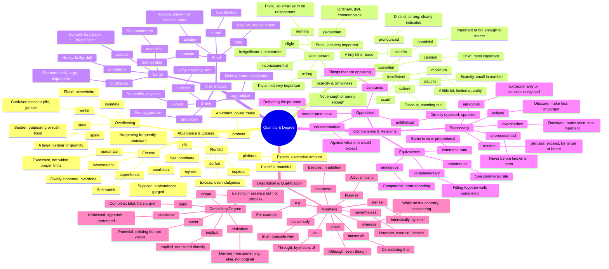

# 📏 Quantity, Size, Degree & Comparisons

> GRE vocabulary for amounts, extremes, significance, and comparative relationships.

## Mind Map

## Quick Memory Hooks

| Word         | Memory Hook                                                    |
| ------------ | -------------------------------------------------------------- |
| paucity      | PAUCI-ty → PAUPER city, scarcity                               |
| plethora     | PLETH-ora → PLENTY + more = excess                             |
| prodigious   | PRODIG-ious → A prodigy is extraordinarily impressive          |
| commensurate | CO-MENSUR-ate → Measuring (mensur) together, proportional      |
| egregious    | E-GREG-ious → Outside (e) the flock (greg), standing out badly |
| salient      | SALI-ent → Leaping (sali) out, standing out                    |
| scintilla    | SCINTILL-a → A tiny scintillating sparkle                      |
| nominal      | NOMIN-al → In name (nomin) only                                |
