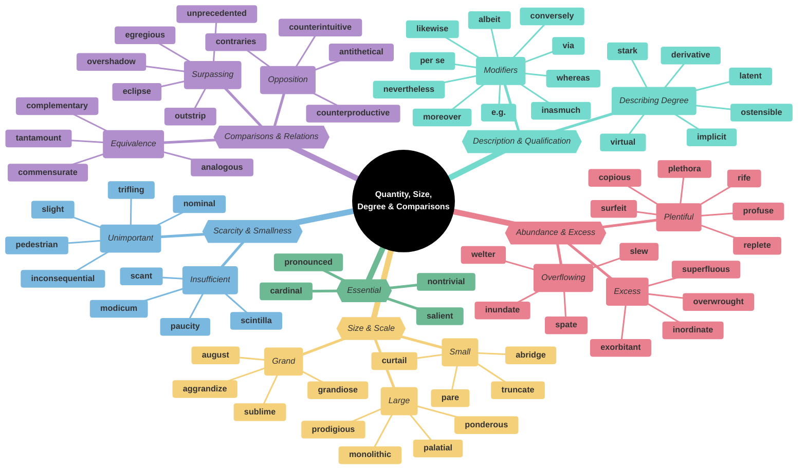
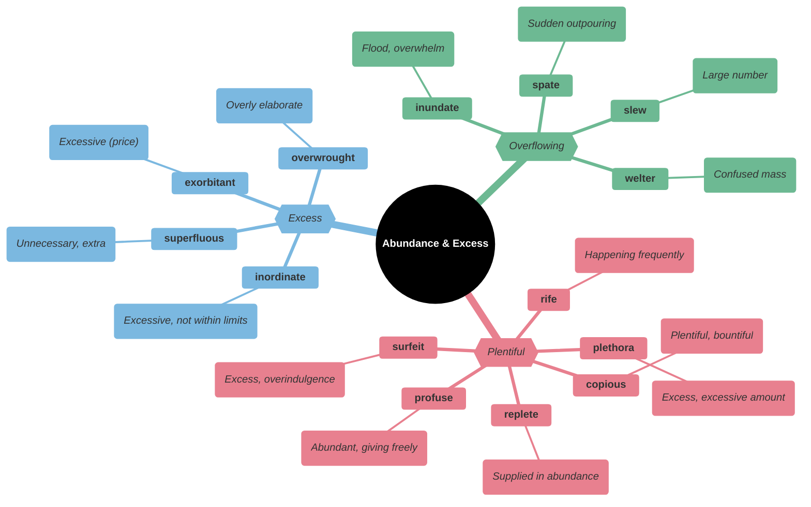
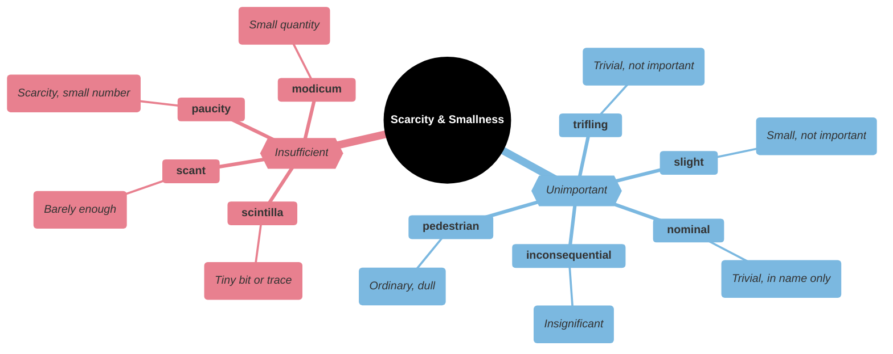
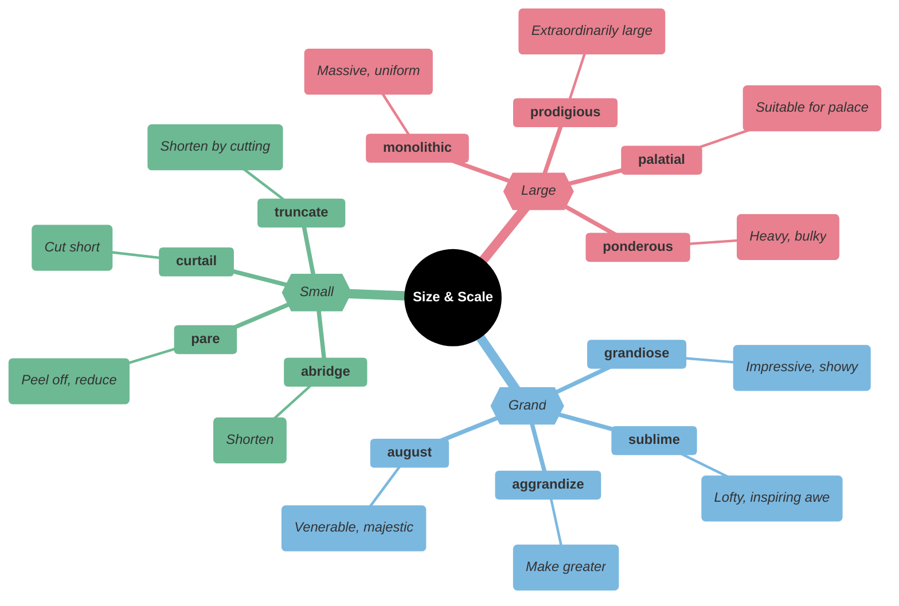
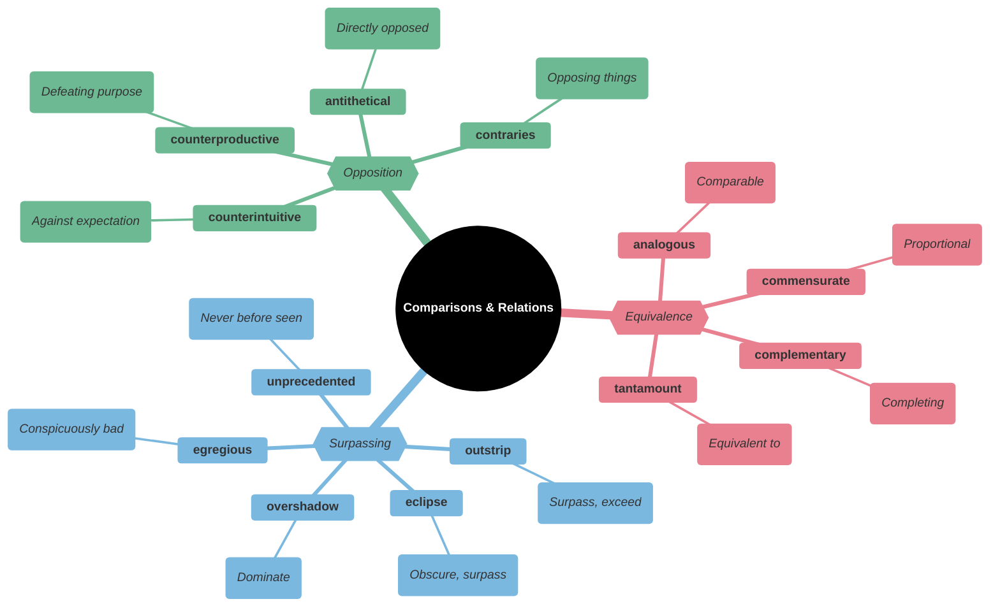
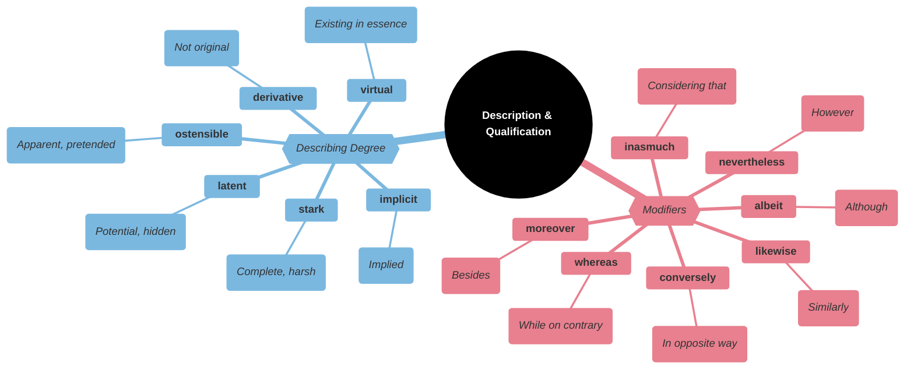
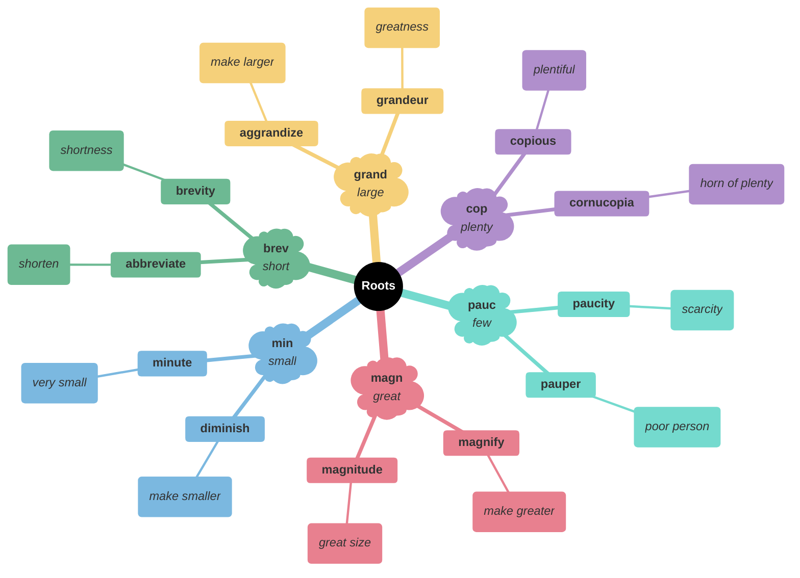

# 📏 Quantity, Size, Degree & Comparisons

## Main Mindmap

---

## Detailed Focus

### Abundance & Excess

| Word            | Phonetics         | Definition                                                                                      | Memory Hook                                           | Example Sentence                                                |
| --------------- | ----------------- | ----------------------------------------------------------------------------------------------- | ----------------------------------------------------- | --------------------------------------------------------------- |
| **copious**     | KOH-pee-uhs       | Abundant in supply or quantity                                                                  | **COPY**-ous → Make many **COPIES**                   | She took **copious** notes during the lecture.                  |
| **replete**     | ri-PLEET          | Filled or well-supplied with something                                                          | **REPLETE** → **RE**-com**PLETE**                     | The book is **replete** with photographs and illustrations.     |
| **plethora**    | PLETH-er-uh       | A large or excessive amount of (something)                                                      | **PLETH**-ora → **PLENT**y                            | There is a **plethora** of diet books on the market.            |
| **surfeit**     | SUR-fit           | An excessive amount of something                                                                | **SUR-FEIT** → **SUR** (over) **FEIT** (done)         | We had a **surfeit** of food after the party.                   |
| **profuse**     | proh-FYOOS        | (especially of something offered or discharged) exuberantly plentiful; abundant                 | **PRO-FUSE** → **FUSE** (pour) forth                  | She offered **profuse** apologies for being late.               |
| **rife**        | RAHYF             | (especially of something undesirable or harmful) of common occurrence; widespread               | **RIFE** → **RIV**er of it                            | The city was **rife** with crime.                               |
| **inordinate**  | in-OR-dn-it       | Unusually or disproportionately large; excessive                                                | **IN-ORDIN**-ate → Not **ORDIN**ary (too much)        | He spends an **inordinate** amount of time playing video games. |
| **exorbitant**  | ig-ZOR-bi-tuhnt   | (of a price or amount charged) unreasonably high                                                | **EX-ORBIT**-ant → Out of **ORBIT** (way too high)    | The hotel charged **exorbitant** prices for room service.       |
| **superfluous** | soo-PUR-floo-uhs  | Unnecessary, especially through being more than enough                                          | **SUPER-FLU**-ous → **SUPER** (over) **FLOW**ing      | The extra comments were **superfluous**.                        |
| **overwrought** | OH-ver-rawt       | (of a piece of writing or a work of art) too elaborate or complicated in design or construction | **OVER-WROUGHT** → **OVER**-worked                    | The prose was **overwrought** and difficult to read.            |
| **inundate**    | IN-uhn-deyt       | Overwhelm (someone) with things or people to be dealt with                                      | **IN-UND**-ate → **UND**er waves                      | We were **inundated** with complaints after the broadcast.      |
| **spate**       | SPEYT             | A large number of similar things or events appearing or occurring in quick succession           | **SPATE** → **SPIT** out a lot                        | There has been a **spate** of burglaries in the neighborhood.   |
| **slew**        | SLOO              | A large number or quantity of something                                                         | **SLEW** → **SL**id a whole lot                       | A whole **slew** of problems arose.                             |
| **welter**      | WEL-ter           | A large number of items in no order; a confused mass                                            | **WELTER** → **WELTER**weight boxing (confused fight) | A **welter** of conflicting evidence.                           |

### Scarcity & Smallness

| Word                | Phonetics           | Definition                                                                                    | Memory Hook                                 | Example Sentence                                                                        |
| ------------------- | ------------------- | --------------------------------------------------------------------------------------------- | ------------------------------------------- | --------------------------------------------------------------------------------------- |
| **scant**           | SKANT               | Barely sufficient or adequate                                                                 | **SCANT** → **SCANT**y                      | There was **scant** evidence to support the claim.                                      |
| **paucity**         | PAW-si-tee          | The presence of something only in small or insufficient quantities or amounts; scarcity       | **PAUCI**-ty → **PAU**per city              | There is a **paucity** of information on the subject.                                   |
| **modicum**         | MOD-i-kuhm          | A small quantity of a particular thing, especially something considered desirable or valuable | **MOD**-icum → **MOD**erate amount          | He didn't even have a **modicum** of common sense.                                      |
| **scintilla**       | sin-TIL-uh          | A tiny trace or spark of a specified quality or feeling                                       | **SCINTILL**-a → **SCINTILL**ating spark    | There is not a **scintilla** of truth in his statement.                                 |
| **nominal**         | NOM-uh-nl           | (of a role or status) existing in name only                                                   | **NOMIN**-al → **NAME** only                | He is the **nominal** head of the organization, but his deputy makes all the decisions. |
| **trifling**        | TRAHY-fling         | Unimportant or trivial                                                                        | **TRIFL**-ing → **TRIFLE** (small dessert)  | It was a **trifling** matter that we shouldn't worry about.                             |
| **slight**          | SLYT                | Small in degree; inconsiderable                                                               | **SLIGHT** → **LIGHT** weight               | There is a **slight** chance of rain.                                                   |
| **inconsequential** | in-kon-si-KWEN-shuhl| Not important or significant                                                                  | **IN-CONSEQUENT**-ial → No **CONSEQUENC**es | The error was **inconsequential** and didn't affect the outcome.                        |
| **pedestrian**      | puh-DES-tree-uhn    | Lacking inspiration or excitement; dull                                                       | **PED**-estrian → On foot (slow/boring)     | His writing style is rather **pedestrian**.                                             |

### Size & Scale

| Word           | Phonetics         | Definition                                                                              | Memory Hook                                          | Example Sentence                                                   |
| -------------- | ----------------- | --------------------------------------------------------------------------------------- | ---------------------------------------------------- | ------------------------------------------------------------------ |
| **prodigious** | pruh-DIJ-uhs      | Remarkably or impressively great in extent, size, or degree                             | **PRODIG**-ious → **PRODIGY** (amazing)              | He had a **prodigious** appetite.                                  |
| **palatial**   | puh-LEY-shuhl     | Resembling a palace in being spacious and splendid                                      | **PALAT**-ial → **PALAC**e-ial                       | The hotel had a **palatial** lobby with marble floors.             |
| **ponderous**  | PON-der-uhs       | Slow and clumsy because of great weight                                                 | **POND**-erous → **POUND**s (heavy)                  | The elephant made **ponderous** movements.                         |
| **monolithic** | mon-uh-LITH-ik    | (of an organization or system) large, powerful, and intractably indivisible and uniform | **MONO-LITH**-ic → **ONE STONE** (huge block)        | The **monolithic** corporation dominated the market.               |
| **grandiose**  | GRAN-dee-ohs      | Impressive or magnificent in appearance or style, especially pretentiously so           | **GRAND**-iose → **GRAND**                           | He had **grandiose** plans for building a castle.                  |
| **aggrandize** | uh-GRAND-ahyz     | Increase the power, status, or wealth of                                                | **AG-GRAND**-ize → Make **GRAND**er                  | The dictator sought to **aggrandize** himself by building statues. |
| **sublime**    | suh-BLAHYM        | Of such excellence, grandeur, or beauty as to inspire great admiration or awe           | **SUB-LIME** → Under the **LIME**light of god        | The view from the mountain top was absolutely **sublime**.         |
| **august**     | aw-GUHST          | Respected and impressive                                                                | **AUGUST** (month) → Named after **AUGUST**us Caesar | The **august** body of the Supreme Court made the decision.        |
| **abridge**    | uh-BRIJ           | Shorten (a book, movie, speech, or other text) without losing the sense                 | **A-BRIDGE** → A **BRIDGE** shortens the path        | The publisher decided to **abridge** the lengthy novel.            |
| **pare**       | PAIR              | Trim (something) by cutting away its outer edges                                        | **PARE** → **PEAR** (peel it)                        | We need to **pare** down our expenses.                             |
| **curtail**    | ker-TEYL          | Reduce in extent or quantity; impose a restriction on                                   | **CUR-TAIL** → **CUT** the **TAIL**                  | We had to **curtail** our vacation because of the storm.           |
| **truncate**   | TRUHNG-keyt       | Shorten (something) by cutting off the top or the end                                   | **TRUNC**-ate → **TRUNK** (cut tree)                 | The meeting was **truncated** due to the fire alarm.               |

### Comparisons & Relations

| Word                  | Phonetics             | Definition                                                                                                                                        | Memory Hook                                                        | Example Sentence                                                                                         |
| --------------------- | --------------------- | ------------------------------------------------------------------------------------------------------------------------------------------------- | ------------------------------------------------------------------ | -------------------------------------------------------------------------------------------------------- |
| **commensurate**      | kuh-MEN-ser-it        | Corresponding in size or degree; in proportion                                                                                                    | **CO-MENSUR**-ate → **MENSUR** (measure) together                  | Her salary is **commensurate** with her experience and skills.                                           |
| **complementary**     | kom-pluh-MEN-tuh-ree  | Combining in such a way as to enhance or emphasize the qualities of each other or another                                                         | **COMPLEMENT**-ary → **COMPLET**es                                 | The wine and cheese were **complementary** flavors.                                                      |
| **analogous**         | uh-NAL-uh-guhs        | Comparable in certain respects                                                                                                                    | **ANA-LOG**-ous → **ANA**logy                                      | The relationship between a ruler and his subjects is **analogous** to that of a father and his children. |
| **tantamount**        | TAN-tuh-mount         | Equivalent in seriousness to; virtually the same as                                                                                               | **TANT-AMOUNT** → **T**hat **AMOUNT**                              | His silence was **tantamount** to a confession.                                                          |
| **outstrip**          | out-STRIP             | Move faster than and overtake (someone else)                                                                                                      | **OUT-STRIP** → **STRIP** past                                     | Demand for the new product **outstripped** supply.                                                       |
| **eclipse**           | ih-KLIPS              | (of a celestial body) obscure the light from or to (another celestial body); deprive (someone or something) of significance, power, or prominence | **ECLIPSE** → Cover up                                             | His success was **eclipsed** by the scandal.                                                             |
| **overshadow**        | oh-ver-SHAD-oh        | Appear much more prominent or important than                                                                                                      | **OVER-SHADOW** → Cast a **SHADOW** **OVER**                       | Her performance was **overshadowed** by the news of the tragedy.                                         |
| **unprecedented**     | uhn-PRES-i-den-tid    | Never done or known before                                                                                                                        | **UN-PRECED**-ented → No **PRECED**ent (before)                    | The team's success was **unprecedented**.                                                                |
| **egregious**         | ih-GREE-juhs          | Outstandingly bad; shocking                                                                                                                       | **E-GREG**-ious → Outside (**E**) the flock (**GREG**) - bad sheep | It was an **egregious** error that cost the company millions.                                            |
| **counterintuitive**  | koun-ter-in-TOO-i-tiv | Contrary to intuition or to common-sense expectation (but often nevertheless true)                                                                | **COUNTER-INTUITIVE** → Against **INTUIT**ion                      | It seems **counterintuitive**, but sometimes the best way to get ahead is to slow down.                  |
| **counterproductive** | koun-ter-proh-DUHK-tiv| Having the opposite of the desired effect                                                                                                         | **COUNTER-PRODUCTIVE** → Against **PRODUCT**ion                    | Yelling at the child was **counterproductive** and only made him cry.                                    |
| **antithetical**      | an-ti-THET-i-kuhl     | Directly opposed or contrasted; mutually incompatible                                                                                             | **ANTI-THET**-ical → **ANTI**-thesis                               | His lifestyle was **antithetical** to everything his parents stood for.                                  |
| **contraries**        | KON-trer-eez          | The opposite                                                                                                                                      | **CONTRA**-ries → **CONTRA** (against)                             | Despite **contraries** in their personalities, they were best friends.                                   |

### Description & Qualification

| Word             | Phonetics        | Definition                                                                                                                  | Memory Hook                                         | Example Sentence                                                                                          |
| ---------------- | ---------------- | --------------------------------------------------------------------------------------------------------------------------- | --------------------------------------------------- | --------------------------------------------------------------------------------------------------------- |
| **albeit**       | awl-BEE-it       | Although                                                                                                                    | **AL-BE-IT** → **AL**l **BE** **IT** (let it be so) | He accepted the job, **albeit** with some reluctance.                                                     |
| **whereas**      | wair-AZ          | In contrast or comparison with the fact that                                                                                | **WHERE-AS**                                        | He loves sports, **whereas** she prefers reading.                                                         |
| **nevertheless** | nev-er-thuh-LES  | In spite of that; notwithstanding; all the same                                                                             | **NEVER-THE-LESS**                                  | It was raining; **nevertheless**, we went for a walk.                                                     |
| **moreover**     | mawr-OH-ver      | As a further matter; besides                                                                                                | **MORE-OVER** → **MORE** **OVER** here              | The rent is reasonable, and **moreover**, the location is perfect.                                        |
| **likewise**     | LAHYK-wahyz      | In the same way; also                                                                                                       | **LIKE-WISE** → **LIKE** **W**ays                   | Watch him and do **likewise**.                                                                            |
| **inasmuch**     | in-az-MUCH       | To the extent that; insofar as                                                                                              | **IN-AS-MUCH**                                      | **Inasmuch** as you have admitted your guilt, the sentence will be lighter.                               |
| **conversely**   | kon-VURS-lee     | Introducing a statement or idea which reverses one that has just been made or referred to                                   | **CONVERSE**-ly → **CONVERSE** (opposite)           | You can add the fluid to the powder, or, **conversely**, the powder to the fluid.                         |
| **stark**        | STAHRK           | Severe or bare in appearance or outline                                                                                     | **STARK** → **STAR**ing naked                       | The **stark** landscape was beautiful in its own way.                                                     |
| **latent**       | LEY-tnt          | (of a quality or state) existing but not yet developed or manifest; hidden; concealed                                       | **LATENT** → **LATE** (coming later)                | The detective found **latent** fingerprints on the glass.                                                 |
| **ostensible**   | o-STEN-suh-buhl  | Stated or appearing to be true, but not necessarily so                                                                      | **OSTENS**-ible → **OSTENT**atious (showing)        | The **ostensible** reason for the meeting was to discuss the budget, but the real reason was to fire him. |
| **implicit**     | im-PLIS-it       | Implied though not plainly expressed                                                                                        | **IM-PLIC**-it → **IM**-plied                       | There was an **implicit** understanding that we wouldn't talk about politics.                             |
| **virtual**      | VUR-choo-uhl     | Almost or nearly as described, but not completely or according to strict definition                                         | **VIRTU**-al → **VIRTU**ally true                   | The stadium was a **virtual** ghost town.                                                                 |
| **derivative**   | duh-RIV-uh-tiv   | (typically of an artist or work of art) imitative of the work of another person, and usually disapproved of for that reason | **DERIV**-ative → **DERIV**ed from                  | The movie was **derivative** and offered nothing new.                                                     |

---

## Etymology & Roots

