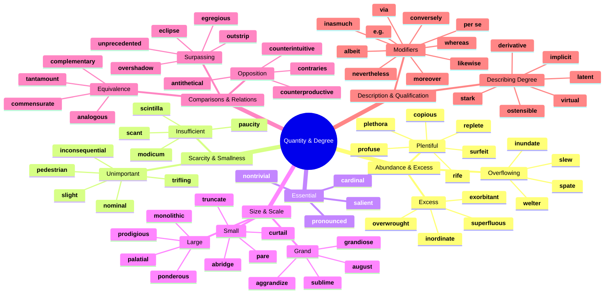
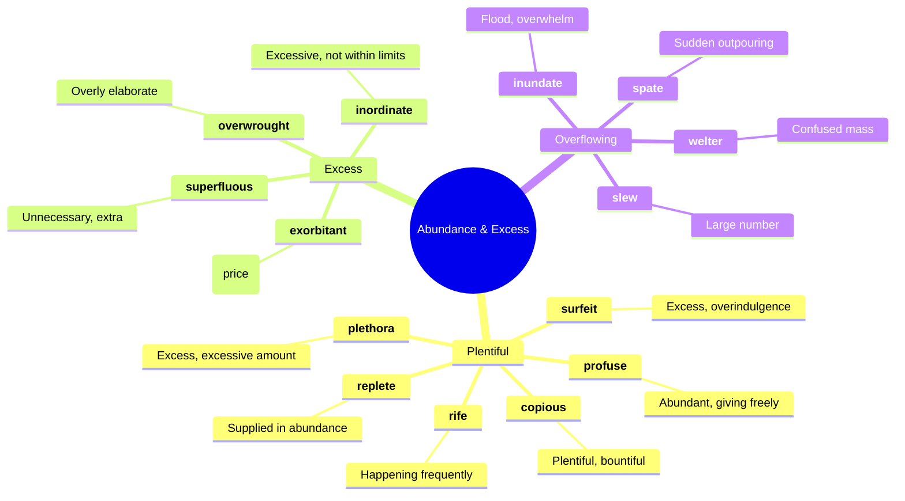
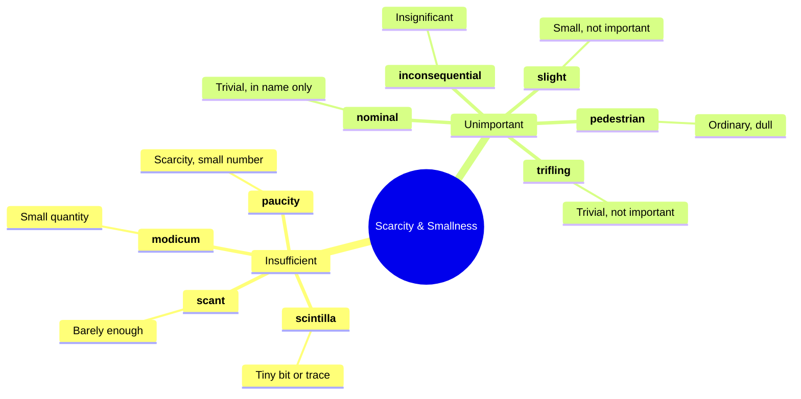
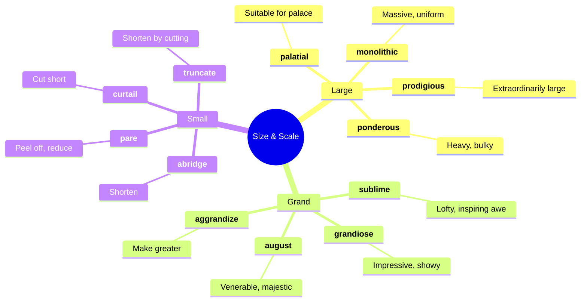
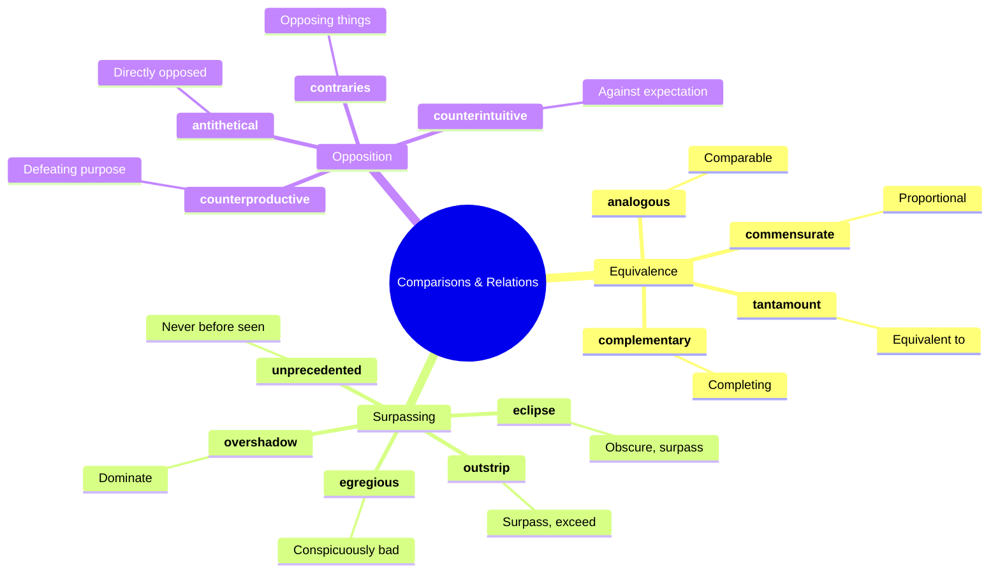
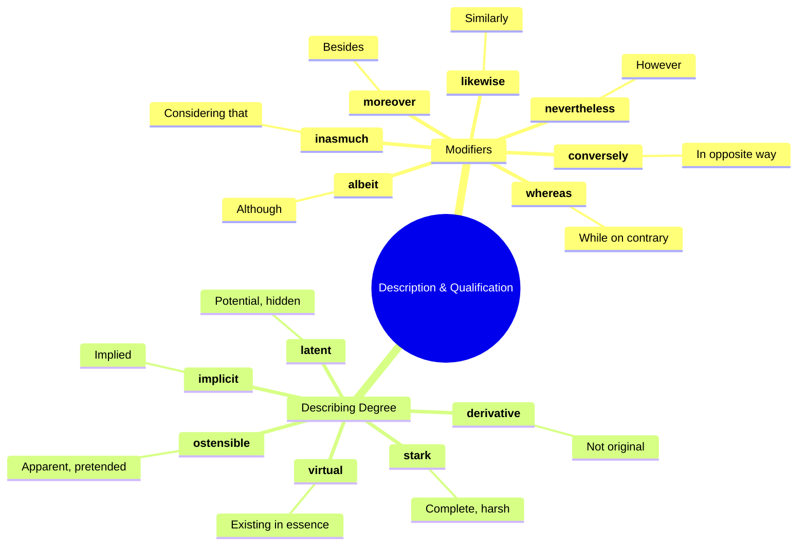
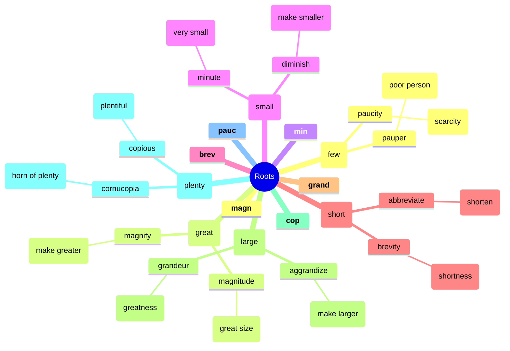

# 📏 Quantity, Size, Degree & Comparisons

## 🗺️ Main Mind Map

---

## 🔍 Detailed Focus

### 🌊 Abundance & Excess

### 🤏 Scarcity & Smallness

### 🐘 Size & Scale

### ⚖️ Comparisons & Relations

### 📝 Description & Qualification

---

## 📚 Vocabulary List

| Word                  | Definition                                                                                                                                        | Memory Hook                                                        | Example Sentence                                                                                          |
| --------------------- | ------------------------------------------------------------------------------------------------------------------------------------------------- | ------------------------------------------------------------------ | --------------------------------------------------------------------------------------------------------- |
| **abridge**           | Shorten (a book, movie, speech, or other text) without losing the sense                                                                           | **A-BRIDGE** → A **BRIDGE** shortens the path                      | The publisher decided to **abridge** the lengthy novel.                                                   |
| **aggrandize**        | Increase the power, status, or wealth of                                                                                                          | **AG-GRAND**-ize → Make **GRAND**er                                | The dictator sought to **aggrandize** himself by building statues.                                        |
| **albeit**            | Although                                                                                                                                          | **AL-BE-IT** → **AL**l **BE** **IT** (let it be so)                | He accepted the job, **albeit** with some reluctance.                                                     |
| **analogous**         | Comparable in certain respects                                                                                                                    | **ANA-LOG**-ous → **ANA**logy                                      | The relationship between a ruler and his subjects is **analogous** to that of a father and his children.  |
| **antithetical**      | Directly opposed or contrasted; mutually incompatible                                                                                             | **ANTI-THET**-ical → **ANTI**-thesis                               | His lifestyle was **antithetical** to everything his parents stood for.                                   |
| **august**            | Respected and impressive                                                                                                                          | **AUGUST** (month) → Named after **AUGUST**us Caesar               | The **august** body of the Supreme Court made the decision.                                               |
| **cardinal**          | Of the greatest importance; fundamental                                                                                                           | **CARDINAL** bird/direction → Main one                             | Respect for others is a **cardinal** rule of this school.                                                 |
| **commensurate**      | Corresponding in size or degree; in proportion                                                                                                    | **CO-MENSUR**-ate → **MENSUR** (measure) together                  | Her salary is **commensurate** with her experience and skills.                                            |
| **complementary**     | Combining in such a way as to enhance or emphasize the qualities of each other or another                                                         | **COMPLEMENT**-ary → **COMPLET**es                                 | The wine and cheese were **complementary** flavors.                                                       |
| **contraries**        | The opposite                                                                                                                                      | **CONTRA**-ries → **CONTRA** (against)                             | Despite **contraries** in their personalities, they were best friends.                                    |
| **conversely**        | Introducing a statement or idea which reverses one that has just been made or referred to                                                         | **CONVERSE**-ly → **CONVERSE** (opposite)                          | You can add the fluid to the powder, or, **conversely**, the powder to the fluid.                         |
| **copious**           | Abundant in supply or quantity                                                                                                                    | **COPY**-ous → Make many **COPIES**                                | She took **copious** notes during the lecture.                                                            |
| **counterintuitive**  | Contrary to intuition or to common-sense expectation (but often nevertheless true)                                                                | **COUNTER-INTUITIVE** → Against **INTUIT**ion                      | It seems **counterintuitive**, but sometimes the best way to get ahead is to slow down.                   |
| **counterproductive** | Having the opposite of the desired effect                                                                                                         | **COUNTER-PRODUCTIVE** → Against **PRODUCT**ion                    | Yelling at the child was **counterproductive** and only made him cry.                                     |
| **curtail**           | Reduce in extent or quantity; impose a restriction on                                                                                             | **CUR-TAIL** → **CUT** the **TAIL**                                | We had to **curtail** our vacation because of the storm.                                                  |
| **derivative**        | (typically of an artist or work of art) imitative of the work of another person, and usually disapproved of for that reason                       | **DERIV**-ative → **DERIV**ed from                                 | The movie was **derivative** and offered nothing new.                                                     |
| **eclipse**           | (of a celestial body) obscure the light from or to (another celestial body); deprive (someone or something) of significance, power, or prominence | **ECLIPSE** → Cover up                                             | His success was **eclipsed** by the scandal.                                                              |
| **egregious**         | Outstandingly bad; shocking                                                                                                                       | **E-GREG**-ious → Outside (**E**) the flock (**GREG**) - bad sheep | It was an **egregious** error that cost the company millions.                                             |
| **exorbitant**        | (of a price or amount charged) unreasonably high                                                                                                  | **EX-ORBIT**-ant → Out of **ORBIT** (way too high)                 | The hotel charged **exorbitant** prices for room service.                                                 |
| **grandiose**         | Impressive or magnificent in appearance or style, especially pretentiously so                                                                     | **GRAND**-iose → **GRAND**                                         | He had **grandiose** plans for building a castle.                                                         |
| **implicit**          | Implied though not plainly expressed                                                                                                              | **IM-PLIC**-it → **IM**-plied                                      | There was an **implicit** understanding that we wouldn't talk about politics.                             |
| **inasmuch**          | To the extent that; insofar as                                                                                                                    | **IN-AS-MUCH**                                                     | **Inasmuch** as you have admitted your guilt, the sentence will be lighter.                               |
| **inconsequential**   | Not important or significant                                                                                                                      | **IN-CONSEQUENT**-ial → No **CONSEQUENC**es                        | The error was **inconsequential** and didn't affect the outcome.                                          |
| **inordinate**        | Unusually or disproportionately large; excessive                                                                                                  | **IN-ORDIN**-ate → Not **ORDIN**ary (too much)                     | He spends an **inordinate** amount of time playing video games.                                           |
| **inundate**          | Overwhelm (someone) with things or people to be dealt with                                                                                        | **IN-UND**-ate → **UND**er waves                                   | We were **inundated** with complaints after the broadcast.                                                |
| **latent**            | (of a quality or state) existing but not yet developed or manifest; hidden; concealed                                                             | **LATENT** → **LATE** (coming later)                               | The detective found **latent** fingerprints on the glass.                                                 |
| **likewise**          | In the same way; also                                                                                                                             | **LIKE-WISE** → **LIKE** **W**ays                                  | Watch him and do **likewise**.                                                                            |
| **modicum**           | A small quantity of a particular thing, especially something considered desirable or valuable                                                     | **MOD**-icum → **MOD**erate amount                                 | He didn't even have a **modicum** of common sense.                                                        |
| **monolithic**        | (of an organization or system) large, powerful, and intractably indivisible and uniform                                                           | **MONO-LITH**-ic → **ONE STONE** (huge block)                      | The **monolithic** corporation dominated the market.                                                      |
| **moreover**          | As a further matter; besides                                                                                                                      | **MORE-OVER** → **MORE** **OVER** here                             | The rent is reasonable, and **moreover**, the location is perfect.                                        |
| **nevertheless**      | In spite of that; notwithstanding; all the same                                                                                                   | **NEVER-THE-LESS**                                                 | It was raining; **nevertheless**, we went for a walk.                                                     |
| **nominal**           | (of a role or status) existing in name only                                                                                                       | **NOMIN**-al → **NAME** only                                       | He is the **nominal** head of the organization, but his deputy makes all the decisions.                   |
| **nontrivial**        | Significant or important                                                                                                                          | **NON-TRIVIAL** → Not **TRIVIAL**                                  | The cost of the project is **nontrivial**.                                                                |
| **ostensible**        | Stated or appearing to be true, but not necessarily so                                                                                            | **OSTENS**-ible → **OSTENT**atious (showing)                       | The **ostensible** reason for the meeting was to discuss the budget, but the real reason was to fire him. |
| **outstrip**          | Move faster than and overtake (someone else)                                                                                                      | **OUT-STRIP** → **STRIP** past                                     | Demand for the new product **outstripped** supply.                                                        |
| **overshadow**        | Appear much more prominent or important than                                                                                                      | **OVER-SHADOW** → Cast a **SHADOW** **OVER**                       | Her performance was **overshadowed** by the news of the tragedy.                                          |
| **overwrought**       | (of a piece of writing or a work of art) too elaborate or complicated in design or construction                                                   | **OVER-WROUGHT** → **OVER**-worked                                 | The prose was **overwrought** and difficult to read.                                                      |
| **palatial**          | Resembling a palace in being spacious and splendid                                                                                                | **PALAT**-ial → **PALAC**e-ial                                     | The hotel had a **palatial** lobby with marble floors.                                                    |
| **pare**              | Trim (something) by cutting away its outer edges                                                                                                  | **PARE** → **PEAR** (peel it)                                      | We need to **pare** down our expenses.                                                                    |
| **paucity**           | The presence of something only in small or insufficient quantities or amounts; scarcity                                                           | **PAUCI**-ty → **PAU**per city                                     | There is a **paucity** of information on the subject.                                                     |
| **pedestrian**        | Lacking inspiration or excitement; dull                                                                                                           | **PED**-estrian → On foot (slow/boring)                            | His writing style is rather **pedestrian**.                                                               |
| **per se**            | By or in itself or themselves; intrinsically                                                                                                      | **PER SE** → **PER**sonally                                        | Money **per se** is not the root of all evil.                                                             |
| **plethora**          | A large or excessive amount of (something)                                                                                                        | **PLETH**-ora → **PLENT**y                                         | There is a **plethora** of diet books on the market.                                                      |
| **ponderous**         | Slow and clumsy because of great weight                                                                                                           | **POND**-erous → **POUND**s (heavy)                                | The elephant made **ponderous** movements.                                                                |
| **precipitate**       | Cause (an event or situation, typically one that is bad or undesirable) to happen suddenly, unexpectedly, or prematurely                          | **PRE-CIPIT**-ate → **PRE** (before) **CAPIT** (head) - headfirst  | The assassination **precipitated** a world war.                                                           |
| **prodigious**        | Remarkably or impressively great in extent, size, or degree                                                                                       | **PRODIG**-ious → **PRODIGY** (amazing)                            | He had a **prodigious** appetite.                                                                         |
| **profuse**           | (especially of something offered or discharged) exuberantly plentiful; abundant                                                                   | **PRO-FUSE** → **FUSE** (pour) forth                               | She offered **profuse** apologies for being late.                                                         |
| **pronounced**        | Very noticeable or marked; conspicuous                                                                                                            | **PRONOUNC**-ed → **ANNOUNC**ed clearly                            | He walked with a **pronounced** limp.                                                                     |
| **replete**           | Filled or well-supplied with something                                                                                                            | **REPLETE** → **RE**-com**PLETE**                                  | The book is **replete** with photographs and illustrations.                                               |
| **rife**              | (especially of something undesirable or harmful) of common occurrence; widespread                                                                 | **RIFE** → **RIV**er of it                                         | The city was **rife** with crime.                                                                         |
| **salient**           | Most noticeable or important                                                                                                                      | **SALI**-ent → **SALI** (jump) out                                 | The **salient** points of the speech were summarized in the handout.                                      |
| **scant**             | Barely sufficient or adequate                                                                                                                     | **SCANT** → **SCANT**y                                             | There was **scant** evidence to support the claim.                                                        |
| **scintilla**         | A tiny trace or spark of a specified quality or feeling                                                                                           | **SCINTILL**-a → **SCINTILL**ating spark                           | There is not a **scintilla** of truth in his statement.                                                   |
| **slew**              | A large number or quantity of something                                                                                                           | **SLEW** → **SL**id a whole lot                                    | A whole **slew** of problems arose.                                                                       |
| **slight**            | Small in degree; inconsiderable                                                                                                                   | **SLIGHT** → **LIGHT** weight                                      | There is a **slight** chance of rain.                                                                     |
| **spate**             | A large number of similar things or events appearing or occurring in quick succession                                                             | **SPATE** → **SPIT** out a lot                                     | There has been a **spate** of burglaries in the neighborhood.                                             |
| **stark**             | Severe or bare in appearance or outline                                                                                                           | **STARK** → **STAR**ing naked                                      | The **stark** landscape was beautiful in its own way.                                                     |
| **sublime**           | Of such excellence, grandeur, or beauty as to inspire great admiration or awe                                                                     | **SUB-LIME** → Under the **LIME**light of god                      | The view from the mountain top was absolutely **sublime**.                                                |
| **superfluous**       | Unnecessary, especially through being more than enough                                                                                            | **SUPER-FLU**-ous → **SUPER** (over) **FLOW**ing                   | The extra comments were **superfluous**.                                                                  |
| **surfeit**           | An excessive amount of something                                                                                                                  | **SUR-FEIT** → **SUR** (over) **FEIT** (done)                      | We had a **surfeit** of food after the party.                                                             |
| **tantamount**        | Equivalent in seriousness to; virtually the same as                                                                                               | **TANT-AMOUNT** → **T**hat **AMOUNT**                              | His silence was **tantamount** to a confession.                                                           |
| **trifling**          | Unimportant or trivial                                                                                                                            | **TRIFL**-ing → **TRIFLE** (small dessert)                         | It was a **trifling** matter that we shouldn't worry about.                                               |
| **truncate**          | Shorten (something) by cutting off the top or the end                                                                                             | **TRUNC**-ate → **TRUNK** (cut tree)                               | The meeting was **truncated** due to the fire alarm.                                                      |
| **unprecedented**     | Never done or known before                                                                                                                        | **UN-PRECED**-ented → No **PRECED**ent (before)                    | The team's success was **unprecedented**.                                                                 |
| **via**               | Traveling through (a place) en route to a destination                                                                                             | **VIA** → **VIA**duct (road)                                       | We flew to London **via** New York.                                                                       |
| **virtual**           | Almost or nearly as described, but not completely or according to strict definition                                                               | **VIRTU**-al → **VIRTU**ally true                                  | The stadium was a **virtual** ghost town.                                                                 |
| **welter**            | A large number of items in no order; a confused mass                                                                                              | **WELTER** → **WELTER**weight boxing (confused fight)              | A **welter** of conflicting evidence.                                                                     |
| **whereas**           | In contrast or comparison with the fact that                                                                                                      | **WHERE-AS**                                                       | He loves sports, **whereas** she prefers reading.                                                         |

---

## 🌱 Etymology & Roots

