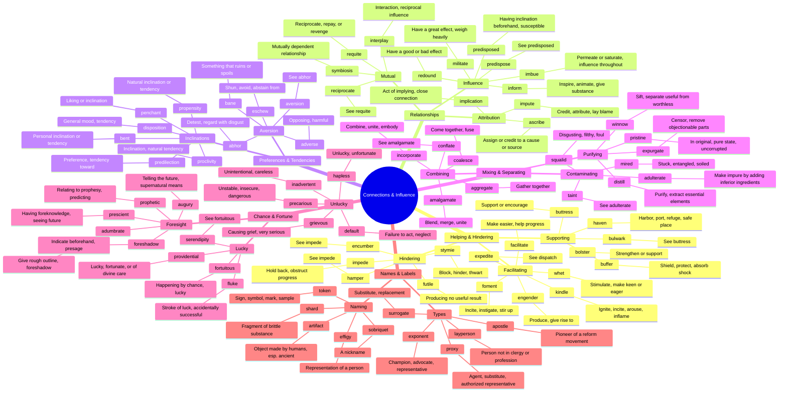

# 🔗 Connections, Relationships & Influence

> GRE vocabulary for associations, influences, impacts, and interpersonal dynamics.

## Mind Map

## Quick Memory Hooks

| Word | Memory Hook |
|------|------------|
| penchant | PEN-CHANT → A chanting pen, drawn to write about favorites |
| proclivity | PRO-CLIV-ity → Leaning (cline) toward something |
| fortuitous | FORTUIT-ous → Fortune (fortuna) smiling by chance |
| adumbrate | AD-UMBRA-te → Adding a shadow (umbra), foreshadowing |
| ascribe | A-SCRIBE → Scribing (writing) credit to someone |
| pristine | PRIST-ine → Like a priest's temple, pure and clean |
| expurgate | EX-PURG-ATE → Purging (removing) the bad parts |
| hapless | HAP-LESS → Less hap (luck), unfortunate |