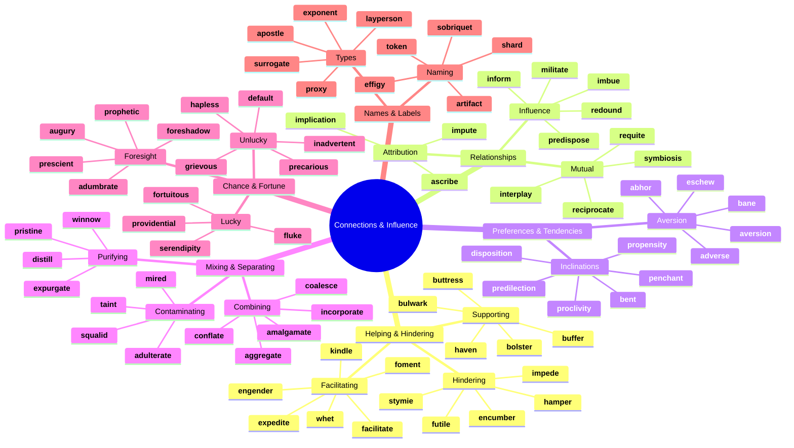
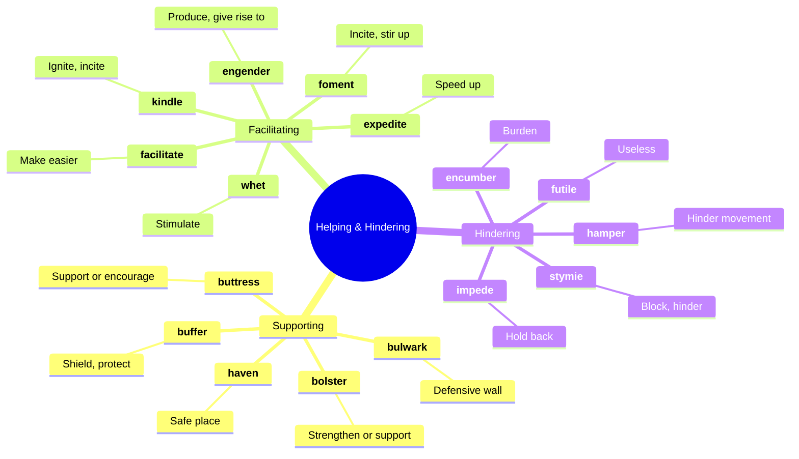
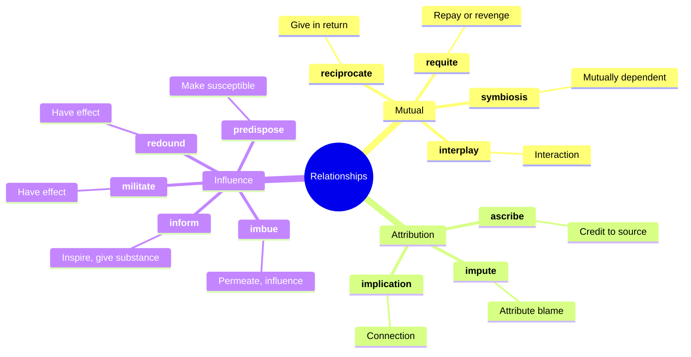
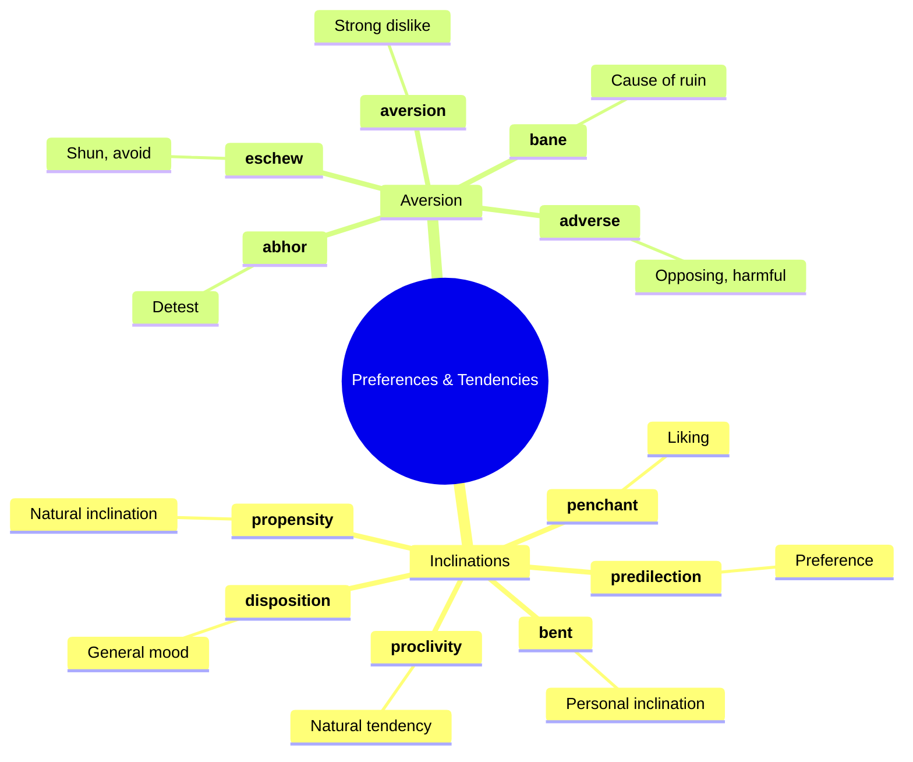
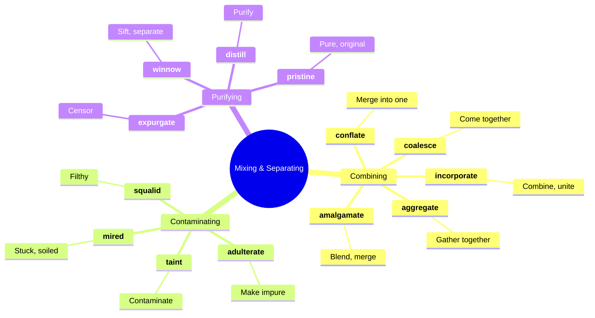
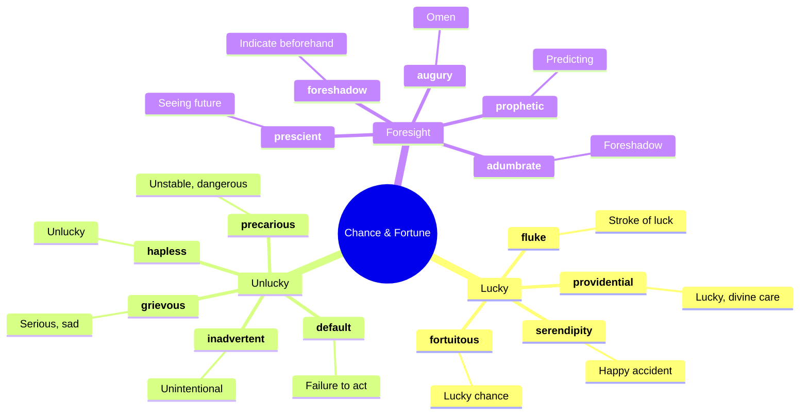
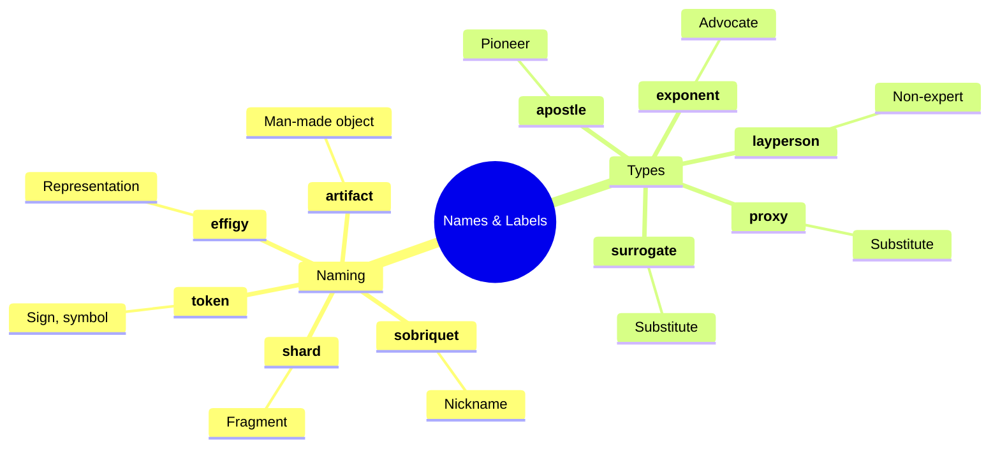
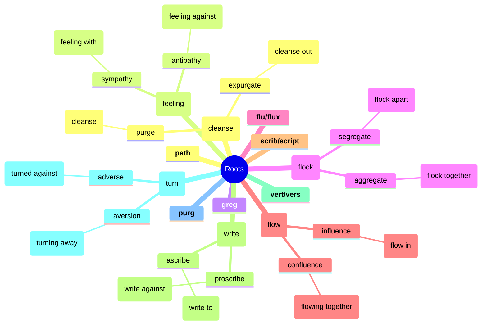

# 🔗 Connections, Relationships & Influence

## 🗺️ Main Mind Map

---

## 🔍 Detailed Focus

### 🤝 Helping & Hindering

### 🔄 Relationships

### ❤️ Preferences & Tendencies

### 🧪 Mixing & Separating

### 🍀 Chance & Fortune

### 🏷️ Names & Labels

---

## 📚 Vocabulary List

| Word             | Definition                                                                                                                                 | Memory Hook                                               | Example Sentence                                                  |
| ---------------- | ------------------------------------------------------------------------------------------------------------------------------------------ | --------------------------------------------------------- | ----------------------------------------------------------------- |
| **abhor**        | Regard with disgust and hatred                                                                                                             | **AB-HOR**-ror → **HOR**ror at it                         | I **abhor** discrimination of any kind.                           |
| **adumbrate**    | Report or represent in outline; foreshadow or symbolize                                                                                    | **AD-UMBRA**-te → **UMBRA** (shadow) cast forward         | The project's problems were **adumbrated** in the initial report. |
| **adulterate**   | Render (something) poorer in quality by adding another substance, typically an inferior one                                                | **ADULTER**-ate → **ADULT**s mess things up (make impure) | The company was fined for **adulterating** its milk with water.   |
| **adverse**      | Preventing success or development; harmful; unfavorable                                                                                    | **AD-VERSE** → **VERSE** (turn) against                   | The drug has some **adverse** side effects.                       |
| **aggregate**    | Form or group into a class or cluster                                                                                                      | **AGGREG**-ate → **GREG**arious (flock together)          | The website **aggregates** news from various sources.             |
| **amalgamate**   | Combine or unite to form one organization or structure                                                                                     | **AMALGAM**-ate → **GUM** together                        | The two schools **amalgamated** to save money.                    |
| **apostle**      | A vigorous and pioneering advocate or supporter of a particular policy, idea, or cause                                                     | **A-POST**-le → **POST**ing the message                   | He was an **apostle** of non-violent resistance.                  |
| **artifact**     | An object made by a human being, typically an item of cultural or historical interest                                                      | **ARTI-FACT** → **ART**ificial **FACT**                   | The museum displayed **artifacts** from ancient Egypt.            |
| **ascribe**      | Attribute something to (a cause)                                                                                                           | **A-SCRIBE** → **SCRIBE** (write) to someone              | He **ascribed** his success to hard work and luck.                |
| **augury**       | A sign of what will happen in the future; an omen                                                                                          | **AUGUR**-y → **AUGUR** (drill) into future               | The dark clouds were an **augury** of the storm to come.          |
| **aversion**     | A strong dislike or disinclination                                                                                                         | **A-VERS**-ion → **VERS**e (turn) away                    | He has a deep **aversion** to getting up early.                   |
| **bane**         | A cause of great distress or annoyance                                                                                                     | **BANE** → **BAN**ish it!                                 | Mosquitoes are the **bane** of my existence in the summer.        |
| **bent**         | A natural talent or inclination                                                                                                            | **BENT** → Leaning towards                                | She has a **bent** for mathematics.                               |
| **bolster**      | Support or strengthen; prop up                                                                                                             | **BOLSTER** pillow → Supports you                         | The good news **bolstered** his morale.                           |
| **buffer**       | A person or thing that prevents incompatible or antagonistic people or things from coming into contact with or harming each other          | **BUFFER** → **BUFF** out the shock                       | The trees act as a **buffer** against the wind.                   |
| **bulwark**      | A defensive wall                                                                                                                           | **BULL-WORK** → Strong wall                               | Freedom of speech is a **bulwark** against tyranny.               |
| **buttress**     | Provide (a building or structure) with projecting supports built against its walls; strengthen or support                                  | **BUTT**-ress → **BUTT**ress supports the wall            | The argument was **buttressed** by solid evidence.                |
| **coalesce**     | Come together and form one mass or whole                                                                                                   | **COAL-ESCE** → **COAL**s burning together                | The ideas **coalesced** into a coherent plan.                     |
| **conflate**     | Combine (two or more texts, ideas, etc.) into one                                                                                          | **CON-FLATE** → **FLAT**ten together                      | Be careful not to **conflate** the two issues.                    |
| **default**      | Failure to fulfill an obligation, especially to repay a loan or to appear in a court of law                                                | **DE-FAULT** → **FAULT**y payment                         | He **defaulted** on his mortgage payments.                        |
| **disposition**  | A person's inherent qualities of mind and character                                                                                        | **DIS-POS**-ition → **POS**ition of mind                  | She has a cheerful **disposition**.                               |
| **distill**      | Extract the essential meaning or most important aspects of                                                                                 | **DISTILL** → **STILL** water (pure)                      | The report **distills** the findings of the study.                |
| **effigy**       | A sculpture or model of a person                                                                                                           | **EFFIGY** → **FIG**ure                                   | The protesters burned an **effigy** of the dictator.              |
| **encumber**     | Restrict or burden (someone or something) in such a way that free action or movement is difficult                                          | **EN-CUMBER** → **CUCUMBER** (heavy veg)                  | He was **encumbered** by heavy luggage.                           |
| **engender**     | Cause or give rise to (a feeling, situation, or condition)                                                                                 | **EN-GEN**-der → **GEN**erate                             | The policy **engendered** controversy.                            |
| **eschew**       | Deliberately avoid using; abstain from                                                                                                     | **ES-CHEW** → **CHEW** something else (spit it out)       | He **eschewed** political involvement.                            |
| **expedite**     | Make (an action or process) happen sooner or be accomplished more quickly                                                                  | **EX-PED**-ite → **PED**al faster                         | We need to **expedite** the shipping process.                     |
| **exponent**     | A person who believes in and promotes the truth or benefits of an idea or theory                                                           | **EX-PON**-ent → **PON**der/put forth                     | She is a leading **exponent** of renewable energy.                |
| **expurgate**    | Remove matter thought to be objectionable or unsuitable from (a book or account)                                                           | **EX-PURG**-ate → **PURG**e out                           | The school edition of the book was **expurgated**.                |
| **facilitate**   | Make (an action or process) easy or easier                                                                                                 | **FACIL**-itate → **FACIL**e (easy in Spanish)            | The new software will **facilitate** better communication.        |
| **fluke**        | Unlikely chance occurrence, especially a surprising piece of luck                                                                          | **FLUKE** → **LUCK**                                      | The goal was a total **fluke**.                                   |
| **foment**       | Instigate or stir up (an undesirable or violent sentiment or course of action)                                                             | **FO-MENT** → **FERMENT** (bubble up)                     | The rebels tried to **foment** unrest in the capital.             |
| **foreshadow**   | Be a warning or indication of (a future event)                                                                                             | **FORE-SHADOW** → **SHADOW** be**FORE**                   | The dark clouds **foreshadowed** the storm.                       |
| **fortuitous**   | Happening by accident or chance rather than design                                                                                         | **FORTU**-itous → **FORTU**ne                             | The meeting was **fortuitous**.                                   |
| **futile**       | Incapable of producing any useful result; pointless                                                                                        | **FUT**-ile → **F**ew **UTIL**ity                         | It was **futile** to try to change his mind.                      |
| **grievous**     | (of something bad) very severe or serious                                                                                                  | **GRIEV**-ous → **GRIEF** causing                         | He made a **grievous** error.                                     |
| **hamper**       | Hinder or impede the movement or progress of                                                                                               | **HAMPER** → Laundry **HAMPER** (trapped)                 | The bad weather **hampered** the rescue efforts.                  |
| **hapless**      | (especially of a person) unfortunate                                                                                                       | **HAP-LESS** → **HAP**py **LESS** (no luck)               | The **hapless** victim was in the wrong place at the wrong time.  |
| **haven**        | A place of safety or refuge                                                                                                                | **HAVEN** → **HEAVEN** (safe)                             | The library was a **haven** of peace and quiet.                   |
| **imbue**        | Inspire or permeate with a feeling or quality                                                                                              | **IM-BUE** → **IM-BLUE** (dye)                            | His voice was **imbued** with sadness.                            |
| **impede**       | Delay or prevent (someone or something) by obstructing them; hinder                                                                        | **IM-PED**-e → **PED**estrian in the way                  | The traffic **impeded** our progress.                             |
| **implication**  | The conclusion that can be drawn from something, although it is not explicitly stated                                                      | **IM-PLIC**-ation → **IM-PLY**                            | The **implication** was that he was guilty.                       |
| **impute**       | Represent (something, especially something undesirable) as being done, caused, or possessed by someone; attribute                          | **IM-PUT**-e → **PUT** on someone                         | They **imputed** the error to a computer glitch.                  |
| **inadvertent**  | Not resulting from or achieved through deliberate planning                                                                                 | **IN-ADVERT**-ent → Not **ADVERT**ised (planned)          | The omission was **inadvertent**.                                 |
| **incorporate**  | Take in or contain (something) as part of a whole; include                                                                                 | **IN-CORP**-orate → **IN** **CORP**s (body)               | The new car design **incorporates** safety features.              |
| **inform**       | Give an essential or formative principle or quality to                                                                                     | **IN-FORM** → **FORM** inside                             | His love of nature **informs** his poetry.                        |
| **interplay**    | The way in which two or more things have an effect on each other                                                                           | **INTER-PLAY** → **PLAY** between                         | The **interplay** of light and shadow was beautiful.              |
| **kindle**       | Light or set on fire; arouse or inspire (an emotion or feeling)                                                                            | **KINDLE** → Fire starter                                 | The book **kindled** his interest in history.                     |
| **layperson**    | A person without professional or specialized knowledge in a particular subject                                                             | **LAY**-person → **LAY**man                               | To a **layperson**, the jargon was confusing.                     |
| **militate**     | (of a fact or circumstance) be a powerful or conclusive factor in preventing                                                               | **MILIT**-ate → **MILIT**ary force against                | His lack of experience **militated** against him getting the job. |
| **mired**        | Cause to become stuck in mud; cover or spatter with mud                                                                                    | **MIRE**-d → **MIRE** (swamp)                             | The project was **mired** in delays.                              |
| **penchant**     | A strong or habitual liking for something or tendency to do something                                                                      | **PEN-CHANT** → **PEN**chant for **CHANT**ing             | He has a **penchant** for spicy food.                             |
| **precarious**   | Not securely held or in position; dangerously likely to fall or collapse                                                                   | **PRE-CAR**-ious → **CAR**e needed                        | The ladder was in a **precarious** position.                      |
| **predilection** | A preference or special liking for something; a bias in favor of something                                                                 | **PRE-DILECT**-ion → **PRE**-se**LECT**ion                | She has a **predilection** for classical music.                   |
| **predispose**   | Make someone liable or inclined to a specified attitude, action, or condition                                                              | **PRE-DISPOSE** → **DISPOSE**d be**FORE**                 | His background **predisposed** him to be suspicious of authority. |
| **prescient**    | Having or showing knowledge of events before they take place                                                                               | **PRE-SCI**-ent → **PRE** (before) **SCI**ence (know)     | His warning proved to be **prescient**.                           |
| **pristine**     | In its original condition; unspoiled                                                                                                       | **PRIST**-ine → **PRI**e**ST** (pure)                     | The car was in **pristine** condition.                            |
| **proclivity**   | A tendency to choose or do something regularly; an inclination or predisposition toward a particular thing                                 | **PRO-CLIV**-ity → **PRO** (forward) **CLIF**f (lean)     | He has a **proclivity** for exaggeration.                         |
| **propensity**   | An inclination or natural tendency to behave in a particular way                                                                           | **PRO-PENS**-ity → **PEN**dulum swings                    | She has a **propensity** to be late.                              |
| **prophetic**    | Accurately describing or predicting what will happen in the future                                                                         | **PROPHET**-ic → Like a **PROPHET**                       | His words turned out to be **prophetic**.                         |
| **providential** | Occurring at a favorable time; opportune                                                                                                   | **PROVID**-ential → **PROVID**ed by God                   | Their arrival was **providential**.                               |
| **proxy**        | The authority to represent someone else, especially in voting                                                                              | **PROXY** → **PROX**imity (stand in)                      | He voted by **proxy**.                                            |
| **reciprocate**  | Respond to (a gesture or action) by making a corresponding one                                                                             | **RE-CIPRO**-cate → **RE**turn                            | I hope to **reciprocate** your kindness one day.                  |
| **redound**      | Contribute greatly to (a person's credit or honor)                                                                                         | **RE-DOUND** → **RE-BOUND**                               | Her success **redounds** to the credit of the school.             |
| **requite**      | Make appropriate return for (a favor, service, or wrongdoing)                                                                              | **RE-QUITE** → **RE-QUIT** (pay back)                     | Unrequited love is painful.                                       |
| **serendipity**  | The occurrence and development of events by chance in a happy or beneficial way                                                            | **SERENDIP**-ity → **SERENE** **DIP** (lucky dip)         | Finding the book I needed was pure **serendipity**.               |
| **shard**        | A piece of broken ceramic, metal, glass, or rock, typically having sharp edges                                                             | **SHARD** → **SHAR**p part                                | He stepped on a **shard** of glass.                               |
| **sobriquet**    | A person's nickname                                                                                                                        | **SO-BRIQUET** → **SO** **BRI**ck (hard name?)            | His **sobriquet** was "The Iron Duke."                            |
| **squalid**      | (of a place) extremely dirty and unpleasant, especially as a result of poverty or neglect                                                  | **SQUAL**-id → **SQU**ashy and dirty                      | They lived in **squalid** conditions.                             |
| **stymie**       | Prevent or hinder the progress of                                                                                                          | **STY-MIE** → Stuck in a **STY**                          | The investigation was **stymied** by a lack of evidence.          |
| **surrogate**    | A substitute, especially a person deputizing for another in a specific role or office                                                      | **SURROGATE** → **SUB**-rogate                            | She acted as a **surrogate** mother.                              |
| **symbiosis**    | Interaction between two different organisms living in close physical association, typically to the advantage of both                       | **SYM-BIO**-sis → **SYM** (together) **BIO** (life)       | The two companies have a **symbiotic** relationship.              |
| **taint**        | Contaminate or pollute (something)                                                                                                         | **TAINT** → **T**int/st**AIN**                            | The scandal **tainted** his reputation.                           |
| **token**        | A thing serving as a visible or tangible representation of a fact, quality, feeling, etc.                                                  | **TOKEN** → **TO** **KEN** (know/show)                    | Please accept this gift as a **token** of my appreciation.        |
| **whet**         | Sharpen the blade of (a tool or weapon); excite or stimulate (someone's desire, interest, or appetite)                                     | **WHET** → **WET** stone sharpens                         | The preview **whetted** my appetite for the movie.                |
| **winnow**       | Blow a current of air through (grain) in order to remove the chaff; remove people or things from a group until only the best ones are left | **WIN-NOW** → **WIN**now out the bad                      | We need to **winnow** the list of applicants.                     |

---

## 🌱 Etymology & Roots

