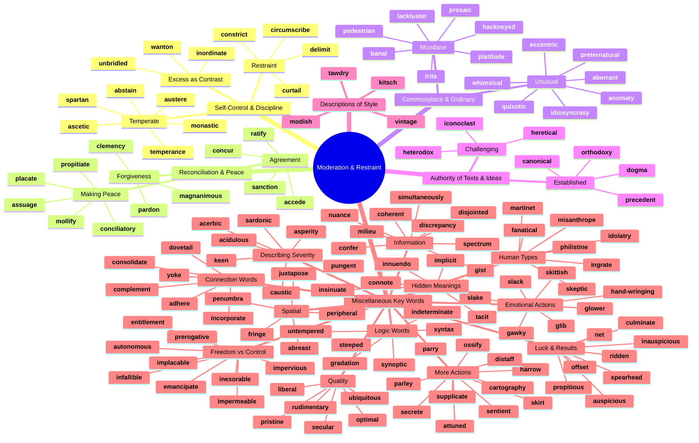
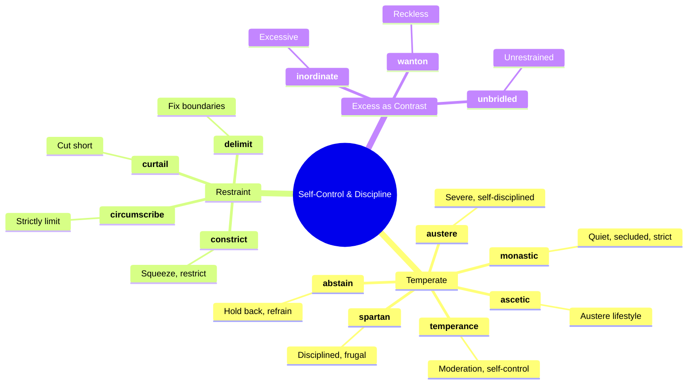
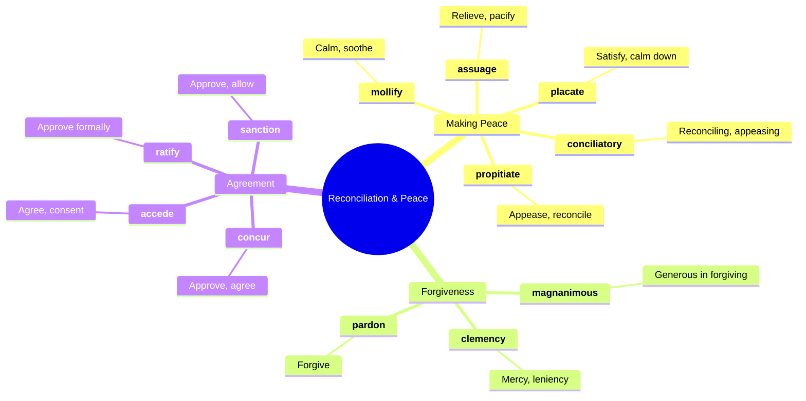
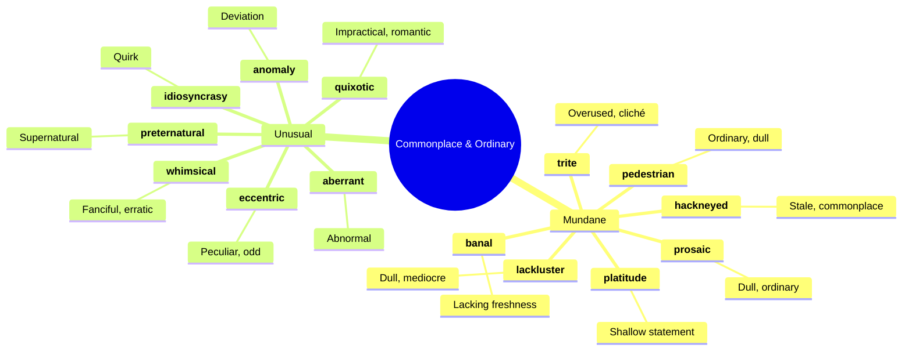
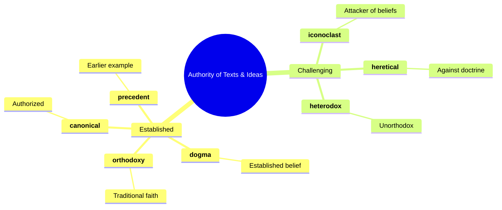
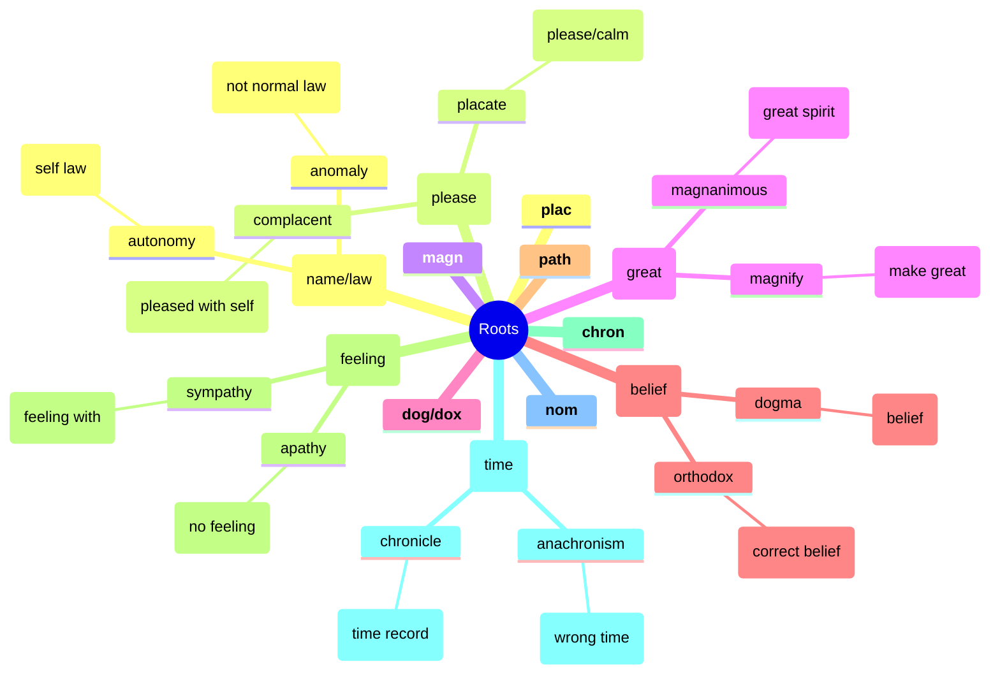

# ⚖️ Moderation, Restraint & Reconciliation

## 🗺️ Main Mind Map

---

## 🔍 Detailed Focus

### 🧘 Self-Control & Discipline

### 🕊️ Reconciliation & Peace

### 🥱 Commonplace & Ordinary

### 📜 Authority of Texts & Ideas

---

## 📚 Vocabulary List

| Word               | Definition                                                                                                                                                      | Memory Hook                                                | Example Sentence                                                              |
| ------------------ | --------------------------------------------------------------------------------------------------------------------------------------------------------------- | ---------------------------------------------------------- | ----------------------------------------------------------------------------- |
| **aberrant**       | Departing from an accepted standard                                                                                                                             | **AB-ERR**-ant → **AB**normal **ERR**or                    | His **aberrant** behavior worried his friends.                                |
| **abreast**        | Side by side and facing the same way; up to date with                                                                                                           | **A-BREAST** → Chest to chest                              | Keep **abreast** of the latest news.                                          |
| **abstain**        | Restrain oneself from doing or enjoying something                                                                                                               | **ABS**-tain → **ABS**ent from it                          | He decided to **abstain** from alcohol.                                       |
| **accede**         | Assent or agree to a demand, request, or treaty                                                                                                                 | **AC-CEDE** → **CEDE** (give up) to agree                  | The government **acceded** to the demands of the protesters.                  |
| **acerbic**        | (especially of a comment or style of speaking) sharp and forthright                                                                                             | **ACER**-bic → **ACID**-ic                                 | His **acerbic** wit made him both feared and admired.                         |
| **acidulous**      | Sharp-tasting; sour; bitter or cutting                                                                                                                          | **ACID**-ulous → Like **ACID**                             | Her **acidulous** comments silenced the room.                                 |
| **adhere**         | Stick fast to (a surface or substance); believe in and follow the practices of                                                                                  | **AD-HERE** → Stick **HERE**                               | We must **adhere** to the rules.                                              |
| **anomaly**        | Something that deviates from what is standard, normal, or expected                                                                                              | **A-NOM**-aly → Not **NOM**inal (normal)                   | The snow in July was a weather **anomaly**.                                   |
| **ascetic**        | Characterized by or suggesting the practice of severe self-discipline and abstention from all forms of indulgence                                               | **A-SCETIC** → **A** **S**aint's ethic                     | The monk lived an **ascetic** life in the mountains.                          |
| **asperity**       | Harshness of tone or manner                                                                                                                                     | **ASPER**-ity → **ASP**irin (bitter)                       | He spoke with such **asperity** that I thought he was angry.                  |
| **assuage**        | Make (an unpleasant feeling) less intense                                                                                                                       | **ASSUAGE** → **SAUSAGE** (comfort food)                   | He tried to **assuage** his guilt by apologizing.                             |
| **attuned**        | Receptive or aware                                                                                                                                              | **A-TUNE**-d → In **TUNE**                                 | She is **attuned** to the needs of her students.                              |
| **august**         | Respected and impressive                                                                                                                                        | **AUGUST** (month) → Named after **AUGUST**us Caesar       | The **august** body of the Supreme Court made the decision.                   |
| **austere**        | Severe or strict in manner, attitude, or appearance                                                                                                             | **AUSTER**-e → **AUSTER**e Australia (harsh outback)       | The **austere** teacher never smiled.                                         |
| **autonomous**     | (of a country or region) having the freedom to govern itself or control its own affairs                                                                         | **AUTO-NOM**-ous → **AUTO** (self) **NOM** (law)           | The university is an **autonomous** institution.                              |
| **banal**          | So lacking in originality as to be obvious and boring                                                                                                           | **BAN**-al → **BAN** it (so boring)                        | The movie's plot was **banal** and predictable.                               |
| **canonical**      | Included in the list of sacred books officially accepted as genuine; accepted as being accurate and authoritative                                               | **CANON**-ical → Official rule                             | The **canonical** works of Shakespeare are studied in schools everywhere.     |
| **cartography**    | The science or practice of drawing maps                                                                                                                         | **CART**-ography → **CHART**ing the earth                  | Ancient **cartography** often included mythical creatures.                    |
| **caustic**        | Able to burn or corrode organic tissue by chemical action; sarcastic in a scathing and bitter way                                                               | **CAUST**-ic → **CAUS**es burning                          | His **caustic** humor offended many people.                                   |
| **circumscribe**   | Restrict (something) within limits                                                                                                                              | **CIRCUM-SCRIBE** → **SCRIBE** (draw) a circle around      | The president's power is **circumscribed** by the constitution.               |
| **clemency**       | Mercy; lenience                                                                                                                                                 | **CLEMEN**-cy → **CLEMEN**tine (sweet)                     | The prisoner pleaded for **clemency**.                                        |
| **coherent**       | (of an argument, theory, or policy) logical and consistent                                                                                                      | **CO-HERE**-nt → Stick toge**THER**                        | He presented a **coherent** plan for the future.                              |
| **complement**     | A thing that completes or brings to perfection                                                                                                                  | **COMPLEMENT** → **COMPLET**es                             | The wine was a perfect **complement** to the meal.                            |
| **conciliatory**   | Intended or likely to placate or pacify                                                                                                                         | **CONCILI**-atory → **COUNCIL** making peace               | She adopted a **conciliatory** tone to avoid an argument.                     |
| **concur**         | Be of the same opinion; agree                                                                                                                                   | **CON-CUR** → **CUR**rent runs together                    | I **concur** with the committee's findings.                                   |
| **confer**         | Grant or bestow (a title, degree, benefit, or right); have discussions; exchange opinions                                                                       | **CON-FER** → **CON**ference                               | The university **conferred** an honorary degree on him.                       |
| **connote**        | (of a word) imply or suggest (an idea or feeling) in addition to the literal or primary meaning                                                                 | **CON-NOTE** → **CON**nected **NOTE**                      | The word "home" **connotes** warmth and safety.                               |
| **consolidate**    | Make (something) physically stronger or more solid; combine                                                                                                     | **CON-SOLID**-ate → Make **SOLID** together                | The company **consolidated** its debts into a single loan.                    |
| **constrict**      | Make narrower, especially by encircling pressure                                                                                                                | **CON-STRICT** → **STRICT**ly tight                        | The tight collar **constricted** his breathing.                               |
| **culminate**      | Reach a climax or point of highest development                                                                                                                  | **CULMIN**-ate → **COLUMN** top                            | The investigation **culminated** in the arrest of the mayor.                  |
| **curtail**        | Reduce in extent or quantity; impose a restriction on                                                                                                           | **CUR-TAIL** → **CUT** the **TAIL**                        | We had to **curtail** our vacation because of the storm.                      |
| **delimit**        | Determine the limits or boundaries of                                                                                                                           | **DE-LIMIT** → Set **LIMIT**s                              | The fence **delimits** the property line.                                     |
| **discrepancy**    | A lack of compatibility or similarity between two or more facts                                                                                                 | **DIS-CREP**-ancy → **DIS**agreement in s**CRIP**t         | There was a **discrepancy** between the two witness accounts.                 |
| **disjointed**     | Lacking a coherent sequence or connection                                                                                                                       | **DIS-JOINT**-ed → Not **JOINT**ed together                | The movie's plot was **disjointed** and confusing.                            |
| **distaff**        | Of or concerning women                                                                                                                                          | **DIS-STAFF** → **STAFF** for spinning wool (women's work) | The **distaff** side of the family.                                           |
| **dogma**          | A principle or set of principles laid down by an authority as incontrovertibly true                                                                             | **DOG**-ma → **DOG**matic belief                           | He challenged the political **dogma** of his time.                            |
| **dovetail**       | Join together harmoniously                                                                                                                                      | **DOVE-TAIL** → Wood joint shaped like tail                | Our schedules **dovetailed** perfectly, so we could carpool.                  |
| **eccentric**      | (of a person or their behavior) unconventional and slightly strange                                                                                             | **EC-CENTRIC** → Off **CENTER**                            | The **eccentric** millionaire lived in a house shaped like a shoe.            |
| **emancipate**     | Set free, especially from legal, social, or political restrictions                                                                                              | **E-MAN**-cipate → **MAN** freed                           | The slaves were **emancipated** in 1863.                                      |
| **entitlement**    | The fact of having a right to something                                                                                                                         | **EN-TITLE**-ment → Given a **TITLE**                      | He felt a sense of **entitlement** because of his wealthy background.         |
| **fanatical**      | Filled with excessive and single-minded zeal                                                                                                                    | **FAN**-atical → Like a crazy sports **FAN**               | He was **fanatical** about fitness.                                           |
| **fringe**         | The outer, marginal, or extreme part of an area, group, or sphere of activity                                                                                   | **FRINGE** → Edge of rug                                   | He was on the **fringe** of the political movement.                           |
| **gawky**          | Nervously awkward and ungainly                                                                                                                                  | **GAWK**-y → **GAWK**ing awkwardly                         | The **gawky** teenager tripped over his own feet.                             |
| **gist**           | The substance or essence of a speech or text                                                                                                                    | **GIST** → **J**ust **I**t (**S**ummary **T**ext)          | I didn't catch every word, but I got the **gist** of what he was saying.      |
| **glib**           | (of words or the person speaking them) fluent and voluble but insincere and shallow                                                                             | **GLIB** → **LIB**eral with words                          | His **glib** answers annoyed the reporter.                                    |
| **glower**         | Have an angry or sullen look on one's face; scowl                                                                                                               | **GLOWER** → **GLOW**ering eyes                            | He **glowered** at me when I interrupted him.                                 |
| **gradation**      | A scale or a series of successive changes, stages, or degrees                                                                                                   | **GRAD**-ation → **GRAD**ual steps                         | The **gradation** of colors in the sunset was beautiful.                      |
| **hackneyed**      | (of a phrase or idea) lacking significance through having been overused; unoriginal and trite                                                                   | **HACKNEY**-ed → **HACK** horse (overworked)               | The plot was full of **hackneyed** clichés.                                   |
| **hand-wringing**  | The clasping together and squeezing of one's hands, especially when distressed or worried                                                                       | **HAND-WRING**-ing → Worrying hands                        | There was a lot of **hand-wringing** over the budget cuts.                    |
| **harrow**         | Cause distress to                                                                                                                                               | **HARROW** → Plow that cuts earth                          | The **harrowing** experience left him shaken.                                 |
| **heretical**      | Believing in or practicing religious heresy                                                                                                                     | **HERETIC**-al → **HERE** to tick you off                  | His **heretical** views got him expelled from the church.                     |
| **heterodox**      | Not conforming with accepted or orthodox standards or beliefs                                                                                                   | **HETERO-DOX** → **HETERO** (different) **DOX** (belief)   | His **heterodox** opinions made him unpopular with the establishment.         |
| **iconoclast**     | A person who attacks cherished beliefs or institutions                                                                                                          | **ICON-O-CLAST** → **ICON** **CLASH**er                    | As an **iconoclast**, he enjoyed challenging traditional views.               |
| **idiosyncrasy**   | A mode of behavior or way of thought peculiar to an individual                                                                                                  | **IDIO-SYN**-crasy → **IDIO**t **SYN**c (weird mix)        | One of his **idiosyncrasies** was wearing mismatched socks.                   |
| **idolatry**       | Extreme admiration, love, or reverence for something or someone                                                                                                 | **IDOL**-atry → Worship **IDOL**s                          | Her love for the band bordered on **idolatry**.                               |
| **impermeable**    | Not allowing fluid to pass through                                                                                                                              | **IM-PERME**-able → Not **PERME**ating                     | The coat is made of **impermeable** material.                                 |
| **impervious**     | Not allowing fluid to pass through; unable to be affected by                                                                                                    | **IM-PERVI**-ous → Not **PERVI**ous (path through)         | He was **impervious** to criticism.                                           |
| **implacable**     | Unable to be placated                                                                                                                                           | **IM-PLAC**-able → Not **PLAC**ate-able                    | He was an **implacable** enemy.                                               |
| **implicit**       | Implied though not plainly expressed                                                                                                                            | **IM-PLIC**-it → **IM**-plied                              | There was an **implicit** understanding that we wouldn't talk about politics. |
| **incorporate**    | Take in or contain (something) as part of a whole; include                                                                                                      | **IN-CORP**-orate → **IN** **CORP**s (body)                | The new car design **incorporates** safety features.                          |
| **indeterminate**  | Not exactly known, established, or defined                                                                                                                      | **IN-DETERMIN**-ate → Not **DETERMIN**ed                   | The date of the meeting is still **indeterminate**.                           |
| **inexorable**     | Impossible to stop or prevent                                                                                                                                   | **IN-EX**-orable → Not **EX**itable (can't get out)        | The **inexorable** march of time.                                             |
| **infallible**     | Incapable of making mistakes or being wrong                                                                                                                     | **IN-FALL**-ible → Cannot **FALL**                         | No one is **infallible**.                                                     |
| **ingrate**        | An ungrateful person                                                                                                                                            | **IN-GRATE** → Not **GRATE**ful                            | Don't be such an **ingrate**; say thank you!                                  |
| **innuendo**       | An allusive or oblique remark or hint, typically a suggestive or disparaging one                                                                                | **IN-NUENDO** → **IN** your **END**-o (hint)               | The article was full of gossip and **innuendo**.                              |
| **inordinate**     | Unusually or disproportionately large; excessive                                                                                                                | **IN-ORDIN**-ate → Not **ORDIN**ary (too much)             | He spends an **inordinate** amount of time playing video games.               |
| **insinuate**      | Suggest or hint (something bad or reprehensible) in an indirect and unpleasant way                                                                              | **IN-SINU**-ate → **SINU**ous (snake-like) entry           | Are you **insinuating** that I'm lying?                                       |
| **juxtapose**      | Place or deal with close together for contrasting effect                                                                                                        | **JUXTA-POSE** → **POSE** next to                          | The artist **juxtaposed** bright colors with dark shadows.                    |
| **keen**           | Sharp or penetrating, in particular                                                                                                                             | **KEEN** → **K**ing of sharp                               | He has a **keen** eye for detail.                                             |
| **kitsch**         | Art, objects, or design considered to be in poor taste because of excessive garishness or sentimentality, but sometimes appreciated in an ironic or knowing way | **KITSCH**-en art                                          | The souvenir shop was full of **kitsch**.                                     |
| **lackluster**     | Lacking in vitality, force, or conviction; uninspired or uninspiring                                                                                            | **LACK-LUSTER** → No **LUSTER** (shine)                    | The team gave a **lackluster** performance.                                   |
| **liberal**        | Open to new behavior or opinions and willing to discard traditional values                                                                                      | **LIBER**-al → **LIBER**ty (free)                          | He has **liberal** views on social issues.                                    |
| **magnanimous**    | Very generous or forgiving, especially toward a rival                                                                                                           | **MAGN-ANIM**-ous → **MAGN** (great) **ANIM** (spirit)     | He was **magnanimous** in victory, shaking hands with his opponent.           |
| **martinet**       | A strict disciplinarian, especially in the armed forces                                                                                                         | **MARTINET** → **MAR**ch in **NET** (line)                 | The teacher was a **martinet** who demanded absolute silence.                 |
| **milieu**         | A person's social environment                                                                                                                                   | **MILIEU** → **MI**ddle p**L**ace                          | He felt comfortable in the artistic **milieu** of Paris.                      |
| **misanthrope**    | A person who dislikes humankind and avoids human society                                                                                                        | **MIS-ANTHROPE** → **MIS** (hate) **ANTHROP** (human)      | The old **misanthrope** lived alone in a cabin.                               |
| **modish**         | Conforming to or following what is currently popular and fashionable                                                                                            | **MOD**-ish → **MOD**ern                                   | She wears **modish** clothes.                                                 |
| **mollify**        | Appease the anger or anxiety of (someone)                                                                                                                       | **MOLL**-ify → Make **MILD**                               | He tried to **mollify** the angry customer with a refund.                     |
| **monastic**       | Relating to monks, nuns, or others living under religious vows, or the buildings in which they live                                                             | **MONA**-stic → **MONK**-like                              | He lived a **monastic** life, dedicated to his studies.                       |
| **net**            | (of an amount, value, or price) remaining after the deduction of tax or other contributions                                                                     | **NET** profit                                             | His **net** income is $50,000 a year.                                         |
| **nuance**         | A subtle difference in or shade of meaning, expression, or sound                                                                                                | **NUANCE** → **N**ew **ANCE** (glance)                     | He didn't understand the **nuances** of the language.                         |
| **offset**         | Counteract (something) by having an opposing force or effect                                                                                                    | **OFF-SET** → **SET** **OFF** balance                      | The gains in one area were **offset** by losses in another.                   |
| **optimal**        | Best or most favorable; optimum                                                                                                                                 | **OPTIM**-al → **OPTIM**um                                 | We need to find the **optimal** solution to the problem.                      |
| **orthodoxy**      | Authorized or generally accepted theory, doctrine, or practice                                                                                                  | **ORTHO-DOX**-y → **ORTHO** (straight) **DOX** (belief)    | He challenged the political **orthodoxy** of the time.                        |
| **ossify**         | Turn into bone or bony tissue                                                                                                                                   | **OSSI**-fy → **OSS** (bone)                               | The cartilage will **ossify** as the child grows.                             |
| **pardon**         | The action of forgiving or being forgiven for an error or offense                                                                                               | **PAR-DON** → **DON**ate forgiveness                       | The governor granted him a **pardon**.                                        |
| **parley**         | A conference between opposing sides in a dispute, especially a discussion of terms for an armistice                                                             | **PARLEY** → **PARL**er (speak in French)                  | The generals met to **parley**.                                               |
| **parry**          | Ward off (a weapon or attack), especially with a countermove                                                                                                    | **PARRY** → **P**ush **A**way                              | He **parried** the blow with his sword.                                       |
| **pedestrian**     | Lacking inspiration or excitement; dull                                                                                                                         | **PED**-estrian → On foot (slow/boring)                    | His writing style is rather **pedestrian**.                                   |
| **penumbra**       | The partially shaded outer region of the shadow cast by an opaque object                                                                                        | **PEN-UMBRA** → **PEN** (almost) **UMBRA** (shadow)        | The moon passed through the **penumbra** of the earth's shadow.               |
| **peripheral**     | Of, relating to, or situated on the edge or periphery of something                                                                                              | **PERI-PHER**-al → **PERI** (around)                       | The issue is **peripheral** to the main debate.                               |
| **philistine**     | A person who is hostile or indifferent to culture and the arts, or who has no understanding of them                                                             | **PHILISTINE** → Biblical enemy of Israelites              | He called me a **philistine** because I didn't like the opera.                |
| **placate**        | Make (someone) less angry or hostile                                                                                                                            | **PLAC**-ate → **PLAC**id (calm)                           | He tried to **placate** the crying baby.                                      |
| **platitude**      | A remark or statement, especially one with a moral content, that has been used too often to be interesting or thoughtful                                        | **PLAT**-itude → **FLAT** statement                        | He offered only empty **platitudes** instead of real advice.                  |
| **precedent**      | An earlier event or action that is regarded as an example or guide to be considered in subsequent similar circumstances                                         | **PRE-CED**-ent → **PRE** (before) **CED**e (go)           | The court's decision set a **precedent** for future cases.                    |
| **prerogative**    | A right or privilege exclusive to a particular individual or class                                                                                              | **PRE-ROG**-ative → **PRE** (before) **ROG** (ask)         | It is the president's **prerogative** to veto the bill.                       |
| **preternatural**  | Beyond what is normal or natural                                                                                                                                | **PRETER-NATURAL** → **PRETER** (beyond) **NATURAL**       | He had a **preternatural** ability to predict the weather.                    |
| **pristine**       | In its original condition; unspoiled                                                                                                                            | **PRIST**-ine → **PRI**e**ST** (pure)                      | The car was in **pristine** condition.                                        |
| **propitious**     | Giving or indicating a good chance of success; favorable                                                                                                        | **PRO-PIT**-ious → **PRO**fit                              | The timing was **propitious** for starting a new business.                    |
| **propitiate**     | Win or regain the favor of (a god, spirit, or person) by doing something that pleases them                                                                      | **PRO-PITI**-ate → **PRO**fit from **PITI**y               | They offered sacrifices to **propitiate** the gods.                           |
| **prosaic**        | Having the style or diction of prose; lacking poetic beauty; commonplace; unromantic                                                                            | **PROSA**-ic → **PROSE** (not poetry)                      | He lived a **prosaic** life.                                                  |
| **pungent**        | Having a sharply strong taste or smell                                                                                                                          | **PUNG**-ent → **PUNC**ture nose                           | The onions had a **pungent** odor.                                            |
| **quixotic**       | Exceedingly idealistic; unrealistic and impractical                                                                                                             | **QUIXOT**-ic → Don **QUIXOT**e                            | He had a **quixotic** plan to save the world.                                 |
| **ratify**         | Sign or give formal consent to (a treaty, contract, or agreement), making it officially valid                                                                   | **RAT**-ify → **RAT**e it good                             | The senate **ratified** the treaty.                                           |
| **ridden**         | Dominated or burdened by                                                                                                                                        | **RIDDEN** → **RID**e on top                               | The city was **ridden** with crime.                                           |
| **rudimentary**    | Involving or limited to basic principles                                                                                                                        | **RUDI**-mentary → **RUDE** (raw/basic)                    | He had only a **rudimentary** knowledge of French.                            |
| **sanction**       | Give official permission or approval for (an action)                                                                                                            | **SANCT**-ion → **SANCT**ify (make holy/law)               | The government **sanctioned** the use of force.                               |
| **sardonic**       | Grimly mocking or cynical                                                                                                                                       | **SARDON**-ic → **SARDIN**ia (bitter herb)                 | He gave a **sardonic** laugh.                                                 |
| **secrete**        | (of a cell, gland, or organ) produce and discharge (a substance)                                                                                                | **SECRETE** → **SECRET**e (hide/produce)                   | The glands **secrete** hormones.                                              |
| **secular**        | Denoting attitudes, activities, or other things that have no religious or spiritual basis                                                                       | **SECUL**-ar → **SECUL**ar world                           | We live in a **secular** society.                                             |
| **sentient**       | Able to perceive or feel things                                                                                                                                 | **SENT**-ient → **SENS**e                                  | Humans are **sentient** beings.                                               |
| **simultaneously** | At the same time                                                                                                                                                | **SIMUL**-taneously → **SIMUL**ated time                   | The two events happened **simultaneously**.                                   |
| **skeptic**        | A person inclined to question or doubt all accepted opinions                                                                                                    | **SKEPT**-ic → **SCOPE** it out first                      | He is a **skeptic** when it comes to alternative medicine.                    |
| **skirt**          | Go around or past the edge of                                                                                                                                   | **SKIRT** → Edge of dress                                  | He **skirted** the issue and didn't answer the question directly.             |
| **skittish**       | (of a person) playfully frivolous or unpredictable; (of an animal, especially a horse) excitable or easily scared                                               | **SKIT**-tish → **SKIT**ter away                           | The horse was **skittish** and hard to control.                               |
| **slack**          | Not taut or held tightly; loose                                                                                                                                 | **SLACK** → **LACK** tension                               | The rope went **slack**.                                                      |
| **slake**          | Quench or satisfy (one's thirst)                                                                                                                                | **SLAKE** → **LAKE** (drink from)                          | He drank water to **slake** his thirst.                                       |
| **spearhead**      | Lead (an attack or movement)                                                                                                                                    | **SPEAR-HEAD** → Tip of spear                              | She **spearheaded** the campaign for cleaner air.                             |
| **spectrum**       | A band of colors, as seen in a rainbow, produced by separation of the components of light by their different degrees of refraction according to wavelength      | **SPECTR**-um → **SPECT**er (ghost/image)                  | The survey covered a wide **spectrum** of opinions.                           |
| **steeped**        | Surrounded or filled with a quality or influence                                                                                                                | **STEEP**-ed → Tea **STEEP**ing                            | The town is **steeped** in history.                                           |
| **supplicate**     | Ask or beg for something earnestly or humbly                                                                                                                    | **SUPPLIC**-ate → **SUPPL**y plea                          | He **supplicated** the king for mercy.                                        |
| **synoptic**       | Of or forming a general summary or synopsis                                                                                                                     | **SYN-OPT**-ic → **SYN** (together) **OPT**ic (eye)        | The book gives a **synoptic** view of the war.                                |
| **syntax**         | The arrangement of words and phrases to create well-formed sentences in a language                                                                              | **SYN-TAX** → **SYN** (together) **TAX**is (arrangement)   | He struggled with the complex **syntax** of the language.                     |
| **tacit**          | Understood or implied without being stated                                                                                                                      | **TACIT** → **TACIT**urn (silent)                          | We had a **tacit** agreement.                                                 |
| **tawdry**         | Showy but cheap and of poor quality                                                                                                                             | **TAWDRY** → St. **AUDREY**'s lace (cheap)                 | The jewelry was **tawdry** and fake.                                          |
| **temperance**     | Abstinence from alcoholic drink                                                                                                                                 | **TEMPER**-ance → **TEMPER**ing desires                    | The **temperance** movement sought to ban alcohol.                            |
| **trite**          | (of a remark, opinion, or idea) overused and consequently of little import; lacking originality or freshness                                                    | **TRITE** → **TRI**ed too much                             | The movie was full of **trite** dialogue.                                     |
| **ubiquitous**     | Present, appearing, or found everywhere                                                                                                                         | **UBI-QUIT**-ous → **UBI** (where) **QUIT** (everywhere)   | Cell phones are now **ubiquitous**.                                           |
| **unbridled**      | Uncontrolled; unconstrained                                                                                                                                     | **UN-BRIDLE**-d → No **BRIDLE** (horse control)            | He had **unbridled** ambition.                                                |
| **untempered**     | Not moderated or lessened by anything                                                                                                                           | **UN-TEMPER**-ed → Not **TEMPER**ed (softened)             | His criticism was **untempered** by kindness.                                 |
| **vintage**        | The year or place in which wine, especially wine of high quality, was produced                                                                                  | **VINT**-age → **VINT**ner (wine maker)                    | This is a **vintage** year for wine.                                          |
| **wanton**         | (of a cruel or violent action) deliberate and unprovoked                                                                                                        | **WANT**-on → **WANT**ing to do bad                        | The vandals caused **wanton** destruction.                                    |
| **whimsical**      | Playfully quaint or fanciful, especially in an appealing and amusing way                                                                                        | **WHIM**-sical → On a **WHIM**                             | The artist's work is **whimsical** and fun.                                   |
| **yoke**           | A wooden crosspiece that is fastened over the necks of two animals and attached to the plow or cart that they are to pull                                       | **YOKE** → **Y**olk (center/join)                          | The oxen were **yoked** together.                                             |

---

## 🌱 Etymology & Roots

