# ⚖️ Moderation, Restraint & Reconciliation

> GRE vocabulary for balance, self-control, harmony, and remaining miscellaneous high-frequency words.

## Mind Map

```mermaid
mindmap
  root((Moderation & Restraint))
    Self-Control & Discipline
      Temperate
        temperance
          Moderation, self-control
        abstain
          Hold back, refrain
        ascetic
          Austere lifestyle without pleasures
        monastic
          Quiet, secluded, strict, lacking luxuries
        austere
          Severe, very self-disciplined, without luxury
        spartan
          Very disciplined, frugal, austere
      Restraint
        circumscribe
          Strictly limit
        constrict
          Squeeze, compress, restrict
        delimit
          Fix, mark boundaries of
        curtail
          See abridge
      Excess as Contrast
        inordinate
          Excessive, unrestrained
        wanton
          Reckless, without regard for right
        unbridled
          See inordinate
    Reconciliation & Peace
      Making Peace
        conciliatory
          Reconciling, appeasing, making peace
        placate
          Satisfy or calm down angry person
        propitiate
          Attempt to reconcile, reduce animosity
        mollify
          Calm or soothe angry person
        assuage
          Make milder, relieve, pacify
      Forgiveness
        magnanimous
          Generous in forgiving
        clemency
          See magnanimous
        pardon
          See magnanimous
      Agreement
        concur
          Approve, agree
        accede
          Agree, give consent
        ratify
          See sanction
        sanction
          Approve, allow, ratify
    Commonplace & Ordinary
      Mundane
        banal
          Lacking freshness, cliché
        trite
          Lacking originality, overused, cliché
        hackneyed
          So commonplace as to be stale
        platitude
          Shallow, overused statement
        prosaic
          Dull, ordinary
        pedestrian
          Ordinary, dull, commonplace
        lackluster
          Dull, mediocre, lacking brilliance
      Unusual
        eccentric
          Peculiar, odd, deviating from norm
        whimsical
          Marked by odd, fanciful ideas, erratic
        quixotic
          Extremely impractical but romantic
        idiosyncrasy
          Peculiar quality, quirk
        anomaly
          Deviation from common
        aberrant
          Abnormal, deviant
        preternatural
          Supernatural, exceptional
    Authority of Texts & Ideas
      Established
        dogma
          Established belief, system of principles
        orthodoxy
          See orthodox
        canonical
          Authorized, recognized
        precedent
          See precursor
      Challenging
        iconoclast
          Attacker of cherished beliefs
        heretical
          See iconoclast
        heterodox
          See iconoclast
      Descriptions of Style
        vintage
          Items from previous era, old-fashioned
        modish
          Stylish, contemporary
        tawdry
          Gaudy, cheap-looking, indecent
        kitsch
          See tawdry
    Miscellaneous Key Words
      Spatial
        abreast
          Side-by-side, keeping up with
        fringe
          On the margin, periphery
        peripheral
          Outer boundary, not primary importance
        penumbra
          Outer part of shadow, periphery
        juxtapose
          Place side by side for comparison
      Quality
        rudimentary
          Elementary, basic, undeveloped
        pristine
          In original, pure state
        optimal
          Best, most desirable
        ubiquitous
          Existing everywhere at same time
        secular
          Not religious, pertaining to worldly things
        liberal
          Favorable to progress, tolerant, generous
      Logic Words
        indeterminate
          Not fixed, indefinite, vague
        steeped
          Immersed in, saturated with
        untempered
          Not moderated, not counterbalanced
        synoptic
          Relating to a synopsis or summary
        syntax
          Rules governing grammar
        gradation
          Progression in stages
      Emotional Actions
        hand-wringing
          Expression of nervousness, guilt
        glower
          Stare in angry, sullen way
        glib
          Fluent but superficial or insincere
        gawky
          Physically awkward, tall and skinny
        skittish
          Shy, fickle, nervous
        slack
          Loose, negligent, lazy
        slake
          Satisfy, esp. thirst
      Human Types
        philistine
          Person hostile to culture
        misanthrope
          Hater of humankind
        ingrate
          Ungrateful person
        martinet
          Strict disciplinarian
        skeptic
          Person inclined to doubting
        fanatical
          Excessively devoted, zealous
        idolatry
          Idol worship, excessive devotion
      More Actions
        ossify
          Become hard like bone, inflexible
        secrete
          Produce and release substance
        skirt
          Border, go around, evade
        harrow
          Painfully disturb or distress
        supplicate
          Pray humbly, beg
        parley
          Discussion between enemies
        parry
          Deflect, avoid, skillfully evade
        sentient
          Conscious, experiencing sensation
        attuned
          In harmony, sympathetic relationship
        distaff
          Female, relating to maternal side
        cartography
          Mapmaking
        conciliatory
          See reconciliation section
      Connection Words
        dovetail
          Join or fit together
        yoke
          Burden or something that oppresses
        adhere
          Stick to, such as a plan or belief
        incorporate
          Combine, unite, embody
        consolidate
          Unite, combine, solidify
        complement
          See complementary
      Describing Severity
        asperity
          Rigor, severity, harshness of tone
        acerbic
          Sour, harsh or severe
        acidulous
          Slightly acid, sharp or caustic
        caustic
          Corroding, very critical or sarcastic
        sardonic
          Scornfully mocking, cynically derisive
        pungent
          Sharp taste or smell, stimulating
        keen
          Sharp, piercing, very perceptive
      Luck & Results
        propitious
          Favorable, likely to work out
        auspicious
          See propitious
        inauspicious
          See hapless
        ridden
          Dominated or burdened by
        net
          Remaining after deductions, ultimate
        offset
          Counteract, compensate for
        spearhead
          Be the leader of
        culminate
          Reach highest point or final stage
      Information
        gist
          Main idea, essence
        nuance
          Subtle difference in meaning
        spectrum
          Broad range of related qualities
        milieu
          Environment, atmosphere
        discrepancy
          Difference or inconsistency
        disjointed
          Disconnected, not coherent
        coherent
          See lucid
        confer
          Consult, compare views, bestow
        simultaneously
          See simultaneous
      Freedom vs Control
        entitlement
          Believing one has right to privileges
        prerogative
          See entitlement
        autonomous
          Self-governing, independent
        emancipate
          See autonomous
        impervious
          Impenetrable, not emotionally disturbed
        impermeable
          Impassable, not allowing passage
        implacable
          Not able to be appeased or satisfied
        inexorable
          Relentless, unyielding
        infallible
          Incapable of error, certain
      Hidden Meanings
        tacit
          Understood without being said
        implicit
          Implied, not stated directly
        insinuate
          Hint, suggest slyly
        connote
          Suggest beyond literal meaning
        innuendo
          See insinuate
```

## Quick Memory Hooks

| Word         | Memory Hook                                          |
| ------------ | ---------------------------------------------------- |
| temperance   | TEMPER-ance → Tempering your desires                 |
| conciliatory | CONCILI-atory → Like a council seeking peace         |
| banal        | BAN-al → So boring it should be BANned               |
| hackneyed    | HACKNEY-ed → Like an overworked hackney horse        |
| ubiquitous   | UBI-QUIT-ous → Everywhere you quit, it's still there |
| placate      | PLAC-ate → Make placid, calm down                    |
| austere      | AUSTER-e → Like an Aussie winter, bare and harsh     |
| impervious   | IM-PERVI-ous → Not pervious, nothing gets through    |
