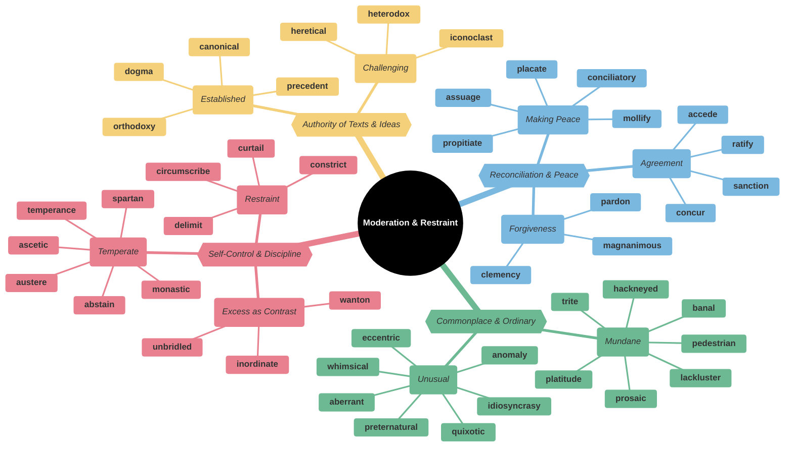
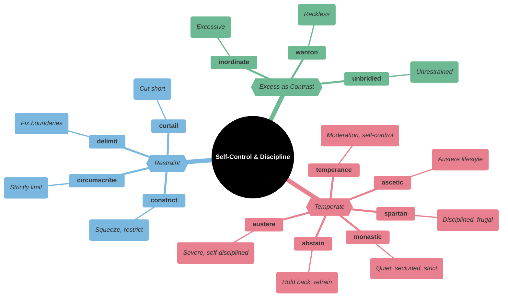
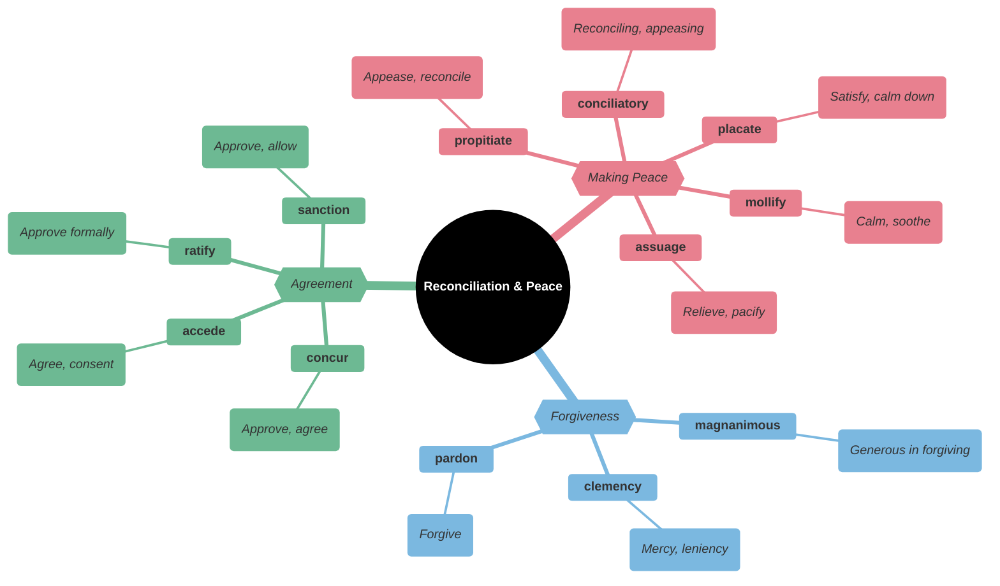
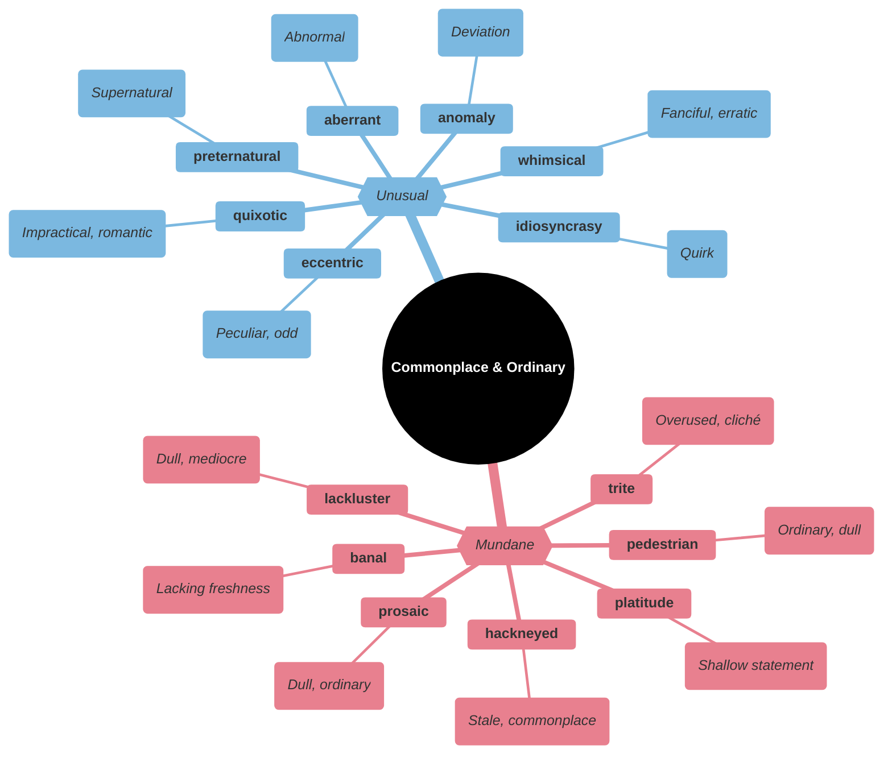
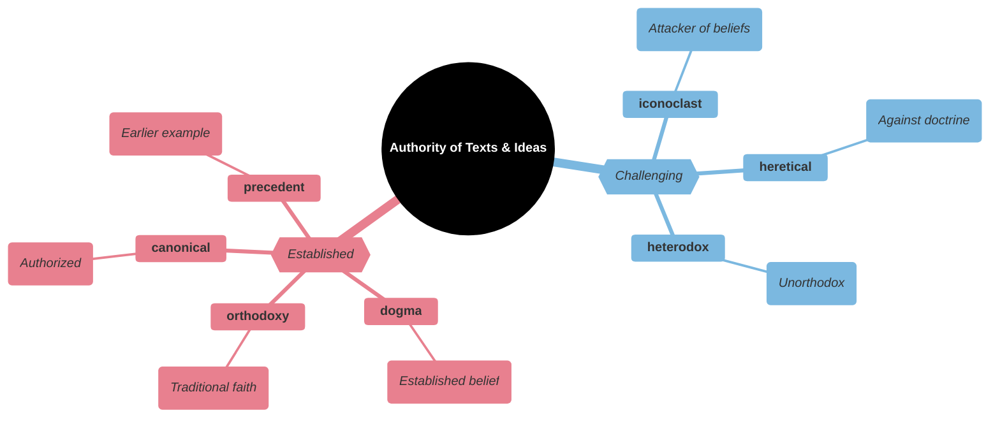
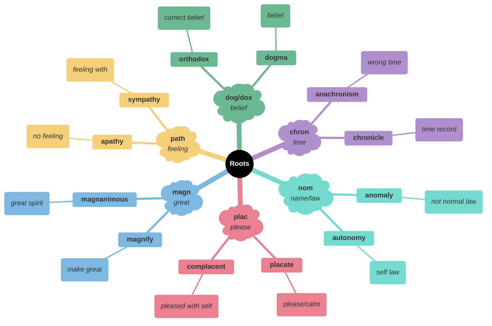

# ⚖️ Moderation, Restraint & Reconciliation

## Main Mindmap

---

## Detailed Focus

### 🧘 Self-Control & Discipline

| Word             | Definition                                                                                                        | Memory Hook                                           | Example Sentence                                                |
| ---------------- | ----------------------------------------------------------------------------------------------------------------- | ----------------------------------------------------- | --------------------------------------------------------------- |
| **temperance**   | Abstinence from alcoholic drink                                                                                   | **TEMPER**-ance → **TEMPER**ing desires               | The **temperance** movement sought to ban alcohol.              |
| **abstain**      | Restrain oneself from doing or enjoying something                                                                 | **ABS**-tain → **ABS**ent from it                     | He decided to **abstain** from alcohol.                         |
| **ascetic**      | Characterized by or suggesting the practice of severe self-discipline and abstention from all forms of indulgence | **A-SCETIC** → **A** **S**aint's ethic                | The monk lived an **ascetic** life in the mountains.            |
| **monastic**     | Relating to monks, nuns, or others living under religious vows, or the buildings in which they live               | **MONA**-stic → **MONK**-like                         | He lived a **monastic** life, dedicated to his studies.         |
| **austere**      | Severe or strict in manner, attitude, or appearance                                                               | **AUSTER**-e → **AUSTER**e Australia (harsh outback)  | The **austere** teacher never smiled.                           |
| **spartan**      | Disciplined, frugal                                                                                               | **SPARTAN** → **SPART**an warriors                    | The hotel room was **spartan** but clean.                       |
| **circumscribe** | Restrict (something) within limits                                                                                | **CIRCUM-SCRIBE** → **SCRIBE** (draw) a circle around | The president's power is **circumscribed** by the constitution. |
| **constrict**    | Make narrower, especially by encircling pressure                                                                  | **CON-STRICT** → **STRICT**ly tight                   | The tight collar **constricted** his breathing.                 |
| **delimit**      | Determine the limits or boundaries of                                                                             | **DE-LIMIT** → Set **LIMIT**s                         | The fence **delimits** the property line.                       |
| **curtail**      | Reduce in extent or quantity; impose a restriction on                                                             | **CUR-TAIL** → **CUT** the **TAIL**                   | We had to **curtail** our vacation because of the storm.        |
| **inordinate**   | Unusually or disproportionately large; excessive                                                                  | **IN-ORDIN**-ate → Not **ORDIN**ary (too much)        | He spends an **inordinate** amount of time playing video games. |
| **wanton**       | (of a cruel or violent action) deliberate and unprovoked                                                          | **WANT**-on → **WANT**ing to do bad                   | The vandals caused **wanton** destruction.                      |
| **unbridled**    | Uncontrolled; unconstrained                                                                                       | **UN-BRIDLE**-d → No **BRIDLE** (horse control)       | He had **unbridled** ambition.                                  |

### 🕊️ Reconciliation & Peace

| Word             | Definition                                                                                    | Memory Hook                                            | Example Sentence                                                    |
| ---------------- | --------------------------------------------------------------------------------------------- | ------------------------------------------------------ | ------------------------------------------------------------------- |
| **conciliatory** | Intended or likely to placate or pacify                                                       | **CONCILI**-atory → **COUNCIL** making peace           | She adopted a **conciliatory** tone to avoid an argument.           |
| **placate**      | Make (someone) less angry or hostile                                                          | **PLAC**-ate → **PLAC**id (calm)                       | He tried to **placate** the crying baby.                            |
| **propitiate**   | Win or regain the favor of (a god, spirit, or person) by doing something that pleases them    | **PRO-PITI**-ate → **PRO**fit from **PITI**y           | They offered sacrifices to **propitiate** the gods.                 |
| **mollify**      | Appease the anger or anxiety of (someone)                                                     | **MOLL**-ify → Make **MILD**                           | He tried to **mollify** the angry customer with a refund.           |
| **assuage**      | Make (an unpleasant feeling) less intense                                                     | **ASSUAGE** → **SAUSAGE** (comfort food)               | He tried to **assuage** his guilt by apologizing.                   |
| **magnanimous**  | Very generous or forgiving, especially toward a rival                                         | **MAGN-ANIM**-ous → **MAGN** (great) **ANIM** (spirit) | He was **magnanimous** in victory, shaking hands with his opponent. |
| **clemency**     | Mercy; lenience                                                                               | **CLEMEN**-cy → **CLEMEN**tine (sweet)                 | The prisoner pleaded for **clemency**.                              |
| **pardon**       | The action of forgiving or being forgiven for an error or offense                             | **PAR-DON** → **DON**ate forgiveness                   | The governor granted him a **pardon**.                              |
| **concur**       | Be of the same opinion; agree                                                                 | **CON-CUR** → **CUR**rent runs together                | I **concur** with the committee's findings.                         |
| **accede**       | Assent or agree to a demand, request, or treaty                                               | **AC-CEDE** → **CEDE** (give up) to agree              | The government **acceded** to the demands of the protesters.        |
| **ratify**       | Sign or give formal consent to (a treaty, contract, or agreement), making it officially valid | **RAT**-ify → **RAT**e it good                         | The senate **ratified** the treaty.                                 |
| **sanction**     | Give official permission or approval for (an action)                                          | **SANCT**-ion → **SANCT**ify (make holy/law)           | The government **sanctioned** the use of force.                     |

### 🥱 Commonplace & Ordinary

| Word              | Definition                                                                                                               | Memory Hook                                          | Example Sentence                                                   |
| ----------------- | ------------------------------------------------------------------------------------------------------------------------ | ---------------------------------------------------- | ------------------------------------------------------------------ |
| **banal**         | So lacking in originality as to be obvious and boring                                                                    | **BAN**-al → **BAN** it (so boring)                  | The movie's plot was **banal** and predictable.                    |
| **trite**         | (of a remark, opinion, or idea) overused and consequently of little import; lacking originality or freshness             | **TRITE** → **TRI**ed too much                       | The movie was full of **trite** dialogue.                          |
| **hackneyed**     | (of a phrase or idea) lacking significance through having been overused; unoriginal and trite                            | **HACKNEY**-ed → **HACK** horse (overworked)         | The plot was full of **hackneyed** clichés.                        |
| **platitude**     | A remark or statement, especially one with a moral content, that has been used too often to be interesting or thoughtful | **PLAT**-itude → **FLAT** statement                  | He offered only empty **platitudes** instead of real advice.       |
| **prosaic**       | Having the style or diction of prose; lacking poetic beauty; commonplace; unromantic                                     | **PROSA**-ic → **PROSE** (not poetry)                | He lived a **prosaic** life.                                       |
| **pedestrian**    | Lacking inspiration or excitement; dull                                                                                  | **PED**-estrian → On foot (slow/boring)              | His writing style is rather **pedestrian**.                        |
| **lackluster**    | Lacking in vitality, force, or conviction; uninspired or uninspiring                                                     | **LACK-LUSTER** → No **LUSTER** (shine)              | The team gave a **lackluster** performance.                        |
| **eccentric**     | (of a person or their behavior) unconventional and slightly strange                                                      | **EC-CENTRIC** → Off **CENTER**                      | The **eccentric** millionaire lived in a house shaped like a shoe. |
| **whimsical**     | Playfully quaint or fanciful, especially in an appealing and amusing way                                                 | **WHIM**-sical → On a **WHIM**                       | The artist's work is **whimsical** and fun.                        |
| **quixotic**      | Exceedingly idealistic; unrealistic and impractical                                                                      | **QUIXOT**-ic → Don **QUIXOT**e                      | He had a **quixotic** plan to save the world.                      |
| **idiosyncrasy**  | A mode of behavior or way of thought peculiar to an individual                                                           | **IDIO-SYN**-crasy → **IDIO**t **SYN**c (weird mix)  | One of his **idiosyncrasies** was wearing mismatched socks.        |
| **anomaly**       | Something that deviates from what is standard, normal, or expected                                                       | **A-NOM**-aly → Not **NOM**inal (normal)             | The snow in July was a weather **anomaly**.                        |
| **aberrant**      | Departing from an accepted standard                                                                                      | **AB-ERR**-ant → **AB**normal **ERR**or              | His **aberrant** behavior worried his friends.                     |
| **preternatural** | Beyond what is normal or natural                                                                                         | **PRETER-NATURAL** → **PRETER** (beyond) **NATURAL** | He had a **preternatural** ability to predict the weather.         |

### 📜 Authority of Texts & Ideas

| Word           | Definition                                                                                                              | Memory Hook                                              | Example Sentence                                                          |
| -------------- | ----------------------------------------------------------------------------------------------------------------------- | -------------------------------------------------------- | ------------------------------------------------------------------------- |
| **dogma**      | A principle or set of principles laid down by an authority as incontrovertibly true                                     | **DOG**-ma → **DOG**matic belief                         | He challenged the political **dogma** of his time.                        |
| **orthodoxy**  | Authorized or generally accepted theory, doctrine, or practice                                                          | **ORTHO-DOX**-y → **ORTHO** (straight) **DOX** (belief)  | He challenged the political **orthodoxy** of the time.                    |
| **canonical**  | Included in the list of sacred books officially accepted as genuine; accepted as being accurate and authoritative       | **CANON**-ical → Official rule                           | The **canonical** works of Shakespeare are studied in schools everywhere. |
| **precedent**  | An earlier event or action that is regarded as an example or guide to be considered in subsequent similar circumstances | **PRE-CED**-ent → **PRE** (before) **CED**e (go)         | The court's decision set a **precedent** for future cases.                |
| **iconoclast** | A person who attacks cherished beliefs or institutions                                                                  | **ICON-O-CLAST** → **ICON** **CLASH**er                  | As an **iconoclast**, he enjoyed challenging traditional views.           |
| **heretical**  | Believing in or practicing religious heresy                                                                             | **HERETIC**-al → **HERE** to tick you off                | His **heretical** views got him expelled from the church.                 |
| **heterodox**  | Not conforming with accepted or orthodox standards or beliefs                                                           | **HETERO-DOX** → **HETERO** (different) **DOX** (belief) | His **heterodox** opinions made him unpopular with the establishment.     |

---

## Etymology & Roots

